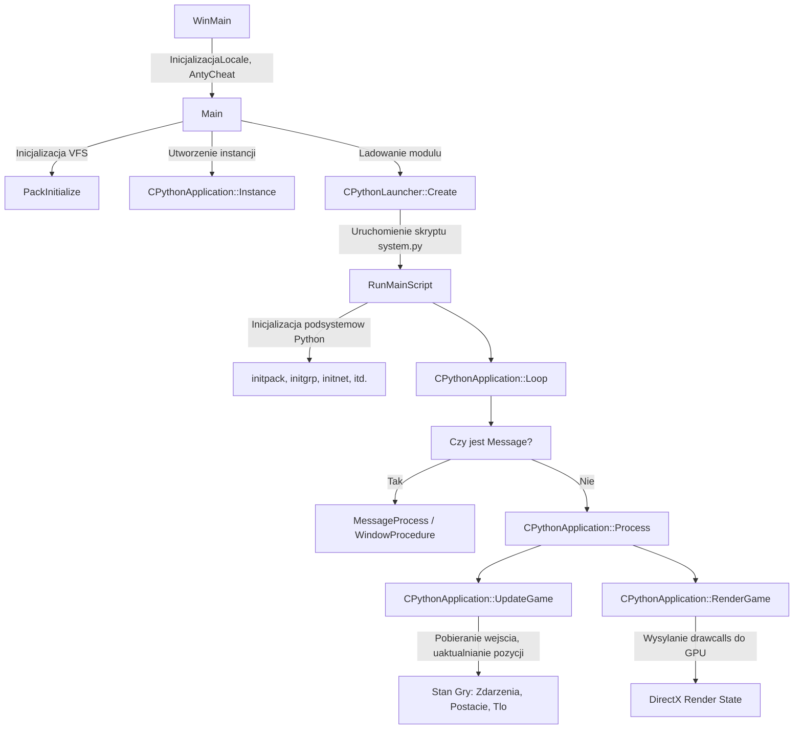

# Architektura Klienta: Cykl Zycia i Petla Gry (UserInterface)

## 1. Cel Architektoniczny i Rola Modulu
Modul `UserInterface` stanowi glowny punkt wejscia (Entry Point) aplikacji klienckiej Metin2. Odpowiada za inicjalizacje wszystkich podsystemow nizej i wyzej poziomowych (m.in. zarzadzanie pamiecia, system pakietow, grafika 3D, silnik fizyki, interfejs w Pythonie).
Glowna odpowiedzialnoscia klasy `CPythonApplication` jest utrzymanie globalnego stanu dzialania gry, laczac logike biznesowa gry z wywolaniami bibliotek zewnetrznych oraz systemowym API Windowsa.
- **Zaleznosci**: 
  - **EterBase / EterLib**: podsystemy bazowe (Timer, DX, obsluga myszy/kamery).
  - **EterPack**: system wirtualnego systemu plikow VFS.
  - **MilesLib**: system audio.
  - **Python**: osadzony interpreter zarzadzajacy mechanika UI i wyzwalajacy skrypty logiki gry.
  - **Silniki Anty-Cheat**: AhnLab HackShield, nProtect GameGuard, WiseLogic XTrap.

## 2. Diagram Architektury i Przeplywu Danych (Mermaid)

## 3. Rejestr Struktur Danych i Pamieci (Memory & Struct Layout)

Enumy i struktury zarzadzane w `CPythonApplication.h`:

* `enum ECursorMode`:
  * `CURSOR_MODE_HARDWARE`: Renderowanie kursora sprzetowe.
  * `CURSOR_MODE_SOFTWARE`: Renderowanie kursora programowe.

* `enum ECursorShape`: Zestaw identyfikatorow ksztaltow kursora (np. `CURSOR_SHAPE_NORMAL`, `CURSOR_SHAPE_ATTACK`, `CURSOR_SHAPE_TARGET`, `CURSOR_SHAPE_CAMERA_ROTATE`, itd.). Mapowane sa rowniez przez aliasy uzywane podczas ladowania srodowiska (`NORMAL = CURSOR_SHAPE_NORMAL`).

* `enum EInfo`: 
  * `INFO_ACTOR`, `INFO_EFFECT`, `INFO_ITEM`, `INFO_TEXTTAIL` - typy pobieranych informacji o systemie poprzez metode GetInfo().

* `enum ECameraControlDirection`:
  * `CAMERA_TO_POSITIVE = 1`, `CAMERA_TO_NEGITIVE = -1`, `CAMERA_STOP = 0` - kierunki manipulacji ruchem kamery.

* `enum (Camera Mode)`:
  * `CAMERA_MODE_NORMAL = 0`, `CAMERA_MODE_STAND = 1`, `CAMERA_MODE_BLEND = 2`
  * `EVENT_CAMERA_NUMBER = 101`

* `struct SCameraSpeed`:
  * `float m_fUpDir;` (Offset 0x0)
  * `float m_fViewDir;` (Offset 0x4)
  * `float m_fCrossDir;` (Offset 0x8)
  * *Przeznaczenie*: Sluzy do kontrolowania tempa zmian pozycji kamery w 3 osiach (lokalny uklad wspolrzednych kamery). Rozmiar: 12 bajtow (DWORD alignment).

* **Klasa `CPythonApplication` (Glowne pola)**:
  Klasa ta operuje wylacznie jako wirtualny kontener dla menedzerow systemowych (np. `CLightManager`, `CSoundManager`, `CFlyingManager`, `CRaceManager`, `CItemManager`). Jest monolitycznym wezlem przechowujacym stan wszystkich innych systemow, z gigantycznym rozkladem pamieci wynikajacym z posiadania instancji `CGraphicDevice` oraz `CNetworkDevice`.

## 4. Rejestr Klas i Metod (API Reference)

* `int APIENTRY WinMain(HINSTANCE hInstance, HINSTANCE hPrevInstance, LPSTR lpCmdLine, int nCmdShow)`
  * **Logika**: Glowny punkt wejscia Windows. Inicjalizuje system logowania, ustala kodowanie (LocaleService), odpala systemy anty-cheat (AhnLab, GameGuard, XTrap). Przetwarza wiersz polecen szukajac parametrow jak `--locale`, `--timestamp` czy `--openid-authkey`. Po wstepnych walidacjach odpala wlasciwe jadro klienckie - funkcje `Main`.

* `bool Main(HINSTANCE hInstance, LPSTR lpCmdLine)`
  * **Logika**: Ustawia ziarno losowania (srandom, time). Tworzy managery wirtualnego systemu plikow (`CEterPackManager`), laduje zasoby ("pack"). Nastepnie alokuje na stercie glowny obiekt powloki `CPythonApplication`, wywoluje metode `Initialize(hInstance)`, przygotowuje Python (`CPythonLauncher`) i uruchamia procedury aplikacji wylapujac wyjatki za posrednictwem `CPythonExceptionSender`. Zwalnia `app` przed wyjsciem.

* `bool RunMainScript(CPythonLauncher& pyLauncher, const char* lpCmdLine)`
  * **Logika**: Deklaruje wszystkie "bindings" podsystemow C++ dla Pythona, kolejno wywolujac funkcje startowe modolow (`initpack()`, `initgrp()`, `initnet()`, `initchrmgr()`, itp.). Konfiguruje globalna zmienna `__DEBUG__` w przestrzeni Pythona w zaleznosci od buildu (DISTRIBUTE vs DEBUG). Wskazuje na odpalenie glownego skryptu logiki `system.py`.

* `void CPythonApplication::Loop()`
  * **Logika**: Nieskonczona petla (while 1). Wywoluje sprawdzenie czy sa komunikaty Windows (`IsMessage()`). Jesli tak, uruchamia `MessageProcess()` obslugujacy `WindowProcedure`. W przeciwnej sytuacji wywoluje wlasna petle logiki `Process()`. Odnotowuje klatke bezczynnosci pobierajac czas.

* `bool CPythonApplication::Process()`
  * **Logika**: Najpierw przepytuje eventy anty-cheatow (`HackShield_PollEvent()`, `XTrap_PollEvent()`). Uaktualnia FPS (UpdateFPS i RenderFPS) w blokach sekundowych (1000ms checktime). Wykonuje uplyw czasu przez `CTimer::Instance().Advance()`. Skoki logiki bazowane na uplywie czasu wylapuja sytuacje klatkowania - nastepnie wywoluja `UpdateGame()` oraz finalnie generuja render poprzez `RenderGame()`. 

* `void CPythonApplication::UpdateGame()`
  * **Logika**: Obsluguje logike przed renderowaniem klatki.
    1. Rejestruje wejscie myszy: `GetMousePosition(&ptMouse)`.
    2. Uaktualnia Frustum i Culling kamery na podstawie pola widzenia okna UI.
    3. Pobiera absolutna srodkowa pozycje glownego aktora gracza (`m_pyPlayer.NEW_GetMainActorPosition(&kPPosMainActor)`).
    4. Rozkazuje zaktualizowanie modulu `CPythonBackground` wzgledem biezacej pozycji (streaming mapy CMapOutdoor).
    5. Wywoluje `Update` dla menedzerow systemowych: znakow i modeli (`m_kChrMgr.Update()`), dzwieku, cial latajacych/animacji (`m_FlyingManager`), przedmiotow UI i samej postaci.

* `void CPythonApplication::RenderGame()`
  * **Logika**: Potok renderujacy grafike za pomoca DirectX. Rozpoczyna od projekcji kamery. Przelicza Deform (Soft-skinning Granny 3D dla postaci). Renderuje do tekstury cienie postaci (`RenderCharacterShadowToTexture`). Ustawia render states DirectX (`SetGameRenderState`). Nastepnie sekwencyjnie wyswietla w swiecie: Niebo, Chmury, Geometrie 3D Mapy (Terrain/Area), Postacie, Wode, Snieg, Efekty, Latanie (Strzaly, Czary) i konczy interfejsem 2D nad wszystkim. 

* `LRESULT CPythonApplication::WindowProcedure(HWND hWnd, UINT uiMsg, WPARAM wParam, LPARAM lParam)`
  * **Logika**: Przetwarza wiadomosci okna na zdarzenia klienta. Obsluguje `WM_ACTIVATEAPP` przy alt-tabowaniu - sciszajac/przywracajac volume. Reaguje na podwojne klikniecie i pojedyncze klikniecia myszy, mapujac z koordynatow ekranowych na UI. Przesyla zdarzenia wielojezykowej klawiatury IME (`WM_IME_*`) prosto do `CPythonIME`. Obsluguje przywracanie urzadzenia D3D podczas reskalowania (`WM_SIZE`).

## 5. Punkty Styku (Cross-Subsystem Integration)

* **Python Integration**: Modul ten rejestruje gigantyczna pule interfejsow dla Pythona (pliki init), po czym laduje skrypt startowy `system.py` za pomoca wbudowanej klasy CPythonLauncher (lacznik Py_InitModule itp). Posiada wskaznik `m_poMouseHandler`, przez ktory system Windows wysyla wywolania klikniec myszki wprost do srodowiska Pythona.

* **DirectX / VRAM (EterLib)**: `CPythonApplication` przetrzymuje referencje na `CGraphicDevice`. Bezposrednio w `RenderGame` oraz w przerwaniach okna (np. `WM_SIZE`) wywolywane sa akcje na buforach `ResizeBackBuffer(uWidth, uHeight)`. Zastosowanie procedur renderowania zarzadza maszyna stanow DX (Render States, Texture Stages). 

* **Przegladarka Sieciowa i Wideo**: Zawiera implementacje obslugi mediow poprzez COM/DirectShow (np. `m_pGraphBuilder`, `m_pSampleGrabber` w klasie CPythonApplication) do ladowania loga na starcie i renderowania video cutscenek na nakladkach UI, a takze wbudowany `CWebBrowser` oparty o IWebBrowser2 umozliwiajacy pokazywanie okien przegladarki wprost w kliencie (np. w systemie ItemShop).

## 6. Pulapki, Antywzorce i Ograniczenia

1. **God Object Anti-Pattern (CPythonApplication)**:
   Klasa jest centralnym punktem, do ktorego dostep odbywa sie poprzez `CPythonApplication::Instance()`. Posiada ona dziesiatki menedzerow rozdzielonych po calym ekosystemie (od renderingu nieba przez network datagrams az po obsluge dzwiekowa). Taki schemat blokuje jednoczesna przebudowe lub wydzielenie tych warstw, skutkujac gigantycznym rozmiarem pliku `UserInterface.cpp` i bardzo dlugim czasem kompilacji narazonych plikow.
2. **Klatkowanie / Limit FPS**:
   Petla w `Process()` zarzadza wlasnym limitem klatek (`s_bFrameSkip`). Jesli sprzet renderuje wolniej niz oczekiwany limit UpdateFPS, gra zaczyna ucinac klatki renderu dla zrownowazenia Update(). Uplyw czasu (`CTimer`) steruje wszystkim; przy lagach serwera, uplyw globalnego czasu powoduje teleportacje gracza (Interpolation jumps), jako ze pozycja wynika scisle z `UpdateGame()`.
3. **Alt-Tab i Focus (D3DERR_DEVICELOST)**:
   Wyzwalanie `WM_ACTIVATEAPP` w polaczeniu ze starszym API DX8/DX9 wymaga obslugi utraty pamieci VRAM. Czesto niepoprawnie napisane obiekty (brak zwolnienia i przypisania OnLostDevice i OnResetDevice) rezydujace w PythonApplication podczas minimalizacji ekranu spowoduja crashe aplikacji (np. wyjatek przy probie zablokowania nieistniejacego bufora verteksow).
4. **Rozszerzenia Makr Zabezpieczen (Themida/Enigma)**:
   Aplikacja uzywa blokow macro w stylu `NANOBEGIN` i `NANOEND`. Znaczaco modyfikuje to uklad skompilowanego pliku binarnego pod katem debugowania (utrudniona lub niemozliwa praca z debuggerem bez dostepu do czystego buildu dev), poniewaz wprowadzane sa tam rutyny wirtualizacyjne.
