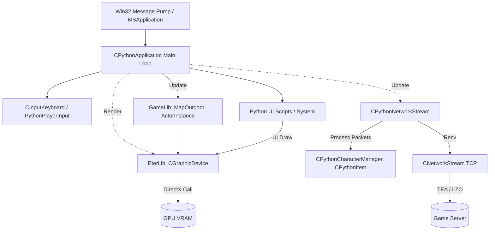

# Architektura Ogolna Klienta: Przeplywy Danych i Podzial Warstwowy

## 1. Cel Architektoniczny i Rola Modulu
Niniejsza dokumentacja prezentuje calosciowe spojrzenie na architekture klienta gry (Metin2), skupiajac sie na integracji kluczowych podsystemow: warstwy wejscia/aplikacji (Win32), skryptowania UI (Python 2.7), renderingu (Direct3D 8/9 poprzez EterLib/GameLib) oraz komunikacji sieciowej (TCP za posrednictwem EterLib i UserInterface). 

Klient jest skonstruowany warstwowo:
*   **Warstwa Platformy/Aplikacji:** Obiekty typu `CMSApplication` oraz dziedziczacy po nim `CPythonApplication` inicjalizuja cykl zycia, zarzadzaja wejsciem (klawiatura, mysz), pompa komunikatow systemu Windows oraz koordynuja glowny proces aktualizacji klatek (`Update` / `Render`).
*   **Warstwa Sieciowa:** Klasy takie jak `CNetworkStream` (EterLib) zarzadzaja nieskonczonymi buforami wysylania i odbierania. Ich warstwa wyzsza w postaci `CPythonNetworkStream` interpretuje surowe bajty z uzyciem stalych offsetow binarnej komunikacji i wykonuje logike decyzyjna zalezna od konkretnej fazy (Login, Game, Offline).
*   **Warstwa Logiki i Stanu:** `GameLib` zawiera glowne procedury obslugi obiektow, np. `CActorInstance` aktualizuje swoje pozycje/animacje w 3D, a koordynacja z backendem jest przesylana wprost do narzedzi takich jak `CPythonCharacterManager`.
*   **Warstwa Renderingu:** Abstrahowana przez `EterLib` (np. `CGraphicDevice`, obsluga stanow Direct3D, resursy z VFS), zintegrowana w jeden wspolny wezel w obrebie `CPythonApplication::Render`, gdzie interfejs 2D i scena 3D nakladaja sie na siebie.

Zaleznosci zewnetrzne obejmuja m.in: Python 2.7, Granny3D, SpeedTree, Miles Sound System, Direct3D 8/9, DirectX Input 8 oraz kryptografie (Panama, TEA).

## 2. Diagram Architektury i Przeplywu Danych (Mermaid)

## 3. Rejestr Struktur Danych i Pamieci (Memory & Struct Layout)

### UserInterface / Packet.h
Struktury pociete dla wymiany sieciowej (`#pragma pack(push, 8)` i uzycie stalych wielkosci):
*   `TPacketHeader` (`BYTE` / `unsigned char`): 1 bajt, okresla typ nadchodzacego lub wychodzacego opkodu sieciowego.
*   `_AHNHS_TRANS_BUFFER` (uzywane tylko z zabezpieczeniem Hackshield):
    *   `unsigned char byBuffer[400]`: statyczny bufor transferowy opcji.
    *   `unsigned short nLength`: rozmiar w bajtach, 16-bitowe liczby (2 bajty).
    *   Wyrownanie pamieci do 8 bajtow.

### UserInterface / PythonApplication.h
*   `enum EDeviceState` (4 bajty `int`): 
    *   `DEVICE_STATE_FALSE` (0)
    *   `DEVICE_STATE_SKIP` (1)
    *   `DEVICE_STATE_OK` (2)
*   `enum ECursorMode` (4 bajty `int`):
    *   `CURSOR_MODE_HARDWARE` (0)
    *   `CURSOR_MODE_SOFTWARE` (1)

### EterLib / NetStream.h
*   Klasa `CNetworkStream` hermetyzuje operacje i bufory socketu w pamieci uzytkownika. Przechowuje wskazniki adresow alokowanych buforow uzywanych przez funkcje send/recv, flagi zabezpieczen oraz obiekty typu `c_szTeaKey` (16-bajtowa tablica znakow) do deszyfrowania TCP TEA jesli wlaczony stary tryb kryptograficzny.

## 4. Rejestr Klas i Metod (API Reference)

### MSApplication / CPythonApplication
*   **`void CMSApplication::MessageLoop()`**: Glowna petla uzytkownika systemu Windows (Win32). Odpytuje system o zdarzenia przez `PeekMessage`. Jesli kolejka komunikatow jest wolna od eventow systemu operacyjnego, wykonuje krok symulacji gry. W przeciwnym razie przetwarza zdarzenia za pomoca `TranslateMessage` i przeksztalca do okna w `DispatchMessage`.
*   **`CPythonApplication::CPythonApplication()`**: Inicjuje stan startowy glownego obiektu zarzadzajacego. Ustawia zmienne wskaznikowe (np. `m_poMouseHandler`) na wartosc NULL, zeruje liczniki pomiaru klatek renderowania (`m_dwUpdateFPS=0`, `m_dwRenderFPS=0`) i przygotowuje wbudowane liczniki kamer 3D.
*   **`void CPythonApplication::GetMousePosition(POINT* ppt)`**: Wywoluje metode rodzica okna Win32 w celu zlokalizowania aktualnej, precyzyjnej koordynaty kursora wzgledem ramki aplikacji klienta w systemie i wpisuje dane `X` oraz `Y` do zadanej lokalizacji wskaznika typu `POINT`.

### CNetworkStream / CPythonNetworkStream
*   **`bool CNetworkStream::Connect(const char* c_szAddr, int port, int limitSec)`**: Rozpoczyna tworzenie i podlaczanie gniazda TCP pod wybrane IP. Blokuje wywolanie funkcji API systemu z opcjonalnym limitem sekund (`limitSec`) poprzez funkcje gniazd systemowych. W razie powodzenia polaczenia ustawiane sa statusy sukcesu i brak bledu dzialania `ERROR_NONE`.
*   **`void CNetworkStream::Process()`**: Wysyla dane z gotowych kolejek FIFO przez funkcje `send()` gniazda API oraz jednoczesnie pobiera otrzymane klatki od serwera gier uzywajac funkcji `recv()`. Te klatki podlegaja sprawdzeniu na zgodnosc integralnosci, po czym aplikowany jest filtr dekompresji (TEA/LZO), jesli dane byly chronione.
*   **`void CPythonNetworkStream::__RefreshTargetBoardByVID(DWORD dwVID)`**: Wewnetrzna funkcja pomagajaca odswiezyc okno interfejsu (GUI) wskazanego wroga poprzez wykonanie zewnetrznego skryptu uzywajac makra `PyCallClassMemberFunc` wraz ze zlozonym formatem zmiennych `Py_BuildValue("(i)", dwVID)`.

## 5. Punkty Styku (Cross-Subsystem Integration)

*   **Z Pythonem (Warstwa Skryptowa):** `CPythonApplication` jest sercem integracyjnym; uzywa funkcji srodowiskowej `Py_InitModule`, rejestrujac metody i slowniki w taki sposob, by narzedzia graficzne PythonUI mogly kontrolowac operacje przemieszczania, walki, dzwiekow w sposob asynchroniczny z wejsciem (np. uzycie klawiatury). 
*   **Z Siecia (Backend TCP):** `CPythonNetworkStream` rozdziela przeplyw dzialan i polecen wejsciowych okna na siec. Pakiety i ich kody (zdefiniowane jako stale jak `HEADER_CG_LOGIN`, `HEADER_CG_ATTACK`) w naglowku strukturalnym `Packet.h` pakowane sa i ukladane w ciagi binarne dzieki `#pragma pack`, obciazane dekompresja na poziomie nizszego `CNetworkStream` i eksportowane na socket internetowy do oprogramowania serwera.
*   **Z Direct3D (Warstwa Sprzetowa):** Podczas wstawania warstwy aplikacji, funkcja API `CGraphicDevice::Create` dokonuje pobrania dostepnych mozliwosci systemowej karty poprzez interfejs DirectX. Ustanawia render context powiazany z uchwytem HWND, ktory nalezy do `MSApplication`. Prawdopodobne awarie GPU przechwytuje narzedzie klatkowe.

## 6. Pulapki, Antywzorce i Ograniczenia

1.  **D3DERR_DEVICELOST i Zarzadzanie VRAM:** W zaleznosci od akcji zewnetrznych takich jak minimalizacja czy uzycie kombinacji "Alt+Tab", DirectX czesto gubi tzw. Device (urzadzenie). Systemy w wewnatrz `CPythonApplication::Render` oraz zasoby interfejsu `GrpDevice` musza idealnie potrafic niszczyc i wskrzeszac ulotne wskazniki i obiekty VRAM by nie doszlo do utraty i wyciekow pamieci powodujacych wyrzucenie klienta przez `Reset`.
2.  **Kolejnosc zdarzen sieciowych w TCP:** System protokolu zaklada integralnosc ale nie gwarantuje paczek po stronie logicznej oprogramowania. Zatem wywolania `NetStream::Recv` niosa ryzyko uciecia danych w polowie structa uzytkownika C++, co kaze uzywac dodatkowych procesow gromadzenia resztek pamieci przez co obciazana jest petla asynchroniczna z biblioteki `GameLib`.
3.  **Mieszanie kodu ASCII z szerokim formatem (WideChar):** Mimo uzycia bazowych formatowan znakow jednobajtowych C++ jak typowe tablice ISO, istnienie obiektow GUI operujacych w GDI np. `EterLib::GrpFontTexture`, by wyswietlic znaki globalne tworzy mocne spowolnienia na miedzynarodowych wydaniach przez wymagane funkcje takie jak `WideCharToMultiByte` dla czatowania lokalnego.
