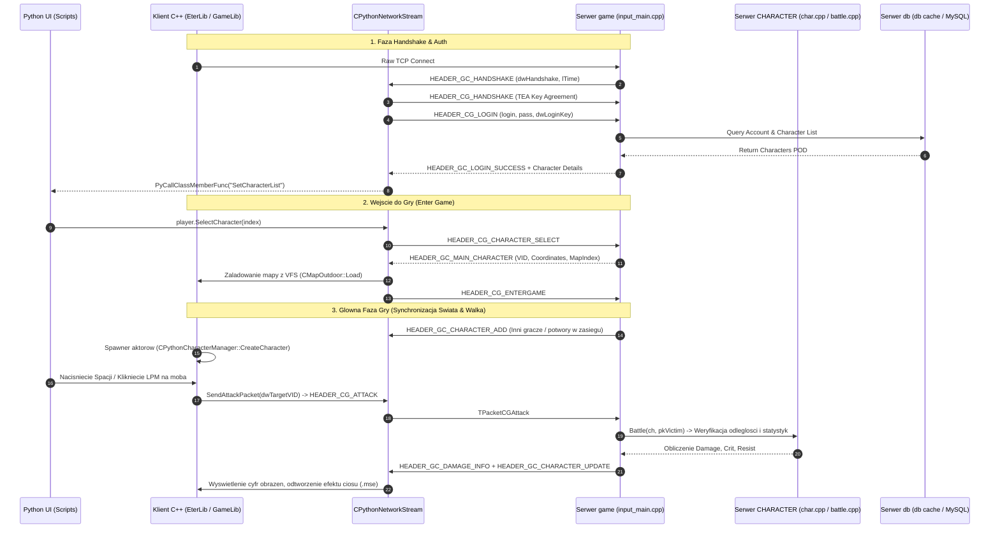

# Mapa Integracji: Klient C++ <-> Serwer C++ (Client-Server Architectural Matrix)

## 1. Model Architektury i Przeplywu Danych

Klient i Serwer gry Metin2 komunikuja sie w architekturze **Server-Authoritative** (Serwer jest jedynym autorytetem logiki gry i stanu swiata) poprzez ciagly strumien **TCP/IP** z wbudowanym wlasnym mechanizmem buforow cyklicznych oraz szyfrowaniem blokowym TEA.



---

## 2. Pelna Macierz Faz Sieciowych (Network State Machine)

Komunikacja sieciowa po obu stronach sterowana jest scislym automatem stanow (FSM):

| Faza Sieciowa | Obsluga po Stronie Klienta (C++) | Obsluga po Stronie Serwera (C++) | Opis Przeplywu i Bezpieczenstwo |
|---|---|---|---|
| **PHASE_OFFLINE** | `CPythonNetworkStream::Connect()` | `CClientManager::Accept()` | Brak aktywnego gniazda; inicjalizacja socketu TCP (`CSocketStream`). |
| **PHASE_HANDSHAKE** | `PythonNetworkStreamPhaseHandshake.cpp` | `input_auth.cpp` / `input_login.cpp` | Wymiana kluczy kryptograficznych TEA (`HEADER_GC_HANDSHAKE` / `HEADER_CG_HANDSHAKE`), wyliczenie delty czasu `TimeSync`. |
| **PHASE_AUTH / LOGIN** | `PythonNetworkStreamPhaseLogin.cpp` | `input_auth.cpp` (`CInputAuth::Login`) | Przeslanie nazwy uzytkownika i zaszyfrowanego hasla, weryfikacja z baza danych MySQL, odeslanie statusu i `dwLoginKey`. |
| **PHASE_SELECT** | `PythonNetworkStreamPhaseSelect.cpp` | `input_login.cpp` (`CInputLogin::CharacterSelect`) | Przeslanie listy postaci gracza (max 4). Wybor slotu, tworzenie nowej postaci (`HEADER_CG_CHARACTER_CREATE`) lub usuniecie kodem usuniecia (`HEADER_CG_CHARACTER_DELETE`). |
| **PHASE_LOADING** | `PythonNetworkStreamPhaseLoading.cpp` | `input_main.cpp` (`CInputMain::Entergame`) | Serwer odsyla `HEADER_GC_MAIN_CHARACTER` z `dwVID`, wspolrzednymi bazowymi `x, y, z` i numerem mapy. Klient wstrzymuje renderowanie i laduje kafelki mapy 3x3 z VFS (`CMapOutdoor`). Po ukonczeniu odsyla `HEADER_CG_ENTERGAME`. |
| **PHASE_GAME** | `PythonNetworkStreamPhaseGame.cpp` | `input_main.cpp` (`CInputMain::Process`) | Glowna faza rozgrywki: synchronizacja aktorow w zasiegu wzroku serwera (`VIEW_DISTANCE`), synchronizacja ekwipunku, ruch, czat, gildie, handel i lochy. |

---

## 3. Wspoldzielone Binarne Kontrakty Struktur Danych (Data Contracts)

Aby deserializacja bajtowa dzialala bezposrednio w pamieci RAM bez narzutu CPU, **Klient i Serwer C++ musza wspoldzielic identyczny rozklad struktur (struct layout) z wymuszonym wyrownaniem `#pragma pack(1)`**:

### A. Prototypy Przedmiotow (`item_proto` <-> `TItemTable`)
- **Klient**: `source/UserInterface/DumpProto/dump_proto.cpp` oraz `CPythonItem`
- **Serwer**: `E:\full_source_metin22\common\tables.h` (`TItemTable`)
- **Struktura binarna**:
  ```cpp
  typedef struct SItemTable {
      DWORD       dwVnum;
      char        szName[ITEM_NAME_MAX_LEN + 1];        // 25 bajtow
      char        szLocaleName[ITEM_NAME_MAX_LEN + 1];  // 25 bajtow
      BYTE        bType;
      BYTE        bSubType;
      BYTE        bWeight;                              // Nieuzywane (zawsze 0)
      BYTE        bSize;                                // Rozmiar komorek (1, 2, 3)
      DWORD       dwAntiFlags;                          // Maski klas (Wojownik, Ninja, etc.)
      DWORD       dwFlags;                              // Flagi zachowania
      DWORD       dwWearFlags;                          // Gdzie zakladany (Body, Head, Weapon)
      DWORD       dwImmuneFlag;
      DWORD       dwGold;                               // Cena sprzedazy u NPC
      DWORD       dwShopBuyPrice;                       // Cena kupna w sklepie
      TItemLimit  aLimits[ITEM_LIMIT_MAX_NUM];          // 2 limity (np. Poziom)
      TItemApply  aApplies[ITEM_APPLY_MAX_NUM];         // 3 wbudowane bonusy
      long        alValues[ITEM_VALUES_MAX_NUM];        // 6 wartosci bazowych (obr. min/max, obrona)
      long        alSockets[ITEM_SOCKET_MAX_NUM];       // 3 gniazda na KD / czas trwania
      DWORD       dwRefinedVnum;                        // VNUM na jaki ulepsza Kowal
      WORD        wRefineSet;                           // Grupa w refine_proto
      BYTE        bAlterToMagicItemPct;
      BYTE        bSpecular;                            // Swiecenie pancerza/broni (0..100)
      BYTE        bGainSocketPct;
  } TItemTable;
  ```

### B. Prototypy Potworow i NPC (`mob_proto` <-> `TMobTable`)
- **Klient**: `source/UserInterface/DumpProto/dump_proto.cpp` oraz `CPythonNonPlayer`
- **Serwer**: `E:\full_source_metin22\common\tables.h` (`TMobTable`)
- Definiuje VNUM potwora, nazwe, rase, zasieg ataku `wAttackRange`, zasieg wzroku AI `wAggressiveSight`, folder zasobow modeli 3D `szFolder` (np. `"d:/ymir work/monster/wild_boar"`), statystyki zycia i obrazen.

### C. Pakiet Dodania Aktora do Sceny (`TPacketGCCharacterAdd`)
Gdy serwer wykryje, ze potwor, NPC lub inny gracz wszedl w zasieg widzenia klienta, wysyla:
```cpp
typedef struct packet_char_additional_info {
    BYTE    header;                                     // HEADER_GC_CHAR_ADDITIONAL_INFO (136)
    DWORD   dwVID;                                      // Unikalny ID w instancji gry
    char    name[CHARACTER_NAME_MAX_LEN + 1];           // Nazwa gracza / potwora
    WORD    awPart[CHR_EQUIPPART_NUM];                  // Wyglad: Zbroja, Bron, Fryzura
    BYTE    bEmpire;                                    // Krolestwo (Shinsoo, Chunjo, Jinno)
    DWORD   dwGuildID;                                  // ID gildii (do herbu)
    DWORD   dwLevel;                                    // Poziom wyswietlany nad glowa
    short   sAlignment;                                 // Ranga (Rycerski, Okrutny)
    BYTE    bPKMode;                                    // Tryb walki (Peace, Guild, Free)
    DWORD   dwMountVnum;                                // Wierzchowiec / kon
} TPacketGCCharacterAdditionalInfo;
```
Klient po odebraniu natychmiast wywoluje `CPythonCharacterManager::RegisterInstance()`, pobiera model z `CRaceManager`, podczepia bronie pod odpowiednie kosci szkieletu (`Socket`) w Granny 3D i wyswietla pasek zycia oraz r肅ke nad glowa (`CPythonTextTail`).

---

## 4. Przeliczanie Wspolrzednych Swiata (World Coordinates vs Client Pixels)

Czesty punkt kolizji przy integracji klienta z serwerem:
- **Serwer (game)**: Operuje na wspolrzednych globalnych swiata gry wyrazonych w **centymetrach**:
  - Pozycja gracza: `x = 469300, y = 964200`.
- **Klient (C++)**: W silniku `CMapOutdoor` i `CPythonPlayer` przelicza pozycje na **piksele**:
  - `PixelPosition = ServerPosition / 100` (np. `x = 4693.0f, y = 9642.0f`).
- **Pakiety Ruchu (`TPacketCGMove` i `TPacketGCMove`)**:
  - Przesylaja kordynaty w centymetrach, kat rotacji w stopniach (0..360 skonwertowane do radiana) oraz czas ticku timera `dwTime`.
  - W razie niezgodnosci wiekszej niz prog tolerancji `DISTANCE_MAX`, serwer natychmiast wysyla `TPacketGCSyncPosition`, zmuszajac klienta do cofniecia postaci (anticheat rubberbanding).

---

## 5. Most Bindowan Pythona: Od UI do Gniazda Sieciowego

Kazda akcja uzytkownika w interfejsie przechodzi sciezke:

```
[ Klikniecie w GUI Pythona (np. uiInventory.py) ]
                       │
                       ▼
[ Metoda Pythona C++: player.SendItemUsePacket(slot) ]
                       │
                       ▼
[ CPythonNetworkStream::SendItemUsePacket(TItemPos cell) ]
                       │ (Pakowanie TPacketCGItemUse, HEADER_CG_ITEM_USE)
                       ▼
[ Strumien TCP: CSocketStream::Send() ]
                       │ (Siec TCP/IP)
                       ▼
[ Serwer: CInputMain::Process -> case HEADER_CG_ITEM_USE ]
                       │
                       ▼
[ Serwer: CHARACTER::UseItem(TItemPos Cell) ]
                       │ (Sprawdzenie poziomu, klasy, cooldownu mikstury)
                       ▼
[ Serwer: SendPacket: TPacketGCItemSet (aktualizacja slotu) + TPacketGCPointChange (przyrost HP) ]
                       │
                       ▼
[ Klient: CPythonNetworkStream::RecvItemSet() & RecvPointChange() ]
                       │
                       ▼
[ Odswiezenie Paska Zycia i Animacja Mikstury w Ekranie Gry ]
```

---

## 6. Podsumowanie Wzorcow Integracji

1. **Zero Interpretacji w Locie**: Wszystkie komunikaty sieciowe to silnie typowane struktury C/C++ z rygorystycznym rzutowaniem wskaznikow bufora pamieci.
2. **Kompilacja Danych**: Baza `item_proto` i `mob_proto` jest w 100% zsynchronizowana pod katem rozmiaru bajtowego pomiedzy serwerem bazodanowym `db` a klientem uzywajacym kompilatora `DumpProto`.
3. **Odpornosc na Modyfikacje**: Kazda akcja wysylana z Pythona (`player.*`) jest re-walidowana przez silnik C++ klienta, a ostatecznie zatwierdzana w logice biznesowej serwera (`E:\full_source_metin22\game\src`).
