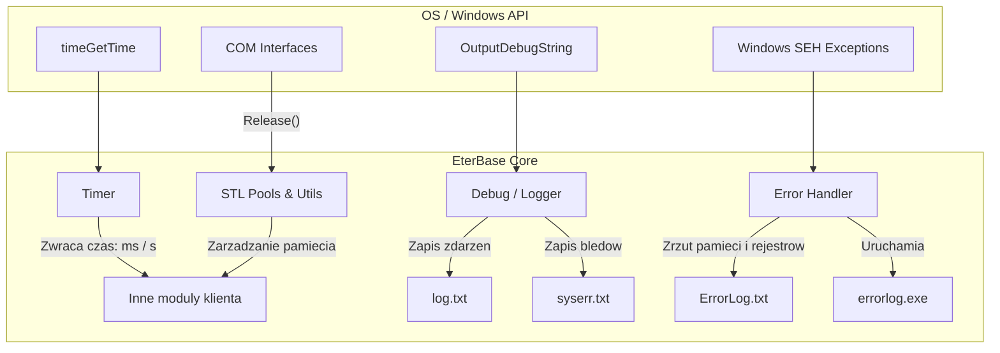

# Dokumentacja Podsystemu: EterBase Core (Timer, Debug, Wyjatki, STL)

## 1. Cel Architektoniczny i Rola Modulu

Podsystem `EterBase` (Timer, Debug, Error, STL) to fundamentalna warstwa narzedziowa (Core Utilities) klienta gry. Jego glowna odpowiedzialnoscia jest dostarczanie niskopoziomowych mechanizmow niezbednych do dzialania innych systemow:
- **Timer**: Zarzadzanie czasem gry, synchronizacja czasu klienta z serwerem, oraz kontrola szybkosci klatek (frame time).
- **Debug**: Rozbudowane makra i funkcje logowania zrzucajace informacje diagnostyczne do plikow (`syserr.txt`, `log.txt`) oraz do standardowego wyjscia.
- **Error (Wyjatki)**: Przechwytywanie krytycznych bledow (Crash/Exception Handling) poprzez `SetUnhandledExceptionFilter`, zrzucanie stosu wywolan (Call Stack) i rejestrow procesora.
- **STL (Alokatory i Algorytmy)**: Niestandardowe, wydajne pule pamieci (`stl_stack_pool`, `stl_circle_pool`), bezpieczne usuwanie obiektow COM (`safe_release`) oraz funkcje pomocnicze do manipulacji kontenerami C++.

Modul ten znajduje sie na samym dole hierarchii zaleznosci (nie zalezy od zadnych wyzszych warstw silnika). Jest wywolywany niemalze przez kazdy inny modul w kliencie (np. EterPythonLib, UserInterface, EterGrnLib). Korzysta z bibliotek systemowych Windows (`windows.h`, `imagehlp.h`, `mmsystem.h`).

## 2. Diagram Architektury i Przeplywu Danych (Mermaid)

## 3. Rejestr Struktur Danych i Pamieci (Memory & Struct Layout)

Podsystem wykorzystuje specyficzne struktury i aliasy typow w celu zarzadzania zasobami:

- **`stl_sz_less`** (Struktura / Funktor):
  - **Pola**: Brak pol instancyjnych.
  - **Przeznaczenie**: Funktor dla kontenerow asocjacyjnych (np. `std::map<char*, ...>`), uzywajacy `strcmp` do porownywania kluczy tekstowych.
  - **Rozmiar/Wyrownanie**: 1 bajt (pusta struktura w C++).

- **`CTokenVector`**: `typedef std::vector<std::string>`
- **`CTokenMap`**: `typedef std::map<std::string, std::string>`
- **`CTokenVectorMap`**: `typedef std::map<std::string, CTokenVector>`

- **`stringhash`** (Struktura / Funktor):
  - **Przeznaczenie**: Funktor generujacy hash ze `std::string` algorytmem typu FNV (mnoznik 16777619).

- **Zmienne Globalne dla Timera (`Timer.cpp`)**:
  - `gs_dwBaseTime` (`DWORD` / 4 bajty) - czas referencyjny od uruchomienia aplikacji.
  - `gs_dwServerTime` (`DWORD` / 4 bajty) - czas zsynchronizowany z serwerem.
  - `gs_dwClientTime` (`DWORD` / 4 bajty) - punkt odniesienia lokalnego czasu dla synchornizacji serwera.
  - `gs_dwFrameTime` (`DWORD` / 4 bajty) - czas obecnej klatki renderowania.

- **Struktury dla Error Handler (`error.cpp`)**:
  - Wykorzystuje bezposrednio struktury `CONTEXT`, `STACKFRAME` i `EXCEPTION_POINTERS` z naglowka `<imagehlp.h>` (Windows API) do analizy stosu podczas crashy (z domyslnym wyrownaniem Win32 ABI).

## 4. Rejestr Klas i Metod (API Reference)

### Modul Timer (`CTimer` / `ELTimer_*`)

Klasa `CTimer` dziedziczy po `CSingleton<CTimer>`. Steruje logika czasu z mozliwoscia uniezaleznienia od czasu systemowego (czas "customowy").

- `BOOL ELTimer_Init()`: Inicjalizuje bazowy czas uzywajac `timeGetTime()` (Windows Multimedia API). Uwaga: w kodzie zakomentowano uzycie `QueryPerformanceCounter` na rzecz starszego, mniej precyzyjnego `timeGetTime()`. Zwraca zawsze 1.
- `DWORD ELTimer_GetMSec()`: Zwraca liczbe milisekund od momentu inicjalizacji bazy `timeGetTime() - gs_dwBaseTime`.
- `VOID ELTimer_SetServerMSec(DWORD dwServerTime)`: Ustawia czas z serwera (`gs_dwServerTime`) oraz zapisuje aktualny czas klienta do `gs_dwClientTime` w celu obliczania offsetu (roznicy).
- `DWORD ELTimer_GetServerMSec()`: Zwraca aktualny zsynchronizowany czas serwera poprzez dodanie czasu serwera do odleglosci, jaka uplynela od momentu synchronizacji: `CTimer::instance().GetCurrentMillisecond() - gs_dwClientTime + gs_dwServerTime`.
- `VOID ELTimer_SetFrameMSec()`: Zapisuje czas startu obecnej klatki.
- `void CTimer::Advance()`: Funkcja aktualizujaca timer. Jesli `m_bUseRealTime` jest true, mierzy delte (elapsed time) korzystajac z `ELTimer_GetMSec()`. Jesli false (custom time), przesuwa czas sztucznie co 16 lub 17 ms naprzemiennie (tworzac sztywne 60 FPS).
- `void CTimer::Adjust(int iTimeGap)`: Przesuwa mierzony aktualny czas w przod/tyl o podana wartosc w ms.

### Modul Debug (`CLogFile` / Funkcje globalne)

- `void TraceError(const char* c_szFormat, ...)`: Funkcja krytyczna. Otwiera liste parametrow (`va_list`), formatuje string (`_vsnprintf`), dodaje znak nowej linii `\n`, dokleja timestamp w formacie `MMDD HH:MM:SS::MS :: SYSERR: [Wiadomosc]`. Zapisuje blad do `stderr` i wywoluje `fflush(stderr)`. Wywoluje tez zapis do pliku via `LogFile()`.
- `void TraceErrorWithoutEnter(...)`: Identyczna, lecz bez wymuszenia przejscia do nowej linii na koncu buffera.
- `void OpenLogFile(bool bUseLogFile)`: Przekierowuje `stderr` na plik `syserr.txt` (uzywajac `freopen`). Nastepnie inicjalizuje singleton `CLogFile` zapisujacy reszte logow do `log.txt`.
- `void LogBox(const char* c_szMsg, const char* c_szCaption, HWND hWnd)`: Wyswietla komunikat pop-up przez standardowe `MessageBox` z Windows API i loguje tresc do logow.
- `void OpenConsoleWindow()`: Przypina konsole (AllocConsole) i przekierowuje `stdout`/`stdin` do `CONOUT$`/`CONIN$`. Uzywane w trybie developerskim.

### Modul STL (Niestandardowe narzedzia - `Stl.h`)

- `template<typename TContainer> void stl_wipe(TContainer& container)`: Iteruje przez kontener (wektor, lista), wywoluje `delete` na kazdym elemencie-wskazniku, przypisuje NULL, po czym czysci caly kontener (clear).
- `template<typename T> void safe_release(T& rpObject)`: Sprawdza czy `rpObject` jest wazny, jesli tak to wola metode `Release()` (standard dla interfejsow COM / DirectX) i przypisuje NULL.
- `class stl_stack_pool<TData>`: Szablon puli danych, dzialajacy w oparciu o wektor.
  - `alloc()`: zwraca wskaznik na kolejny wolny element z wczesniej zaalokowanej pamieci (odrzuca alokacje na stercie w trakcie trwania programu, prealokowane w `initialize()`). Jesli brakuje pamieci w puli, wyrzuca asercje, po czym zawija z powrotem na index 0 (nadpisujac dane).
- `class stl_circle_pool<TData, THandle=int>`: Cyrkularna pula obietkow, w ktorej flagi boolean (`m_flags`) zapamietuja czy podany slot (`THandle`) jest wolny. Funkcja `alloc()` wyszukuje pierwszy pusty slot, zaznacza flage na true i zwraca jego ID. Brak obslugi mutexow.

### Modul Error (Wyjatki i Crash)

- `LONG __stdcall EterExceptionFilter(_EXCEPTION_POINTERS* pExceptionInfo)`: Filtr bledow aplikacji. Gdy wystapi crash:
    1. Otwiera `ErrorLog.txt`.
    2. Pobiera nazwe modulu (exe/dll) za pomoca `GetModuleFileName`.
    3. Zapisuje czas bledy, typ wyjatku (np. 0xC0000005 - Access Violation) oraz zrzuca rejestry (EAX, EBX, ECX, EDX, EBP, ESP).
    4. Za pomoca `StackWalk` generuje Call Stack i mapuje go po zaladowanych modulach uzywajac callbacku `EnumerateLoadedModulesProc`.
    5. Na koncu wywoluje osobny proces: `WinExec("errorlog.exe", SW_SHOW)`, aby wyslac lub sformatowac powiadomienie (Crash Reporter).

## 5. Punkty Styku (Cross-Subsystem Integration)

- **Serwer (Sieciowosc):**
  - Wywolanie `ELTimer_SetServerMSec` integruje sie bezposrednio z analiza pakietow sieciowych (Ping/Time Sync Packet). Synchronizacja zegara klienta i serwera pozwala precyzyjnie okreslic moment, w ktorym buffy (zaklecia) czy efekty przestaja dzialac wedlug logiki po stronie serwera.
  - `error.cpp` posiadalo kiedys wbudowane zrzucanie crash logow przez surowy socket (zakomentowane z uzyciem IP `147.46.127.42`), jednak zostalo to przeniesione do `errorlog.exe`.
- **DirectX / Hardware:**
  - Funkcja `safe_release` w `Stl.h` stanowi punkt wiazania klienta ze zwalnianiem buforow, tekstur VRAM oraz zasobow interfejsow `IDirect3D9` oraz `IDirect3DDevice9`.
- **Python:**
  - Narzedzia debugowania (`TraceError`, `LogBox`) sa eksponowane do srodowiska Python (zwykle w `EterPythonLib`), tworzac logi z bledami w skryptach `.py`.

## 6. Pulapki, Antywzorce i Ograniczenia

1. **Rozdzielczosc Czasu (Timer precision):**
    Klient wykorzystuje obecnie `timeGetTime()` do mierzenia uplywajacego czasu, poniewaz wysoce precyzyjny licznik wydajnosci (`QueryPerformanceCounter`) zostal zakomentowany. Powoduje to niska precyzje narzucona przez sprzet (~10-15 ms rozdzielczosci na starych systemach, zaleznie od `timeBeginPeriod`), co skutkuje szarpanym poruszaniem klatek i fizyki na nowoczesnych urzadzeniach o wysokim odswiezaniu.
2. **Brak Bezpieczenstwa Watkow (Thread Safety Issues):**
  - Pule `stl_stack_pool` oraz `stl_circle_pool` nie posiadaja ZADNEGO mechanizmu ochrony wspolbieznego dostepu (mutex, spinlock). Wywolanie `alloc()` z dwoch roznych watkow doprowadzi do nadpisania tej samej pamieci (Data Race).
  - Globalny logger `CLogFile` oraz strumien `stderr` i bufory znakow w `Debug.cpp` formacie `szBuf` moga ulec znieksztalceniu w przypadku wielowatkowosci (braki barier).
3. **Zarzadzanie Pamiecia w Puli Stosu:**
  - W klasie `stl_stack_pool::alloc()`, w przypadku przekroczenia liczby zarezerwowanych elementow, system wyrzuca asercje ale nastepnie zeruje offset i nadpisuje istniejace obiekty: `if (m_pos >= max) { m_pos = 0; }`. Doprowadzi to do fatalnego uszkodzenia obiektow, ktore moga nadal byc uzywane gdzies w pamieci klienta (Dangling/Corrupted Pointers).
4. **Brak Bezpiecznych Operacji na Stringach:**
    Funkcje logujace opieraja sie na `_vsnprintf` i manualnym wstawianiu `\n` oraz `\0` w wyliczonym wczesniej `strlen()`. Istnieje w nich niebezpieczenstwo obciecia ciagu w srodku pol bajtu w kodowaniach wielobajtowych (Multibyte) lub przeokraglenia rozmiaru bufora `DEBUG_STRING_MAX_LEN` na starszych kompilatorach.
5. **Wycieki Pamieci przy zlym uzyciu `stl_wipe`:**
    Uzycie `delete *i` wewnatrz `stl_wipe` dziala prawidlowo tylko dla typow utworzonych poprzez `new Obiekt`. W przypadku tablic alokowanych dynamicznie (wymagajacych `delete[]`) prowadzi to do wycieku pamieci (Memory Leak).
