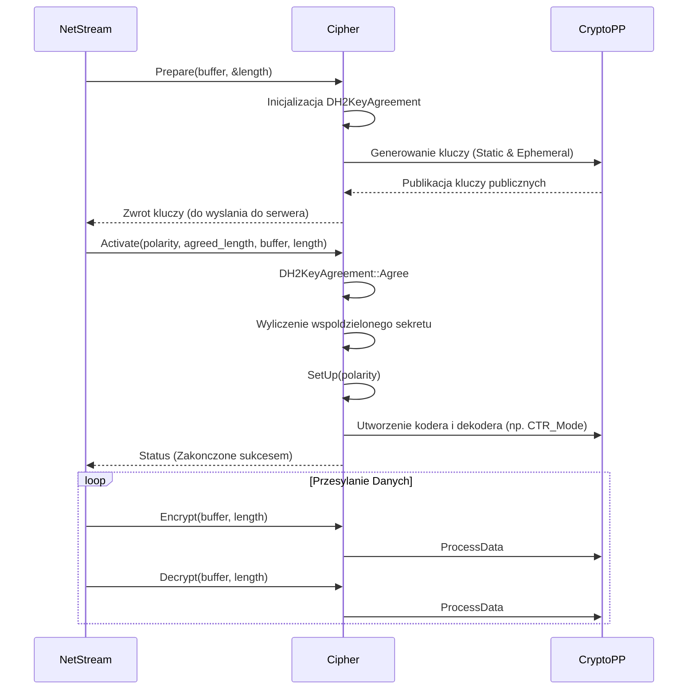

# Dokumentacja Podsystemu EterBase: Kryptografia, CRC32 i Polimorfizm (CPoly)

## 1. Cel Architektoniczny i Rola Modulu

Podsystem ten, bedacy czescia bazowej biblioteki `EterBase`, pelni trzy glowne role w architekturze klienta:
1. **Kryptografia (Cipher)**: Zabezpieczanie kanalu komunikacyjnego miedzy klientem a serwerem (w ramach makra `_IMPROVED_PACKET_ENCRYPTION_`). Odpowiada za ustalanie kluczy przy uzyciu protokolu Diffie-Hellman oraz szyfrowanie i deszyfrowanie pakietow algorytmami symetrycznymi (np. RC6, MARS, Twofish).
2. **Weryfikacja integralnosci (CRC32)**: Implementacja algorytmu CRC32 do weryfikacji danych w pamieci, jak rowniez zawartosci plikow bezposrednio z dysku przy uzyciu mapowania pamieci (Memory Mapped Files). Wykorzystywane przez system pakietow (EterPack) oraz przy walidacji zasobow.
3. **Parser wyrazen matematycznych (CPoly)**: Maszyna parsujaca (polimorficzna), sluzaca do dynamicznego wyliczania wartosci z tekstowych wzorow (np. obrazenia ze skilli, statystyki broni). Pozwala na przypisywanie zmiennych, obsluge funkcji trygonometrycznych oraz losowanie wartosci.

Modul ten operuje jako warstwa pomocnicza dla systemow sieciowych, zarzadzania plikami oraz mechaniki gry. Zalezy glownie od zewnetrznej biblioteki `CryptoPP` w przypadku operacji kryptograficznych, a mechanizmy CRC32 polegaja na funkcjach WinAPI (np. `CreateFileMapping`, `MapViewOfFile`). CPoly dziala niezaleznie.

## 2. Diagram Architektury i Przeplywu Danych (Mermaid)

## 3. Rejestr Struktur Danych i Pamieci (Memory & Struct Layout)

### Enum `ERandomType` (CPoly)
Rodzaje operacji na funkcjach losowych zdefiniowane wewnatrz `CPoly`:
- `RANDOM_TYPE_FREELY` (0): Zwykle losowanie ulamkowe lub calkowite z zakresu.
- `RANDOM_TYPE_FORCE_MIN` (1): Wymusza pobieranie zawsze minimalnej wartosci z zakresu.
- `RANDOM_TYPE_FORCE_MAX` (2): Wymusza pobieranie zawsze maksymalnej wartosci z zakresu.

### Struktura `BlockCipherDetail<T>` (Cipher)
Szablon wykorzystywany do tworzenia klas szyfrow blokowych w trybie `CTR_Mode`.
- Nie zawiera pol z danymi wlasnymi, pelni jedynie role selektora (fabryki) dla konkretnych typow ciphers z `CryptoPP`.

### Layout klasy `Cipher`
- `bool activated_`: Flaga (1 bajt) - okresla czy proces wymiany kluczy dobiegl konca i mozna bezpiecznie uzywac funkcji Encrypt/Decrypt.
- `CryptoPP::SymmetricCipher* encoder_`: Wskaznik na obiekt kodera strumieniowego (rozmiar ptr).
- `CryptoPP::SymmetricCipher* decoder_`: Wskaznik na obiekt dekodera strumieniowego (rozmiar ptr).
- `KeyAgreement* key_agreement_`: Wskaznik na polimorficzny obiekt wykonujacy proces wymiany kluczy, usuwany po aktywacji (rozmiar ptr).

### Layout klasy `DH2KeyAgreement`
- `DH dh_`: Obiekt parametrow grupy Diffie-Hellman z `CryptoPP`.
- `DH2 dh2_`: Obiekt implementujacy logike zunifikowanej wymiany kluczy z uzyciem grupy `dh_`.
- `SecByteBlock spriv_key_`, `epriv_key_`: Zaalokowane na stercie (wewnatrz SecByteBlock) bufory kluczy prywatnych (Statycznego i Efemerycznego).
- `SecByteBlock shared_` (z klasy bazowej): Bufor wspolnego, ostatecznego sekretu wygenerowanego po wymianie z serwerem.

## 4. Rejestr Klas i Metod (API Reference)

### `Cipher`
- `explicit Cipher()` / `~Cipher()` / `CleanUp()`: Konstruktor i destruktor. Konstruktor zeruje wskazniki i ustawia `activated_` na `false`. `CleanUp()` uwalnia (poprzez `delete`) aktywne obiekty algorytmow szyfrujacych i obiekt `key_agreement_`.
- `size_t Prepare(void* buffer, size_t* length)`: Rozpoczyna proces uzgadniania klucza. Zabezpieczony w srodku makrami `VM_START` (Themida). Inicjalizuje `DH2KeyAgreement` z bezpiecznymi parametrami grupy RFC 5114. Generuje pare statycznych i efemerycznych kluczy, a czesci publiczne obu kluczy kopiuje do `buffer`. Zwraca dlugosc wynikowego sekretu (tzw. agreed length).
- `bool Activate(bool polarity, size_t agreed_length, const void* buffer, size_t length)`: Konczy uzgadnianie klucza odbierajac polowke wygenerowana przez serwer z parametru `buffer`. Jezeli uzgodnienie `Agree` zwraca sukces, wywoluje `SetUp()`. Kasuje instancje `key_agreement_`.
- `bool SetUp(bool polarity)`: Pobiera wyliczony wczesniej przez klase `DH2KeyAgreement` shared secret. W oparciu o pierwsze dwa bajty tego sekretu wybiera dwa z mozliwych algorytmow z predefiniowanej listy za pomoca operatora modulo (funkcja `BlockCipherAlgorithm::Pick`). Przydziela z pozostalych bajtow sekretu bloki dla dwoch kluczy i dwoch IV (Initialization Vector), na ich podstawie generujac obiekt kodera (`encoder_`) i dekodera (`decoder_`). Parametr `polarity` okresla ktory klucz sluzy do kodowania, a ktory do dekodowania (pozwala to uniknac kolizji miedzy kierunkami komunikacji klient-serwer i serwer-klient). Uzywa makr `VM_START`/`VM_END`.
- `void Encrypt(void* buffer, size_t length)`: Odpala transformacje `ProcessData` kodera na miejscu w buforze podanym przez argument. Dziala wylacznie, jesli flaga `activated_` jest prawdziwa.
- `void Decrypt(void* buffer, size_t length)`: Wykonuje operacje odwrotna metoda dekodera, rowniez zastepujac tekst zaszyfrowany w oryginalnym buforze.

### `CRC32` (Funkcje Wolne)
- `DWORD GetCRC32(const char* buf, size_t len)`: Oblicza sume kontrolna tablicowa uzywajac wbudowanej `CRCTable`. Iteruje bloki co 16 bajtow uzywajac rozwinietych makr `DO16`, a reszte dokonczaja makra `DO1`. Zwraca wynik zanegowany (`crc ^ 0xffffffff`).
- `DWORD GetCaseCRC32(const char* buf, size_t len)`: Wersja obliczajaca sume ignorujac wielkosc znakow liter (zapewniane przez lokalne makro `UPPER(c)` oraz `DO16CI`).
- `DWORD GetHFILECRC32(HANDLE hFile)`: Odczytuje caly plik korzystajac z mechanizmu file mappingu Windows API (`CreateFileMapping`, `MapViewOfFile`). Oblicza CRC bezposrednio z pamieci wirtualnej zmapowanego widoku uzywajac `GetCRC32`, zapobiegajac przerwaniom I/O na powolne odczyty blokowe, po czym zwalnia zmapowana pamiec przez `UnmapViewOfFile`.
- `DWORD GetFileCRC32(const char* c_szFileName)`: Otwiera plik dany sciezka uzywajac `CreateFile` i przesyla uchwyt do `GetHFILECRC32`.

### `CPoly`
- `CPoly()`: Inicjalizuje z typem losowania `RANDOM_TYPE_FREELY` oraz tworzy prekompilowany wektor obslugiwanych identyfikatorow funkcji i symboli do listy `tokenBase`.
- `int Analyze(const char* pszStr)`: Wykonuje analize leksykalna lancucha tekstowego wyrazenia, rozdzielajac go na elementy skladowe (liczby, operatory matematyczne, identyfikatory metod, zmienne). Zwraca 1, jesli parser odniosl sukces.
- `float Eval()`: Ocenia sparsowany i przeanalizowany ciag wyrazen poslugujac sie tablica znakow i tablica wartosci. Wykorzystuje rekursywna maszyne stosu zmiennych operacyjna z maska `POLY_MAXSTACK` (do 100 wywolan). Wykonuje operacje matematyczne (np. dodawanie, dzielenie) pobierajac operand z wirtualnego stosu `save[]` i wrzucajac na niego modyfikacje.
- `int my_irandom(double start, double end)` / `double my_frandom(double start, double end)`: Generuje liczby losowe miedzy `start` a `end`. Jezeli typ losowania (przez `SetRandom`) to wymuszony minimum/maximum, to omija rzeczywiste wywolanie wbudowanego silnika randomizacyjnego, ulatwiajac tym samym testowanie i narzucanie progow (np. maksymalny "damage").

## 5. Punkty Styku (Cross-Subsystem Integration)
- **Komunikacja Sieciowa (NetworkStream)**: Obiekty pakietow korzystaja z klasy `Cipher`, zeby przy nawiazywaniu polaczenia odpalic `Prepare()` wysylajac swoj klucz, i odebrac klucz serwera odbierajac go w `Activate()`. Nastepnie przy wysylce z socketow uzywane bedzie `Encrypt()`.
- **EterPack i Ladowarki Plikow (FileLoader)**: Algorytmy sum kontrolnych (szczegolnie `GetFileCRC32`) sa uzywane przed zaladowaniem plikow `.epk` w VFS gry (Virtual File System) w celu upewnienia sie, czy ktos nie edytowal bazy zasobow, a takze uzywane sa do ladowania patcha przez program startujacy.
- **Kalkulacje Zmiennoprzecinkowe gry (Python / System Umiejetnosci)**: Silnik `CPoly` obrabia wszystkie wbudowane w kod Pythona gry logiki przeliczeniowe typu "300 + mw * 1.5". Parametry gracza jak (Sila, Zrecznosc - STR, DEX) bywaja wstrzykiwane funkcja `SetVar()` jako zmienne do maszyny wielomianow, a nastepnie wynik jest wyrzucany z `Eval()`.

## 6. Pulapki, Antywzorce i Ograniczenia
- **Wplyw makr Themidy na klatkarz**: Funkcje z wnetrza `Cipher`, takie jak `SetUp`, `Prepare` i `Activate` otoczone sa przez makra preprocesora `VM_START` i `VM_END`. Oznacza to, ze przy kompilacji pod wirtualizacje Themidy ten konkretny kod bedzie brutalnie zmutowany i zaciemniony, co uchroni przed reversowaniem pamieci, lecz z uwagi na integracje skomplikowanej matematyki Diffie-Hellman silnie opozni pierwsze sekundy nawiazania polaczenia. Nalezy unikac wywolywania ich wielokrotnie lub w goracym przeplywie wewnatrz glownego watku D3D.
- **Bledy wielkosci mapowania pamieci (CRC32)**: Wewnatrz funkcji `GetHFILECRC32`, widok tworzony za pomoca `MapViewOfFile` przyjmuje dla duzych plikow pelny rozmiar. Na starych systemach (32-bit arch), zmapowanie pliku o rozmiarze > 1-2 GB na raz moze spowodowac rzucenie wyjatku z uwagi na brak ciaglego bloku wirtualnej pamieci przestrzeni adresowej, co wywola tzw. Out of Memory Crash dla klienta gry.
- **Stos maszynowy `CPoly`**: Stos ewaluacyjny `save` zadeklarowany statycznie wewnatrz `CPoly::Eval` jako tabela obslugujaca maks 100 wpisow (`POLY_MAXSTACK`). Utworzenie skomplikowanego, recznie wygenerowanego wielomianu w plikach konfiguracyjnych serwera z ponad setka nawiasow lub operandow po pobraniu przez klienta zaskutkuje przepelnieniem bufora i pamieci (Buffer Overflow / Stack Corruption). Maszyna powinnna miec zabezpieczenia sprawdzajace granice inkrementacji `iSp`.
