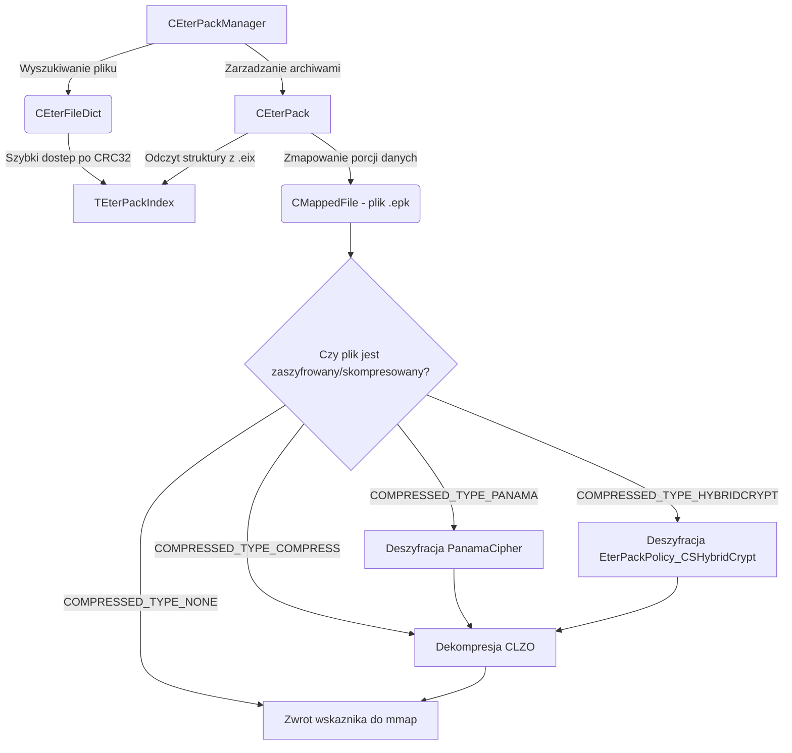

# Dokumentacja Podsystemu: EterPack (Virtual File System)

## 1. Cel Architektoniczny i Rola Modulu

Podsystem EterPack pelni role Wirtualnego Systemu Plikow (VFS - Virtual File System) dla klienta gry. Zamiast ladowac zasoby bezposrednio z dysku jako luzne pliki (co powoduje narzut IO i wydluza czasy ladowania), klient uzywa EterPack do odczytu danych ze spakowanych archiwow. 

Archiwa EterPack dziela sie na dwa glowne komponenty:
- **Plik Indeksu (.eix)**: Przechowuje struktury danych opisujace kazdy plik wewnatrz archiwum (nazwa pliku, sumy kontrolne, rozmiary przed i po kompresji, ofsety danych, rodzaj uzytego algorytmu kompresji/szyfrowania). Moze byc dodatkowo skompresowany i zaszyfrowany.
- **Plik Danych (.epk)**: Zawiera surowe fragmenty bajtow plikow, czesto poddane dekompresji w locie za pomoca biblioteki LZO (Lempel-Ziv-Oberhumer) oraz chronione algorytmami kryptograficznymi (Panama, Camellia, XTEA, Twofish via HybridCrypt).

Podsystem optymalizuje zarzadzanie pamiecia poprzez wykorzystanie mechanizmu File Mapping (`CMappedFile` z EterBase). Odczyt duzych zasobow takich jak modele 3D (.gr2), skrypty Pythona (.py), czy tekstury (.dds), nie obciaza procesora zbednym kopiowaniem pamieci w trybie uzytkownika, lecz mapuje bloki bezposrednio w przestrzeni adresowej VRAM / RAM procesem wspieranym z poziomu systemu operacyjnego.

Zaleznosci:
- **Crypto++**: Obliczenia skrotow MD5, SHA1, Tiger, RIPEMD128, Whirlpool, oraz operacje szyfrowania szyframi strumieniowymi (Panama).
- **LZO**: Szybka kompresja/dekompresja blokow danych w czasie rzeczywistym.
- **EterBase**: Wykorzystanie nakladki `CMappedFile` na systemowe wywolania Win32 API (`CreateFileMapping`, `MapViewOfFile`).

## 2. Diagram Architektury i Przeplywu Danych (Mermaid)



## 3. Rejestr Struktur Danych i Pamieci (Memory & Struct Layout)

### `EEterPackTypes` (enum)
Okresla limity danych tekstowych i stale uzywane przez menedzer pamieci podczas defragmentacji archiwow, jak rowniez typ zabezpieczenia.
- `DBNAME_MAX_LEN = 255`
- `FILENAME_MAX_LEN = 160`
- `FREE_INDEX_BLOCK_SIZE = 32768`
- `FREE_INDEX_MAX_SIZE = 512`
- `DATA_BLOCK_SIZE = 256`
- **Typy pakietow**:
  - `COMPRESSED_TYPE_NONE = 0` - Brak kompresji.
  - `COMPRESSED_TYPE_COMPRESS = 1` - Kompresja LZO.
  - `COMPRESSED_TYPE_SECURITY = 2` - LZO + Prosty klucz XOR (`s_adwEterPackSecurityKey`).
  - `COMPRESSED_TYPE_PANAMA = 3` - Szyfrowanie Panama z CryptoPP (klucze generowane z nazwy pliku i sum kontrolnych).
  - `COMPRESSED_TYPE_HYBRIDCRYPT = 4` - HybridCrypt (XTEA / Twofish).
  - `COMPRESSED_TYPE_HYBRIDCRYPT_WITHSDB = 5` - HybridCrypt ze zintegrowanym blokiem SDB (Supplementary Data Block).

### `TEterPackIndex` / `SEterPackIndex`
Struktura mapujaca konkretny plik wpisany do archiwum EterPack. Opatrzona jest dyrektywa `#pragma pack(push, 4)`, wymuszajac 4-bajtowe wyrownywanie pol w pamieci by oszczedzic miejsce.

```cpp
#pragma pack(push, 4)
typedef struct SEterPackIndex
{
    long            id;               // Identyfikator w tablicy indexow
    char            filename[161];    // Sciezka do pliku (maks 160 + '\0')
    DWORD           filename_crc;     // CRC32 z nazwy pliku - glowny hash wyszukiwania
    long            real_data_size;   // Rozmiar alokacji bloku (wyrownany do 256 bajtow)
    long            data_size;        // Rzeczywisty rozmiar pliku po dekompresji
    DWORD           data_crc;         // Checksum danych (w innej wersji BYTE MD5Digest[16])
    long            data_position;    // Offset poczatku bloku wewnatrz pliku .epk
    char            compressed_type;  // Jeden z tagow z EEterPackTypes
} TEterPackIndex;
#pragma pack(pop)
```

## 4. Rejestr Klas i Metod (API Reference)

### `CEterPackManager` (Singleton)
Glowy koordynator wirtualnego systemu plikow klienta, rozszerzajacy wzorzec `CSingleton<CEterPackManager>`. Trzyma rejestr zaladowanych `.eix` / `.epk` w postaci tablic i slownikow (`m_PackMap`, `m_DirPackMap`).

- `bool Get(CMappedFile & rMappedFile, const char * c_szFileName, LPCVOID * pData)`:
  Glowne wejscie (entrypoint) do ladowania danych. Menedzer w pierwszej kolejnosci sprawdza, czy zostal ustawiony tryb wyszukiwania `SEARCH_PACK_FIRST`. Jesli tak, przeszukuje pakiety, jesli nie, przeszukuje dysk twardy za pomoca makra `_access`. Jezeli zasob znajduje sie w archiwum, metoda prosi konkretny `CEterPack` o uzupelnienie referencji do obiektu `CMappedFile` i pobiera pointer na poczatek zbuforowanych i rozkodowanych danych.
  
- `bool RegisterPack(const char * c_szName, const char * c_szDirectory, const BYTE* c_pbIV)`:
  Rejestruje nowe archiwum pod podanym prefiksem (katalogiem). Alokuje obiekt `CEterPack` i nakazuje mu wywolanie wewnetrznej metody `Create`, z podanym (opcjonalnie) Wektorem Inicjalizujacym `c_pbIV` uzywanym pozniej przez kryptografie Panama.
  
- `void RetrieveHybridCryptPackKeys(const BYTE *pStream)`:
  Odczytuje ze strumienia sieciowego lub zakodowanego pliku (dump file) zestaw haszy z nazwami bazowymi paczek oraz paczki z kluczami, wykorzystywanymi do pozniejszego zdekodowania zasobow w polityce `EterPackPolicy_CSHybridCrypt`.

### `CEterFileDict`
Slownik optymalizacyjny dla menedzera `CEterPackManager`. Posiada strukture mapujaca (hashmap) oparta na `std::unordered_multimap<DWORD, Item>`, w ktorej kluczem jest CRC32 obliczone na nazwie wirtualnego pliku, a wartoscia jest obiekt wiazacy dany indeks pliku (`TEterPackIndex`) z konkretna instancja archiwum (`CEterPack`).

### `CEterPack`
Klasa reprezentujaca logiczne pojedyncze archiwum VFS. Obiekty alokowane sa przez `CEterPackManager`.

- `bool Create(CEterFileDict& rkFileDict, const char * dbname, const char * pathName, bool bReadOnly, const BYTE* iv)`:
  Otwiera fizyczne pliki `.eix` i `.epk`. Jesli archiwum podano jako read-only (`m_bReadOnly`), a pliki nie istnieja, funkcja zwroci `false`. Podczas odczytu z `.eix` dokonuje weryfikacji naglowka na podstawie `eterpack::c_IndexCC` (Magiczna wartosc FourCC: 'EPKD') oraz `eterpack::c_Version`. Rejestruje takze zdekodowane tablice `TEterPackIndex` w podanej instancji `CEterFileDict`.

- `bool Get2(CMappedFile& out_file, const char * filename, TEterPackIndex * index, LPCVOID * data)`:
  Metoda dekompresujaca zasob w locie i przepisujaca go z mapy `.epk` do pamieci zewnetrznej. Wykorzystuje referencyjny `index->compressed_type` do okreslenia sciezki egzekucji. Jesli to bezpieczny strumien `COMPRESSED_TYPE_SECURITY` i nie zdano weryfikacji MD5/CRC32 wywala blad. Przekierowuje bajty do algorytmow (np. LZO, `__Decrypt_Panama`, SDB z Themida SDK).
  
- `bool __Decrypt_Panama(const char* filename, const BYTE* data, SIZE_T dataSize, CLZObject& zObj)`:
  Szyfrator symetryczny bazujacy na obsludze silnika PanamaCipher z CryptoPP. Wymagane jest poprawne zainicjowanie `m_stIV_Panama` wektorem IV. Klucz dla procesu jest dynamicznie generowany funkcja `__CreateFileNameKey_Panama`. Deszyfracja przetwarza bloki po 2048 bajtow maksymalnie w jednym podejsciu, co jest wymogiem dopasowania `MandatoryBlockSize()`. Wynik wstawia do obiektu `CLZObject`.
  
- `void __CreateFileNameKey_Panama(const char * filename, BYTE * key, unsigned int keySize)`:
  Wazny i nieszablonowy mechanizm EterPack. Klucz Panama jest budowany na podstawie nazwy pliku. Z nazwy pliku obliczany jest kod CRC32. Operacja modulo 4 (`idx & 3`) wybiera jeden z pierwszych algorytmow skrotu HashFilter (0=Whirlpool, 1=Tiger, 2=SHA1, 3=RIPEMD128). Filtr wykonuje sie na `SrcStringForKey` (nazwa pliku) by wypelnic pierwsza czesc wektora. Nastepnie na postawie 4-bajtowej wartosci utworzonego klucza (`*(unsigned int*)key`) wybierana jest w ten sam sposob druga funkcja hashujaca dopelniajaca koncowy wymiar klucza do 32 bajtow.

## 5. Punkty Styku (Cross-Subsystem Integration)

- **EterBase - System Plikow & Pule pamieci**: Podsystem VFS bezposrednio jest klientem mechanizmow mapowania stron procesora przez `CMappedFile`. Ponadto wszystkie indeksy sa walidowane CRC32 na bazie naglowka `CRC32.h` (obliczanie `filename_crc` jako wezel drzewa binarnych haszy wyszukiwania).
- **Zarzadzanie Bezpieczenstwem Pamieci (Themida)**: W obsludze `COMPRESSED_TYPE_HYBRIDCRYPT` w obiekcie CEterPack widoczne sa makra `VM_START` i `VM_END` sluzace do wirtualizacji maszyn w kodzie uzytkownika, pochodzace ze srodowiska zabezpieczen Themida. To powiazanie wskazuje mocny wektor walki z debugerami zrzucajacymi wyekstrahowany kod paczek .epk na dysk.
- **CLZObject (EterBase)**: Wrapper dekompresyjny. Dane szyfrowane sa odpakowywane bezposrednio do pamieci tymczasowej kontrolowanej przez obiekt LZO dla zapewnienia braku relokacji wielkich blokow i wycieku referencji w c-strings (gwarantowane `new CLZObject`).

## 6. Pulapki, Antywzorce i Ograniczenia

1. **Wspolbieznosc Krytyczna**: Metody rejestrowania paczek z `CEterPackManager` modyfikuja listy std::list i unordered_map bez natywnego zabezpieczania watkowego odczytu i zapisu. Obiekt posiada zmienna `CRITICAL_SECTION m_csFinder`, co sugeruje niepelnoskalowa synchronizacje w kontekscie tylko niektorych wyszukiwan zasobow, stad obciazanie go masowymi operacjami ladowania/rejestracji pakietow z asynchronicznego watku np. ladowania modeli bywa zrodlem martwych zakleszczen i bledow mapowania.
2. **Zuzycie i Wyciek MappedFile**: Wszystkie pomyslnie zaimportowane pliki laduja swoj wskaznik z .epk prosto przez `CMappedFile`. To w skrajnych architekturach Win32 (x86 - 32bity) wyczerpuje pule dostepnych stron przestrzeni wirtualnej do zaalokowania i wyrzuca blad "Out Of Memory", mimo ze na maszynie fizycznie moze byc duzo pamieci RAM (ograniczenie 2 GB na proces / LARGEADDRESSAWARE flag limitation).
3. **Deterministyczna Deszyfracja (Panama)**: Klucze Panama sa generowane TYLKO bazujac na stringu nazwy pliku. Osoba majaca znajomosc sciezki np. `d_a_mil_bow_01.gr2` jest w stanie prosta implikacja wyliczyc `idx` z CRC32 i odtworzyc 32 bajtowy klucz Tiger/SHA1 bez uzywania klucza sesji serwera. To zrywa zasade bezpieczenstwa, czyniac szyfr w EterPack czystym narzedziem zaciemniania logiki "Security through Obscurity".
4. **Fragmentacja blokow archiwum**: Przy tworzeniu i modyfikacji (metoda `Put`), dekompresja/rekompresja wiekszego pliku wymaga przesuniecia go do nowej strefy tablicy .epk i porzuceniu starego ofsetu (`PushFreeIndex`). Bez wywolania operacji typu defragmentacji, z biegiem narastania modyfikacji klienckich, paczka puchnie niekontrolowanie przechowujac sterty "wolnych blokow" i przemieszanych stron LZO.
