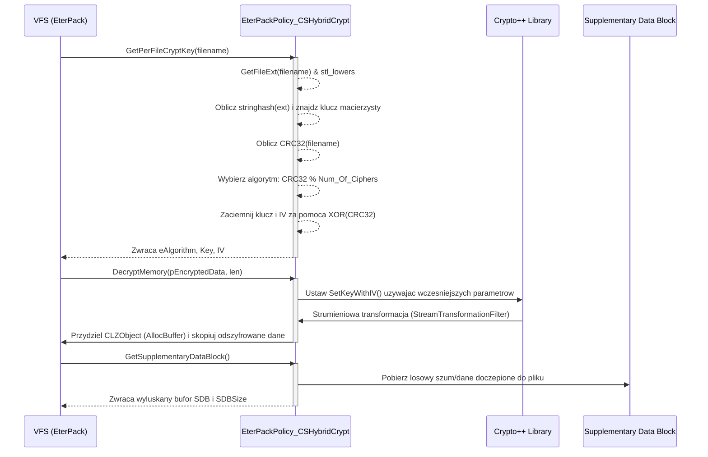

# Dokumentacja Podsystemu: EterPack - Szyfrowanie Archiwow i Polityka Bezpieczenstwa

## 1. Cel Architektoniczny i Rola Modulu

**Glowna odpowiedzialnosc**: Podsystem `EterPackPolicy_CSHybridCrypt` odpowiada za zaawansowane, hybrydowe szyfrowanie i deszyfrowanie plikow ladowanych do pamieci klienta z archiwow wirtualnego systemu plikow (Virtual File System - VFS) gry. Jego celem jest ochrona zasobow gry (modele, tekstury, mapy) przed nieautoryzowanym dostepem, modyfikacja i wyodrebnieniem. Implementuje szyfrowanie zalezne od rozszerzenia pliku oraz unikalnych sum kontrolnych (CRC32), wsparte o mechanizmy zaciemniania logiki przez narzedzie Themida. Dodatkowo modul obsluguje bloki danych uzupelniajacych (Supplementary Data Block - SDB), ktore sa czesciowo zaszyfrowanymi, losowymi fragmentami danych, utrudniajacymi proste czytanie pamieci i analize struktury archiwum.

**Zaleznosci**:
*   **Wywolania**: Modul jest bezposrednio wywolywany przez warstwe EterPack / EterBase zarzadzajaca dostepem do plikow VFS w czasie ladowania assetow do gry.
*   **Zalezne biblioteki**:
    *   **Crypto++** (`<cryptopp/cryptlib.h>`, `<cryptopp/camellia.h>`, `<cryptopp/twofish.h>`, `<cryptopp/tea.h>`, `<cryptopp/modes.h>`, `<cryptopp/osrng.h>`): wykorzystywana do operacji kryptograficznych (szyfrowanie Camellia, Twofish, XTEA).
    *   **EterBase**: `Stl.h` (funkcje `stl_lowers`, `stringhash`), `FileName.h` (operacje na rozszerzeniach), `FileBase.h`, `Crc32.h` (obliczanie `GetCRC32`), `lzo.h` (struktura buforow skompresowanych `CLZObject`), `Random.h`.
    *   **ThemidaSDK**: Zabezpieczenie kodu, wykorzystanie makr `VM_START` i `VM_END` na poziomie poszczegolnych krytycznych funkcji.

## 2. Diagram Architektury i Przeplywu Danych (Mermaid)

## 3. Rejestr Struktur Danych i Pamieci (Memory & Struct Layout)

### Enums

*   `enum eHybridCipherAlgorithm`: Enum definiujacy dostepne algorytmy szyfrowania.
    *   `e_Cipher_Camellia` (0)
    *   `e_Cipher_Twofish` (1)
    *   `e_Cipher_XTEA` (2)
    *   `Num_Of_Ciphers` (3) - Uzywane jako modulo przy wyborze algorytmu dla danego pliku.

### Unie Szyfrujace (Memory Packing)

Unie uzywane sa do elastycznego zarzadzania pamiecia bez rzutowania wskaznikow. Pozwalaja na wygodne odwolywanie sie do bufora klucza w zaleznosci od wybranego algorytmu.

*   `union UEncryptKey` (Alias: `TEncryptKey`):
    *   `BYTE key[16]` - surowa tablica klucza dla latwego xorowania (16 bajtow).
    *   `BYTE keyCamellia[CryptoPP::Camellia::DEFAULT_KEYLENGTH]` (zwykle 16 bajtow).
    *   `BYTE keyTwofish[CryptoPP::Twofish::DEFAULT_KEYLENGTH]` (zwykle 16 bajtow).
    *   `BYTE keyXTEA[CryptoPP::XTEA::DEFAULT_KEYLENGTH]` (zwykle 16 bajtow).
    *   *Przeznaczenie*: Magazynuje rozne formaty kluczy, wielkosc zalezy od MAX_KEYLENGTH, minimalnie zajmuje 16 bajtow.

*   `union UEncryptIV` (Alias: `TEncryptIV`):
    *   `BYTE iv[16]` - surowa tablica wektora inicjalizacyjnego.
    *   `BYTE ivCamellia[CryptoPP::Camellia::BLOCKSIZE]` (16 bajtow).
    *   `BYTE ivTwofish[CryptoPP::Twofish::BLOCKSIZE]` (16 bajtow).
    *   `BYTE ivXTEA[CryptoPP::XTEA::BLOCKSIZE]` (8 bajtow).
    *   *Przeznaczenie*: Wektor startowy dla trybu Counter (CTR_Mode).

### Struktury i Typy (Structs)

*   `struct SCSHybridCryptKey` (Alias: `TCSHybridCryptKey`):
    *   `TEncryptKey uEncryptKey` - klucz powiazany z rozszerzeniem pliku.
    *   `TEncryptIV uEncryptIV` - wektor IV powiazany z rozszerzeniem pliku.
    *   *Przeznaczenie*: Struktura wezla w mapie trzymajaca macierzyste klucze dla konkretnego rozszerzenia (np. `.dds`, `.gr2`).

*   `struct SSupplementaryDataBlockInfo` (Alias: `TSupplementaryDataBlockInfo`):
    *   `std::string strRelatedMapName` - nazwa mapy powiazanej z danym plikiem SDB. Zoptymalizowane: po stronie klienta czesto zignorowane/nieuzywane (zmienna docelowa).
    *   `std::vector<BYTE> vecStream` - wektor z surowymi bajtami bloku dopelniajacego SDB. Rozmiar zwykle od 64 do 128 bajtow.
    *   *Przeznaczenie*: Przechowuje dodatkowe szumowe bity wyciete/doczepiane na koncu wlasciwego zasobu chroniac go w pamieci/na dysku przed narzedziami do wyciagania (extractors).

### Kontenery zaleznosci (Maps)

*   `m_mapHybridCryptKey` (Typ: `std::unordered_map<DWORD, TCSHybridCryptKey>`): Zmienna klasy. Przechowuje zmapowane rozszerzenia (skonwertowane z stringhash - CRC rozszerzenia w lowercase) do unikalnego klucza `TCSHybridCryptKey`.
*   `m_mapSDBMap` (Typ: `std::unordered_map<DWORD, TSupplementaryDataBlockInfo>`): Zmienna klasy. Mapuje skrot `stringhash` obustronnie obnizonej nazwy calego pliku na strukture `TSupplementaryDataBlockInfo` (czyli konkretny zaszumiony blok dopelniajacy dla danego pliku).

## 4. Rejestr Klas i Metod (API Reference)

Klasa glowna: `EterPackPolicy_CSHybridCrypt`

### Metody Inicjalizacyjne i Pobierania Klucza

*   `bool EterPackPolicy_CSHybridCrypt::GenerateCryptKey(std::string& rfileName)`
    *   **Parametry**: `rfileName` (nazwa/sciezka pliku w formacie string).
    *   **Zwraca**: `true` przy pomyslnym utworzeniu, `false` gdy klucz juz istnieje dla tego rozszerzenia.
    *   **Logika Biznesowa**: Funkcja ekstrahuje rozszerzenie pliku, konwertuje do malych liter i mapuje za pomoca `stringhash`. Za pomoca narzedzi z biblioteki Crypto++ (`AutoSeededRandomPool`) generuje calkowicie losowy blok bajtow uzupelniajac `uEncryptKey` i `uEncryptIV`. Nastepnie nowo stworzony element wkladany jest do `m_mapHybridCryptKey`. Operacja ukryta za sprawa makr Themida (`VM_START`/`VM_END`).

*   `bool EterPackPolicy_CSHybridCrypt::GetPerFileCryptKey(std::string& rfileName, eHybridCipherAlgorithm& eAlgorithm, TEncryptKey& key, TEncryptIV& iv)`
    *   **Parametry**: nazwa pliku i parametry wyjsciowe dla algorytmu, klucza i wektora.
    *   **Zwraca**: `true` lub `false` (w zaleznosci od obecnosci rozszerzenia w systemie).
    *   **Logika Biznesowa**: Szuka klucza macierzystego opierajac sie o rozszerzenie pliku. Jesli klucz zostanie znaleziony, algorytm dla konkretnego pliku jest losowany w sposob jednoznaczny: `GetCRC32(lowercase(filename)) % Num_Of_Ciphers`. Pozwala to na unikniecie jednego algorytmu dla calego archiwum - pliki uzywaja roznych narzedzi szyfrujacych. Nastepnie `key` i `iv` modyfikowane sa tak, ze ich poszczegolne DWORDy sa poddawane operacji bitowej `XOR (^=)` z uzyciem CRC32 pelnej nazwy pliku. Oznacza to, ze kazdy plik posiada w pelni odizolowany, scisle chroniony wlasny klucz i iv.

### Szyfrowanie / Deszyfrowanie w Pamieci

W obu przypadkach uzywany jest ten sam tryb `CTR_Mode` (Counter Mode).

*   `bool EterPackPolicy_CSHybridCrypt::EncryptMemory(std::string& rfileName, IN const BYTE* pSrcData, IN int iSrcLen, OUT CLZObject& zObj)`
    *   **Parametry**: `rfileName` (string), `pSrcData` (wskaznik na oryginalne dane), `iSrcLen` (dlugosc wejsciowa), `zObj` (struktura zwracana do alokacji LZO bufora).
    *   **Zwraca**: `true` na sukces.
    *   **Logika Biznesowa**: Wywoluje `GetPerFileCryptKey`. Sprawdza wyluskanie `eAlgorithm`. Inicjuje obiekt encrypcji Camellia, Twofish lub XTEA z wykorzystaniem filtru `StreamTransformationFilter`. Zaszfrowane dane trafiaja do obiektu `std::string strCipher`. Na koniec pamiec `zObj` (`CLZObject`) jest pre-alokowana do wielkosci zrodlowej i strumien jest z niej zgrywany za pomoca `memcpy`. ThemidaVM oslania te funkcje.

*   `bool EterPackPolicy_CSHybridCrypt::DecryptMemory(std::string& rfilename, IN const BYTE* pEncryptedData, IN int iEncryptedLen, OUT CLZObject& zObj)`
    *   **Parametry**: Zblizone jak wyzej.
    *   **Zwraca**: `true` na sukces.
    *   **Logika Biznesowa**: Identyczna z `EncryptMemory` ale dzialajaca w odwrotnym kierunku - na obiektach `CIPHER_MODE<algorithm>::Decryption`. Decryptor odczytuje wskazane dane zaszyfrowane i wyprowadza Plain Text do bufora zadeklarowanego z wyprzedzeniem jako std::string (`strDecipher.reserve()`). Kopiowanie wyniku nastepuje po weryfikacji dlugosci oryginalnego streamu.

### Odczyt i Zapis Struktur I/O z Pliku Datowych

*   `void EterPackPolicy_CSHybridCrypt::WriteCryptKeyToFile(CFileBase& rFile)`
*   `int EterPackPolicy_CSHybridCrypt::ReadCryptKeyInfoFromStream(IN const BYTE* pStream)`
    *   **Logika Biznesowa**: Zarzadza procesem serializacji/deserializacji map rozszerzen dla kluczy matrycowych klienta. Dane sa serializowane jako bajty jeden po drugim: DWORD rozmiaru mapy -> iteracja [DWORD (hash) -> BYTE[16] (key) -> BYTE[16] (IV)]. Metoda Read jest niebezpieczna ze wzgledu na zaufanie do `dwCryptoInfoSize` i plynnego inkrementowania `iStreamOffset`.

### Supplementary Data Block (SDB)

*   `bool EterPackPolicy_CSHybridCrypt::GenerateSupplementaryDataBlock(std::string& rfilename, const std::string& strMapName, IN const BYTE* pSrcData, IN int iSrcLen, OUT LPBYTE& pDestData, OUT int& iDestLen)`
    *   **Logika Biznesowa**: Bierze oryginalne dane ucinajac losowo wygenerowany fragment (64-128 bajtow). Zwraca ten "uciety" koniuszek jako SDB przechowywany w `m_mapSDBMap` dla konkretnego `CRC32(lower(filename))`. Nalezy byc uwaznym poniewaz `iDestLen` zostaje zmniejszone (plik na dysku zostaje okrojony bez bufora, dopelnienie wysyla/pobiera gdzies indziej).

*   `bool EterPackPolicy_CSHybridCrypt::GetSupplementaryDataBlock(std::string& rfilename, OUT LPBYTE& pSDB, OUT int& iSDBSize)`
    *   **Zwraca**: Adres struktury bloku uzupelniajacego dla danego nazewnictwa oraz jego rozmiar. Jesli SDB nie istnieje, zwraca null.

*   `void EterPackPolicy_CSHybridCrypt::WriteSupplementaryDataBlockToFile(CFileBase& rFile)`
*   `int EterPackPolicy_CSHybridCrypt::ReadSupplementatyDataBlockFromStream(IN const BYTE* pStream)`
    *   **Logika Biznesowa**: Zapis SDB do zewnetrznego rejestru (strumienia). Podczas odczytu z serwera lub ukrytego pliku `ReadSupplementatyDataBlockFromStream` nie wczytuje zmiennej stringowej mapy - optymalizacja obnizajaca obciazenie pamieci ("related map name isn't required in client, so we don't recv it from stream to reduce packet size").

## 5. Punkty Styku (Cross-Subsystem Integration)

*   **Powiazanie z Pythonem**: Ta bezposrednia klasa nie zawiera exportow `PyMethodDef`. Dziala jako zaplecze i jest instancjonowana jako singleton lub modul w obiekcie CEterPackManager / wirtualnego systemu. To modul zarzadcy EterPack uzywa bibliotek Py_BuildValue w celu weryfikacji sum kontrolnych i statusow przez skrypty Python (np. zabezpieczenia anty-cheat w `system.py`).
*   **Powiazanie z serwerem**: Metoda `ReadSupplementatyDataBlockFromStream` wskazuje na odczytywanie "z pakietu". W EterPack (i plikach Index) dane o kluczach i SDB moga pochodzic z ukrytych streamow zakodowanych w pliku wykonywalnym lub przesylanych specjalnymi opkodami tuz po autoryzacji serwerowej klienta TCP. SDB pozwala maskowac wazne czesci map przed parserami, dopoki klient nie podlaczy sie i nie dostanie wlasciwego narzutu w pamieci.
*   **Powiazanie z DirectX / sprzetem**: Funkcje DecryptMemory wyprowadzaja wyczyszczone surowe dane plikowe (Modele 3D, Textury DXT), ktore finalnie zostaja przekazane do buforow EterImage, a pozniej uploadowane do VRAM przez interfensy d3dDevice->CreateTexture / Lock. Brak zaleznosci graficznych spowalnia VFS jedynie na etapie ladowania w glownej petli C++.

## 6. Pulapki, Antywzorce i Ograniczenia

1.  **Potencjalne wycieki i bezp. pamieci**: W `EncryptMemory` wywolywany jest konstruktor z dynamiczna alokacja pamieci `new CryptoPP::StringSink(strCipher)`. Funkcja polega na auto-niszczeniu lancucha potokow `StreamTransformationFilter` (wlasnosc `m_deleteAttachment=true`), ale bez odpowiedniego try-catch wokolo w przypadku throw z biblioteki CryptoPP, nastepuje unhandled exception i zablokowanie watku alokatora, co wysadza klienta.
2.  **Podatnosc w `ReadCryptKeyInfoFromStream`**: Funkcja ufnie wczytuje `dwCryptoInfoSize` prosto ze strumienia wejsciowego i przeprowadza petle wedlug tego rozmiaru. Spreparowany strumien z ujemnym bitowo lub olbrzymim rozmiarem wykonczeni pule pamieci procesowej prowadzac do bledu Segmentation Fault (przepelnienie offsetu odczytu pamieci `pStream + iStreamOffset`).
3.  **Modyfikacja CRC Kluczy i IV via XOR**: Operacja `*((DWORD*)key.key + i) ^= dwfileNameCrc` dokonuje castingu pamieci bez zadbania o wyrownanie. Z racji faktu, ze tablica BYTE to ciag surowy, mozna narazic sie na glosy ostrzegawcze `Strict Aliasing Rule` badz `Unaligned Memory Access` zaleznie od modyfikacji platformy do ARM lub najnowszych kompilatorow GCC, jesli te makra kiedys zostalyby przeniesione.
4.  **Brak obslugi mniejszych niz jeden bajt**: SDB sprawdza `if(iSDBSize <= 0)` i jesli src data jest mala, moze odmowic pakowania lub poprawnie skopiowac bufor, naruszajac integrity check Themidy w przypadku uszkodzen pliku.
5.  **Multi-watkowosc**: Klasa polega na statycznym narzedziu szyfrujacym bez blokady semaforowej (Mutex). Rownoczesny odczyt wielu malych plikow (np. tekstury interfejsu podczas ruchu) moze doprowadzic do nalozenia wektorow inicjalizacyjnych i uwalenia stanu pamieci `m_mapSDBMap` co zrzuci uzytkownika do systemu bez komunikatu.
