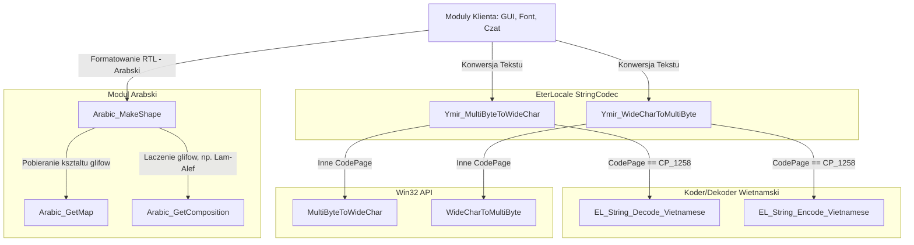

# Dekonstrukcja Podsystemu EterLocale: Wielojezycznosc, Kodowania Znakow i StringCodec

## 1. Cel Architektoniczny i Rola Modulu

Podsystem **EterLocale** to fundamentalny modul klienta sluzacy do unifikacji obslugi wielojezycznosci (i18n), konwersji stron kodowych oraz manipulacji tekstami w zaleznosci od regionu (np. obsluga jezyka arabskiego, wietnamskiego).
Jego glownym celem architektonicznym jest ukrycie wewnetrznej zlozonosci API Windows i specjalnych wyjatkow regionalnych (jak CP_1258 dla wietnamskiego) pod warstwa posrednia (np. interfejsy z prefiksem `Ymir_`), tak by reszta kodu klienta, system interfejsu GUI oraz silnik gry, operowaly na zunifikowanych danych znakowych.

**Glowne odpowiedzialnosci:**

- Zapewnienie funkcji mapujacych szerokie znaki (`WideChar`) na znaki wielobajtowe (`MultiByte`) oraz na odwrot, biorac pod uwage wyjatki kodowania.
- Analiza, transformacja i prezentacja skryptow dla jezykow pisanych od prawej do lewej (RTL) z wymogami ksztaltowania liter (np. jezyk arabski - obsluga wariantow poczatkowych, srodkowych, koncowych i izolowanych znaku).

**Zaleznosci:**

- **Systemowe**: Windows API (`MultiByteToWideChar`, `WideCharToMultiByte`).
- **Wewnetrzne (Klient)**: Pozostale komponenty EterLocale (jak np. `StringCodec_Vietnamese.h`), wykorzystywane przez m.in. UI (EterPythonUI), obsluge fontow (TextTail, FontManager), czat oraz pakiety sieciowe wymagajace konwersji miedzy UTF-8 / Ansi a WideChar na potrzeby renderowania DirectX.

---

## 2. Diagram Architektury i Przeplywu Danych (Mermaid)

Ponizszy diagram obrazuje przeplyw wywolan w trakcie konwersji i formatowania tekstow wielojezycznych.

---

## 3. Rejestr Struktur Danych i Pamieci (Memory & Struct Layout)

W podsystemie operujacym w duzej mierze na bezposrednich buforach i przeksztalceniach wystepuja pomocnicze definicje slownikowe. W module arabskim zdefiniowano wyliczenia kontrolujace zakres kodow i formy glifow.

### `enum ARABIC_CODE`

**Przeznaczenie:** Definiuje bazowy zakres kodow Unicode dla alfabetu arabskiego uzywanego w tablicach konwersji.

- `ARABIC_CODE_BASE = 0x0621` : Kod bazowy (Hamza).
- `ARABIC_CODE_LAST = 0x064a` : Ostatni wspierany glowny kod (Yeh).
- `ARABIC_CODE_COUNT = ARABIC_CODE_LAST - ARABIC_CODE_BASE + 1` : Rozmiar uzytecznego przedzialu.

### `enum ARABIC_FORM_TYPE`

**Przeznaczenie:** Okresla mozliwe postacie (ksztalty) danego znaku arabskiego w zaleznosci od jego umiejscowienia w slowie, wymusza konwersje na odpowiednie stale mapujace z zakresu glifow prezencyjnych (Presentation Forms).

- `DEBUG_CODE (0)` : Indeks uzywany potencjalnie do celow diagnostycznych/wewnetrznych tablic z kodem bazowym.
- `ISOLATED (1)` : Forma izolowana, gdy litera nie laczy sie ani z lewej, ani z prawej.
- `INITIAL (2)` : Forma poczatkowa (laczy sie z lewej).
- `MEDIAL (3)` : Forma srodkowa (laczy sie z dwoch stron).
- `FINAL (4)` : Forma koncowa (laczy sie z prawej).
- `ARABIC_FORM_TYPE_NUM (5)` : Maksymalny rozmiar (ilosc stanow) dla struktur macierzowych w `Arabic_GetMap`.

---

## 4. Rejestr Klas i Metod (API Reference)

### Plik `StringCodec.h` i `StringCodec.cpp`

Zamiast bezposredniego korzystania z API Windowsowego, uzyto wrapperow (funkcji fasadowych) przechwytujacych specyficzne strony kodowe, przed wywolaniem docelowych bibliotek OS.

#### `int Ymir_WideCharToMultiByte(UINT CodePage, DWORD dwFlags, LPCWSTR lpWideCharStr, int cchWideChar, LPSTR lpMultiByteStr, int cbMultiByte, LPCSTR lpDefaultChar, LPBOOL lpUsedDefaultChar)`

- **Parametry:** Standardowe parametry tosame z WinAPI `WideCharToMultiByte`.
- **Zwracana wartosc:** `int` - Ilosc zapisanych bajtow w buforze wielobajtowym. Zwraca 0 w przypadku bledu alokacji/braku wielkosci na zakonczenie null, zgodnie ze standardami Win32.
- **Logika Biznesowa:** Zastepuje globalne wolanie `WideCharToMultiByte`. W bloku warunkowym sprawdza `CodePage`. Jesli to `CP_1258` (Wietnam), deleguje wykonanie do specjalizowanej wewnetrznej funkcji `EL_String_Encode_Vietnamese`. W przeciwnym razie wywoluje wbudowane `WideCharToMultiByte` Win32 API.

#### `int Ymir_MultiByteToWideChar(UINT CodePage, DWORD dwFlags, LPCSTR lpMultiByteStr, int cbMultiByte, LPWSTR lpWideCharStr, int cchWideChar)`

- **Parametry:** Standardowe parametry tosame z WinAPI `MultiByteToWideChar`.
- **Zwracana wartosc:** `int` - Ilosc znakow szerokich wpisanych do `lpWideCharStr`.
- **Logika Biznesowa:** Zastepuje API systemowe celem odkodowywania Stringow z konkretnych formatow wielobajtowych do UTF-16 (`WideChar`). Podobnie jak funkcja wyzej, przechwytuje `CodePage == CP_1258` by uzyc niestandardowego `EL_String_Decode_Vietnamese`. W innym wypadku deleguje to do bibliotek Windows.

### Plik `Arabic.h` i `Arabic.cpp`

Odpowiada za dekodowanie, rozpoznawanie spacji, symboli specjalnych oraz – co najwazniejsze – na "sklejanie" (shaping) znakow arabskich, aby renderowaly sie w prawidlowych wariantach kaligraficznych.

#### `bool Arabic_IsInSpace(wchar_t code)`

- **Parametry:** `code` - Znak (UTF-16).
- **Zwraca:** `true` jesli kod to spacja `' '` (0x20) lub znak tabulacji `'\t'`, w przeciwnym razie `false`.

#### `bool Arabic_IsInSymbol(wchar_t code)`

- **Parametry:** `code` - Znak (UTF-16).
- **Zwraca:** `true` jesli kod miesci sie w zdefiniowanych zakresach podstawowych znakow interpunkcyjnych, cyfr matematycznych i symboli ASCII, np.: `! " # $ % & ' ( ) * + , - . /` i tak dalej.
- **Logika Biznesowa:** Operuje prostymi maskami przedzialowymi, identyfikujac wszystkie znaki sterujace klawiatury angielskiej (z wyjatkiem alfanumerycznych, ktore nie sa symbolami).

#### `bool Arabic_IsInPresentation(wchar_t code)`

- **Parametry:** `code` - Znak (UTF-16).
- **Zwraca:** `true` jesli dany symbol jest czescia zakresu "Arabic Presentation Forms" blok A (0xFB50 - 0xFDFF) lub blok B (0xFE70 - 0xFEFF), z wylaczeniem samego backspace (0x08). Oznacza to, ze znak ten juz jest po transformacji wizualnej (z ksztaltem).

#### `bool Arabic_HasPresentation(wchar_t* codes, int last)`

- **Parametry:**
  - `codes` - Wskaznik na tablice znakow (string).
  - `last` - Indeks konczacy przeglad.
- **Zwraca:** `true` jezeli w przeskanowanej partii tekstu znajduje sie juz sformatowany glif.
- **Logika Biznesowa:** Iteruje tablice wstecznie (`last > 0`). Pomiija biale znaki (`Arabic_IsInSpace`). Na pierwszym znalezionym niespacjowym znaku weryfikuje czy jest znakiem "Presentation" korzystajac z `Arabic_IsInPresentation`. Wczesne wyjscie (zwraca true/false bez przegladania calej reszty), wiec algorytm skupia sie na ostatnich znaczacych tokenach ciagu.

#### `wchar_t Arabic_GetMap(wchar_t code, ARABIC_FORM_TYPE pos)`

- **Parametry:**
  - `code` - Znak bazowy do transformacji.
  - `pos` - Wariant wygladu strukturalnego (`ARABIC_FORM_TYPE`).
- **Zwraca:** Odpowiednio rzutowany na wizualny glif z Arabic Presentation Forms (np. 0xFE8D dla ALEF_ISOLATED).
- **Logika Biznesowa:** Ogromny blok `switch-case` bazujacy na zdefiniowanych tablicach pre-alokowanych znakow w kodzie zrodlowym, np. `ALEF`, `BEH`, `TEH`. Zwraca bezposrednio element danej formy `[pos]`. Jesli znak bazowy nie wymaga/nie posiada mapowania, zwraca `0`.

#### `wchar_t Arabic_GetComposition(wchar_t cur, wchar_t next, ARABIC_FORM_TYPE pos)`

- **Parametry:**
  - `cur` - Znak obecny (zazwyczaj LAM `0x0644`).
  - `next` - Znak zastepczy nastepny.
  - `pos` - `ARABIC_FORM_TYPE` docelowej ligatury.
- **Zwraca:** Kod ligatury (np. `LAM_ALEF_MADDA[pos]`) lub `0` jezeli to nie ta kombinacja.
- **Logika Biznesowa:** Obsluguje tzw. "Mandatory Ligatures" - obowiazkowe ksztalty (ligatury) arabskie powstawajace z polaczenia zdanego znaczka `Lam` ze znakami z grupy `Alef` itp.

#### `size_t Arabic_MakeShape(wchar_t* src, size_t srcLen, wchar_t* dst, size_t dstLen)`

- **Parametry:**
  - `src` - Ciag zrodlowy tekstu.
  - `srcLen` - Dlugosc ciagu zrodlowego.
  - `dst` - Zapewniony (zaalokowany) bufor docelowy.
  - `dstLen` - Pojemnosc bufora docelowego.
- **Zwraca:** Ilosc zapisanych znakow w `dst` (zwraca wartosc nowej dlugosci `dstIndex`).
- **Logika Biznesowa (Najwazniejszy algorytm ksztaltujacy - Contextual Shaping):**
  1. Wykonuje asekuracje systemowa `assert(dstLen >= srcLen)` (bezpieczenstwo pamieciowe).
  2. Iteruje znak po znaku przez caly `src`.
  3. Jezeli dany znak NIE JEST znakiem nalezacym do tablicy mapowan arabskich (nie wyroznia sie forma z `Arabic_IsInMap`), bezposrednio przepisuje go do `dst`.
  4. Jesli NALEZY do mapy znakow kaligraficznych:
     - Znajduje "Poprzedni" zrodlowy znak (`prev`), ignorujac modyfikatory komponujace znaki wokalizacyjne (tzw. Tashkeel/Harakat w `Arabic_IsInComposing`). Zabezpiecza brak powiazan, jesli poprzedni znak to poczatek bufora lub znak niemajacy ksztaltu `INITIAL` ani `MEDIAL`.
     - Znajduje "Nastepny" znak (`next`), analogicznie ignorujac znaki wokalizacyjne, szukajac w dol stringa.
     - Sprawdza kombinacje ligatur obowiazkowych (`Arabic_IsComb1(cur) && Arabic_IsComb2(next)`). Jezeli pasuje - wykorzystuje `Arabic_GetComposition` laczac je w jeden, jednoczesnie pomijajac kolejny znak w iteracji glownej petli (`srcIndex++`).
     - Jezeli wystepuja z weryfikacja obydwu granic (jest poprzedni i nastepny) -> wymusza `MEDIAL`.
     - Jesli jest tylko poprzedni -> `FINAL`.
     - Jesli jest tylko nastepny -> `INITIAL`.
     - Jesli zaden warunek brzegowy sie nie spelnia (np. litera oddzielona spacja) -> wymusza `ISOLATED`.
  5. Zwrocone, wlasciwe ksztalty dopisywane sa na biezaco do pamieci bufora docelowego `dst`, nadpisujac pierwotny strumien kodowy, optymalnie formatujac i18n na render.

#### `wchar_t Arabic_ConvSymbol(wchar_t c)`

- **Parametry:** Znak `c`.
- **Zwraca:** Znak odbity lustrzanie (np. dla `'('` zwraca `')'`), a domyslnie wprost odbiera to, co dostal.
- **Logika Biznesowa:** Poniewaz rendering dla krajow arabskich prowadzony jest Right-To-Left (RTL), statyczne czcionki np. w UI rysujace nawiasy z otwarciem z lewej musza zostac odwrocone. Otwierajacy nawias dla anglika staje sie zamykajacym nawiasem w przestrzeni RTL i odwrotnie.

---

## 5. Punkty Styku (Cross-Subsystem Integration)

- **Renderowanie Tekstu / Czcionki**: Funkcje `Arabic_MakeShape` najczesciej sa uzywane bezposrednio w implementacjach biblioteki `TextTail` lub w zarzadzaniu buforami Direct3D na warstwach UI. Tekst przeslany do bufora grafiki jest tam poddawany uprzedniemu rozbiciu na `Presentation Forms`, co zapobiega renderowaniu kwadratow zamiast prawidlowych wiazan znakowych (zjawisko disjoint letters na serwerach prywatnych bez proper RTL shaping).
- **Pythonowe API UI**: Systemowe implementacje modulu `EterLocale` sa wywolywane z przestrzeni C++, w momentach mapowania funkcji tekstowych z Pythona, np. podczas wczytywania input boxow u klienta lub tlumaczenia elementow okna (`ui.py`).
- **Warstwa Wymiany Sieciowej**: `StringCodec` moze pelnic krytyczna role w walidacji i konwersji wiadomosci wysylanych z klienta przez UDP/TCP, jesli struktury (np. `TPacketGGChat`) uzywaja okreslonego, zakodowanego na sztywno narzutu (jak formatowanie czatu z Wietnamu w `CP_1258` do lokalnego Ansi/UTF-8 klienta bazy serwera).

---

## 6. Pulapki, Antywzorce i Ograniczenia

1. **Alokacje Buforow (Overflow / Out-Of-Bounds)**:
   - Funkcja `Arabic_MakeShape` ma asercje `assert(dstLen >= srcLen)`. Oznacza to, ze programista wolajacy ta funkcja **Musi** przewidziec zaalokowanie docelowego buffera jako min. identycznego rozmiaru w WideChar. Asercje nie pomoga na Buildzie _Release_ (sa usuwane przez preprocesor `NDEBUG`), co w przypadku zlego obliczenia wywola Buffer Overrun.
   - Algorytmy ksztaltujace _redukuja_ dlugosc stringow w przypadku Ligatur (Lam-Alef skleja dwa znaki w jeden glif). Zwrocenie `dstIndex` jako wynik nowej dlugosci musi byc skrupulatnie obsluzone (prawdopodobnie wprowadzajac terminalny null `\0` poza zakresem `Arabic_MakeShape`), poniewaz funkcja ta **NIE GWARANTUJE** automatycznego dodania null terminatora (`\0`) po zakonczeniu konwersji.

2. **Ograniczenie Zakresu (Hardcoding formy)**:
   - Modul ksztaltowania arabskiego posiada bardzo restrykcyjnie ustawione, na sztywno, zakresy (np. `case 0x06DD:` wylaczone celowo z komentarzem "The 2 entries below should not be here - contact unicode.org !!").
   - Brak implementacji zlozonych tablic dwukierunkowych bidi (Bidirectional Algorithm Unicode'a), ktory np. plynnie pozwala na przelatywanie RTL i LTR (Right-to-Left z wbudowanym Left-to-Right dla liczb badz angielskich wyrazow w srodku zdania arabskiego), przez co znaki rzymskie moga renderowac sie wspak, o ile modul renderujacy nadrzedny tego nie weryfikuje.

3. **Zastapienie WinAPI MultiByteToWideChar**:
   - `StringCodec` dziala w sposob zamkniety na jeden boczny kanal: `CodePage == CP_1258` dla wietnamskiego. Tego typu sztywne zaprogramowanie sprawia, ze jesli powstalaby potrzeba customowego dodania np. wlasnych kodowan typu Shift-JIS dla innych flag/jezykow, wymusi to ciagla modyfikacje glownej bramki w `Ymir_WideCharToMultiByte`. Lepiej sprawdzilaby sie architektura typu _Factory_ albo tablica rejestracji Handlerow-Koderow.

4. **Wielowatkowosc**:
   - Brak widocznych globalnych statycznych tablic ulegajacych modyfikacji w `Arabic.cpp` jest dobrym objawem. Tablice form (jak `static wchar_t TATWEEL[ARABIC_FORM_TYPE_NUM]`) sa w trybie tylko do odczytu, zatem modul sam w sobie wydaje sie byc bezpieczny watkowo (thread-safe) z perspektywy wyscigow.
