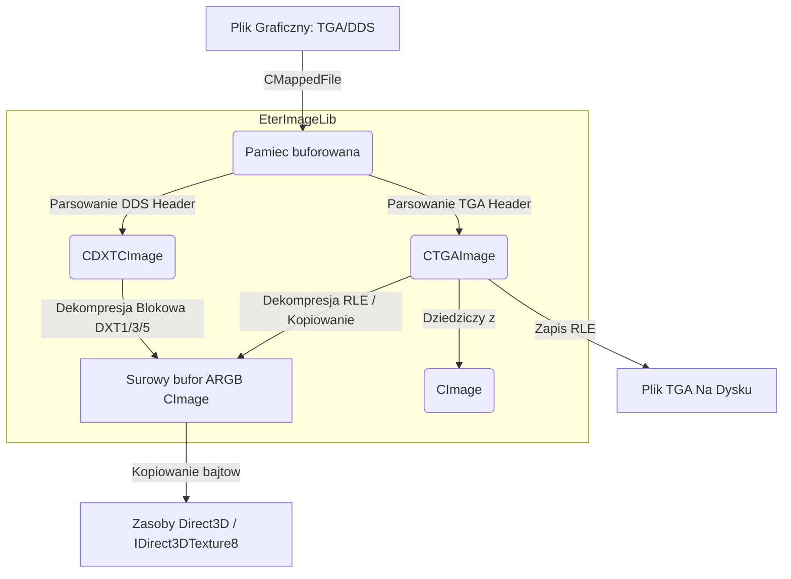

# Dokumentacja Techniczna: EterImageLib

## 1. Cel Architektoniczny i Rola Modulu

Modul `EterImageLib` pelni role bazowej biblioteki w kliencie C++ do obslugi i zarzadzania surowymi danymi obrazow w pamieci (glownie pikseli w formacie 32-bitowym ARGB). Odpowiada za odczyt, dekodowanie (dekompresje) i zapis wybranych formatow graficznych (TGA, DDS), dzialajac blisko sprzetu, bezposrednio pracujac z buforami bitowymi.

Glowna odpowiedzialnosc:
- Ladowanie, alokacja i utrzymywanie surowego bufora ARGB dla obrazow.
- Obsluga formatu TGA, w tym natywna dekompresja algorytmu RLE.
- Bezposrednia obsluga powierzchni DDS skompresowanych algorytmami S3TC (DXT1, DXT3, DXT5) poprzez wlasne, niskopoziomowe procedury dekompresji pikseli blokowych (bez uzycia zewnetrznych bibliotek graficznych do dekompresji).
- Przygotowywanie danych pikseli w formacie akceptowalnym bezposrednio przez struktury i tekstury Direct3D.

Zaleznosci:
- `eterBase`: Korzysta z klasy `CMappedFile` w celu efektywnego wczytywania calych plikow bezposrednio do pamieci z dysku, co minimalizuje narzut operacji We/Wy.
- Zewnetrzne biblioteki: Deserializacja niektorych innych formatow odbywa sie z pomoca biblioteki DevIL (np. w podsystemach UI, takich jak MarkManager), jednak obsluga TGA oraz DXT (S3TC) znajduje sie we wlasnych strukturach EterImageLib.

## 2. Diagram Architektury i Przeplywu Danych (Mermaid)

## 3. Rejestr Struktur Danych i Pamieci (Memory & Struct Layout)

Modul precyzyjnie definiuje wyrownanie pamieci (packing) z racji czytania danych bezposrednio z mapowanych plikow binarnego formatu.

### TGA_HEADER
`#pragma pack(1)`
- `char idLen` - Dlugosc identyfikatora (0).
- `char palType` - Typ palety (1 jesli jest, 0 brak).
- `char imgType` - Typ obrazka (2 dla nieskompresowanego RGB, 10 dla RLE).
- `WORD colorBegin` - Poczatek palety.
- `WORD colorCount` - Rozmiar palety.
- `char palEntrySize` - Rozmiar wpisu palety (24 bit).
- `WORD left`, `WORD top` - Pozycja.
- `WORD width`, `WORD height` - Wymiary obrazka.
- `char colorBits` - Ilosc bitow na piksel (zazwyczaj 16, 24 lub 32).
- `char desc` - Flagi opisujace (bit 3 to kanal alpha, bity 4-5 to origin).

### Struktury Kompresji S3TC (DXT)

- `DXTColBlock` (8 bajtow)
  - `WORD col0`, `WORD col1` - Kolory bazowe w 16-bitach (RGB565).
  - `BYTE row[4]` - 16 pikseli (2 bity na piksel) definiujace indeks koloru dla interpolacji.

- `DXTAlphaBlockExplicit` (DXT3)
  - `WORD row[4]` - 4 bity wartosci alpha bezposrednio na kazdy z 16 pikseli (brak interpolacji, ostre przejscia).

- `DXTAlphaBlock3BitLinear` (DXT5)
  - `BYTE alpha0`, `BYTE alpha1` - Bazowe wartosci alpha.
  - `BYTE stuff[6]` - 48 bitow sluzacych jako 3-bitowe indeksy dla interpolowanych wartosci kanalu alpha.

### Color8888 i Color565
Uzywane do szybkiego dostepu do kanalow. Modul opiera sie w pelni na strukturze Little-Endian platformy x86.
- `struct Color8888`: `BYTE b, g, r, a;` (W tej kolejnosci, czyli adres poczatkowy to b, LSB to b w reprezentacji rejestru 32-bit).
- `struct Color565`: Zdefiniowana jako pola bitowe: `unsigned nBlue : 5; unsigned nGreen : 6; unsigned nRed : 5;`. 

### XDDPIXELFORMAT (z d3d.h)
Zawiera szczegoly na temat masek bitowych `dwRBitMask`, `dwRGBAlphaBitMask`, bitow na piksel (`dwRGBBitCount`) w celu dekodowania naglowkow DDS i mapowania na struktury wewnetrzne `EPixFormat`.

## 4. Rejestr Klas i Metod (API Reference)

### CImage (Klasa Bazowa)
- `CImage()` / `~CImage()`: Konstruktor / destruktor czyszczacy bufor `m_pdwColors`.
- `void Create(int width, int height)`: Alokuje bufor pikseli jako tablice `DWORD` na stercie (wielkosc `width * height * 4` bajtow). Niszczy poprzedni bufor, jesli istnial.
- `void Destroy()`: Zwalnia pamiec.
- `void Clear(DWORD color = 0)`: Zapelnia caly bufor podanym 32-bitowym kolorem.
- `DWORD* GetBasePointer()` / `DWORD* GetLinePointer(int line)`: Dostep do adresow pamieci z wnetrza bufora pikseli.
- `void PutImage(int x, int y, CImage* pImage)`: Nadpisuje kwadratowy obszar pamieci wycinkiem (lub calym obrazem) przekazanym w buforze pImage, wykorzystujac `memcpy` dla kazdego wiersza po kolei.
- `void FlipTopToBottom()`: Odbija obraz w pionie (potrzebne m.in. dla formatu TGA zaleznie od flag). Tworzy dynamicznie na stercie cala nowa tablice o rozmiarze obrazu dla swapa, co moze byc drogie wydajnosciowo.

### CTGAImage (Dziedziczy po CImage)
- `bool LoadFromDiskFile(const char * c_szFileName)`: Otwiera plik przez `CMappedFile` i przekazuje dane do `LoadFromMemory`.
- `bool LoadFromMemory(int iSize, const BYTE * c_pbMem)`: Parsuje naglowek `TGA_HEADER`. 
  - Wspiera nieskompresowane 16/24/32 bity (uzupelnia brakujace kanaly pelnym alpha 0xFF).
  - Wspiera algorytm RLE (imgType = 10), rozpakowujac w locie powtarzajace sie piksele z bezposrednia walidacja przestepstw poza zadeklarowane szerokosc/wysokosc (Assertion `!"RLE overflow"` i false return przy korupcji piku TGA).
  - Wykonuje `FlipTopToBottom()` automatycznie, jesli origin imageDesc TGA wymaga obrocenia.
- `bool SaveToDiskFile(const char* c_szFileName)`: Pakuje `m_pdwColors` z powrotem do TGA, ze wsparciem dla kompresji RLE jesli flaga jest ustawiona, iterujac przez bufory do wykrywania identycznych sasiadujacych pikseli.

### CDXTCImage
Nie rozszerza bezposrednio `CImage`, jest bytem zarzadzajacym dekompresja DDS/DXT (mipmap) do wektorow we wlasnej strukturze.
- `bool LoadFromFile(const char * filename)`: Odpala z pliku z uzyciem `CMappedFile`. Sprawdza koncowke `.DDS`.
- `bool LoadHeaderFromMemory(const BYTE * c_pbMap)`: Odczytuje Magic Number "DDS " oraz naglowek struktury Microsoft `DDSURFACEDESC2`. Mapuje pixelFormat m.in. na enumy `PF_DXT1`, `PF_DXT3`, `PF_DXT5`. Rozpoznaje maksymalnie 12 mipmap i zapisuje offsety.
- `void Decompress(int miplevel, DWORD * pdwDest)`: Wybiera odpowiedni wariant algorytmu DXT bazujac na formacie i wstrzykuje piksele ARGB do `pdwDest`.
- `void DecompressDXT1(int miplevel, DWORD * pdwDest)`: Dla kazdego bloku kompresji dekoduje 4 kolory (baza kolory RGB565 oraz dwa obliczone na podstawie srednich wazonych). Wpisuje indeksy pikseli do docelowej mapy 32-bit (nie ma alpha).
- `void DecompressDXT3(...)` i `DecompressDXT5(...)`: Dekoduja bloki DXT3 (wprost przypisane kanaly alpha z `DXTAlphaBlockExplicit`) lub DXT5 (z interpolowanymi kanalami alfa na bazie `DXTAlphaBlock3BitLinear`). Proces wymaga zlozonej arytmetyki na kanalach blokowych dla uzyskania wyrownania ARGB 8888.

## 5. Punkty Styku (Cross-Subsystem Integration)

- **Podsystem UI / DirectX (Graphic System):** Metody dostarczaja gotowe paczki pikseli (`DWORD *` z kolorami), ktore silnik graficzny (DX8/DX9) wykorzystuje przy operacjach takich jak `IDirect3DTexture8::LockRect()` lub przy generowaniu dynamicznych zasobow przez API `D3DXCreateTexture`. Formaty kompresji sa dekompresowane w pamieci uzytkownika przed przekazaniem do D3D lub moga byc wysylane natywnie.
- **`eterBase`:** Glowna zaleznoscia plikowa jest `CMappedFile`, co wiaze wydajnosc modulu w calosci ze stronicowaniem plikow przez narzedzia systemu Windows i buforowaniem na poziomie jadra SO (I/O). 
- **DevIL (Zewnetrzne obslugiwanie binarne):** Sam rdzen `CImage`/`CTGAImage` radzi sobie bez DevIL. Jednak, ze zrodel nadrzednych modulu UI widac odwolania do `ilInit()`, co sugeruje ze EterImageLib mozna integrowac bezposrednio, kiedy ladowane sa customowe tekstury np. system emblematow (MarkManager). 
- Modul nie jest bezposrednio polaczony z siecia C++ klienta (Packet.h) ani systemem Python API - dziala na etapie inicjalizacji zasobow / VFS (Virtual File System).

## 6. Pulapki, Antywzorce i Ograniczenia

1. **Wielokrotna alokacja przy obracaniu (`FlipTopToBottom`):** Metoda w `CImage` tworzy nowa, pelna kopie obrazu jako tablice `DWORD` by przeprowadzic zamiane elementow gora/dol i korzysta z uciazliwego zapisu operujacego buforami pamieci po calym wierszu za pomoca `memcpy`. W srodowiskach ubozszych w RAM lub przy setkach ogromnych tekstur TGA ladowanych rownoczesnie to zbedne `new DWORD[m_width * m_height]` moze byc obciazeniem dla heap-u lub doprowadzic do fragmentacji.
2. **Hardcoded Limit MipMap (Ograniczenie):** `MAX_MIPLEVELS` jest sztywno ustawione na 12. Obrazy o wyzszej rozdzelczosci z wieksza iloscia mipmap zostana przyciete, ignorujac tekstury wyzsze w drabinie rozdzielczosci po 12 warstwie mip-mapowania.
3. **Masywne RLE Crash / RLE Overflow:** Jesli w pliku TGA zadeklarowany jest mniejszy rozmiar obrazka a kompresja wskazuje na dluzszy przebieg (rle count), kod uzywa `assert(!"RLE overflow")` lecz po nim zwraca `false` (w finalnym buildzie Release brakuje crasza przez `assert`, ale strumien RLE zostaje natychmiastowo przerwany, co moze skutkowac niedoladowanym, pocwiartowanym obrazem, uszkadzajacym pule).
4. **Endianship Constraint:** Wszystkie struktury DXT (`Color8888`, `Color565`, operacje bitowe w RLE z zakladaniem adresow po `WORD`) sa zoptymalizowane, ale i uzaleznione od systemu Little-Endian (Intel x86/x64). Jakakolwiek proba uruchomienia klienta np. na platformach Big-Endian skutkowac bedzie znieksztalconymi teksturami przez odwrotny format maski.
5. **D3DERR_DEVICELOST:** Mimo iz ten modul dziala na System RAM, a nie VRAM, jezeli system glowny (graficzny) utraci kontekst i bedzie musial ponownie zaladowac wszystkie tekstury do VRAM, `CImage` ani `CDXTCImage` nie posiadaja mechanizmow cache. Wiele odczytow musi byc uruchomionych ponownie przez `CMappedFile`.
