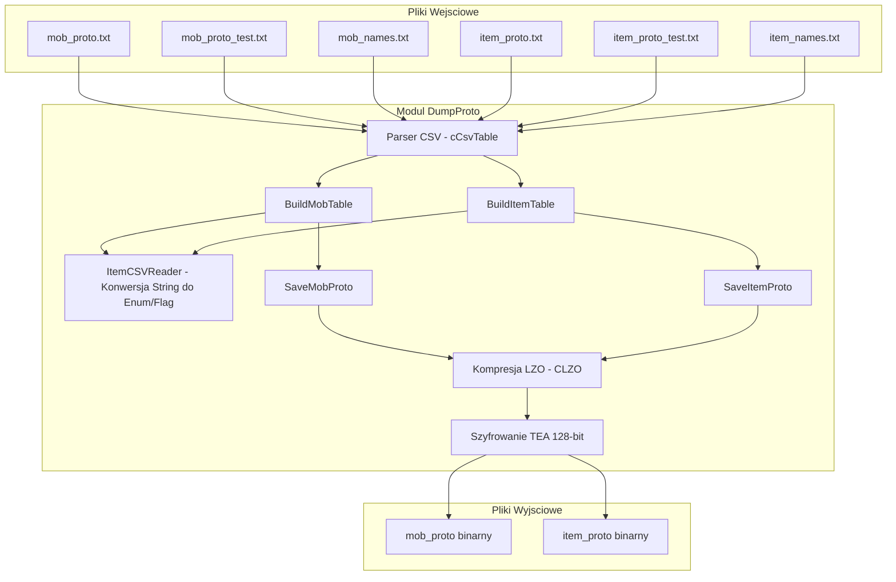

# Dokumentacja Podsystemu: DumpProto (Konwerter CSV do Binarnego Proto)

## 1. Cel Architektoniczny i Rola Modulu

**DumpProto** to samodzielne narzedzie typu CLI (Command Line Interface), pelniace role kompilatora/generatora danych klienckich (tzw. "prototypow" przedmiotow i potworow). Jego glowna odpowiedzialnoscia jest wczytanie danych zdeklarowanych w formacie tekstowym CSV (rozdzielanych tabulatorami) oraz wyeksportowanie ich do wysoce zoptymalizowanych, skompresowanych algorytmem LZO i zaszyfrowanych algorytmem TEA plikow binarnych: `item_proto` i `mob_proto`.

Pliki te sa nastepnie wczytywane bezposrednio przez klienta gry. DumpProto pelni role mostu umozliwiajacego projektantom gry (Game Designers) edycje atrybutow w przyjaznym formacie (np. Excel), jednoczesnie zabezpieczajac te dane przed trywialna inzynieria wsteczna i redukujac ich rozmiar.

## 2. Diagram Architektury i Przeplywu Danych



## 3. Rejestr Struktur Danych i Pamieci (Memory & Struct Layout)

Struktury eksportowane sa rzutowane w pamieci uzywajac scislego wyrownania (packing `pragma pack(1)`). Brak wyrownania gwarantuje bezposredni odczyt na kliencie bez nadmiarowego wyrownania pamieci kompilatora.

### 3.1 TMobSkillLevel (`#pragma pack(1)`)
*Opis*: Pojedyncza umiejetnosc przypisana do potwora.
* `DWORD dwVnum` - ID umiejetnosci.
* `BYTE bLevel` - Poziom umiejetnosci.

### 3.2 TMobTable (`#pragma pack(1)`)
*Opis*: Struktura reprezentujaca prototyp potwora. 
Rozmiar bajtowy scisle zdefiniowany.
* `DWORD dwVnum` - Unikalny identyfikator potwora.
* `char szName[25]` - Nazwa potwora (wewnetrzna, max 24 znaki + NULL byte).
* `char szLocaleName[25]` - Zlokalizowana nazwa potwora wyswietlana w kliencie.
* `BYTE bType`, `bRank`, `bBattleType`, `bLevel`, `bSize` - Typ (NPC/Monster), ranga (Boss, King), dystans (Melee/Range), poziom, fizyczny rozmiar.
* `DWORD dwGoldMin`, `dwGoldMax`, `dwExp`, `dwMaxHP` - Statystyki ekonomiczne i zycia.
* `BYTE bRegenCycle`, `bRegenPercent` - Regeneracja HP.
* `WORD wDef` - Defensywa.
* `DWORD dwAIFlag`, `dwRaceFlag`, `dwImmuneFlag` - Maski bitowe AI, rasy oraz odpornosci.
* `BYTE bStr`, `bDex`, `bCon`, `bInt` - Statystyki.
* `DWORD dwDamageRange[2]` - Minimalne i maksymalne obrazenia bazowe.
* `short sAttackSpeed`, `sMovingSpeed` - Predkosc ataku i ruchu.
* `BYTE bAggresiveHPPct` - Prog zycia do zmiany zachowania (Agresja).
* `WORD wAggressiveSight`, `wAttackRange` - Zasieg wzroku dla AI i zasieg ataku.
* `char cEnchants[6]` - Elementalne bonusy / debuffy zadawane graczowi (Trucizna, Spowolnienie, etc).
* `char cResists[11]` - Odpornosci na typy broni i magii.
* `DWORD dwResurrectionVnum`, `dwDropItemVnum` - ID po smierci oraz paczka dropu.
* `BYTE bMountCapacity`, `bOnClickType`, `bEmpire` - Opcje wierzchowca i klikniecia NPC.
* `char szFolder[65]` - Folder ze sciezkami zasobow modeli 3D/animacji (`.msm` / `.gr2`).
* `float fDamMultiply` - Mnoznik obrazen.
* `DWORD dwSummonVnum`, `dwDrainSP`, `dwMobColor`, `dwPolymorphItemVnum` - Zmienne mechanik.
* `TMobSkillLevel Skills[5]` - Tablica 5 umiejetnosci uzywanych przez potwora.
* `BYTE bBerserkPoint`, `bStoneSkinPoint`, `bGodSpeedPoint`, `bDeathBlowPoint`, `bRevivePoint` - Dodatkowe atrybuty AI.

### 3.3 TItemLimit (`#pragma pack(1)`)
* `BYTE bType` - Typ limitu (np. LEVEL, STR, DEX).
* `long lValue` - Wartosc wymagana.

### 3.4 TItemApply (`#pragma pack(1)`)
* `BYTE bType` - Typ bonusu (np. MAX_HP, CRITICAL_PCT).
* `long lValue` - Wartosc bonusu.

### 3.5 TClientItemTable (`#pragma pack(1)`)
*Opis*: Struktura prototypu przedmiotu dla klienta gry.
* `DWORD dwVnum`, `dwVnumRange` - ID startowe przedmiotu oraz ewentualny zakres (wersje +0..+9).
* `char szName[25]`, `szLocaleName[25]` - Nazwa kodowa oraz lokalizowana.
* `BYTE bType`, `bSubType` - Glowny typ (np. WEAPON, ARMOR) i podtyp.
* `BYTE bWeight`, `bSize` - Waga (nieuzywana, zawsze 0 w narzedziu) oraz rozmiar komorek w ekwipunku.
* `DWORD dwAntiFlags`, `dwFlags`, `dwWearFlags`, `dwImmuneFlag` - Bitowe flagi blokujace, flagi akcji, pozycje ekwipowania.
* `DWORD dwGold`, `dwShopBuyPrice` - Wartosc u NPC (sprzedaz/kupno).
* `TItemLimit aLimits[2]` - Warunki zalozenia przedmiotu (LimitType/Value).
* `TItemApply aApplies[3]` - Bazowe 3 bonusy przedmiotu.
* `long alValues[6]` - Generyczne wartosci zalezne od typu przedmiotu (np. Socket count, magic attack power).
* `long alSockets[3]` - Defaultowe gniazda na kd / rudy.
* `DWORD dwRefinedVnum` - VNUM przedmiotu w jaki sie transformuje ten przedmiot u Kowala.
* `WORD wRefineSet` - ID grupy z refine_proto potrzebnej do ulepszenia.
* `BYTE bAlterToMagicItemPct`, `bSpecular`, `bGainSocketPct` - Modulatory swiecenia (Specular) i mechaniki.

## 4. Rejestr Klas i Metod (API Reference)

### 4.1 Parser CSV i Bindowanie Wartosci (ItemCSVReader.cpp)
* `int get_Item_Type_Value(string inputString)` (i podobne):
  * **Logika Biznesowa**: Szuka dopasowania stringa (np. "ITEM_WEAPON") w lokalnej tablicy `string arType[]` i zwraca jego indeks. Jesli maski (np. `WEAR_BODY | WEAR_HEAD`) sa podane, rozdziela string uzywajac znaku `|` na tokeny. 
  * **Zachowanie Algorytmiczne**: Iteruje tablice znanych wartosci tekstowych i po dopasowaniu uzywa funkcji `pow((float)2, (float)i)` by wyliczyc maske bitowa dodawana do `retValue`.

### 4.2 Narzedzia Glowne (dump_proto.cpp)
* `bool BuildMobTable()` / `bool BuildItemTable()`:
  * **Logika Biznesowa**: Wczytuje i scala dane z trzech rodzajow plikow dla potworow/przedmiotow: glowny `_proto.txt`, nakladka testowa `_proto_test.txt` i lokalizacje nazw `_names.txt`. Narzedzie upewnia sie, czy `vnum` wpisu testowego istnieje - jesli tak, nadpisuje istniejacy element; jesli nie, dodaje na koniec. Rozdzielnosc ta pozwala tworcy na testowanie w `_proto_test.txt` bez psucia glownego zbioru bazowego.
  * **Zarzadzanie Pamiecia**: Obiekty dodawane sa poprzez `m_pItemTable = new TClientItemTable[m_iItemTableSize];`.

* `bool Set_Proto_Item_Table(TClientItemTable *itemTable, cCsvTable &csvTable, std::map<int,const char*> &nameMap)`:
  * **Logika Biznesowa**: Formatuje i zapisuje dane z jednej zdekodowanej linii pliku CSV pod odpowiedni `TClientItemTable`. Odczytuje mapowania znakowe na integery, uzywajac funkcji z `ItemCSVReader.cpp`. Obsluguje zakresowe `dwVnumRange`, jezeli wartosc w pliku zapisana jest jako `10~19`.

* `void SaveMobProto()` / `void SaveItemProto()`:
  * **Logika Biznesowa**: Przeprowadza serializacje `m_pMobTable` do pliku.
  * **Przeplyw**: 
    1. Zapisuje 4-bajtowy magiczny znak rozpoznawczy (`MMPT` dla mob, `MIPX` dla item).
    2. Wypisuje (w przypadku Item) numer wersji `dwVersion` (0x00000001) i rozmiar struktury `dwStride`.
    3. Zapisuje ilosc elementow w strukturze.
    4. Bufor ulega kompresji metoda LZO i jednoczesnie szyfrowaniu metoda TEA 128-bit uzywajac zahardcodowanych kluczy statycznych `g_adwItemProtoKey` / `g_adwMobProtoKey`.
    5. Zapisuje ostateczny rozmiar zablokowanego bloku z algorytmu oraz sam wyjsciowy skompresowany i zaszyfrowany bufor binarny.

### 4.3 Szyfrowanie TEA (tea.cpp)
* `void tea_code(const unsigned long sz, const unsigned long sy, const unsigned long *key, unsigned long *dest)`:
  * **Logika**: Przeksztalcenie kryptograficzne wykorzystujace 32-rundowy algorytm Tiny Encryption Algorithm (TEA). 
  * Algorytm obraca bitowo parametry dla dodania trudnosci operacyjnej `DELTA = 0x9E3779B9`. Szyfrowany bufor operuje na blokach 8-bajtowych.

## 5. Punkty Styku (Cross-Subsystem Integration)

* **Siec (Network / Server)**: Format wygenerowany tutaj (struktury binarne `TClientItemTable` / `TMobTable`) **musi** miec swoje idealne odzwierciedlenie (z takimi samymi paddingami / pack(1)) w logice serwera, uzywanej do deserializacji bazy danych w klasach `CItemManager` czy `CMobManager`. Klienckie numery vnum i struktury sluza do renderowania interfejsu (Tooltips) co do bajta zgodnie z odpowiedziami od serwera wysylanymi w paczkach Game.
* **DirectX i Zasoby (VRAM)**: Atrybuty `bType`, `bSubType`, `bSize`, czy pola jak `szFolder` pelnia role referencji dla silnika graficznego. Zaleznie od maski z flag (np. `WEAR_WEAPON`), `CPythonItem` bedzie szukal zasobow (tekstur/modeli gracza) by nalozyc je na dlon (`Socket`) szkieletu DirectX uzywajac Granny 3D.
* **Lokalizacja z Pythonem**: Wynikowe pliki `item_proto` / `mob_proto` zaladowane zostaja po stronie klienta do VFS (Virtual File System / EterPack), a nastepnie bindowane w instancji Singletona menedzerow w kliencie - udostepniane sa skryptom Python poprzez metody PyMethodDef (np. `player.GetItemName()`). 

## 6. Pulapki, Antywzorce i Ograniczenia

1. **Gigantyczny Antywzorzec Maskowania Flagg (Funkcja `pow()` na bitach)**:
   - W pliku `ItemCSVReader.cpp`, we wszystkich parserach flag (np. `get_Item_WearFlag_Value`) budowanie wartosci calkowitoliczbowej flagi odbywa sie na potegach zmiennoprzecinkowych: `retValue = retValue + pow((float)2,(float)i);`. 
   - **Skutek**: Ogromne obciazenie FPU, zagrozenie utraty precyzji zmiennoprzecinkowej dla flag wyzszych rzedow (od 24 bita wzwyz), a nade wszystko skrajna niefachowosc na tle dostepnego w C++ przesuniecia bitowego `retValue |= (1 << i)`.
2. **Hardkodowane Tablice Znakowe Wewnatrz Funkcji**:
   - Tablice (np. `string arWearrFlag[] = ...`) deklarowane sa jako lokalne stosowe tablice stringow generowane od zera przy KAZDYM wywolaniu parsera z pliku CSV. Szybka konwersja do `static std::unordered_map<std::string, int>` wielokrotnie skrocilaby czas dzialania parsingu.
3. **Potezne Wycieki i Niezgodne Zarzadzanie Pamiecia (`free` vs `new[]`)**:
   - W funkcji `BuildItemTable` w pliku `dump_proto.cpp` nastepuje:
     ```cpp
     if (m_pItemTable) {
         free(m_pItemTable); 
         m_pItemTable = NULL;
     }
     ```
   - Jednoczesnie chwile pozniej struktura jest alokowana operatorem c++ `new`: `m_pItemTable = new TClientItemTable[m_iItemTableSize];`. 
   - Zwalnianie pamieci alokowanej z pomoca `new[]` poprzez uniksowe `free()` prowadzi do "Undefined Behavior" wedlug standardu C++, czesto pomijajac dekonstruktory klas lub prowadzac do heap corruption. Pamiec zawsze powinna byc zwalniana za pomoca `delete[]`.
4. **Hardkodowane klucze TEA**: 
   - Wystawia aplikacje kliencka na prosty memory dumping (narzedzia wyciagajace wpisany w PE offsetowo ciag liczb `g_adwItemProtoKey`).
5. **Silna weryfikacja zasiegu tabel**:
   - `TEA_ROUND` zahardkodowane do 32 w `tea.cpp`. Mimo optymalizacji to powoduje brak latwego przelaczania algorytmow (np. na XTEA ze wsparciem zmiennego klucza i brakiem slabej wariancji w rotacjach bitowych).
