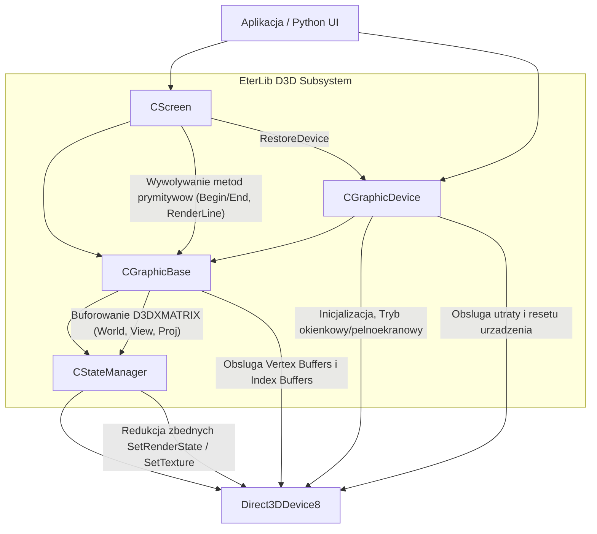

# Dekonstrukcja EterLib: Warstwa Direct3D Device i Maszyna Stanow Renderera

## 1. Cel Architektoniczny i Rola Modulu

Warstwa Direct3D Device (oraz powiazane z nia maszyny stanow i narzedzia ekranu) stanowi fundamentalny fundament renderingu klienta gry. Modul ten (zawarty glownie w `GrpDevice`, `GrpBase`, `GrpScreen` oraz `StateManager`) izoluje reszte aplikacji od bezposrednich wywolan niskopoziomowych API DirectX 8 (D3D8).
Jego glowna odpowiedzialnoscia jest zarzadzanie cyklem zycia urzadzenia renderujacego (inicjalizacja, utrata urzadzenia, reset), optymalizacja i buforowanie stanow maszyny D3D w celu minimalizacji kosztownych zmian stanu na GPU, a takze dostarczenie wysokopoziomowych prymitywow rysowania (ekran 2D, raycasting z kamery, rzutowanie 3D na 2D).
Jest on bezposrednio wywolywany przez wyzsze systemy silnika (np. interfejs uzytkownika - PythonUI, menedzery obiektow 3D, system czasteczek) i jest podstawa dla calej grafiki na ekranie. Zalezy glownie od bibliotek `d3d8.lib`, `d3dx8.lib`.

## 2. Diagram Architektury i Przeplywu Danych (Mermaid)

## 3. Rejestr Struktur Danych i Pamieci (Memory & Struct Layout)

Ponizsze struktury sluza bezposrednio do komunikacji z API D3D8, zatem ich uklad pamieci jest bezposrednio bindowany z potokiem (Fixed Function Pipeline / Shaders). Wyrownanie (packing) jest standardowe dla kompilatora MSVC (domyslnie 8 bajtow, ale tu decyduje rozmiar typow wbudowanych).

* **TVertex (SVertex)**
  * `float x, y, z;` (12 bytes) - Wspolrzedne przestrzenne 3D
  * `DWORD color;` (4 bytes) - Kolor (ARGB)
  * `float u, v;` (8 bytes) - Koordynaty UV tekstury
  * *Przeznaczenie*: Podstawowy wierzcholek renderowany w trybach bez oswietlenia.

* **STVertex**
  * `float x, y, z, rhw;` (16 bytes)
  * *Przeznaczenie*: Wierzcholek transformowany (Transformed & Lit, D3DFVF_XYZRHW), pomija potok TNL karty.

* **TPDTVertex (SPDTVertex)**
  * `TPosition position;` (D3DXVECTOR3 - 12 bytes)
  * `TDiffuse diffuse;` (DWORD - 4 bytes)
  * `TTextureCoordinate texCoord;` (D3DXVECTOR2 - 8 bytes)
  * *Przeznaczenie*: Uzywany masowo w buforach dynamicznych (`ms_alpd3dPDTVB`) dla UI i efektow (Position, Diffuse, TexCoord).

* **TPNTVertex (SPNTVertex)**
  * `TPosition position;` (12 bytes)
  * `TNormal normal;` (12 bytes)
  * `TTextureCoordinate texCoord;` (8 bytes)
  * *Przeznaczenie*: Do modeli oswietlanych (Position, Normal, TexCoord).

* **TPNT2Vertex (SPNT2Vertex)**
  * *Przeznaczenie*: Jak TPNTVertex ale z dwiema parami UV (`texCoord`, `texCoord2`) - uzywane przy multi-texturing / lightmapach.

* **CStreamData** (Zarzadzanie potokami wejscia w `CStateManager`)
  * `LPDIRECT3DVERTEXBUFFER8 m_lpStreamData;` (4 bytes na x86)
  * `UINT m_Stride;` (4 bytes)
  * *Przeznaczenie*: Cache aktualnego strumienia wierzcholkow w D3D.

* **CStateManagerState** (Klasa stanu GPU)
  * `DWORD m_RenderStates[STATEMANAGER_MAX_RENDERSTATES];` (256 * 4 = 1024 bytes) - Cache dla D3DRENDERSTATETYPE
  * `DWORD m_TextureStates[STATEMANAGER_MAX_STAGES][STATEMANAGER_MAX_TEXTURESTATES];` (8 *128* 4 = 4096 bytes) - Cache dla D3DTEXTURESTAGESTATETYPE
  * `LPDIRECT3DBASETEXTURE8 m_Textures[STATEMANAGER_MAX_STAGES];` (8 * 4 = 32 bytes)
  * `D3DXMATRIX m_Matrices[STATEMANAGER_MAX_TRANSFORMSTATES];` - (300 * 64 = 19200 bytes) - Cache transformacji (World, View, Proj)
  * *Przeznaczenie*: Zrzut wyimaginowanego lub biezacego stanu D3D. Uzywane do "shadowing" API, aby zapobiec wywolywaniu nadmiarowych callow.

## 4. Rejestr Klas i Metod (API Reference)

### CGraphicDevice (Inicjalizacja i Zarzadzanie Urzadzeniem)

* **`int Create(HWND hWnd, int hres, int vres, bool Windowed, int bit, int ReflashRate)`**
  * *Parametry:* `hWnd` - uchwyt okna docelowego; reszta to rozdzielczosc, tryb okienkowy/pelen ekran, glebia kolorow i czestotliwosc odswiezania.
  * *Zwraca:* Flagi bledow/sukcesu (np. `CREATE_OK`, `CREATE_NO_DIRECTX`).
  * *Logika:* Pobiera parametry karty graficznej (wywolania do D3D8 adapter), ustawia flage zachowania D3D (`D3DCREATE_SOFTWARE_VERTEXPROCESSING` w razi braku HW TNL). Buduje strukture `D3DPRESENT_PARAMETERS`. Wywoluje `CreateDevice`. Sprawdza wsparcie formatow DXT1-5. Inicjalizuje maszyny CStateManager, laduje macierze jednostkowe. Inicjalizuje dynamiczne bufory wierzcholkow (PDT - dla linii, ksztaltow) oraz statyczne bufory indeksow podstawowych figur (szesciany, trojkaty, linie).

* **`void Destroy()`**
  * *Logika:* Zwalnia obiekty D3D. Niszczy bufory PDT i indeksow podstawowych. Usuwa obiekty mesh (sfera, cylinder), vertex shadery (ptVS, pntVS). Usuniecie m_pStateManager.

### CGraphicBase (Podstawowa Matma, Kamery i Bufory Wierzcholkow)

* **`void SetPerspective(float fov, float aspect, float nearz, float farz)`**
  * *Logika:* Ustawia macierz projekcji (`D3DXMatrixPerspectiveFovRH`), updatuje macierz do `STATEMANAGER`.

* **`bool SetPDTStream(SPDTVertexRaw* pVertices, UINT uVtxCount)`**
  * *Logika:* Kopiuje `pVertices` do dynamicznego bufora wierzcholkow (z limitu 100 buforow, zonglujac w petli round-robin). Lock z flaga `D3DLOCK_DISCARD`. Nastepnie przekazuje ten bufor do `STATEMANAGER.SetStreamSource(0, ...)`.

* **`void MultMatrix(const D3DXMATRIX* pMat)` / `void PushMatrix()` / `void PopMatrix()`**
  * *Logika:* Emulacja stosu macierzy OpenGL uzywajac interfejsu D3DX (`ID3DXMatrixStack`). Przydatne w systemach UI i partyklach do budowania relatywnych transformacji rysowanych prymitywow.

### CScreen (Wysokopoziomowe Operacje na Ekranie i Renderowanie Prymitywow)

* **`bool Begin()` / `void End()`**
  * *Logika:* Wrapuja `STATEMANAGER.BeginScene()` i `STATEMANAGER.EndScene()`. Zeruje licznik trojkatow.

* **`void Show(HWND hWnd)`**
  * *Logika:* Prezentuje backbuffer (SwapBuffers). `ms_lpd3dDevice->Present(...)`. Implementuje specjalny obieg, jesli `g_isBrowserMode` jest aktywne - wtedy dzieli ekran na 4 rects prezentacji, pomijajac wycinek srodkowy z renderowaniem webowym. Przechwytuje blad `D3DERR_DEVICELOST` i wywoluje powrot (`RestoreDevice()`).

* **`BOOL RestoreDevice()`**
  * *Logika:* Uzywa `TestCooperativeLevel`. Jesli wartosc to `D3DERR_DEVICENOTRESET`, resetuje backbuffery. Przebudowuje glowne `D3DPRESENT_PARAMETERS` dla desktop format i wywoluje `ms_lpd3dDevice->Reset()`. Resetuje takze Cache w `STATEMANAGER` wywolujac `SetDefaultState()`.

* **`bool GetCursorPosition(float* px, float* py, float* pz)`**
  * *Logika:* Wykonuje raycasting (IntersectTriangle). Konstrukuje ray (wektor kierunkowy z oka kamery do plaszczyzny rzutowania wzgledem pozycji kursora myszy) i przecina go z wirtualnym "plane" reprezentujacym teren (`v3Eye` i sztuczne trojkaty).

* **`void SetDiffuseColor(...)` / `void SetClearColor(...)`**
  * *Logika:* Modyfikuje prekonfigurowane stale kolory wykorzystywane przy clearowaniu buforow glebi i kolorow (ARGB format).

### CStateManager (Cache API Stanow D3D - Kluczowa Optymalizacja)

* **`void SetRenderState(D3DRENDERSTATETYPE Type, DWORD Value)`**
  * *Logika:* Najwazniejsza metoda cache. Sprawdza, czy `m_CurrentState.m_RenderStates[Type] == Value`. Jesli tak, metoda wychodzi szybkim powrotem (early-out), omijajac kosztowny call do kernela GPU. W przeciwnym wypadku wysyla zadanie z `m_lpD3DDev->SetRenderState` i updatuje wlasny cache.
* **`void SetTextureStageState(DWORD dwStage, D3DTEXTURESTAGESTATETYPE Type, DWORD dwValue)`**
  * *Logika:* Analogiczny mechanizm cache dla texture stages (odpowiedzialnych za operacje takie jak `D3DTOP_MODULATE`, `D3DTOP_ADD`).
* **`void SaveRenderState(...)` / `void RestoreRenderState(...)`**
  * *Logika:* Mechanizm stosu stanu (ale jednopoziomowy!). Backupuje biezacy stan do `m_CopyState`, naklada nowy stan. Pozwala kodom renderowania "dotknac" stanu D3D, wyrenderowac i bezpiecznie odtworzyc stary (przydatne do hermetyzacji np. blendingu UI).

## 5. Punkty Styku (Cross-Subsystem Integration)

* **Z Pythonem**: Ten poziom D3D rzadko jest bezposrednio dotykany przez Pythona. Python wywoluje obiekty wyzszego rzedu (np. `ui.py` -> `UI::Window`), ktore to w metodach C++ `OnRender` wywoluja `CScreen::RenderLine2d` lub metody `CGraphicImageInstance`.
* **Z Serwerem**: Klasy ekranu/urzadzenia sa niewidzialne dla warstwy sieciowej (brak powiazan `Packet.h`).
* **Z DirectX / Sprzetem**: Jest to bezposrednie jadro interakcji z D3D8. Zaleznosci to pointery `IDirect3D8`, `IDirect3DDevice8` oraz D3DX (`ID3DXMatrixStack`). Zarzadza on zasobami pamieci graficznej (VRAM). Funkcja `GetAvailableTextureMemory()` sluzy silnikowi do oceny wolnej pamieci VRAM w celu dobierania nizszej jakosci mipmap (`ms_isLowTextureMemory`).
* **Z systemem I/O**: Podczas operacji "RestoreDevice" wszystkie bufory "MANAGED" sa zazwyczaj obslugiwane przez D3D, lecz bufory w trybie `DEFAULT` w innych czesciach gry (np. textury z lockiem) beda musialy byc odtwarzane oddzielnie.

## 6. Pulapki, Antywzorce i Ograniczenia

1. **Cache Invalidations & State Hacking**: Mechanizm `CStateManager` opiera sie na calkowitym monopolu bycia zarzadca D3DDevice. Jesli jakas zewnetrzna biblioteka lub inny modul (np. zly UI mod, dll hook, nakladka z zewnatrz jak Discord/Steam) zmodyfikuje stan bezposrednio przez wskaznik `ms_lpd3dDevice` omijajac `STATEMANAGER`, cache stanie sie niezsynchronizowany i nastapi graficzne zamieszanie (np. bledne tekstury na modelach).
2. **RestoreDevice D3DERR_DEVICELOST**: Cykl zycia zminimalizowania aplikacji to zmora D3D8. Zrodlo wykazuje obsluge utraty (D3DERR_DEVICENOTRESET), aczkolwiek wszelkie tekstury/bufory utworzone w trybie `D3DPOOL_DEFAULT` przez inne podsystemy musza obslugiwac wlasne interfejsy `OnLostDevice`/`OnResetDevice`. Sam `CScreen` dba jedynie o powrot State Managera do fabrycznych ustawien (`SetDefaultState()`) po resecie parametrow ekranu.
3. **Wielowatkowosc**: API renderera w architekturze (CScreen, CGraphicBase) w ogole nie implementuje zabezpieczen (Muteksow). Korzystanie z renderowania (`SetRenderState`, `DrawPrimitive`) jest dozwolone wylacznie w glownym watku aplikacji (watek message-pump win32).
4. **Limity D3D8**: Narzucone sztucznie stale prealokacje, np: `STATEMANAGER_MAX_RENDERSTATES = 256`, moga byc podatne na overflow w zaleznosci od wersji naglowkow DXSDK z ktorych aplikacja bedzie kompilowana w przyszlosci (obecnie nowsze directx wprowadzaly wiecej stanow).
5. **Round-Robin Vertex Buffers**: `__CreatePDTVertexBufferList` tworzy sztywne 100 buforow dynamicznych, kazdy po 16 vertexow. Proba renderowania obiektu dynamicznego wiekszego niz 16 vertexow uzywajac metody `SetPDTStream` failuje (`if (uVtxCount >= PDT_VERTEX_NUM) return false;`), wymuszajac zrywanie operacji na GPU w kilka malych partii Draw calls - jest to wielki narzut (overhead). Zjawisko to potocznie nazywa sie *batching fragmentation*.
