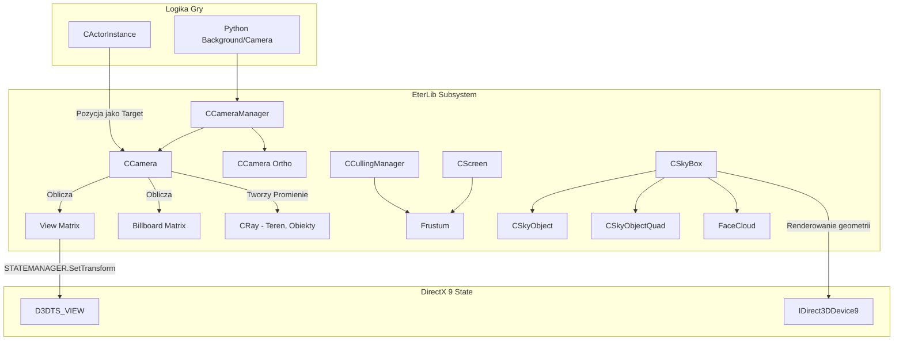

# Podsystem EterLib: Kamera 3D, Macierze Widoku, Frustum i SkyBox

## 1. Cel Architektoniczny i Rola Modulu

Podsystem Kamery (CCamera), SkyBoxa (CSkyBox) oraz Frustum (Frustum) zawarty w bibliotece EterLib, odgrywa kluczowa role w procesie renderowania swiata gry 3D w kliencie Metin2.

**Glowne odpowiedzialnosci:**

- **CCamera:** Zarzadza pozycja (Eye), celem (Target), orientacja (Pitch, Roll) i dystansem kamery orbitujacej (sferycznej). Wylicza i utrzymuje View Matrix (D3DXMATRIX), Billboard Matrix (dla sprite'ow zwracanych w strone kamery) oraz promienie krzyzujace sie w przestrzeni (Ray) wykorzysytwane do wykrywania kolizji (z terenem i obiektami), implementuje fizyke kamery (opory ruchu, kolizje z otoczeniem).
- **CSkyBox:** Modul odpowiedzialny za rendering sfery niebieskiej. Tworzy otoczke swiata skladajaca sie ze statycznego pudla 6 scian (SkyBox), dodatkowej powloki z dynamicznymi (skrolujacymi) chmurami (FaceCloud). Zapewnia gladkie przejscia (ColorTransition) stanow pogody bazujac na systemie gradientow.
- **Frustum:** Modul zoptymalizowany dla biblioteki SphereLib na podstawie kodu Johna W. Ratcliffa (SphereLib/frustum.h). Odpowiada za obcinanie (Culling) obiektow niewidocznych na ekranie, budujac piramide widzenia oparta na macierzy widoku-projekcji. Stosuje zarowno testy sferyczne, jak i sprawdzanie relacji obiektow wzgledem 6 plaszczyzn (Plane).

**Zaleznosci:**

- **EterLib (Direct3D 9):** Kamery uzywaja wektorow i macierzy D3DX, bezposrednio wplywaja na Device D3D (Ustawiaja View Transform).
- **SphereLib:** Uzywane przez modul Frustum do testowania widocznosci wezlow drzewa przestrzennego.
- **CTimer / CColorTransitionHelper:** Uzywane przez SkyBox do updatu pozycji skrolowanych chmur oraz zmiany kolorow w czasie.

## 2. Diagram Architektury i Przeplywu Danych (Mermaid)

## 3. Rejestr Struktur Danych i Pamieci (Memory & Struct Layout)

### eCameraState (Enum)

Zarzadzanie strefami kolizyjnymi kamery:

- `CAMERA_STATE_NORMAL` (0)
- `CAMERA_STATE_CANTGODOWN` (1)
- `CAMERA_STATE_CANTGORIGHT` (2)
- `CAMERA_STATE_CANTGOLEFT` (3)
- `CAMERA_STATE_SCREEN_BY_BUILDING` (4)
- `CAMERA_STATE_SCREEN_BY_BUILDING_AND_TOOCLOSE` (5)

### SColor / TColor

Reprezentuje uklad RGBA zmiennoprzecinkowy:

- `float r, g, b, a;` (Align: 4 bytes, Total size: 16 bytes)

### TGradientColor

Reprezentuje strukture gradientu dla wierzcholkow:

- `TColor m_FirstColor;`
- `TColor m_SecondColor;` (Total size: 32 bytes)

### CSkyObjectQuad

Reprezentuje sciane/quad (4 wierzcholki):

- `TPDTVertex m_Vertex[4];` (Struct D3DFVF_XYZ | D3DFVF_DIFFUSE | D3DFVF_TEX1)
- `TIndex m_Indices[4];` (Indices ukladajace 2 trojkaty)
- `CColorTransitionHelper m_Helper[4];` (Narzedzie pomocnicze dla iterpolacji barw dla kazdego z 4 rogow Quada).

### TSkyObjectFace

Reprezentuje zrodlo strukturalne sciany SkyBoxa.

- `std::string m_strfacename;` (32 bytes)
- `std::string m_strFaceTextureFileName;` (32 bytes)
- `TSkyObjectQuadVector m_SkyObjectQuadVector;` (Vector, 24 bytes)

### CCamera (Wybrane wazne parametry)

- `D3DXVECTOR3 m_v3Eye, m_v3Target, m_v3Up, m_v3View, m_v3Cross;` (Parametry orbitowania przestrzennego).
- `D3DXMATRIX m_matView, m_matInverseView, m_matBillboard;` (Macierze przestrzenne).
- `float m_fPitch, m_fRoll, m_fDistance;` (Katy rotacji Eulera oraz dystans wzgledem `m_v3Target`).
- `CRay m_ViewRay, m_kLeftObjectCollisionRay, ...` (Pociski/Raycasting do kolizji z terenem/budynkami).

## 4. Rejestr Klas i Metod (API Reference)

### CCamera

Kamera jest reprezentowana jako obiekt z zablokowanym celem. Praca z klasa opiera sie na kalkulacji macierzy View.

- `void SetViewMatrix()`: Fundamentalna metoda aktualizacji stanu. Oblicza `m_v3View` jako (Target - Eye). Tworzy Cross Product View oraz Up dla wyznaczenia Right (`m_v3Cross`). Uzywa funkcji trygonometrycznych `acosf` aby wydobyc aktualny kat Pitch. Generuje `m_matView` przez `D3DXMatrixLookAtRH`. Ustawia macierz Billboardowa kasujac z `m_matInverseView` wektory translacji (_41,_42, _43). Na koniec konstruuje set `CRay` dla kolizji z mapami.
- `void Move(const D3DXVECTOR3 & v3Displacement)`: Przesuwa zarowno punkt docelowy (Target) jak i zrodlo (Eye) o wektor translacji `v3Displacement`. Wywoluje `SetViewMatrix`.
- `void Zoom(float fRatio)`: Modyfikuje wektor (Eye - Target) skalujac go przez `fRatio`. Przemieszcza pozycje m_v3Eye blizej/dalej m_v3Target.
- `void RotateEyeAroundTarget(float fPitchDegree, float fRollDegree)`: Wprowadza limit rotacji (Pitch) do wartosci przedzialu (-80.0f ; 80.0f). Mnozy macierz obrotu dla osi Cross (Pitch) i osi Z (Roll). Modyfikuje orientacje i aplikuje zmiany przez transformacje macierzowe dla wektora `m_v3Eye`.

### CCameraManager

Singleton ulatwiajacy dostep do globalnego menedzera kamer.

- Utrzymuje slownik `std::map<BYTE, CCamera *> m_CameraMap;`
- Pozwala zdefiniowac wiele rzutowan: np. perspektywiczne i rzut ortogonalny, a takze dynamiczne przelaczanie kamer: `SetCurrentCamera`.

### CSkyBox

Obsluguje generowanie tekstur z mapowania otoczenia (6 polaczoncyh twarzy) oraz dynamiczne srodowisko pogodowe.

- `void Update()`: Wykonuje aktualizacje fizyki. W przyp. trwajacej plynnej transformacji kolorow, wywoluje `Update()` dla poszczegolnych `TSkyObjectFace` i chmur.
- `void Render()`: Aplikuje odpowiednie stany Renderowania (RenderStates) dla karty graficznej - wylacza Depth-Writing (ZWRITEENABLE=FALSE), wylacza oswietlenie i mgle. Nastepnie dla render-mode uzywa 2 sposobow na aplikacje tekstur poprzez SetTexture na D3DTSS_COLOROP i renderuje poszczegolne Face.
- `void RenderCloud()`: Renderuje dynamiczne (scrolling) chmury uzywajac D3DTTFF_COUNT2 dla texture-coordinate transformacji. Skrollujac parametr `m_fCloudPositionU` i V za pomoca predkosci i CTimer'a. Wymaga wlaczonego AlphaBlending (ONE, INVSRCCOLOR) dla plynnego nakladania sie z chmurami bazowymi/niebem.
- `void SetSkyColor(const TVectorGradientColor& c_rColorVector, ...)`: Pozwala na konfiguracje poszczegolnych gradientowych warstw niebosklonu. Dzieli sky-boxy na poszczegolne "Quad", aplikuje plynne przejscia czasowe dla `m_Helper`.

### Frustum (SphereLib/frustum.cpp)

Klasa implementujaca prostopadloscian widzenia i system selekcji.

- `void BuildViewFrustum(D3DXMATRIX & mat)`: Ekstrahuje wspolczynniki z podanej macierzy transformacji (Kombinacja View*Proj), aby wyliczyc 6 wektorow 3D plaszczyzn (Plane Equation). Dokonuje normalizacji tych plaszczyzn (`D3DXPlaneNormalize`).
- `void BuildViewFrustum2(D3DXMATRIX & mat, float fNear, float fFar, float fFov, ...)`: Wyznacza srodkowy punkt prostopadloscianu widokowego oraz jego m_fRadius, przygotowujac frustum do szybkiego testowania typu Bounding-Sphere. Wywoluje glowny `BuildViewFrustum`.
- `ViewState ViewVolumeTest(const Vector3d &c_v3Center, const float c_fRadius) const`: Testuje bryle otaczajaca node przestrzenny (np. Culling Sphere) i orzeka stan (VS_INSIDE, VS_PARTIAL, VS_OUTSIDE) na podstawie:
  - Testu dystansu sfery Frustum m_fRadius wzgledem testowanej sfery (jesli wlaczony - szybki tryb wstepny).
  - Testu D3DXPlaneDotCoord dla szesciu scian - jesli punkt + promien sfery znajdzie sie poza chociazby 1 plaszczyzna, odrzuca go (VS_OUTSIDE). Jesli miedzy krawedziami przecina plaszczyzny, zwraca VS_PARTIAL.

## 5. Punkty Styku (Cross-Subsystem Integration)

- **Python (Background / Environment):** Pakiety Pythona zarzadzajace klimatem wywoluja moduly modyfikujace kolorystke tła (CPythonBackground). Konwertuja wartosci z Tuple na wywolania API w C++ tj. `SetSkyColor()`.
- **EterGrnLib / SphereLib / CullingManager:** Frustum sluzy jako bezposrednie jadro optymalizacyjne renderowania drzewa (SpeedTree) oraz Modeli (Granny) na mapach otwartych (CMapOutdoor). W EterLib zadeklarowany jako pole w CScreen do uzytku z zewnatrz (`CScreen::ms_frustum`).
- **DirectX 9 (D3D9):** Macierze widoku bezposrednio trafiaja na API graficzne: `STATEMANAGER.SetTransform(D3DTS_VIEW)`. Kamery utrzymuja cache zmiennych stanu i przywracaja go po zakonczeniu (np. Culling w przypadku Renderowania chmur SkyBoxa).

## 6. Pulapki, Antywzorce i Ograniczenia

1. **Wysokie koszty Math/Trygonometrii:** Klasa CCamera uzywa kosztochlonnych funkcji (acosf, operacje na macierzach odwrotnych - `D3DXMatrixInverse`) w ramce (co klatke) podczas `SetViewMatrix()`.
2. **Kalkulacja Promieni:** Posiada sztywno zapisana (hardcoded) matematyke dla wektorow wezlow kolizyjnych (CameraRightToTerrain, CameraLeftObject), ktora mnozona jest przez 2,3 lub 4 razy promien kolizji, co nie skaluje sie poprawie bez modyfikacji silnika przy bardzo gestym srodowisku lub nieproporcjonalnych obiektach (np. bardzo niskie tunele blokujace kamere).
3. **Statyczne rozmiary SkyBoxa:** Uklady scian w CSkyBox (tablica [6] i petle) sa sztywno przystosowane do 6-sciennego boxa, bez mozliwosci uzycia zblizonej sfery (SkyDome). Powoduje to powstawanie znieksztalcen na laczeniach jesli tekstury sub (DDS) nie sa perfekcyjnie przygotowane dla scianek "Cube Mapy".
4. **Frustum Sphere:** Test (BuildViewFrustum2) buduje sfere o `m_fRadius` bedacym przekatna bloku piramidy. Optymalizacja sferyczna (`m_bUsingSphere`) odrzuca tylko ewidentne, dalekie wezly - krawedziowe uwarunkowania i tak spadaja na wolny test 6 plaszczyzn, wiec zysk w glebokim culling'u jest slaby i wymaga precyzyjnego pozycjonowania quadtree przez CMapOutdoor.
