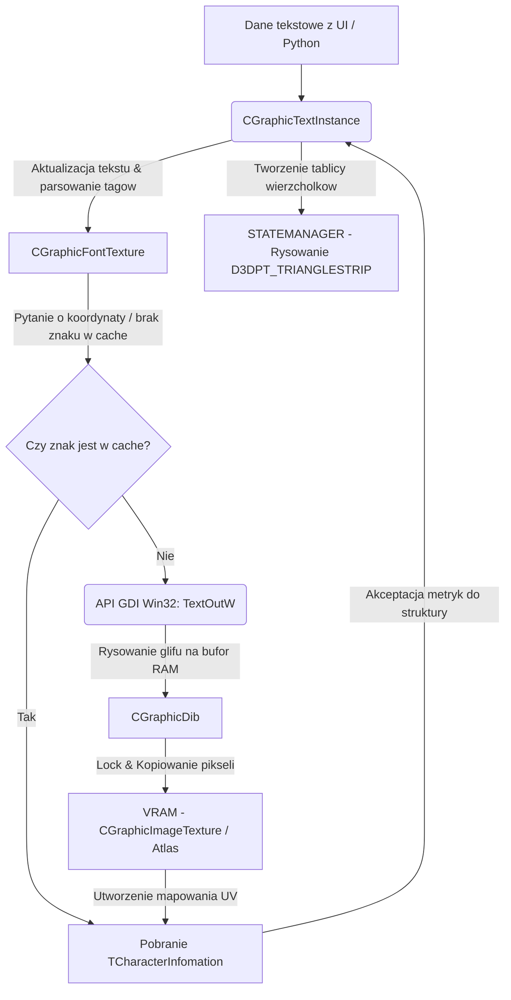

# Dokumentacja Podsystemu: EterLib - Rasteryzacja Czcionek i Renderowanie Tekstu

## 1. Cel Architektoniczny i Rola Modulu
Modul EterLib tekst/czcionki odpowiada za dynamiczna rasteryzacje znakow TrueType, budowanie z nich atlasow w pamieci VRAM oraz wydajne renderowanie tych znakow w formie poligonow (quadow) z pomoca DirectX.
Jego waznym zadaniem jest takze parsowanie specjalnych znacznikow w ciagu znakow (np. kolorowanie tekstu `|cFFFF0000`, hiperlinki `|H...|h`, kody znakowe `@9999`), formatowanie tekstu, dzielenie na wiele linii (word-wrapping) oraz obsluga systemow znakowych zlozonych, jak jezyk arabski (wymagajacy odpowiednich ksztaltow znakow w zaleznosci od ich polozenia).

Zaleznosci:
- Wywolywany przez interfejs graficzny UI klienta (w tym Python UI) w celu renderowania nazw graczy, chatu, statystyk czy opisow przedmiotow.
- System integruje standardowe API Win32 (GDI) do konwersji czcionki wektorowej w piksele oraz DirectX (STATEMANAGER, tekstury Direct3D) do operacji wyswietlania.

## 2. Diagram Architektury i Przeplywu Danych (Mermaid)

## 3. Rejestr Struktur Danych i Pamieci (Memory & Struct Layout)

- **`CGraphicFontTexture::TCharacterKey`**:
  Typowane jako `std::pair<WORD, wchar_t>`. Kompozycja identyfikatora strony kodowej (CodePage) i wartosci znaku unikodu. Sluzaca jako klucz do mapy cache znakow (4 bajty + ewentualny padding do wyrownania 8 bajtow zaleznie od kompilatora i architektury).

- **`CGraphicFontTexture::TCharacterInfomation`**:
  Rozmiar calkowity na architekturze 32-bit: ok. 28 bajtow (z wyrownaniami).
  - `short index`: Indeks wykorzystanej tekstury atlasowej z wektora `m_pFontTextureVector`.
  - `short width`: Rzeczywista szerokosc wyrenderowanego znaku (piksele).
  - `short height`: Rzeczywista wysokosc wyrenderowanego znaku (piksele).
  - `float left`: Koordynata UV na teksturze - horyzontalny start (U1).
  - `float top`: Koordynata UV - wertykalny start (V1).
  - `float right`: Koordynata UV - horyzontalny koniec (U2).
  - `float bottom`: Koordynata UV - wertykalny koniec (V2).
  - `float advance`: Przesuniecie rysika kursora (w pikselach float) po narysowaniu danego znaku na ekranie w osi X.

- **`CGraphicTextInstance::SHyperlink`**:
  - `short sx`: Horyzontalna (X) poczatkowa pozycja zakresu w ktorym dziala hiperlink (okreslone w pikselach).
  - `short ex`: Koncowa horyzontalna pozycja dzialania hiperlinku.
  - `std::wstring text`: Odparsowana docelowa komenda hiperlinka.

- **Typy Wyliczeniowe (`enum`)**:
  - `EHorizontalAlign`: Wyrownanie poziome tekstu (`HORIZONTAL_ALIGN_LEFT = 0x01`, `CENTER = 0x02`, `RIGHT = 0x03`).
  - `EVerticalAlign`: Wyrownanie pionowe (`VERTICAL_ALIGN_TOP = 0x10`, `CENTER = 0x20`, `BOTTOM = 0x30`).

## 4. Rejestr Klas i Metod (API Reference)

### `CGraphicFontTexture`
Odpowiada za wektorowe rasteryzowanie uzytkowego fonta przy pomocy natywnego API operacyjnego i pakowanie znakow do wlasnego atlasu (2D Texture Atlas).
- `bool Create(const char* c_szFontName, int fontSize, bool bItalic)`: Rozpoczyna tworzenie obiektu. Inicjalizuje strukture robocza `CGraphicDib` (wielkosc do 512x512 pikseli w RAM). Wyluskuje z GDI uchwyt obiektu `HFONT` (z pomoca `CreateFontIndirect`). Przygotowuje pierwsza pusta teksture `CGraphicImageTexture`.
- `TCharacterInfomation* GetCharacterInfomation(WORD codePage, wchar_t keyValue)`: Glowna funkcja dostepowa. Szuka znaku pod kluczem w `m_charInfoMap`. Jezeli znaleziono, zawraca gotowe koordynaty UV. W przeciwnym razie ucieka w `UpdateCharacterInfomation`.
- `TCharacterInfomation* UpdateCharacterInfomation(TCharacterKey code)`: Dynamicznie doczytuje znak za pomoca `TextOutW` do pamieci buforowej (DIB). Korzysta z `GetCharABCWidthsFloatW` dla wydobycia dokladnego marginesu znaku w pikselach i float. Sprawdza limit wymiaru atlasu aktualnie budowanej warstwy wykorzystujac iterator `m_x` i `m_y` (oraz najwieksza wysokosc `m_step` z danego rzedu zapakowania). W razie zapelnienia strony DIB (atlasu), wzywa `UpdateTexture()`, i przydziela nowa warstwe przez `AppendTexture()`. Zapisuje przeliczone UV do nowej `TCharacterInfomation`. Wystawia flage `m_isDirty = true`.
- `bool UpdateTexture()`: Funkcja synchronizacji z graficznym buforem VRAM (wywolywana sporadycznie po seriach wygenerowanych nowych znakow). Dokonuje blokady pamieci tekstury z API graficznego (`Lock()`), iteruje poprzez bufor z API DIB (`m_dib.GetPointer()`) i recznie nadpisuje podwojnie rzutowanymi wskaznikami przestrzen kolorow pikseli. Po skopiowaniu odblokowuje VRAM poprzez `Unlock()`.

### `CGraphicTextInstance`
Reprezentuje konkretny narysowany string znakow, osadzony w pamieci uzytkownika i srodowisku okna (UI). Posiada bufor koordynat, by nie liczyc geometrii per-frame.
- `void Update()`: 
  Sercem calej transformacji tekstu z tablicy znakow w tablice metryk. Metoda dzieli (parsuje) string wykorzystujac zewnetrzne systemy jak `GetTextTag` czy operatory identyfikujace znaczniki jezykowe jak arabskie formy wyrownan (`Arabic_MakeShape`). Analizuje zmiany kolorow np. znacznik `|cFFFF0000` aktualizuje `dwColor`, co rzutuje wlasnosc ubarwienia na nastepny wczytany znak. Wylicza granice dlugosci za pomoca limitu `m_fLimitWidth` oraz flagi wieloliniowosci `m_isMultiLine` i generuje hiperlinki w locie. Odpowiada ostatecznie za wylistowanie tablic `m_pCharInfoVector` oraz `m_dwColorInfoVector`.
- `void Render(RECT * pClipRect)`:
  Wykonywana kazdej klatki. Jezeli widnieje flaga modyfikacji, uprzednio wykonuje sie `Update()`. Na podstawie ustalonych koordynat bazowych (`m_hAlign`, `m_vAlign`) funkcja generuje ostateczna serie wspolrzednych wierzcholkow `SPDTVertex` (w zaleznosci m.in. od obramowania). 
  Najpierw, jezeli opcja obrysu (`m_isOutline`) ma flage na True, mechanizm renderuje caly lancuch graficzny czterokrotnie lub osmiokrotnie wzgledem kierunkow swiata przemieszczajac obrys delikatnie poza glowny font i uzywajac koloru z `m_dwOutLineColor`. Do renderowania uzywa trybu strumieniowego `D3DPT_TRIANGLESTRIP` w bibliotece statemanagera.
  Nastepnie podana sama baza (core font) uzywajac koordynat i indywidulnego koloru z wektora przyporzadkowanego do znakow. 
  W ostatecznosci funkcja realizuje renderowanie nakladki edycyjnej (IME Composition/Cursor) jako quady ze stala pozycja dyfuzyjna (pola podswietlone ulbegin/ulend).
- Pula pamieci: `CDynamicPool<CGraphicTextInstance> ms_kPool` zostala zaimplementowana w celu optymalizacji obciazenia narzutu alokacji `new/delete` przy tworzeniu tysiecy instancji chatu lub wyskakujacego tekstu obrazen. Metody tworzenia to `New()` oraz `Delete()`.

## 5. Punkty Styku (Cross-Subsystem Integration)
- **Implementacja GDI i Powloki Win32 API (OS Integration)**: Wszechobecne w systemie atlasu. `CreateFontIndirect`, `SelectObject`, `TextOutW`. Odbiera surowe sygnaly ze sterownika Inputu `CIME` (w tym kursory i skladnie IME).
- **Powiazanie z Kodowaniem i Jezykami Regionalnymi**: Funkcjonalnosc uwzglednia lokalne obyczaje jak prawostronne pisanie Arabskie (`defCodePage == CP_ARABIC`), uwzglednia zmiany ksztaltow arabskich (`Arabic_IsInSymbol`). 
- **Zasoby Renderujace (DirectX/StateManager)**: Odbior i kontrola potoku D3D (zarzadzane przez `STATEMANAGER`), dezaktywowanie flag fog oraz lighting `D3DRS_FOGENABLE, D3DRS_LIGHTING`, narzucanie `VertexShader` typu (`D3DFVF_XYZ|D3DFVF_DIFFUSE|D3DFVF_TEX1`). Renderowanie strumieniowe `CGraphicBase::SetPDTStream`.
- **Ekspozycja w Python API / Game Server**: Klasa ta bezposrednio parsuje stringi nadane przez system Pythona w warstwie UI (`ui.py` czy `textline`). Silnik analizuje kodowanie narzucone przez formatowanie pochodzace prosto z pakietow chatu serwerowego bez zadnej izolacyjnej warstwy wstepnej. Kolory z gniazda Socket klienta potrafia bezposrednio modyfikowac bufory Quadow (np. status GM, gildii, drop przedmiotow z predefiniowanymi ID rzadkosci `htoi`).

## 6. Pulapki, Antywzorce i Ograniczenia
- **Watek i Bottleneck (Synchronizacja Renderingu i Win32 GDI)**: Natywne funkcje GDI nie sa asynchroniczne i w pelni thread-safe w ujeciu wielowatkowego renderera. Pojawienie sie nowych znakow na ekranie chatu w grze np. wielkiej ilosci nowego tekstu chinskiego unikodu spowoduje, iz gra musi zastopowac glowny watek renderujacy na czas generacji czcionek. Generuje to zauwazalne zaciecia (stutters) nazywane czesto "lagiem chatu".
- **Wyciek Pamieci VRAM w Atlasie**: Klasa `CGraphicFontTexture` implementuje model narastajacy w atlasie cache poprzez tworzenie `AppendTexture()`. Kod nigdy nie usuwa pojedynczych znakow ani starszych blokow znakowych z cache tekstur podczas dzialania programu, nawet gdy dany jezyk zmienil sie w trakcie wielogodzinnej sesji co moze prowadzic do gigantycznego marnowania puli VRAM.
- **Kosztowna Optymalizacja Renderowania Obrysu (Outline)**: Mechanika renderowania Outline z uzyciem powielania wierzcholkow na podstawie marginesu `m_fFontFeather` i ponownego renderowania osmiokrotnego dla poszczegolnych znakow jest destrukcyjna dla wydajnosci na duzych ilosciach tekstu uzytkownika. Rozrost trojkatow dla 1000 iterowanych liter jest ekstremalny w porownaniu do metod typu SDF (Signed Distance Fields) lub chociazby outline tworzonego przez shadery (Pixel Shader post-processing).
- **Zjawisko CPU do GPU VRAM Stal (Lock & Update)**: Kopiowanie z pamieci systemowej `m_dib.GetPointer()` do pamieci lokalnej adaptera graficznego powiazane z zablokowaniem `pwDst` to drogie zapytanie graficzne. Blokowanie i natychmiastowe rysowanie powoduje utrate asynchronicznosci sterownika D3D i wplywa negatywnie na czas klatki.
- **Ryzyko Nieodwracalnego Blednego Wyrownania (Word Wrap Ucieczki)**: Ograniczenie `m_fLimitWidth` ucina slowo opierajac sie o dotychczas zaalokowane wlasciwosci wektorow wspolrzednych. Szybka asynchroniczna zmiana dlugosci pudelka ramki UI moze stworzyc uszkodzenie wizualne dopoki `m_isUpdate` nie wywola brutalnego formatu poprzez `SetValue()`.
