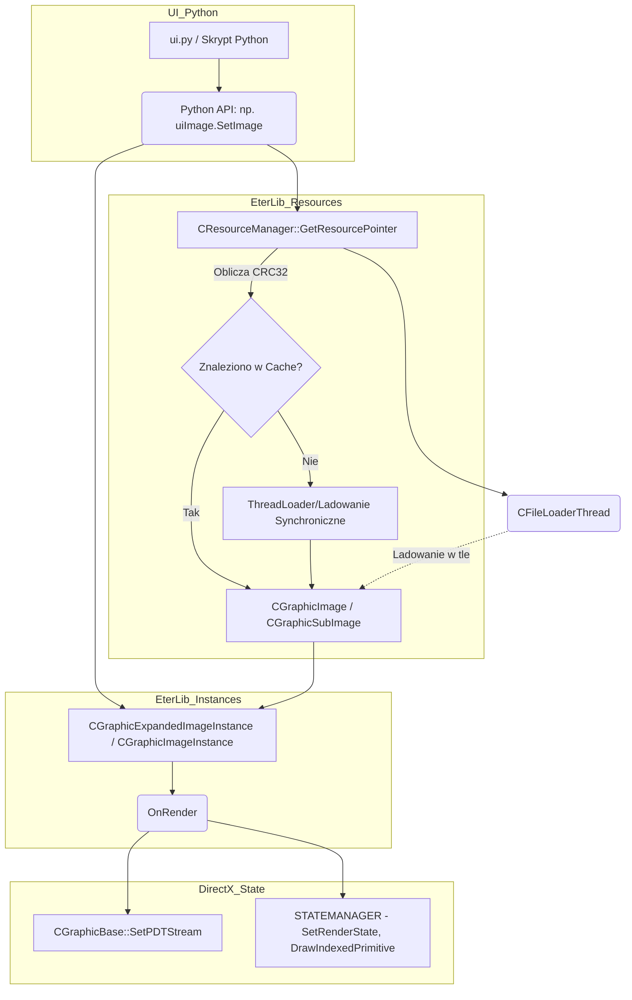

# Dekonstrukcja Modulu: EterLib - Primitivy 2D, Expanded Image i ResourceManager

## 1. Cel Architektoniczny i Rola Modulu
Modul EterLib w kontekscie prymitywow 2D, obrazow oraz zarzadzania zasobami pelni funkcje silnika renderujacego elementy interfejsu uzytkownika (UI) oraz zarzadcy pamieci podrecznej plikow (Resource Cache). Odpowiada za ladowanie plikow graficznych z dysku/pakietow (np. `.sub`, `.tga`), zarzadzanie instancjami tekstur, rozszerzonymi operacjami na obrazach 2D (rotacja, skalowanie, przezroczystosc, tryby mieszania - blendowania) oraz wielowatkowe ladowanie w tle. 

**Zaleznosci:**
*   **Wywolywany przez:** Warstwe Pythona interfejsu uzytkownika (ui.py) za posrednictwem wrapperow C++ (np. w `uiImage.cpp`, bindowanych przez Py_BuildValue / metod `PyMethodDef`), a takze przez obiekty efektow 2D.
*   **Korzysta z bibliotek:** DirectX 8/9 (`D3DXVECTOR2`, `D3DFORMAT`, `D3DTEXTURE`, stany silnika D3D), EterBase (Timer, Pool, stl_wipe_second, system CRC32, Mutex, MappedFile), EterImageLib (DXTCImage) oraz EterPack (EterPackManager do odczytu spakowanych plikow `isExist`).

## 2. Diagram Architektury i Przeplywu Danych (Mermaid)

## 3. Rejestr Struktur Danych i Pamieci (Memory & Struct Layout)

### Klasa: `CGraphicExpandedImageInstance` (Plik: `GrpExpandedImageInstance.h`)
*Rozmiar i Align (Domyslne pakowanie kompilatora, przewaznie 4/8 bytes align).*
Rozszerza `CGraphicImageInstance`.
*   `float m_fDepth` (4 bajty): Glebokosc renderowania 2D (Z-buffer).
*   `D3DXVECTOR2 m_v2Origin` (8 bajtow): Punkt obrotu/skalowania obrazu (x, y).
*   `D3DXVECTOR2 m_v2Scale` (8 bajtow): Skala w osiach X i Y.
*   `float m_fRotation` (4 bajty): Kat obrotu w stopniach.
*   `RECT m_RenderingRect` (16 bajtow): Obszar wewnatrz obrazu przeznaczony do renderowania. Zmienne `left, top, right, bottom`.
*   `int m_iRenderingMode` (4 bajty): Tryb blendowania (patrz Enum nizej).
*   `static CDynamicPool<CGraphicExpandedImageInstance> ms_kPool`: Pula pamieci alokujaca instancje bez obciazania sterty OS.

**Enum: `CGraphicExpandedImageInstance::ERenderingMode`**
*   `RENDERING_MODE_NORMAL` (0): Zwykle rysowanie.
*   `RENDERING_MODE_SCREEN` (1): Przezroczystosc Additive/Screen (INVDESTCOLOR / ONE).
*   `RENDERING_MODE_COLOR_DODGE` (2): Kolor Dodge.
*   `RENDERING_MODE_MODULATE` (3): Mnozenie pikseli (ZERO / SRCCOLOR).

### Klasa: `CGraphicSubImage` (Plik: `GrpSubImage.h`)
Rozszerza `CGraphicImage`. Odpowiada za pojedyncza ikone wycieta ze zbiorczej tekstury (np. ikonki ekwipunku w jednym `.dds`).
*   `CGraphicImage::TRef m_roImage`: Wskaznik zliczajacy (smart pointer `CRef`) na rodzimy (zbiorczy) `CGraphicImage`.
*   Zmienne z klasy bazowej `CGraphicImage`: `m_rect` typu `RECT` okresla, jaki wycinek bazowego obrazka jest renderowany.
*   `static char m_SearchPath[256]`: Domyslna sciezka wyszukiwania (czesto "D:/Ymir Work/UI/").

### Klasa: `CResourceManager` (Plik: `ResourceManager.h`)
Singleton zarzadzajacy zasobami (`CSingleton<CResourceManager>`).
*   `TResourcePointerMap m_pCacheMap`: Pula statycznych stalych elementow.
*   `TResourcePointerMap m_pResMap`: Pula ogolna zaalokowanych z pamieci VRAM/RAM (klucz CRC32 sciezki pliku -> wskaznik na zasob).
*   `TResourceDeletingMap m_ResourceDeletingMap`: `std::map<CResource*, DWORD>` (Zasob do skasowania -> Czas w ms po ktorym zasob zostanie w pelni zwolniony - opoznione kasowanie).
*   `TResourceRequestMap m_RequestMap`: `std::map<DWORD, std::string>` (Klucz -> Sciezka pliku). Trzyma zapytania ladowania w tle.
*   `TResourceRequestMap m_WaitingMap`: Oczekujace odpowiedzi z watku.
*   `TResourceRefDecreaseWaitingMap m_pResRefDecreaseWaitingMap`: `std::map<long, CResource*>` - Oczekiwanie na dekrementacje licznika referencji po zaladowaniu zasobu w tle.
*   `static CFileLoaderThread ms_loadingThread`: Statyczny obiekt watku ladujacego pliki asynchronicznie (I/O bez blokowania glownego watku D3D).

## 4. Rejestr Klas i Metod (API Reference)

### 4.1. Klasa `CGraphicExpandedImageInstance`
Odpowiada za modyfikacje wyswietlania podstawowej tekstury (skalowanie, obrot, specjalny rendering).
*   **`static DWORD Type();`**: Zwraca staly skrot sumy CRC32 stringa typu dla bezpiecznej weryfikacji.
*   **`static void DeleteExpandedImageInstance(CGraphicExpandedImageInstance * pkInstance);`**: Wywoluje `Destroy()` i zwalnia element przez `ms_kPool.Free()`.
*   **`CGraphicExpandedImageInstance();`**: Konstruktor wywolujacy `Initialize()`.
*   **`virtual ~CGraphicExpandedImageInstance();`**: Destruktor wolajacy `Destroy()`.
*   **`void Destroy();`**: Niszczy instancje (bazowy `CGraphicImageInstance::Destroy`) i zeruje stany przez `Initialize()`.
*   **`void SetDepth(float fDepth);`**: Przypisuje `m_fDepth = fDepth`.
*   **`void SetOrigin();`**: Wylicza wymiary z `GetWidth()` i `GetHeight()` podzial na pol by ustanowic srodek (pivot point).
*   **`void SetOrigin(float fx, float fy);`**: Ustawia specyficzny punkt jako pivot.
*   **`void SetRotation(float fRotation);`**: Przypisuje `m_fRotation`.
*   **`void SetScale(float fx, float fy);`**: Ustawia `m_v2Scale.x` i `m_v2Scale.y`.
*   **`void SetRenderingRect(float fLeft, float fTop, float fRight, float fBottom);`**: Ustawia obszar obrazu do narysowania w formacie od `0.0f` do `1.0f`.
*   **`void SetRenderingMode(int iMode);`**: Przypisuje `m_iRenderingMode = iMode`.
*   **`void Initialize();`**: Zeruje pola pamieci i ustawia domyslne skale 1.0f.
*   **`void OnRender();`**: Glowna metoda rysujaca. Pobiera referencje do `CGraphicTexture` i wylicza wspolrzedne mapowania UV (tzw. `su, sv, eu, ev`) na podstawie `m_RenderingRect`. Przygotowuje bufor wierzcholkow (`TPDTVertex vertices[4]`), uwzgledniajac `m_v2Scale` (przemnaza szerokosc i wysokosc), a takze ustala wspolrzedne pozycji (`m_v2Position`, przesuwajac srodek o `m_v2Origin`). Jesli `m_fRotation` != 0, korzysta z trygonometrii (`sinf`, `cosf` na obroconym radianie z funkcji `D3DXToRadian`), aby obrocic kazdy z 4 wierzcholkow wzgledem osi `m_v2Origin`. Nastepnie za pomoca makr `STATEMANAGER` zmienia odpowiednie tryby `D3DRS_SRCBLEND` i `D3DRS_DESTBLEND` zaleznie od `m_iRenderingMode` (np. dla COLOR_DODGE na `INVDESTCOLOR` i `ONE`). Na koniec przekazuje bufor wierzcholkow (`vertices`) poprzez wywolanie `CGraphicBase::SetPDTStream` do DirectX (`DrawIndexedPrimitive(D3DPT_TRIANGLELIST, 0, 4, 0, 2)`). Odtwarza poprzedni stan renderowania.
*   **`void OnSetImagePointer();`**: Oprocz ustawienia obrazu, resetuje i ustawia `Origin` na nowy srodek szerokosci nowo wyznaczonego elementu.
*   **`BOOL OnIsType(DWORD dwType);`**: Sprawdza zgodnosc typu uzywajac wczesniej zdefiniowanej funkcji `Type()`.
*   **`static void CreateSystem(UINT uCapacity);`**: Inicjuje pule systemowa (`ms_kPool.Create()`).
*   **`static void DestroySystem();`**: Niszczy pule (`ms_kPool.Destroy()`).
*   **`static CGraphicExpandedImageInstance* New();`**: Alokuje nowa przestrzen z `ms_kPool`.
*   **`static void Delete(CGraphicExpandedImageInstance* pkImgInst);`**: Odpowiada powyzszej funkcji kasowania z pamieci Pool.

### 4.2. Klasa `CGraphicSubImage`
Mechanika pakowania wielu malych ikon (np. eq) w jeden `.dds` (.tga). Parser plikow `.sub`.
*   **`static TType Type();`**: Zwraca zahashowany klucz `CGraphicSubImage` jako id podsystemu.
*   **`CGraphicSubImage(const char* c_szFileName);`**: Wywoluje konstruktor klasy bazowej.
*   **`virtual ~CGraphicSubImage();`**: Oproznia wskaznik referencyjny `m_roImage`.
*   **`bool CreateDeviceObjects();`**: Mapuje lokalna instancje `m_imageTexture` posilkujac sie podlinkowanym tekstura rodowita pobrana z `m_roImage->GetTexturePointer()`.
*   **`bool SetImageFileName(const char* c_szFileName);`**: Wywoluje zarzadce pamieci: `CResourceManager::Instance().GetResourcePointer(c_szFileName)` wymuszajac ladowanie fizycznego podkladu `.dds` do ramu/VRAM, rzutujac odpowiedz na `CGraphicImage*`. Jesli prawidlowe wola podfunkcje z setowaniem obrazu.
*   **`void SetRectPosition(int left, int top, int right, int bottom);`**: Kopiuje dane podanego elementu by obcinac go na ekranie z zadanego pliku tga (sprite sheetu).
*   **`void SetRectReference(const RECT& c_rRect);`**: Podobne co powyzsze uzywajac typ `RECT`.
*   **`static void SetSearchPath(const char * c_szFileName);`**: Modyfikuje `m_SearchPath` pod bazowe obiekty `.dds`.
*   **`void SetImagePointer(CGraphicImage* pImage);`**: Podmienia bazowy zasob (atlas) pod wskaznik `m_roImage`. Nastepnie wywoluje `CreateDeviceObjects()`.
*   **`bool OnLoad(int iSize, const void* c_pvBuf);`**: Dekoduje pliki `.sub`, ktore sa plikami tekstowymi informujacymi zrodlo. Rozdziela linie (`CMemoryTextFileLoader`) na pary klucz-wartosc. Szuka kluczy: "title", "version", "image", "left", "top", "right", "bottom". Na ich podstawie wywoluje `SetImageFileName` dla glownego, duzego obrazu oraz modyfikuje swoj `m_rect` uzywajac `SetRectPosition`. Roznica wersji (`2.0`) powoduje inaczej parsowana sciezke: szuka pliku tekstury bezposrednio w sciezce `.sub` (obcina koncowke w obrebie `\`), zamiennie ze statycznym szukaniem po `m_SearchPath` (zmienna ustawiona czesto na "D:/Ymir Work/UI/").
*   **`void OnClear();`**: Zwalnia bazowa klase uwalniajac pamiec.
*   **`bool OnIsEmpty() const;`**: Sprawdza podstawa m_roImage (Atlas).
*   **`bool OnIsType(TType type);`**: Kontroler zgodnosci polimorficznej rzutowania.

### 4.3. Klasa `CResourceManager`
Zarzadzanie cyklem zycia dla resourcow plikowych calej aplikacji.
*   **`CResourceManager();`**: Inicjator bez zadefiniowanej implementacji domyslnie za pomoca CSingletonu.
*   **`virtual ~CResourceManager();`**: Wywoluje kasowanie (Destroy()).
*   **`void LoadStaticCache(const char* c_szFileName);`**: Ustanawia dany wpis w statycznej bazie `m_pCacheMap` do uzytku z inkrementowanym plikiem by nie usuwalo z vram.
*   **`void DestroyDeletingList();`**: Funkcja niszczaca uwalniajaca natychmiast `m_ResourceDeletingMap` a takze `m_pCacheMap` podczas zamkniecia systemu (aplikacji klienckiej).
*   **`void Destroy();`**: Zabezpiecza usuniecie asercja (musi byc wyczyszczone cache uprzednio) kasujac rezydujaca glowna baze plikowa z pamieci RAM (czyszczenie calej hash mapy).
*   **`void BeginThreadLoading();` / `void EndThreadLoading();`**: Puste stubs bez implementacji bezposredniej. Watki zarzadzane w petli Update.
*   **`CResource * InsertResourcePointer(DWORD dwFileCRC, CResource* pResource);`**: Umieszcza wskaznik w glownej puli `m_pResMap`, wyrzuca blad krytyczny asercji w razie nadpisania instniejacych wezlow w mapie.
*   **`CResource * FindResourcePointer(DWORD dwFileCRC);`**: Zwraca bezposrednio element z tabeli hash po jego unikalnym hashu klucza nazwy.
*   **`CResource * GetResourcePointer(const char * c_szFileName);`**: Metoda pobierajaca zasob. Zamienia na lowercase sciezki, oblilcza CRC32 za pomoca `__GetFileCRC`. Sprawdza czy CRC w ogole istnieje w `m_pResMap`. Jesli istnieje - inkrementuje swoj stan/zwraca wskaznik (re-use). Jesli nie istnieje, korzystajac z tabeli hash map `m_pResNewFuncMap` paruje roszerzenie (np. "sub") z funkcja fabryki ladujacej ten typ danych. Ladowane jest do rejestru `InsertResourcePointer`.
*   **`CResource * GetTypeResourcePointer(const char * c_szFileName, int iType=-1);`**: Wariant dla wymuszonego typu podczas tworzenia wskaznika gdy rozszerzenie jest opcjonalne badz nieznane uzywajac do wywolania podpietego loadera powiazanego z enumem byType.
*   **`bool isResourcePointerData(DWORD dwFileCRC);`**: Boolean zwracajacy tozsamosc elementu badz blad z false.
*   **`void RegisterResourceNewFunctionPointer(const char* c_szFileExt, CResource* (*pResNewFunc)(const char* c_szFileName));`**: Mapuje callback func (fabryke) w stosunku do sufiksu plikowego.
*   **`void RegisterResourceNewFunctionByTypePointer(int iType, CResource* (*pNewFunc) (const char* c_szFileName));`**: Dodaje mape ladowania z id (TType/id) na factory pointer.
*   **`void DumpFileListToTextFile(const char* c_szFileName);`**: Sluzy do debugowania. Zlicza ilosc obiektow i bajtow VRAM/RAM (rozmiar). Zapisuje caly dump pamieci do pliku uzywajac sortowania przez stl (`DumpKBCompare` / `DumpCostCompare`). Zwraca liste przesortowana po wielkosci KB obiektow jak i po kosztach ladowania (czas w milisekundach).
*   **`bool IsFileExist(const char * c_szFileName);`**: Zwraca obecnosc z poziomu VFS (EterPackManager).
*   **`void Update();`**: Powinna byc wolana co frame. Sluzy do opoznionego niszczenia pamieci oraz popychania kolejki ladowania z watku pobocznego (Thread IO). Przechodzi przez `m_ResourceDeletingMap`. Jesli znacznik czasu (millisekundy z `ELTimer_GetMSec()`) jest wiekszy niz zarejestrowany czas kasowania, sprawdza `pResource->canDestroy()`, jesli tak, wola metode uwalniania z DirectX `pResource->Clear()` kasujac z VRAM/RAM. Zabezpiecza by nie wyczyscic wiecej niz `c_DeletingCountPerFrame` (30 plikow) naraz, unikajac stuteringu klatek renderowanych gry. Na koncu wola `ProcessBackgroundLoading()`.
*   **`void ReserveDeletingResource(CResource * pResource);`**: Kiedy instancja z wewnatrz mowi by zostac usunieta, trafia do hash setu i czeka wlasciwy okres np 30000ms zanim wygasnie z cache calkowicie (zapobieganie ciaglego wlaczania / wylaczania tego samego panelu np. Ekwipunek GUI).
*   **`void ProcessBackgroundLoading();`**: Sprawdza nowo zadane obiekty z `m_RequestMap` (Set). Popycha je do `ms_loadingThread` (`ms_loadingThread.Request`). Rownolegle odczytuje od watku ladowania liste pobranych juz obiektow poprzez `ms_loadingThread.Fetch(&pData)`. Nastepnie dokonuje ladowania synchronicznego z wczesniej zaalokowanego bufora (`pResource->OnLoad(pData->dwSize, pData->pvBuf)`), zwiekszajac licznik. Odklada rowniez wpisy do mapy `m_pResRefDecreaseWaitingMap`, gdzie po czasie 30s usunie nadmiarowa referencje wymuszona przez ladowanie pre-emptive w tle. To rozwiazanie zabezpiecza przed znikaniem ikonek zaraz po ich zaladowaniu jesli nie zostaly przypisane.
*   **`void PushBackgroundLoadingSet(std::set<std::string> & LoadingSet);`**: Przekazuje pakiety plikow od interfejsu celem zaladowania wielowatkowo w tle bez zawieszenia silnika D3D.
*   **`void __DestroyDeletingResourceMap();`**: Wewnetrzna rutyna kasowania kolejki wywolujaca funkcja w obiekcie clear.
*   **`void __DestroyResourceMap();`**: Niszczy wszystkie zmapowane klasy czyszczac `m_pResMap`.
*   **`void __DestroyCacheMap();`**: Niszczy z `m_pCacheMap` uzywajac operatora zwolnienia pointeru `Release`.
*   **`DWORD __GetFileCRC(const char * c_szFileName, const char ** c_pszLowerFile = NULL);`**: Hashuje zawartosc z podanej sciezki systemowej jako sume kontrola podana z eterBase bedaca primary key.

## 5. Punkty Styku (Cross-Subsystem Integration)
1.  **Python (UI Scripting):** Klasy Expanded Image i SubImage sa eksportowane do warstwy skryptu przez pliki takie jak `uiImage.cpp`, dajac mozliwosc wywolywania np. `image.SetRotation()` w skryptach `.py`. 
2.  **DirectX (VRAM):** Ten modul to klej ukladajacy zasoby systemowe. Same tekstury tworzone i mapowane sa za posrednictwem klasy bazowej `CGraphicImageTexture`, ktora wysyla je bezposrednio do pamieci wideo Direct3D. Zla obsluga referencji bedzie skutkowala `D3DERR_OUTOFVIDEOMEMORY`. 
3.  **IO / EterPack (VFS):** CResourceManager sciaga pliki dyskowe, lub (najczesciej) czyta z archiwa Etera korzystajac z polaczenia z modulem EterPack (`IsFileExist(c_szFileName)` poprzez `CEterPackManager`).

## 6. Pulapki, Antywzorce i Ograniczenia
*   **Brak Thread Safety w CResourceManager:** Glowne funkcje cache mapy D3D, takie jak dodawanie zasobu poprzez API ladowania asynchronicznego nie posiada Lockow (Mutex/Semaphore) przy bezposrednim modyfikowaniu flag pamieci i licznikow wezlow w glowym watku (`ProcessBackgroundLoading`). Synchronizacja dotyczy TYLKO dostepu IO przy odczycie pliku w `CFileLoaderThread` a nie wpisu do Cache.
*   **Memory Leaks przez Mapy Opoznione (c_Deleting_Wait_Time / c_Reference_Decrease_Wait_Time):** Opoznianie kasowania o 30 sekund w UI ma ulepszyc wydajnosc ciagle otwieranego, np. Ekwipunku, ale nagle zwolnienie setek ikon przez opoznienie w 30 sekundy moze generowac mocne przyciecia i chwilowo ogromne uzycie ramu w krytycznych sytacjach.
*   **Niewykorzystane rotacje srodka:** Rotacja ExpandedImage wymusza uzycie Culling `D3DCULL_CCW`, w `OnRender` jesli obraz zostanie odwrocony/lustrzany skala `m_v2Scale`, jednak statystyka cullingu moze ulec bledom przy uzyciu obrotu katowego bez skali (`m_fRotation != 0.0f`). Kat obrotu przeliczany z trygonometria i skala co klatke (OnRender) w UI obciaza szyne danych. Zle zastosowanie UI spowoduje duzy 'overhead' przy wielu widgetach.
