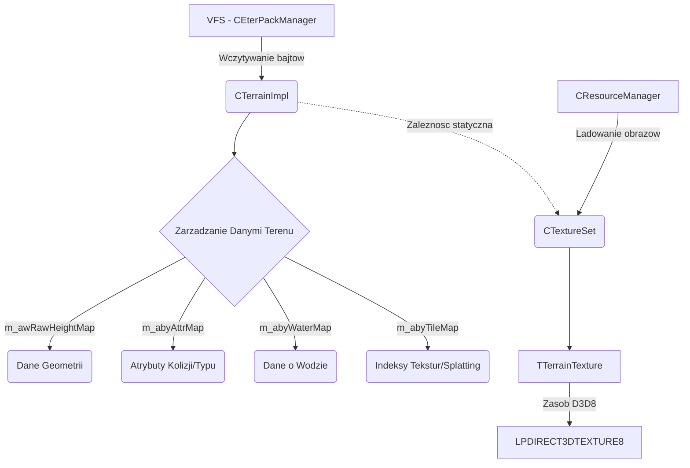

# Dokumentacja Podsystemu: PRTerrainLib - Silnik Terenu, Mapy Wysokosci i Teksturowanie

## 1. Cel Architektoniczny i Rola Modulu
Modul `PRTerrainLib` pelni role bazowego silnika terenu w kliencie gry. Jego glowna odpowiedzialnoscia jest ladowanie, przechowywanie i zarzadzanie danymi geometrycznymi oraz teksturami terenu dla pojedynczego bloku mapy. 
Odpowiada m.in. za:
- Ladowanie map wysokosci (Heightmap) w formacie RAW.
- Zarzadzanie atrybutami terenu (AttrMap) - np. blokady ruchu, strefy wody.
- Zarzadzanie mapami wody (WaterMap) i kafelkami tekstur (TileMap).
- Cieniowanie terenu na podstawie wczesniej wygenerowanych map cieni (ShadowMap).
- Wielowarstwowe teksturowanie terenu (Splatting) z wykorzystaniem zestawow tekstur (`CTextureSet`).

Zaleznosci:
- Wywolania Pythonowe/Klienckie: API prawdopodobnie udostepniane wyzej, ale na poziomie modulu nie ma bezposrednich calli do Pythona.
- **EterPack**: Wykorzystywany do ladowania plikow z wirtualnego systemu plikow (VFS).
- **EterBase / EterLib**: Moduly pomocnicze, zarzadzanie zasobami (CResourceManager, CGraphicImageInstance), bufory wierzcholkow/indeksow.
- **Direct3D 8**: Zasoby VRAM (LPDIRECT3DTEXTURE8).

## 2. Diagram Architektury i Przeplywu Danych



## 3. Rejestr Struktur Danych i Pamieci (Memory & Struct Layout)

### Typy wyliczeniowe i stale w `CTerrainImpl`
- Wymiary bazowe mapy (w kafelkach/jednostkach): `XSIZE = 128`, `YSIZE = 128`
- `HEIGHTMAP_RAW_XSIZE = 131`, `HEIGHTMAP_RAW_YSIZE = 131` (16-bit WORD). Zapas wielkosci (margin) +3.
- `ATTRMAP_XSIZE = 256`, `ATTRMAP_YSIZE = 256` (8-bit BYTE).
- `TILEMAP_RAW_XSIZE = 258`, `TILEMAP_RAW_YSIZE = 258` (8-bit BYTE).
- `WATERMAP_XSIZE = 128`, `WATERMAP_YSIZE = 128` (8-bit BYTE).
- `NORMALMAP_XSIZE = 129`, `NORMALMAP_YSIZE = 129`.
- `SHADOWMAP_XSIZE = 256`, `SHADOWMAP_YSIZE = 256` (16-bit WORD, R5G6B5).
- Atrybuty (bitowe flagi): `ATTRIBUTE_BLOCK = 1`, `ATTRIBUTE_WATER = 2`, `ATTRIBUTE_BANPK = 4`.

### Struktury Terenu (`TerrainType.h`)
- **`TTerainSplat`** (Rozmiar: 12 bajtow, wyrownanie: 4)
  - `long Active;` - flaga aktywnosci splatta.
  - `long NeedsUpdate;` - flaga zadania aktualizacji tekstury.
  - `LPDIRECT3DTEXTURE8 pd3dTexture;` - wskaznik na teksture splatta w D3D8.
- **`TTerrainSplatPatch`** (Rozmiar zalezny od stalych, packing default)
  - `DWORD TileCount[256];` - licznik uzyc danej tekstury.
  - `DWORD PatchTileCount[64][256];` - licznik per patch (TERRAIN_PATCHCOUNT=8, wiec 8x8=64).
  - `TTerainSplat Splats[256];`
  - `bool m_bNeedsUpdate;`
- **`TERRAIN_VBUFFER`** (Bufor wierzcholkow terenu)
  - Zawiera bufory sprzetowe (`CGraphicVertexBuffer vb`, `CGraphicIndexBuffer ib`).
  - Rozmiary i ilosc indeksow (`long VertexSize`, `short NumIndices`).
  - Min i max bounding boxa terenu (`float minx, maxx, miny, maxy, minz, maxz`).
  - Status uzycia i id materialu (`char used`, `short mat`).
- **`PR_MATERIAL`** (Rozmiar: ok. 68 bajtow)
  - `char name[19];`
  - `float ambi_r, ambi_g, ambi_b, ambi_a;` - Ambient
  - `float diff_r, diff_g, diff_b, diff_a;` - Diffuse
  - `float spec_r, spec_g, spec_b, spec_a;` - Specular
  - `float spec_power;`
- **`TTerrainGlobals`**
  - Globale ustawienia wyswietlania (m.in. cienie, polozenie slonca `D3DXVECTOR3 SunLocation`, `SplatTilesX`, `SplatTilesY`, flagi rysowania).

### Struktura Tekstur (`TextureSet.h`)
- **`STerrainTexture` (alias `TTerrainTexture`)** (Rozmiar dynamiczny, zalezy od kompilatora i biblioteki standardowej)
  - `std::string stFilename;`
  - `LPDIRECT3DTEXTURE8 pd3dTexture;`
  - `CGraphicImageInstance ImageInstance;`
  - Skalowanie i offset: `float UScale, VScale, UOffset, VOffset;`
  - `bool bSplat;`
  - Zakres rzednej: `unsigned short Begin, End;` (do automatycznego mapowania opartego o wysokosc).
  - `D3DXMATRIX m_matTransform;` - macierz UV.

### Prywatne Struktury Naglowkow (Zdefiniowane w `Terrain.cpp`)
- **`SAttrMapHeader`** (Rozmiar 6 bajtow, `pragma pack(1)`)
  - `WORD m_wMagic;` - 2634.
  - `WORD m_wWidth, m_wHeight;`
- **`SWaterMapHeader`** (Rozmiar 7 bajtow, `pragma pack(1)`)
  - `WORD m_wMagic;` - 5426.
  - `WORD m_wWidth, m_wHeight;`
  - `BYTE m_byLayerCount;`

## 4. Rejestr Klas i Metod (API Reference)

### Klasa `CTerrainImpl`
Glowne jadro terenu trzymajace macierze w pamieci operacyjnej oraz tablice statyczne.
- **`static void SetTextureSet(CTextureSet * pTextureSet)`**: Ustawia globalny obiekt `ms_pTextureSet`. W przypadku braku wskaznika uzywa pustego, statycznego `s_EmptyTextureSet`.
- **`static CTextureSet * GetTextureSet()`**: Zwraca biezacy, globalnie podpiety zestaw tekstur.
- **`CTerrainImpl()` / `~CTerrainImpl()`**: Konstruktor/Destruktor wywolujacy `Initialize()` oraz `Clear()`.
- **`TTerrainSplatPatch & GetTerrainSplatPatch()`**: Zwraca referencje do globalnej struktury danych patcha splatow.
- **`DWORD GetNumTextures()`**: Wywoluje `GetTextureCount()` na globalnym menedzerze tekstur i zwraca wartosc.
- **`TTerrainTexture & GetTexture(const long & c_rlTextureNum)`**: Deleguje pobieranie konkretnej referencji tekstury z `CTextureSet`.
- **`LPDIRECT3DTEXTURE8 GetShadowTexture()`**: Zwraca interfejs cieni (`m_lpShadowTexture`).
- **`__forceinline WORD GetHeightMapValue(short sx, short sy)`**: Ekstraktuje 16-bitowa rzedna z `m_awRawHeightMap`. Bierze poprawke na padding (`+1` dla sx i sy wzgledem `HEIGHTMAP_RAW_XSIZE`).
- **`DWORD GetShadowMapColor(float fx, float fy)`**:
  - Konwertuje koordynaty float mapy (0 do `TERRAIN_XSIZE`) do indeksow calkowitych w macierzy 256x256 uzywajac makra ASM `PR_FLOAT_TO_INT`.
  - Odczytuje 16-bitowy kolor formatu R5 G6 B5 z `m_awShadowMap`.
  - Zwraca go w postaci rozszerzonej jako 32-bit `DWORD` okladajac (0xff << 24) i przesuwajac kanaly do postaci X8R8G8B8.
- **`bool LoadWaterMap(const char * c_szWaterMapName)`**: Wywoluje podwykonawce `LoadWaterMapFile`. Jesli sie nie powiedzie, zapelnia bufor `m_abyWaterMap` wartoscia `0xFF` i zeruje wyliczenia wod. Zwraca logi za pomoca `TraceError`.
- **`bool LoadWaterMapFile(const char * c_szWaterMapName)`**: Odczytuje header, sprawdza MAGIC (5426) i rozmiary (128x128). Ustawia ilosc warstw w `m_byLayerCount` (do maks. 255). Jesli warstw jest wiecej niz 0, wczytuje dodatkowo listte rzednych wysokosci jeziora (`m_lWaterHeight`) formatu WORD. Obsluguje dwie wersje resztkowych rozmiarow (kompatybilnosc starych naglowkow).
- **`void Initialize()`**: Zeruje pamiec (`memset`) dla wysokosci wod, alfy, czysci struktury shadowmap (`0xFFFF`), map normalnych oraz headerow.
- **`virtual void Clear()`**: Zwalnia interfejsy D3D dla kazdej tablicy `m_lpAlphaTexture` i przechodzi do `Initialize()`.
- **`void LoadTextures()`**: Klasa posiada jedynie deklaracje (niezaimplementowana w dostarczonym .cpp) - prawdopodobnie przeznaczona do wczytywania przez klase pochodna w Engine'ach wyzszego rzedu (np. `CMapOutdoor`).
- **`bool LoadHeightMap(const char*c_szFileName)`**: Wykonuje mapowanie przez `CEterPackManager`, nastepnie kopiuje binarne dane (`memcpy`) do `m_awRawHeightMap` dla calego rozmiaru RAW_XSIZE x RAW_YSIZE.
- **`bool RAW_LoadTileMap(const char * c_szFileName)`**: Pobiera plik przez VFS, mapuje rozmiar bajtowy dla map kafelkow, uzywa bezposrednio `memcpy` w tablice `m_abyTileMap`.
- **`bool LoadAttrMap(const char *c_pszFileName)`**: Mapuje przez paczki VFS, sprawdza header `SAttrMapHeader`, potwierdza MAGIC (2634) i rozdzielczosc, po czym bezpiecznie wykonuje memcopy atrybutow kolizji do `m_abyAttrMap`.

### Klasa `CTextureSet`
- **`CTextureSet()` / `~CTextureSet()`**: Standardowe inicjalizatory i destrukcje. Wywoluja odpowiednio `Initialize()` / `Clear()`.
- **`void Initialize()`**: Pusta funkcja rezerwacyjna.
- **`void Clear()`**: Usuwa instancje obrazu `m_ErrorTexture` oraz czysci tablice wektora wezlow `m_Textures`. Na koniec wywoluje `Initialize`.
- **`void Create()`**: Dodaje `AddEmptyTexture()` na poczatek i wczytuje hardcoded teksture specjalna `"d:/ymir work/special/error.tga"` przez zasob. Zabezpiecza pierwszy slot (index 0) pod uzytek pusty (defaultowy tile).
- **`bool Load(const char * c_szTextureSetFileName, float fTerrainTexCoordBase)`**: Uzywa LoadMultipleTextData i `CTokenVectorMap` do parsowania formatu klucz-wartosc. Wylicza petle od indeksu `0` do `lCount` na podstawie wartosci w pliku `texturecount`. Odczytuje parametry Scale/Offset/Splat/Begin/End i wypelnia wywolaniem `SetTexture()`. Rezerwuje przestrzen w `m_Textures`. Zapisuje plik nazwe do `m_stFileName`.
- **`bool Save(const char * c_pszFileName)`**: Otwiera plik i zrzuca w petli wlasciwosci w postaci plain-textu formacie wymaganym przez gre. Pomija pierwszy pusty id, piszac tekstury od indeksu 1.
- **`unsigned long GetTextureCount()`**: Zwraca `m_Textures.size()`.
- **`TTerrainTexture & GetTexture(unsigned long ulIndex)`**: Jesli indeks przekracza rozmiar, rzuca bezpiecznie referencja `m_ErrorTexture`, jesli nie, daje z tablicy.
- **`bool RemoveTexture(unsigned long ulIndex)`**: Usuwa rekord jezeli indeks istnieje wywolujac std::vector::erase.
- **`bool SetTexture(...)`**: Wczytuje nowa teksture. Zada z Singletonu `CResourceManager` zasobu jako typ graficzny, podmienia zmienne (Skala, Offset). Pre-kompiluje macierz przeksztalcen dla Direct3D8 w zmiennej `tex.m_matTransform` w celu blyskawicznego uzycia w fazie mapowania splattingu UV.
- **`void Reload(float fTerrainTexCoordBase)`**: Wymusza pobranie wskaznikow przez ResourceManager dla wszystkich zaladowanych obrazow od nowa oraz przelicza `D3DXMatrixScaling` na podstawie argumentu bazowego skali terenu (tex coord base).
- **`bool AddTexture(...)`**: Waliduje twardy limit 256 tekstur (`GetTextureCount() >= 256`). Zapobiega ladowaniu po duplikatach sprawdzajac caly wektor wg parametru FileName. Rezerwuje pamiec i wpycha wartosci poleceniem `SetTexture`. Wyswietla bledy przez UI LogBox jezeli wczytano niedozwolony stan.
- **`const char * GetFileName()`**: Zwraca inline biezaca sciezke jako ciag znakow (c_str()).
- **`void AddEmptyTexture()`**: Dodaje staly, zerowy element wektora `TTerrainTexture eraser`.

## 5. Mechaniki: Heightmap, Normalne i Splatting

### Ladowanie Heightmap (.raw)
Funkcja `LoadHeightMap` opiera swoja logike bezposrednio o mechanizm wirtualnego systemu EterPack. Oczekiwany zrzut pamieci to 16-bitowe liczby stalopozycyjne, reprezentujace wysokosc. Bufor `m_awRawHeightMap` ma na brzegach zapas +3 rzednych (tzw. overlap badz padding, sluzacy do generowania sasiadujacych geometrii krajobrazu by uniknac seaming'u miedzy kafelkami na granicy silnika) wzgledem 128 jednostek rozmiaru kafelka. Operacja wykonana zostaje przez wgranie blokowe (block-copy) metoda `memcpy`.

### Wyliczanie Wektorow Normalnych Swiatla
W klasie `CTerrainImpl` obecna jest struktura statyczna `m_acNormalMap` definiowana jako tablica dla X+1, Y+1 o rozmiarze 3. Zaklada ona, ze normalne zapisane sa po dekompresji (badz skwantowaniu) w formacie po 1 bajcie (`CHAR`) ze znakiem na wspolrzedna X, Y, Z. Silnik nie dostarcza funkcji matematycznych do estymacji wektorow normalnych swiatla dla wierzcholkow w powyzszym podsystemie `Terrain.cpp` - odpowiedzialnosc ta lezy po stronie rozszerzen (np. `CMapOutdoor`), ktore korzystaja z `GetHeightMapValue`, obliczajac strome pochodne wektora z brzegowych roznic sasiadow i nastepnie wrzucajac je do pamieci `m_acNormalMap` badz wysylaja natywnie do rendering pipeline (`TERRAIN_VBUFFER`). 

### Wielowarstwowe Teksturowanie (Splatting)
Proces tworzenia wielowarstwowej faktury terenu odbywa sie za posrednictwem struktury `TTerrainSplatPatch` i `CTextureSet`.
1. Informacja przestrzenna pochodzi z pliku zaladowanego z `RAW_LoadTileMap` - gdzie jeden bajt (0-255) decyduje, jakiej tekstury jako mapy Splat uzyc.
2. Zestaw `CTextureSet` przechowuje instancje D3DTEXTURE8 dla max 255 pedzli. Informacje o UV transformacji (Skala i przesuniecie offsetowe UV) sa juz pre-kalkulowane przy ladowaniu kazdej wartosci w pamiec (jako `D3DXMATRIX`), co eliminuje cykle CPU w fazie generowania geometrii.
3. System moze posluzyc sie automatycznym maskowaniem na podstawie parametrow `Begin` i `End` z `TTerrainTexture`, mowiacych systemowi miedzy jakimi wysokosciami rzednej terenu dana warstwa blenduje sie alfa. W trakcie rysowania wywolywane beda warstwy alfy na patchach splatta uwzgledniajace zaleznosci statystyczne `PatchTileCount`.

## 6. Punkty Styku (Cross-Subsystem Integration)

- **System Paczek i Wirtualny System Plikow (CEterPackManager):**
  Wszelkie wczytywania (np. `LoadHeightMap`, `LoadWaterMapFile`) obywaja sie poprzez `CEterPackManager::Instance().Get(kMappedFile, ...)` ktory bezposrednio udostepnia wskaznik w pamieci calego rozpakowanego pliku z archiwum eix/epk. Znacznie przyspiesza to proces `memcpy` ale naraza na zniszczenie pulek sterty jesli dane sa zle skonstruowane.
- **ResourceManager (System Model/Tekstura):**
  `CTextureSet` wykorzystuje Singleton `CResourceManager::Instance().GetResourcePointer` dla zarzadzania instancjami TGA/JPG/DDS terenu. Zapewnia to oszczednosc pamieci (reference counting obslugiwany przez dolny modul w hierarchii).
- **Formaty Zmiennoprzecinkowe (Makro ASM):**
  Plik `TerrainType.h` definiuje makra takie jak `PR_FLOAT_TO_INTASM` stosujace wbudowany kod asemblerowy FPU:
  ```cpp
  __asm fld PR_FCNV
  __asm fistp PR_ICNV
  ```
  Stosowane w celu obejscia kosztow rzutowania `(int)float` dla starszych kompilatorow.
- **Globalna statyczna kontrola zasobow:**
  `CTerrainImpl` uzywa modyfikatorow i wlasciwosci statycznych (`ms_pTextureSet`) dla wspoldzielenia jednego setu tekstur na rozne kafelki (jesli mapa wspoldzieli jeden biomy/krajobraz). Set wstrzykuje sie przez metode `SetTextureSet`.
- **Integracja Python:**
  Na poziomie dostarczonego modulu `PRTerrainLib` brak bezposrednich wrapperow (takich jak `PyMethodDef`). Zapewne enkapsulacja nastapila na wyzszym poziomie abstracji (`background.cpp` itp.).
- **Integracja Sieci (Server Opkody):**
  Same atrybuty serwera (np. `ATTRIBUTE_BANPK`, `ATTRIBUTE_BLOCK`) swiadcza o styku klienta z regulami gry - klient zapobiega wejsciu w sciany lub strefy Safezone odczytujac bajty paczek mapy Attr, natomiast sam pakiet sieciowy nie jest wysylany/odbierany bezposrednio przez te obiekty.

## 7. Pulapki, Antywzorce i Ograniczenia

1. **Sztywny limit dla Splattingu (256):**
   Architektura przyjmuje stalego BYTE'a jako indeksy (0-255). Wewnetrzna tablica `m_Textures` nie moze zatem pomiescic wiecej niz 255 tekstur. Zapobieganie odbywa sie w funkcji `AddTexture` poparte powiadomieniem okienkowym `LogBox`.
2. **Potencjalne UB i Wycieki w ladowaniu RAW (Buffer Overflow):**
   Metody takie jak `RAW_LoadTileMap` czy `LoadHeightMap` zakladaja, ze plik odwzorowany przez VFS MA co najmniej odpowiedni rozmiar, poniewaz wywoluja prosto:
   `memcpy(m_awRawHeightMap, lpcvFileData, sizeof(WORD)*HEIGHTMAP_RAW_XSIZE*HEIGHTMAP_RAW_YSIZE);`
   bez uprzedniej weryfikacji czy wielkosc podanego zasobu ma wymagana ilosc bajtow (w przeciwienstwie do elegancko zrobionego `LoadAttrMap`). Przerwanie struktury danych spowoduje `Access Violation`.
3. **Makra ASM x86/x64 zaleznosci:**
   Uzycie wstawek asemblerowych w C++ (`__asm`) blokuje kompilacje w architekturze 64-bit dla niektorych wspolczesnych kompilatorow (np. MSVC x64 nie obsluguje inline assembly).
4. **Rozmiary map wysokosci wody - brak kompatybilnosci wstecznej:**
   Funkcja `LoadWaterMapFile` wspiera 2 typy struktur, bazujac glownie na reszcie pliku `dwFileRestSize`. Oznacza to ze jezeli silnik rozrosnie sie o nowa wlasciwosc pliku mapy, starszy kod bedzie mial olbrzymie trudnosci z prawidlowa heurystyka formatu.
