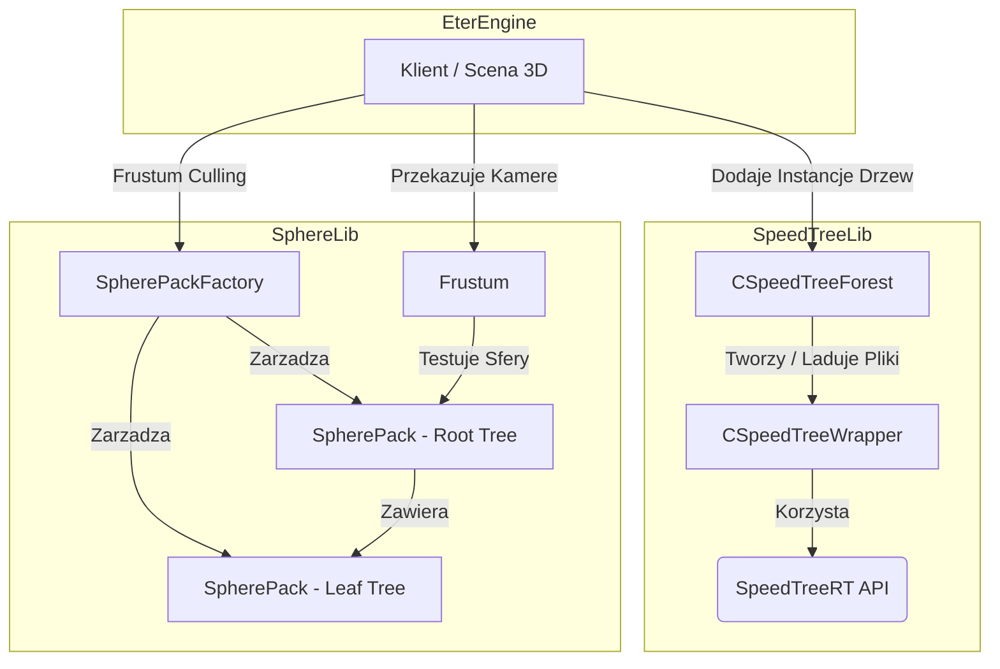

# Podsystem SpeedTree i SphereLib (Drzewa 3D i Drzewa Sfer)

## 1. Cel Architektoniczny i Rola Modulu
Moduly `SpeedTreeLib` oraz `SphereLib` pelnia kluczowa role w optymalizacji wyswietlania, zarzadzaniu widocznoscia oraz obsludze srodowiskowych efektow graficznych (np. wiatr, lasy, roslinnosc) w architekturze klienta.

**SpeedTreeLib (SpeedTreeForest)**:
Odpowiada za ladowanie, renderowanie i zarzadzanie instancjami biblioteki *SpeedTreeRT*. Glownym zadaniem `CSpeedTreeForest` jest centralizacja geometrii roslinnosci. Komponent ten radzi sobie z wczytywaniem wzorcow drzew (.spt), klonowaniem instancji w obrebie calej mapy, obliczaniem i przekazywaniem macierzy wiatru do karty graficznej (Vertex Shaders) oraz uaktualnianiem animacji roslinnosci zgodnie z uplywajacym czasem.

**SphereLib (SpherePack, SpherePackFactory)**:
Dostarcza hierarchiczna strukture kolizji przestrzennej oparta na otaczajacych sferach (Bounding Spheres). Uzywany glownie w procesie "Frustum Culling" (odrzucanie obiektow poza stozkiem widzenia kamery), szybkiego testowania zasiegu (Range Test), sprawdzania kolizji 2D na plaszczyznie (Point Test 2D) oraz do sledzenia promieni (Ray Tracing). Pozwala to drastycznie ograniczyc liczbe testow fizyki i logiki dla wszystkich elementow swiata przez odrzucanie calych galazek obiektow zgrupowanych w tzw. supersferach.

Zaleznosci: 
* Zalezy od `EterPack` i `EterBase` do ladowania plikow i systemow mapowania pamieci.
* Integruje sie scisle z `DirectX` w kontekscie Shaderow (`D3DXMATRIX`, zmienne stalych wiatru dla GPU).
* Zewnetrzna biblioteka abstrakcyjna `SpeedTreeRT.h`.

## 2. Diagram Architektury i Przeplywu Danych

## 3. Rejestr Struktur Danych i Pamieci (Memory & Struct Layout)

### Zmienne Globalne i Makra (SpeedTreeLib)
* `Forest_RenderBranches` (1 << 0)
* `Forest_RenderLeaves` (1 << 1)
* `Forest_RenderFronds` (1 << 2)
* `Forest_RenderBillboards` (1 << 3)
* `Forest_RenderAll` (15)

### Klasa `CSpeedTreeForest` (SpeedTreeForest.h)
* **Typy wewnetrzne**: `typedef std::map<DWORD, CSpeedTreeWrapper *> TTreeMap;`
* `TTreeMap m_pMainTreeMap;` - Mapa wzorcow (glownych definicji drzew). Rozmiar: zalezy od alokatora STL.
* `float m_afLighting[12];` - 4 wektory po 3 zmiennoprzecinkowe dla oswietlenia (Direction, Ambient, Diffuse, reszta wypelnienie). Packing naturalny C++.
* `float m_afFog[4];` - Konfiguracja mgly (Near, Far, LinearScale, 0.0f).
* `float m_afForestExtents[6];` - [min_x, min_y, min_z, max_x, max_y, max_z] oznaczajace krawedzie graniczne (Bounding Box) dla calego lasu.
* `float m_fWindStrength;` - Sila wiatru (0.0 do 1.0).
* `float m_fAccumTime;` - Calkowity uplyw czasu sluzacy do symulacji animacji wiatru.

### Enum `SpherePackFlag` (spherepack.h)
Okresla zachowanie i stan wezla SpherePack w drzewie. Wymusza staly rozmiar calkowity na flage (32 bity, `long mFlags` wewnatrz).
* `SPF_SUPERSPHERE = (1<<0)` - Jest nad-sfera zarzadzana przez nas.
* `SPF_ROOT_TREE = (1<<1)` - Sfera lezy w glownym korzeniu drzewa.
* `SPF_LEAF_TREE = (1<<2)` - Sfera reprezentuje ostateczny "lisc".
* `SPF_ROOTNODE = (1<<3)` - To jest glowny korzen calego drzewa.
* `SPF_RECOMPUTE = (1<<4)` - Oznacza, ze promien graniczny musi byc przeliczony (zmieniono potomkow).
* `SPF_INTEGRATE = (1<<5)` - Oznacza, ze sfera czeka w FIFO na wcielenie w drzewo nadrzedne.
* `SPF_HIDDEN = (1<<6)`, `SPF_PARTIAL = (1<<7)`, `SPF_INSIDE = (1<<8)` - Flagi uzywane przy culling-u (View Frustum Culling) oznaczajace stan obiektu wzgledem kamery.

### Klasa `SpherePack` (spherepack.h)
Hierarchiczna struktura wezla w grafie sfer (dziedziczy po wirtualnej klasie `Sphere` reprezentujacej promiec i wektor polozenia).
* `SpherePack *mNext, *mPrevious;` - Wskazniki podwojnie linkowanej listy bazy puli pamieci (Pool Memory Management).
* `SpherePack *mParent;` - Nadrzedny obiekt SpherePack (SuperSphere).
* `SpherePack *mChildren;` - Lista dzieci tego wezla.
* `SpherePack *mNextSibling, *mPrevSibling;` - Rodzenstwo (podwojnie linkowana lista).
* `SpherePack **mFifo1, **mFifo2;` - Adres wskaznika wezla w globalnym buforze FIFO (optymalizacja szybkiego usuwania podczas Integracji / Rekomputacji).
* `long mFlags;` - Bitmaska w oparciu o `SpherePackFlag`.
* `long mChildCount;` - Szybka referencja ilosci potomkow.
* `float mBindingDistance;` - Odleglosc do granicy "supersfery". Kiedy wezel "ucieknie" od nadrzednej sfery (dystans kwadratowy przekracza binding_distance), wymuszana jest reintegracja.
* `void *mUserData;` - Dowolne zewnetrzne obiekty np. wskaznik na `CInstanceBase`.
* `SpherePackFactory *mFactory;` - Wskaznik na globalna fabryke z pulami.
* `bool IS_SPHERE;` - Identyfikuje ostateczny typ polimorficzny / status.

### Enum `ViewState` (frustum.h)
* `VS_INSIDE`, `VS_PARTIAL`, `VS_OUTSIDE`.

## 4. Rejestr Klas i Metod (API Reference)

### Modul SpeedTreeLib (`CSpeedTreeForest`)
* `void Clear()` - Usuwa wszystkie zbuforowane lasy, instancje (`CSpeedTreeWrapper`) poprzez uzycie metody iteracyjnej. Mapowanie glowne zostaje zwolnione, i podstruktury instancji de-alokowane operatorami `delete`.
* `BOOL GetMainTree(DWORD dwCRC, CSpeedTreeWrapper ** ppMainTree, const char * c_pszFileName)` - Szuka "MainTree" na liscie `m_pMainTreeMap`. Jesli brakuje obiektu (CRC nie istnieje), modul zrzuca mapowanie pliku przez `CEterPackManager` (VFS) i inicjuje nowy `CSpeedTreeWrapper::LoadTree`. Inicjowany jest proces bazy SpeedTreeRT dla tego wzorca.
* `CSpeedTreeWrapper * CreateInstance(float x, float y, float z, DWORD dwTreeCRC, const char * c_szTreeName)` - Metoda fabrykujaca pojedyncze drzewo (klon MainTree). Korzysta z `MakeInstance()` i ustala wspolrzedne swiata, nastepnie zglasza instancje przez `RegisterBoundingSphere()` (rejestruje sie tymczasem czesto jako `SpherePack` z user-data).
* `void SetupWindMatrices(float fTimeInSecs)` - Oblicza 4 rotacyjne, sinusoidalne macierze 4x4 sluzace deformacji szczytow roslin. Zalezne od calkowitego uplywu czasu. Tworzy skomplikowany wzor oparty na krzywych trygonometrycznych, budujac kat bazowy poprzez `fBaseAngle = m_fWindStrength * 35.0f`. Wysyla te dane jako macierze dla vertex shadera (VertexShader_WindMatrices) przez funkcje czysto-wirtualna `UploadWindMatrix`.

### Modul SphereLib (`SpherePackFactory`)
* `void Process(void)` - Cykl przetwarzania klatek. Pobiera wszystkie sfery, ktore sa oflagowane jako `SPF_RECOMPUTE` (zmieniony stan / wezly wypadly z rodzica). Rekomputuje ich objeta powierzchnie z marginesem gravy (dodatek objetosci pozwalajacy uniknac stalego drgania / migotania w granicach). Pobiera sfery z modulu integracji (ktore opuscily srodowisko) i wykonuje proces laczenia (spina pule przez k-D drzewa).
* `void Integrate(SpherePack *pack, SpherePack *supersphere, float node_size)` - Podstawowy algorytm wkladania (insercji). Szuka pod-supersfery w nadrzednej supersferze z najkrotszym punktem wejscia lub dystansem mniejszym niz krawedz graniczna, aby dodac zintegrowany obiekt Sphere. Jesli zaden nadrzedny obiekt go nie zawiera, sfery sa scalane tworzac nowa, wieksza nad-sfere nadrzedna.
* `void FrustumTest(const Frustum &f, SpherePackCallback *callback)` - Rozpoczyna rekurencyjne culling'owanie sfer. Jesli najgrubsza SuperSfera korzenia (Root) znajduje sie poza polem stozka widzenia (`VS_OUTSIDE`), ignoruje testy reszty jej dzieci (nie wysyla ich do wyrenderowania). Jesli jest `VS_PARTIAL` test schodzi nizej az do lisci.

### Modul SphereLib (`SpherePack`)
* `void NewPos(const Vector3d &pos)` - Funkcja uzywana podczas, gdy zewnetrzny obiekt np. Monster lub Player przemieszcza sie z predkoscia. `NewPos` przelicza kwadrat dystansu do nadrzednego obiektu wezlowego. Jesli uzytkownik wyszedl poza promiec sfery nadrzednej (mBindingDistance), nastepuje `Unlink()` a uzytkownik zostaje wpchniety do fifo Fabryki jako `AddIntegrate`.
* `bool Recompute(float gravy)` - Wylicza nowa krawedz Bounding Sphere poprzez petle z pod-obiektami `mChildren`. Nowym centrem jest srednia arytmetyczna koordynat. Nastepnie petla szuka najodleglejszego punktu od owego srodka, po czym tworzy na niego ostateczna otoczke plus paramater `gravy`.

## 5. Punkty Styku (Cross-Subsystem Integration)
1. **SpeedTree i EterPack**: Wektorowanie modeli `.spt` w `CSpeedTreeForest::GetMainTree` opiera sie na mapowaniu calego pliku do pamieci (`CEterPackManager::Instance().Get(file, ...)`) w celu dostarczenia bajtow od razu do `SpeedTreeRT`.
2. **SpeedTree i Karta Graficzna (DirectX / Shaders)**: Metoda `SetupWindMatrices` to serce symulacji. Dynamicznie, podczas fazy *Update*, przelicza CPU parametry katow x i y nastepnie wysyla wskazniki macierzy `afMatrix` do buforow na GPU pod adres zmiennej `c_nVertexShader_WindMatrices` dla wbudowanego efektu podmuchu.
3. **SphereLib i Metin2 / Klient**: Biblioteka SphereLib pelni tu role Spatial-Hashing/BSP. Wszystkie instancje (drzewa 3D z powyzszego SpeedTree, postacie CharacterBase/InstanceBase) dolaczaja sie do systemu kolizji uzywajac metody `SpherePackFactory::AddSphere_`, stajac sie `SPF_LEAF_TREE`. Od tej chwili, engine wykorzystuje je do Cullingu kamery (`FrustumTest`) oraz do pobierania wysokosci terenu/kolizji kliknieciem myszy, poprzez `RayTrace` oraz `PointTest2d`.
4. **Range Testing**: Modul umozliwia szybkie skanowanie bliskosci celow przy dzialaniu AI potworow lub ataku skilli postaci obszarowych.

## 6. Pulapki, Antywzorce i Ograniczenia
1. **Wycieki Pamieci w Mapach SpeedTree**: Brak recznego zabezpieczenia Smart Pointerami na `TTreeMap`. Wywolywanie recznie porywczych interfejsow `delete` w petli (jak robi to `Clear`) podczas zakonczenia watku moze byc niebezpieczne bez solidnej blokady mutex.
2. **Problemy Kaskadowej Rekomputacji Sfer (The Sphere Thrashing Problem)**: Poniewaz instancje opuszczajac swoja nadrzedna sfere wracaja do glownego FIFO `SPF_INTEGRATE`, nagromadzenie sie wielu ruchomych jednostek blisko granic swoich macierzystych sfer grozi zjawiskiem "ping-pong". Modul `gravy` (luzy/margines wielkosci) minimalizuje ten problem, aczkolwiek duzy naplyw pakietow ruszajacych armie (np. Wojny Gildii) moze powaznie przytkac watek ze wzgledu na zapychanie sie listy mRecompute (maksimum limit jest staly = `maxspheres`).
3. **Floating Point Precision**: Uzycie operatora porownania plynnego (`m_fWindStrength == fStrength`) zamiast sprawdzenia epsilon-przyblizonego jest drobnym bledem anty-wzorcowym numeryki.
4. **Slepe Wskazniki (`SpherePack::mUserData`)**: Polimorfizm obiektu podczepionego jako `mUserData` nie ma zabezpieczen zwrotnych. W przypadku zniszczenia obiektu nadrzednego (w silniku np. smierci Postaci) bez usuniecia wpisu w `SpherePackFactory`, uzycie RayTracingu doprowadzi do bledu dostepu naruszenia segmentacji. Zle uzycie flagi `IS_SPHERE` na tym wskazniku moze spowodowac rzucenie assert.
