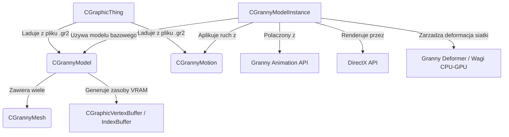

# EterGrnLib: Integracja Granny 3D, Szkielety, Modele .gr2 i Animacje

## 1. Cel Architektoniczny i Rola Modulu

Podsystem `EterGrnLib` stanowi glowna warstwe abstrakcji i integracji z biblioteka Granny 3D w kliencie gry. Jego podstawowa odpowiedzalnoscia jest ladowanie zasobow w formacie `.gr2` (modele i animacje), tworzenie struktur wewnetrznych reprezentujacych geometrie oraz ruch, a takze inicjowanie instancji modeli gotowych do wyrenderowania za pomoca DirectX.

Biblioteka obsluguje zarowno siatki statyczne (rigid) jak i odksztalcane (deformable), opierajace sie na hierarchii kosci szkieletu. `EterGrnLib` zarzadza wagami wierzcholkow, blendowaniem na GPU/CPU oraz ladowaniem tekstur i materialow przez powiazanie instancji modelu ze strukturami `EterLib`.

## 2. Diagram Architektury i Przeplywu Danych (Mermaid)



## 3. Rejestr Struktur Danych i Pamieci (Memory & Struct Layout)

Podsystem uzywa struktur w celu organizowania pamieci VRAM oraz powiazan hierarchicznych z Granny 3D.
Dokladne wyrownanie i upakowanie (packing) wynika ze standardowego kompilatora MSVC (domyslnie 4 bajty w x86).

### `granny_pnt3322_vertex`
```cpp
struct granny_pnt3322_vertex
{
    granny_real32 Position[3]; // Wektor 3D (X, Y, Z), 12 bajtow
    granny_real32 Normal[3];   // Wektor normalny, 12 bajtow
    granny_real32 UV0[2];      // Koordynaty tekstury 1, 8 bajtow
    granny_real32 UV1[2];      // Koordynaty tekstury 2 (blend/mapa oswietlenia), 8 bajtow
};
```
Przeznaczenie: Precyzyjna reprezentacja wezla PNT2 (Pozycja, Normalna, 2xTekstura) wykorzystywana w blokach siatek podziemi. Rozmiar: 40 bajtow per wierzcholek.

### `CGrannyModel::SMeshNode`
```cpp
typedef struct SMeshNode
{
    int iMesh;                       // Indeks siatki w CGrannyModel, 4 bajty
    const CGrannyMesh * pMesh;       // Wskaznik na definicje siatki (CGrannyMesh), 4 bajty (x86)
    SMeshNode * pNextMeshNode;       // Wskaznik na nastepny wezel w liscie (Linked List), 4 bajty (x86)
} TMeshNode;
```
Przeznaczenie: Lista wiazana grupujaca siatki na podstawie typu (Rigid vs Deform) i materialu, ulatwiajaca grupowe renderowanie o tym samym materiale w `CGrannyModel`.

### `CGrannyMesh::STriGroupNode`
```cpp
typedef struct STriGroupNode
{
    STriGroupNode * pNextTriGroupNode; // Wskaznik na nastepny element, 4 bajty
    int idxPos;                        // Startowy offset w buforze indeksow (Index Buffer), 4 bajty
    int triCount;                      // Liczba trojkatow w danej grupie, 4 bajty
    DWORD mtrlIndex;                   // Indeks przypisanego materialu Granny, 4 bajty
} TTriGroupNode;
```
Przeznaczenie: Minimalizuje zmiane stanu (State Changes) w DirectX renderujac ciag trojkatow korzystajacych z tego samego indeksu materialu `mtrlIndex`.

## 4. Rejestr Klas i Metod (API Reference)

### CGrannyModel
Bazowa klasa odpowiedzialna za przechowywanie niemodyfikowalnej geometrii modelu 3D (Vertices, Indices).

- `bool CreateFromGrannyModelPointer(granny_model* pgrnModel)`
  * Sygnatura: Przyjmuje zrodlowy wskaznik `granny_model` wyciagniety z piku `.gr2`.
  * Logika: Alokuje `m_meshs`, laduje pozycje bazowe dla zbuforowanych siatek (`LoadMeshs`), kopiuje indeksy i wierzcholki poprzez `GrannyCopyMeshVertices` do `m_pntVtxBuf` i `m_idxBuf` w VRAM.
- `bool LoadPNTVertices()`
  * Rezerwuje dynamiczna lub statyczna pamiec dla `CGraphicVertexBuffer`. Sklada `m_dwFvF` bazujac na typie nazwan w Granny (Pozycja, Normalne, TexCoords). Iteruje po wszystkich siatkach, kopiujac je do wspolnego bufora bez modyfikacji pozycji kosci.
- `void DeformPNTVertices(void* dstBaseVertices, D3DXMATRIX* boneMatrices, const std::vector<granny_mesh_binding*>& c_rvct_pgrnMeshBinding) const`
  * Sygnatura: Pointers do D3DXMATRIX (macierzy transformacji kosci), tablica bindings Granny.
  * Logika: Funkcja uzywa CPU deformacji: przechodzi przez wszystkie siatki podane przez Granny, naklada macierze wierzcholkow za pomoca `GrannyDeformVertices` opierajac sie na biezacym polozeniu kosci.

### CGrannyModelInstance
Tworzy zywa, renderowalna, animowana kopie obiektu `CGrannyModel`. Kopia ta ma swoj wlasny czas, stan kosci i macierze.

- `void SetMotionPointer(const CGrannyMotion* pMotion, float blendTime=0.0f, int loopCount=0, float speedRatio=1.0f)`
  * Ustawia lub modyfikuje kontroler Granny (granny_control) animacji dla danej instancji. Blending animacji odbywa sie automatycznie w API Granny 3D miedzy starym a nowym ruchem, bazujac na czasie wyrownanym `blendTime`.
- `void UpdateTransform(D3DXMATRIX * pMatrix, float fSecondsElapsed)`
  * Przelicza lokalne (relatywne do przodka) i globalne (macierz siata - world pose) transformacje na czas podany. Integruje ruch przeliczony przez klatki (frames) i uaktualnia stan GrannyWorldPose `m_pgrnWorldPoseReal`.
- `void Deform(const D3DXMATRIX * c_pWorldMatrix)`
  * Logika: Alokuje Dynamiczny Bufor Wierzcholkow (PNT) na grafice (Lock). Kopiuje przeliczone przez deformacje macierzy CPU pozycje modeli. Robi to tylko dla wierzcholkow miekkich (deformowalnych / soft-skin), twarde renderuje jako jednolita siatke.

### CGraphicThing
Zasob zaladowany do `ResourceManager`, opakowanie pliku `.gr2` (Granny 2). Zapewnia leniwe inicjowanie (lazy-loading) modeli i animacji.

- `bool OnLoad(int iSize, const void* c_pvBuf)`
  * Odczytuje surowy zrzut pliku `.gr2` do `GrannyReadEntireFileFromMemory`. Przeparsowuje ilosc animacji oraz modeli, wywoluje `LoadModels()` i `LoadMotions()`, rozpakowujac obiekty Granny. Tworzy powiazania i zwalnia pakiety sekcji bazowych pliku Granny (FileSections).

### CGrannyMotion
Opakowuje funkcjonalnosc animacji Granny (`granny_animation`).

- `void GetTextTrack(const char * c_szTextTrackName, int * pCount, float * pArray) const`
  * Logika: Skanuje sciezki (Track Groups) animacji w poszukiwaniu etykiet tekstowych. Jest to uzywane w grze m.in. do oznaczania momentu uderzenia z bronia "SOUND", "ATTACK", co pozwala zsynchronizowac efekty dzwiekowe/obrazenia.

## 5. Punkty Styku (Cross-Subsystem Integration)

1. **DirectX API & EterLib (Renderowanie)**: 
   `EterGrnLib` nie wywoluje bezposrednio `DrawPrimitive` DirectX; tworzy `CGraphicVertexBuffer` (PNT i PNT2) oraz `CGraphicIndexBuffer`.
   Kiedy `CGrannyModelInstance` jest rysowany (`RenderMeshNodeListWithOneTexture`), uzywa interfejsu D3D poprzez bufory. Miejscami nadpisuje state Direct3D, korzystajac np z dwustronnego renderowania (`D3DRS_CULLMODE`).
2. **System Kolizji**:
   Instancje modeli `CGrannyModelInstance` dziedzicza po `CGraphicCollisionObject`. Pozwala to na przecinanie promieni `Intersect` korzystajac bezposrednio z `MakeBoundBox`, uwzgledniajacym ruchome pozycje wierzcholkow kosci OBB (Oriented Bounding Box).
3. **Menedzer Zasobow (ResourceManager)**:
   Tworzenie objektow polega na pule zarzadcow pamieci bazujacych na `CRef` w pliku klasie `CGraphicThing`. Dzieki `std::string GetModelLocalPath()` menedzer laduje prawidlowo tekstury z relatywnych polozen do struktury modelu.

4. **Brak powiazania z Pythonem**:
   Modul `EterGrnLib` stanowi rdzen graficzny i nie posiada bezposredniego wiazania przez `PyMethodDef`, `PyArg_ParseTuple`, ani `Py_BuildValue`. Integracja z warstwa skryptowa jest delegowana do wyzszych modulow (np. `PythonPlayer`, `PythonCharacterManager`).
5. **Brak powiazania z Siecia**:
   Modul operuje wylacznie po stronie klienta. Nie posiada zadnych bezposrednich powiazan z protokolem (Packet.h) ani nie wysyla wlasnych pakietow TCP. Dane o ruchu docieraja tutaj jako zagregowane wywolania po przetworzeniu komunikacji po stronie serwera.

## 6. Pulapki, Antywzorce i Ograniczenia

- **CPU Skinning / Bottleneck Wierzcholkow**: Kod uzywa `GrannyDeformVertices` (CPU skinning), co blokuje glowy watek gry w duzych natlokach modeli na mapie, zamiast liczyc transformacje na vertex shaderach (GPU). Nalezy miec na uwadze narzuty `Lock`/`Unlock` dla deformowalnych buforow na klatke.
- **Wycieki z Pointerami Granny**: Funkcje `GrannyFreeMeshBinding` i `GrannyFreeMeshDeformer` uzyte recznie moga stwarzac zagrozenie wycieku (Memory Leak) w `CGrannyMesh` gdyby konstruktor przerwano w polowie bledem, ze wzgledu na brak uzycia inteligentnych wskaznikow (Smart Pointers).
- **Zarzadzanie D3DERR_DEVICELOST**: W przypdaku minimalizacji okna znikaja VRAM bufory. Modul zalezy od recznego wywolania `CreateDeviceObjects()` / `DestroyDeviceObjects()` przez zewnetrzny cykl obiektu (z Menedzera zasobow). Jesli kolejnosc zawiedzie - klient zrzuci AV (Access Violation).
- **Hardkodowane Limity**: Animacje FPS ograniczone od `ANIFPS_MIN = 30` do `ANIFPS_MAX = 120` oraz staly pool macierzy moze powodowac bledy desynchronizacji jesli czasy systemowe zalamia delty (delta time z `fSecondsElapsed`).
- **Problemy z TwoSide Mesh**: Funkcje porownujace "2x" jako prefix nazwy siatki (`!strncmp(m_pgrnMesh->Name, "2x", 2)`) w `CGrannyMesh::CreateFromGrannyMeshPointer` do oznaczania siatki jako dwustronnej to antywzorzec ukrytej magii "Magic Strings" i pociaga bledy wydajnosciowe przy zlym nazewnictwie modeli u Artystow 3D.
