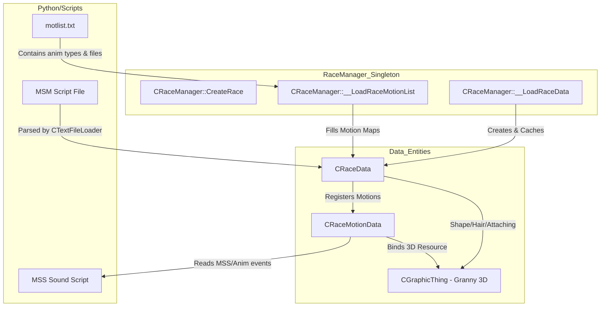

# Dokumentacja Techniczna Modulu: GameLib - CRaceManager i CRaceData (Rejestr Ras i Potworow)

## 1. Cel Architektoniczny i Rola Modulu
Podsystem ten odpowiada za pelne zarzadzanie rasami graczy (Warrior, Assassin, Sura, Shaman), potworami, NPC (Non-Player Characters) oraz wierzchowcami w kliencie Metin2 (GameLib). Jego glowna rola jest parsowanie, buforowanie i zarzadzanie plikami skryptowymi modeli (`.msm` - Monster/Man Script) oraz powiazanymi danymi o animacjach (motlist.txt). Modul zarzadza modelem postaci jako zestawem oddzielnych partii ciala, uzbrojenia, wlosow oraz przypisanych animacji (w tym danych o atakach kombo i kolizjach).

**Zaleznosci:**
*   **EterPack / VFS (Virtual File System):** Wczytywanie plikow (CMappedFile, CTextFileLoader).
*   **EterGrnLib:** Obiekty CGraphicThing, ktore stanowia reprezentacje plikow animacji lub modeli Granny 3D.
*   **EterLib:** Ladowanie zasobow z uzyciem `CResourceManager`, `CAttributeInstance`.
*   **MilesLib (NSound):** Rejestrowanie skryptow dziwkowych podpietych do animacji postaci.
*   **EffectLib:** Ladowanie i rejestrowanie id efektow (np. "smoke bone effects").

## 2. Diagram Architektury i Przeplywu Danych (Mermaid)

## 3. Rejestr Struktur Danych i Pamieci (Memory & Struct Layout)

Podsystem wykorzystuje pule pamieci `CDynamicPool<T>` dla wysokowydajnej alokacji danych rasy i animacji bez fragmentacji sterty.

*   `COMBO_KEY` (DWORD): Zapakowany klucz dla atakow kombo. Upper 16 bits = Motion Mode, Lower 16 bits = Combo Type. Wykorzystuje macro `MAKE_COMBO_KEY(motion_mode, combo_type)`.

*   `enum EParts` w `CRaceData`:
    *   `PART_MAIN` (0)
    *   `PART_WEAPON` (1)
    *   `PART_HEAD` (2)
    *   `PART_WEAPON_LEFT` (3)
    *   `PART_HAIR` (4)
    *   `PART_MAX_NUM` (5) - Maksymalna liczba czesci ekwipunku postaci modyfikujacych geometrie zewnetrzna. Mapuje sie bezposrednio z ID przedmiotow po stronie serwera.

*   `struct SSkin` (w `CRaceData`):
    *   `int m_ePart;` (Alignment: 4 bytes)
    *   `std::string m_stSrcFileName;` (Sciezka zrodlowego pliku tekstury)
    *   `std::string m_stDstFileName;` (Sciezka docelowej tekstury zamiennika)
    *   *Opis:* Realizuje mechanizm "Texture Swap", podmieniajac zrodlowe materialy 3D (czesci zbroi) w locie.

*   `struct SHair` i `struct SShape` (w `CRaceData`):
    *   Zawieraja `std::string m_stModelFileName;` oraz wektor `std::vector<SSkin> m_kVct_kSkin;`.
    *   Sluzza do definiowania zbroi bazowych i rozmaitych wlosow obslugiwanych bezposrednio z tokenow "hairdata" i "shapedata" z `.msm`.

*   `struct TMotion` (w `CRaceData`):
    *   `BYTE byPercentage;` (1 byte, szansa na wylosowanie tej samej animacji - warianty).
    *   PADDING (3 bytes, zaleznie od arch)
    *   `CGraphicThing * pMotion;` (Pointer do reprezentacji zasobu)
    *   `CRaceMotionData * pMotionData;` (Pointer do struktury wydarzen w animacji)

*   `struct SMotionModeData` (w `CRaceData`):
    *   Przechowuje `WORD wMotionModeIndex;` (np. MODE_GENERAL, MODE_ONEHAND_SWORD, MODE_HORSE).
    *   `TMotionVectorMap MotionVectorMap;` - mapuje `WORD` (indeks animacji, np. NAME_WAIT) na vector `TMotion` pozwalajacy na animacje z szansa procentowa.

*   `struct TComboInputData` (w `CRaceMotionData`):
    *   `float fInputStartTime;`
    *   `float fNextComboTime;`
    *   `float fInputEndTime;`
    *   *Opis:* Definiuje okno czasowe uderzenia w sec, w ktorym gracz musi wcisnac spacje aby wyprowadzic kolejny cios z sekwencji.

## 4. Rejestr Klas i Metod (API Reference)

### C-Class: `CRaceManager`
Singleton (CSingleton) sluzacy do trzymania w cache zaladowanych ras.
*   `CRaceManager::GetRaceDataPointer(DWORD dwRaceIndex, CRaceData ** ppRaceData)`:
    Sprawdza mape cache rasy `m_RaceDataMap`. Jesli rasy nie ma, wywoluje wewnetrzne `__LoadRaceData`. Zwraca stan ladowania rasy.
*   `CRaceManager::__LoadRaceData(DWORD dwRaceIndex)`:
    Zasadnicza logika znajdowania plikow. Sprawdza czy race_name zaczyna sie od `#` (lokalne ladowanie w narzedziach jak WorldEditor). Uzywa `__GetRaceResourcePathes`, iteruje przez `d:/ymir work/guild/`, `npc/`, `monster/` probujac znalezc pasujacy plik `.msm`. Tworzy nowy `CRaceData` i prosi o parsowanie za pomoca `CRaceData::LoadRaceData(msmFile)`.
*   `CRaceManager::__LoadRaceMotionList(CRaceData& rkRaceData, ...)`:
    Otwiera plik `motlist.txt` przez VFS, konwertuje tekstowe nazwy (np. "WAIT", "SPAWN", "COMBO_ATTACK1") na ID z enumow (np. `CRaceMotionData::NAME_WAIT`), uzywajac statycznej mapy slownikowej `s_kMap_stType_dwIndex`. Dodaje do rasy instrukcje loadowania poszczegolnych ruchow.
*   `CRaceManager::RegisterRaceSrcName(...)` / `RegisterRaceName(...)`:
    Sluzy do tlumaczenia z id (np. 1) na "warrior", a potem tlumaczenia na katalog zrodlowy.

### C-Class: `CRaceData`
Struktura danych dla konkretnego ID rasy (potwora lub modelu gracza). Reprezentuje model staly. Alokowana przez `CDynamicPool`.
*   `CRaceData::LoadRaceData(const char * c_szFileName)`:
    Uzywa `CTextFileLoader` do parsowania kluczy: `basemodelfilename`, `treefilename`, `smokefilename`. Parsuje blocki `{}` z `"shapedata"`, `"hairdata"`, `"attachingdata"`. Rozroznia tagi `local_model` i `local_sourceskin`.
*   `CRaceData::GetAttachingBoneName(DWORD dwPartIndex, const char ** c_pszBoneName)`:
    Pobiera nazwe kosci (do przyklejania zewnetrznych elementow 3D np. broni czy dymu do pancerza).
*   `CRaceData::GetMotionDataPointer(DWORD dwMotionKey, CRaceMotionData ** ppMotionData)`:
    Zwraca meta-dane opisujace ramy czasowe, eventy animacji i mozliwosc combo dla zadanego klucza animacji (MotionKey to zlozenie Motion Mode i Motion Index).

### C-Class: `CRaceMotionData`
Obiekt reprezentujacy "fizyczne zachowanie" w korelacji do surowej animacji 3D (obliczanie ramki, eventow w czasie).
*   `CRaceMotionData::LoadMotionData(const char * c_szFileName)`:
    Wczytuje skrypt `.msa` (Motion Script Attribute). Wyszukuje blok `motioneventdata`. W przypadku eventow parsowane sa:
    - `MOTION_EVENT_TYPE_FLY`
    - `MOTION_EVENT_TYPE_EFFECT`
    - `MOTION_EVENT_TYPE_SCREEN_WAVING`
    - `MOTION_EVENT_TYPE_SPECIAL_ATTACKING`
    - `MOTION_EVENT_TYPE_SOUND` (wczytuje dzwiek)
    Automatycznie szuka pliku `.mss` (Motion Sound Script) dodajac `/sound` i koncowke base-name-a jesli dllugosc sciezki > 13 znakow (specyficzny przypadek deweloperow metina - string hack).
*   `CRaceMotionData::GetEventType(DWORD dwIndex)`:
    Zwraca typ wydarzenia zarejestrowanego w danej klatce animacji (np. rzucenie particle efektem, zatrzesienie kamery).

## 5. Punkty Styku (Cross-Subsystem Integration)

1.  **Zaleznosci VFS (EterPack)**: Wszystkie wywolania otwierania tekstowych skryptow config (np. `motlist.txt`, pliki `.msa`) opieraja sie na dostepie bezposrednio przez `CEterPackManager` wywolujac `CMappedFile`. `CMemoryTextFileLoader` odczytuje VRAM VFS.
2.  **Powiazanie z Systemem Atrybutow i D3D**: `CRaceData` dostarcza plik kolizji serwera - `GetAttributeDataPtr()`, rzutujac na `CAttributeData*` przechowywany przez `CResourceManager`.
3.  **Cross-Platform Python Styku**: W kliencie Metin2 rejestrowanie typow ras i przypisanie im konkretnych wlasciwosci w PyMethodDef wiaze sie scisle z wywolywaniem globalnego `CRaceManager::Instance().RegisterRaceName(...)` bezposrednio w fazie inicjalizacji klienta w `UserInterface/PythonPlayer.cpp` i modulach sieciowych (`chrmgr.RegisterRaceName`).
4.  **Network/Serwer**: Server wysyla pakiety z poleceniem zespawnowania encji, jej `dwRaceIndex` trafia bezposrednio do `CRaceManager::GetRaceDataPointer`, co inicjuje kaskadowe ladowanie z dysku jesli cache jest puste.
5.  **EffectLib**: Pliki konfiguracyjne czesto w sekcji smoke podaja ilosc ID efektu wydechu z pyska czy potu. Rejestruje te obiekty przy starcie poprzez `CEffectManager::Instance().RegisterEffect2(...)`.

## 6. Pulapki, Antywzorce i Ograniczenia

1.  **Zlozonosc i Sciezki Plikow na Sztywno (Hardcoding)**:
    Metoda `__GetRaceResourcePathes` zawiera ekstremalnie sztywne przypisania scierzek jak `"d:/ymir work/npc/"` czy `"d:/ymir work/monster2/"`. Sprawdzanie czy id jest wieksze nize 14000 a mniejsze niz 15000 do okreslenia "Guild Race" to powazny antywzorzec. Dodanie nowych folderow przez modderow wymusza re-kompilacje zrodla `.cpp`. Zmiana ID potworow moze wyrzucic je ze zbioru przewidywanych sciezek.
2.  **Zagrozenia Wielowatkowosciowe**: Singleton `CRaceManager` nie posiada barier dostepu typu Mutex (`CRITICAL_SECTION`). Jezeli z sieci wejda 2 obiekty na tych samych ID w oddzielnych procesach obslugi pakietow z background loadingu, moze wystapic crash / memory leak przy probie wielokrotnego zaladowania `CRaceData` naraz.
3.  **Wycieki Pamieci i Fragmentacja Stringow**: Kod zalezny od instrukcji `"sound/" + c_szHeader` bazujacy na substringach `string::length > 13` bez uprzedniego poprawnego parsowania nazw potrafi rzucac znieksztalcone adresy do zasobow VFS, jesli ktos wrzuci sciezke bezposrednia nie poprzedzona wymaganym przedrostkiem klienta Ymir (tj. `D:\Ymir Work\...`).
4.  **Pulapka DynamicPool**: Obiekty zarzadzane przez `CDynamicPool<CRaceData>` (np. w `CRaceData::DestroySystem()`) musza byc explicite posprzatane na zamknieciu programu, inaczej wyladuja w narzedziach statycznych profilerow jako wycieki, bo `Clear` a `Destroy` to dwie rozne rzeczy w poolingu EterLib.

## 7. Szczegolowe Wytyczne dla Modulu

*   **Tabele Ras**: Klasy podstawowe (Warrior, Assassin, Sura, Shaman) zazwyczaj naleza do puli ras ponizej `dwRaceIndex` < 9000. Metin2 operuje 4 standardowymi rasami, ale przez gender (plec) system rejestruje kazda klase i jej odmiane plci jako osobny index `RaceData`.
*   **Pliki .msm (Monster Script / Man Script)**: Stanowia podstawowy blok budowlany klienta YMIR-a. Posiadaja skladnie klucz-wartosc hierarchiczna. Definiuja: `BaseModelFileName`, tablice `ShapeData` (Dla zbroi, mapujac id wyposazenia z pliku klienta serwerowego do sciezki `targetskin` na ciele), `HairData` (mapujac wlosy), i `AttachingData` opisujace sloty (takie jak punkty zamocowania broni prawej reki `Bip01 R Hand`).
*   **motlist.txt**: Zwykly plik wierszowy definiujacy id z `enum`'a w C++, typ animacji, nazwe krotka pliku, oraz uzytkowy procent szansy zrodlowej. Parseowany po tokenach, ignoruje entery.
*   **Sloty Ekwipunku i Kosci**: Modul RaceData nie renderuje ich sam z siebie. Przechowuje logike ktora udostepnia dane "gdzie" dane `dwPartIndex` (np `PART_WEAPON`) ma byc dopiete `CRaceData::GetAttachingBoneName`, ktory potem `CInstanceBase` modyfikuje przez update macierzy tranformacji kosci w przestrzeni 3D.
