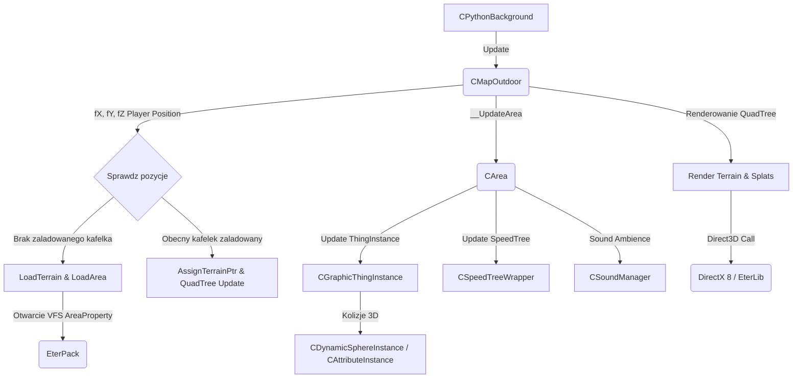
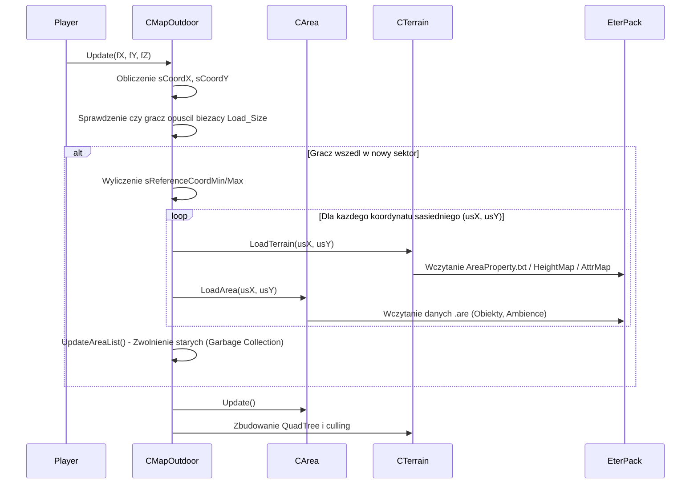

# GameLib: CMapOutdoor i CArea - Streaming Swiata Gry i Kolizje

## 1. Cel Architektoniczny i Rola Modulu

W architekturze klienta Metin2, modul **GameLib (CMapOutdoor, CArea, CTerrain)** odpowiada za zarzadzanie swiatem zewnetrznym (outdoor). Jest to glowny system strumieniowania terenow (streaming) - silnik bezszwowo laduje i zwalnia z pamieci kafelki terenu zaleznie od polozenia gracza.

Glowna odpowiedzialnoscia `CMapOutdoor` jest:
- Zarzadzanie tzw. siatka terenow (macierz kafelkow 3x3 lub wiesza). Zaleznie od wspolrzednych gracza wywolywane jest ladowanie nowych kafelkow `.are` (Area) i `.atr` (Terrain).
- Renderowanie nieba, swiatla slonecznego, filtrow ekranowych (fog, lens flare) i cieni z wykorzystaniem narzedzi ze SpeedTree i EterLib.
- Obliczanie i utrzymywanie QuadTree w celu optymalizacji renderingu i culling'u dla kafelkow terenu.
- Omijanie przeszkod (PCBlocker) oraz liczenie glebokosci/wysokosci postaci nad terenem (Z).

Odpowiedzialnoscia podmodulu `CArea` jest:
- Zarzadzanie obiektami 3D rozmieszczonymi na danym wycinku swiata - modelami Granny (budynki), drzewami (SpeedTree), efektami wizualnymi, potworami oraz punktami dzwiekowymi (Ambience).
- Rozwiazywanie statycznych kolizji dla budowli i dungeonow umiejscowionych w strefie Area.

Zaleznosci:
- **EterPack**: wirtualny system plikow (Virtual File System) do zczytywania danych binarnych `.atr`, `.are`, `Setting.txt`.
- **EterLib**: CStateManager (stan urzadzenia Direct3D), CResourceManager.
- **SpeedTreeLib**: wywolywanie funkcji drzew (lasu).
- **PRTerrainLib**: silnik narzedzi terenu i tekstur (TerrainType.h).
- Modul wywolywany jest glownie przez aplikacje z poziomu skryptow w Pythonie za posrednictwem `CPythonBackground` i innych klas interfejsowych GameLib.

## 2. Diagram Architektury i Przeplywu Danych (Mermaid)

### Strumieniowanie wezlow terenu (Sequence Diagram)

## 3. Rejestr Struktur Danych i Pamieci (Memory & Struct Layout)

Ponizej znajduja sie kluczowe struktury okreslajace wezly terenowe, renderowanie, swiatlo oraz ladowanie pamieci z `.are`. 

### `SOutdoorMapCoordinate` (TOutdoorMapCoordinate)
Przechowuje identyfikator terenu jako kafelka siatki.
- `short m_sTerrainCoordX;` - Wspolrzedna X kafelka terenu.
- `short m_sTerrainCoordY;` - Wspolrzedna Y kafelka terenu.
- **Wyrownanie (Packing)**: Zalezne od kompilatora, 4 bajty w sumie.

### `CArea::SObjectData` (TObjectData)
Struktura reprezentujaca zserializowany pojedynczy obiekt ze srodowiska mapy ladowany z plikow ustawien.
- `TObjectPosition Position;` (typedef z `D3DXVECTOR3`, 12 bajtow).
- `DWORD dwCRC;` (4 bajty) - Unikalny identyfikator pliku/rodzaju obiektu wyciagany przez funkcja sumy kontrolnej.
- `BYTE abyPortalID[PORTAL_ID_MAX_NUM];` (Zazwyczaj tablica 6 lub 8 bajtow) - Identyfikatory polaczen portalowych podziemi.
- `float m_fYaw;`, `float m_fPitch;`, `float m_fRoll;` (12 bajtow) - Rotacje (katy Eulera).
- `float m_fHeightBias;` (4 bajty) - Modyfikator przesuniecia w osi Z.
- `DWORD dwRange;` (4 bajty) - Zasiegi np. dzwiekow (Ambience).
- `float fMaxVolumeAreaPercentage;` (4 bajty) - Wspolczynnik narastania maksymalnej glosnosci blisko centrum.
- **Wyrownanie (Packing)**: 4-bajtowe / domyslne kompilatora. Rozmiar: ok. 40-48 bajtow zaleznie od wielkosci `PORTAL_ID_MAX_NUM`.

### `CArea::SAmbienceInstance` (TAmbienceInstance)
Dynamiczna instancja emitera dzwieku 3D zaleznosci od odleglosci do gracza.
- Dziedziczy po `CScreen`.
- `float fx, fy, fz;` - Pozycja w swiecie.
- `DWORD dwRange;` - Promien aktywnego slyszenia.
- `float fMaxVolumeAreaPercentage;`
- `int iPlaySoundIndex;` - Przypisany identyfikator slotu odtwarzania z `CSoundManager`. (Jesli brak dzwieku to -1).
- `float fNextPlayTime;` - Dla dzwiekow typu STEP (kroki/losowe) licznik oparty na `CTimer::Instance().GetCurrentSecond()`.
- `prt::TPropertyAmbience AmbienceData;` - Osobna struktura wyczytywana z properties, zawierajaca liste nazw plikow dzwiekowych i typy.
- Wskazniki na funkcje uaktualniajace (Function Pointers): `void (SAmbienceInstance::*Update)(float, float, float);`

### `CArea::SObjectInstance` (TObjectInstance)
Reprezentuje stan wczytanego i aktywnego na mapie bytu srodowiskowego.
- `DWORD dwType;` - Enum typu wlasnosci z PRTerrainLib (Drzewo, Budynek, Efekt, Ambience, DungeonBlock).
- `CAttributeInstance * pAttributeInstance;` - Skroty do informacji o kolizjach wezlow.
- `CSpeedTreeWrapper * pTree;` - Wskaznik na wrapper SpeedTree, jesli `dwType == TREE`.
- `BOOL isShadowFlag;`
- `CGraphicThingInstance * pThingInstance;` - Reprezentacja graficzna Granny / Wlasnego formatu modelu dla budynkow (Normal Object).
- `DWORD dwEffectID;`, `DWORD dwEffectInstanceIndex;` - Identyfikatory menedzera efektow jesli to emiter czasteczek/swiatel na mapie.
- `TAmbienceInstance * pAmbienceInstance;` - Jesli to emiter dzwieku otoczenia.
- `CDungeonBlock * pDungeonBlock;` - Wskaznik na klocek/komorke podziemia dla instancjonowanych lochow (jesli modul tego wymaga).
- Zastosowano tu CDynamicPool dla tej struktury w celu ograniczenia fragmentacji pamieci przy ciezkim ladowaniu sektorow (`ms_ObjectInstancePool`).

### `CMapOutdoor::SoftwareTransformPatch_STVertex` i pochodne
Struktury optymalizacyjne uzywane jesli urzadzenie graficzne wspiera T&L jedynie po stronie softwarowej.
- `SoftwareTransformPatch_STVertex`: Posiada `D3DXVECTOR4 kPosition;`.
- `SoftwareTransformPatch_STLVertex`:
  - `D3DXVECTOR4 kPosition;`
  - `DWORD dwDiffuse;`
  - `DWORD dwFog;`
  - `D3DXVECTOR2 kTexTile;`, `D3DXVECTOR2 kTexAlpha;`, `D3DXVECTOR2 kTexStaticShadow;`, `D3DXVECTOR2 kTexDynamicShadow;`
- Pakiet wierzcholkowy zawierajacy przeliczone koordynaty i wagi oswietlenia obliczane statycznie na etapie culling'u dla poszczegolnych `patchnum`.

## 4. Rejestr Klas i Metod (API Reference)

### Klasa: `CMapOutdoor`
Zarzadca outdoorowego klienta podlegly interfejsowi Game/Python. Dziedziczy z `CMapBase`.

- `bool Update(float fX, float fY, float fZ)`
  - **Logika**: Glowna petla uaktualniajaca streaming. Oblicza sektor siatki gracza przez konwersje jego pozycji na `CTerrainImpl::TERRAIN_XSIZE`. Oblicza `sCoordX` oraz `sCoordY`. Nastepnie sprawdza warunek: czy m_CurCoordinate zmienilo sie wzgledem m_PrevCoordinate o odpowiednia wartosc delta (`LOAD_SIZE_WIDTH`).
  - Jesli gracz przeszedl strefe bezpieczna kafelka srodkowego, wywoluje petle X, Y, by wczytac nowe instancje `LoadTerrain(usX, usY)` i `LoadArea(...)`. Nastepnie aktualizuje wektor starych/niezaleznych pol poleceniem usuniecia poprzez zapytanie odleglosci od centrum nowej siatki (`UpdateAreaList`). Uruchamia `__UpdateGarvage()` wykonujac usuniecie 1 po 1 (zapobiegniecie wstrzymaniu renderowania klatki dluzej niz ustalone minimum). Update'uje QuadTree i wola `CTimer` dla systemu SpeedTree. Czas jest logowany dla systemu profilujacego. Zwraca true po sukcesie.

- `bool LoadArea(WORD wAreaCoordX, WORD wAreaCoordY, WORD wCellCoordX, WORD wCellCoordY)`
  - **Logika**: Sprawdza funkcja `isAreaLoaded`, czy juz istniejemy. Buduje id numeryczne ze wzoru `(wAreaCoordX)*1000 + wAreaCoordY`. Generuje docelowy plik `.are` (np. `mapa\000000\`). Uzywa `CArea::New()` (pobiera z puli pamieci) na wygenerowanie nowego `pArea`. Odpala logiki ladowania dla danego `pArea`. Nadaje status enable dla portalu jesli sa. Umieszcza go w wektorze `m_AreaVector`. Zwraca true.

- `float GetHeight(float fx, float fy)`
  - **Logika**: Najpierw poszukuje wysokosci obiektow bezposrednio znajdujacych sie na punktach x, y za pomoca predykatu `FGetObjectHeight` przeslanego przez culling Quadtree (znajduje obiekt po promieniu rzutu w dol). Uruchamia fMAX, by zwrocic wieksza (np. stojac na dachu, wygrywa budynek). Jesli obiekt nie rzucil bledu i nie ma go (lub jego bounding box), konwertuje lokalizacje na kafelek terenu `Terrain`, po czym zwraca `GetTerrainHeight(fx, fy)` zaokraglone lub mapowane za posrednictwem cache `SHeightCache`. Zabezpieczenie minimalnej wysokosci do wyrenderowania i prawidlowego wektora kamery dla `GetPickingPointWithRay`.

- `float GetCacheHeight(float fx, float fy)`
  - **Logika**: Optymalizacja do detekcji podloza i blokera scian dla serwera / kamery. Oblicza dwKey (hash) wyciagajac binarne bity int'ow z fx i fy. Przeszukuje lokalnie w `m_kHeightCache`. Jesli trafienie pudluje, wylicza fizycznie na zywo przez funkcje `GetHeight(fx, fy)`, nastepnie wrzuca na koniec liscie wektora (lub rotuje po maksymalnej pojemnosci, hash mapy).

- `void UpdateAreaList(long lCenterX, long lCenterY)`
  - **Logika**: Mechanizm wyrzucajacy nieaktualne tereny z powodu przebywania gracza na innej mapie. Za pomoca functora std::for_each (`FPushTerrainToDeleteVector`, `FPushAreaToDeleteVector`), przechodzi po wszystkich wczytanych CTerrain/CArea. Kafelki oddalone poza okno `AROUND_AREA_NUM` i z boku kierunku poruszania (wyliczane przez parametry eDeleteLRDir, eDeleteTBDir) podlegaja wyrzuceniu do `m_TerrainDeleteVector`. Pozniej glowna petla gry je usunie.

### Klasa: `CArea`
Odpowiednik danych srodowiskowych danego kafelka.

- `bool Load(const char * c_szPathName)`
  - **Logika**: Wywoluje ladowanie konkretnych wektorow srodowiskowych m.in: `__Load_LoadObject(ObjectFileName)` z rozszerzeniem `are`, oraz wczytywanie ambiancji `__Load_LoadAmbience(AmbienceFileName)` z `amb`. Nastepnie odpala `__Load_BuildObjectInstances()`, sortuje obiekty na podstawie CRC za pomoca std::sort i przypisuje z alokatora.

- `void __UpdateEffectList()`
  - **Logika**: Iteracja wzdluz mapy instancji efektow `m_EffectInstanceMap`. Update na wszystkich i wykasowanie ze zbioru jesli metoda powrocila wartosc (!isAlive) - co nakazuje CEffectManager::Instance().DestroyUnsafeEffectInstance(), uwalniajac wezly i zwalniajac czasteczki.

- `void UpdateAroundAmbience(float fX, float fY, float fZ)`
  - **Logika**: Funkcja polimorficzna dla CArea. Iteruje po kazdym sklonowanym instancjonowaniu dzwiekow srodowiskowych wewnatrz obszaru `m_AmbienceCloneInstanceVector`. Wywoluje wewnetrzne `pInstance->__Update(fX, fY, fZ)`, gdzie nastepuje oddelegowanie poprzez function pointer do UpdateOnceSound, UpdateStepSound lub UpdateLoopSound bazujac na string'ach konfiguracyjnych w plikach AMBIENCE property.

- `void __SetObjectInstance_SetDungeonBlock(TObjectInstance * pObjectInstance, const TObjectData * c_pData, CProperty * pProperty)`
  - **Logika**: Tworzy statyczna bryle dungeonu. Alokuje z CDynamicPool<CDungeonBlock>, uzywa BuildBoundingSphere dla okrelania przestrzeni widzenia korytarzy/pokojow (portalowania scian). Wywoluje nadanie portali z tablicy zaleznych przejsc `abyPortalID` (sluzacym okluzji) i uzupelnia kolizje ze strAttributeDataFileName.

### Klasa: `CTerrain`
Obiekt zarzadzajacy siatka geomertyczna i culling'iem pojedynczego kwadratu terenu z PRTerrainLib.

- `WORD WE_GetHeightMapValue(short sX, short sY)`
  - **Logika**: Otrzymuje fizyczna macierz pikseli w formacie krotkim (-1 w kolumnach zewnetrznych, lub max WIDTH). Wylicza, czy podany indeks wchodzi na obszar docelowego pliku, czy granice sasiednich CTerrain! To glowne mechaniki **bezzszwowosci (seamless map)** w grze. Jezeli `sX < 0`, pobiera wskaznik na kafelek sasiadujacy poprzez odpytanie w CMapOutdoor i uzywa matematyki translacji krawedzi, aby pociagnac punkt z boku. Jesli jest na srodku uzywa domyslnej tablicy wysokosci raw.

- `float GetHeight(int x, int y)`
  - **Logika**: Skomplikowana funkcja rzutujaca. Oblicza X dist i Y dist jako odleglosci relatywne (z dzielenia mod) do `CELLSCALE`. Zaleznie czy piksel gracza upada po lewej czy po prawej stronie przekatnej cwiartki komorki (`xdist <= ydist`), uzywa odpowiednich trzech punktow krawedzi kafelka by policzyc slope (wzniesienie plaskie z iloczynu skalarnego). Rzuca wysokosc bazujac na `m_fHeightScale` i zinterpolowanych wielomianach od pionowych werteksow komorki, dajac pelna iluzje gladkiego podloza terenu.

## 5. Punkty Styku (Cross-Subsystem Integration)

1. **Python (`CPythonBackground`)**: Wszystkie instrukcje powiazane ze zmiana kamery czy strumieniowania z poziomu pythona (skryptow logiki Metin) nie odpytuja serwera bezposrednio o teren, ale komunikowane sa do singletonu z zewnetrznego opakowania C++ poprzez `app.SetCamera` etc. Python dowiaduje sie o nazwach map i parametrach swiatla z konfiguracyjnych plikow odczytanych w trakcie ladowania `.are`.
2. **Serwer i Siec (Packet.h / Socket)**: Wysokosc Z i pozycja XY ulegajaca zderzeniu (PC Blocker/AttributeInstance) nie wysylaja kolizji do serwera, serwer bazuje na wlasnej paczce wysokosci - dlatego uzywane jest "CacheHeight", by utrzymac dokladne odbicie terenu z serwerem, aby narzedzie sprawdzajace opkody np. zapobiegajace hackowaniu nie wycofalo pakietu gracza z racji latania, tzw. Rubberbanding.
3. **Hardware, VRAM i DirectX**: Ladowanie tekstur dla kafelka terenu `CalculateNormal`, `LoadShadowTexture` i splattowanie tekstur wielowarstwowych operuje na EterLib (`STATEMANAGER`). Jesli wyliczony przez QuadTree lisc mowi o widocznosci w przestrzeni FRUSTUM (matryca kamery CCameraManager), wtedy dane pakowane do bufora IDirect3DVertexBuffer8 wysylane sa rurociagiem bezposrednio z `CMapOutdoor::__HardwareTransformPatch_RenderPatchSplat` w momecie OnRender, uzywajac optymalnego batchingu (maksimum polaczen primitive count w wektorach list renderingu).

## 6. Pulapki, Antywzorce i Ograniczenia

1. **Zaciecja ladowania klatek (Lag Spikes)**: Funkcja `__Game_UpdateArea` laduje od razu obszar (np. 1-9 na raz w obrysie `LOAD_SIZE_WIDTH`). Deserializacja `.atr` oraz `.are` przez system plikow i tworzenie instancji z puli wymaga ogromnej iteracji (jak w `CArea::__Load_BuildObjectInstances()`). Moze to zawiesic glowny watek logiki powodujac frame drop. W przeszlosci probo wano wprowadzic watki uzywajac `CAreaLoaderThread` (czego pozostalosci stanowia zakomentowane zmienne m_bBGLoadingEnable w MapOutdoor), z ktorego jednak zrezygnowano na rzecz recznego GarbageCollection.
2. **Problemy zwiazane z D3DERR_DEVICELOST**: Jesli narzedzie DirectX straci target okna glownego (np. alt-tab z fullscreen), narzedzia takie jak zbuforowane wezly QuadTree moga utrzymywac inwalidowane macierze tekstur - musi to byc przechwytywane glebiej, zanim znowu wywola `OnRender`.
3. **Wycieki Pamieci w wektorach kasujacych (m_TerrainDeleteVector)**: CMapOutdoor przechowuje i deleguje usuniecia do kosza na osobny cykl aktualizacyjny. Usuniecia np. czasteczek z mapy wymagaja bezpiecznych metod w menedzerze (`rkEftMgr.DestroyUnsafeEffectInstance()`), w przeciwnym razie iterator wektora przeskakuje lub wycieka dany adres. Kasowanie jest robione metoda straznika (czyli w miedzyklatkach `__ClearGarvage()`). Powinno to byc zachowane szczelnie, poniewaz CTerrain allokuje w systemie DynamicPool znaczne polacie bajtow pamieci wlasciwosci (m_abyAttrMap itp).
4. **Roznice synchronizacyjne na granicy wezlow kafelkowych (Seams)**: Metoda `WE_GetHeightMapValue` polega scisle na odczycie matematycznym wspolrzednych sasiada. Zla synchronizacja `sX + XSIZE` wzgledem narzedzia WorldEditor (przy zapisie) powoduje artefakty szwowej siatki i przesuniecia normalek cieniowania `CalculateNormal`. Narzedzie generujace tekstury musi sciśle operowac wewnatrz tych regul, ukladajac marginesy na styk o rozmiar -1 i maksymalny.
