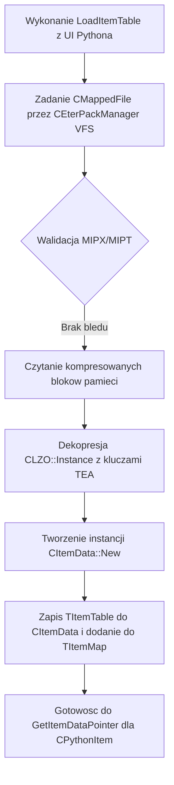
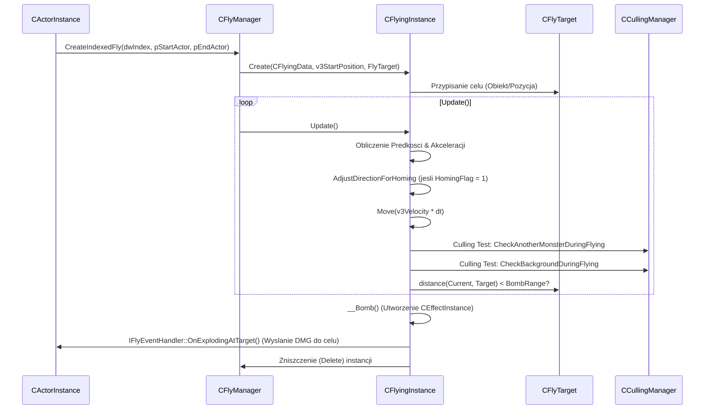

# Dokumentacja Podsystemu: GameLib: CItemManager oraz CFlyManager (Pociski 3D)

## 1. Cel Architektoniczny i Rola Modulu

Podsystem ten, umiejscowiony w bibliotece `GameLib`, pelni dwie kluczowe i zupelnie rozne role architektoniczne w kliencie gry (prawdopodobnie Metin2):

1.  **CItemManager**: Pelni role glownego, scentralizowanego rejestru (Singleton) przechowujacego dane i prototypy przedmiotow (Item Prototypes). Odpowiada za wczytywanie i parsowanie danych o przedmiotach (w tym wlasciwosci takich jak: ikony, parametry, limity, zaleznosci miedzy systemami jak anti-flagi czy typy broni) z zaszyfrowanych/skompresowanych plikow `item_proto` przez VFS klienta. Dziala jako posrednik dla innych systemow (np. UI w Pythonie, logika ekwipunku) do pobierania obowiazujacych statystyk danego przedmiotu.
2.  **CFlyManager / CFlyingObjectManager**: Stanowi wyspecjalizowany silnik fizyki i renderingu pociskow 3D (tzw. "Fly Objects"), takich jak strzaly, zaklecia magiczne i efekty obszarowe w grze. Odpowiada za wczytywanie definicji trajektorii (.msf), sledzenie celow z uzyciem systemu "Fly Target" (obiekty naprowadzajace homing), obliczanie kolizji 3D (obwiednie dynamiczne w przestrzeni), a takze wizualizacje smug (trails) pociskow.

**Zaleznosci:**
*   **Wywolywany przez:** Logika CPythonItem, CPythonPlayer, moduly Python UI (PythonItemModule, PythonPlayerModule) odpytujace `CItemManager`. Natomiast `CFlyManager` wywolywany jest przez logike postaci, walki (np. `ActorInstanceBattle`, system skilli serwera poprzez wiadomosci pakietowe mapowane na `CreateIndexedFly`).
*   **Korzysta z:** `CEterPackManager` (VFS) oraz dekodowania LZO do danych przedmiotow. `CEffectManager` i `CResourceManager` (wczytywanie modeli, ikon i efektow dla obiektow latajacych oraz przedmiotow), EterLib (Render state management, CTimer, CCullingManager do frustum/kolizji sferycznych). Zalezy takze bezposrednio od DirectX (D3DXMATRIX, D3DTS_WORLD, D3DRS_*).

## 2. Diagram Architektury i Przeplywu Danych (Mermaid)

### Cykl Zycia Ladowania Przedmiotow (ItemManager)

### Przeplyw Pociskow (FlyManager)

## 3. Rejestr Struktur Danych i Pamieci (Memory & Struct Layout)

### Z GameLib/ItemData.h:

1.  **Struktura `SItemLimit` (`TItemLimit`) - Zapakowana (Pragma Pack 1)**
    *   **Pamiec:** `bType` (BYTE, 1 bajt), `lValue` (long, 4 bajty). Rozmiar calkowity = 5 bajtow.
    *   **Cel:** Okresla zaleznosci i ograniczenia przedmiotow np. minimalny level czy konkretna klasa. Wymuszone pakowanie zmniejsza rozmiar bufora z LZO.

2.  **Struktura `SItemApply` (`TItemApply`) - Zapakowana (Pragma Pack 1)**
    *   **Pamiec:** `bType` (BYTE, 1 bajt), `lValue` (long, 4 bajty). Rozmiar calkowity = 5 bajtow.
    *   **Cel:** Definicja bonusow dodawanych przez dany przedmiot (np. +10 Sily, Odpornosc na magie 15%).

3.  **Struktura `SItemTable` (`TItemTable`) - Zapakowana (Pragma Pack 1)**
    *   Rozbudowana, zwarta reprezentacja calego wiersza bazy `item_proto` przekazywana prosto z pakietu od serwera/pliku LZO na kliencie.
    *   **Pola kluczowe:**
        *   `dwVnum` (DWORD, 4) - Identyfikator unikalny przedmiotu.
        *   `dwVnumRange` (DWORD, 4) - Zakres modyfikacji (warianty VNUM).
        *   `szName` / `szLocaleName` (char[25] + 1 = 25 kazdy, wg starych ITEM_NAME_MAX_LEN, ogolem char array) - Nazwy wlasne i systemowe.
        *   `bType` / `bSubType` / `bWeight` / `bSize` (BYTE, 1x4 = 4) - Klasyfikacja podstawowa i wielkosc na liscie ekwipunku.
        *   `dwAntiFlags`, `dwFlags`, `dwWearFlags`, `dwImmuneFlag` (DWORD, 4x4=16) - Maski bitowe kontrolujace uzycie.
        *   `aLimits` (`TItemLimit[ITEM_LIMIT_MAX_NUM]`) - Lista limitow.
        *   `aApplies` (`TItemApply[ITEM_APPLY_MAX_NUM]`) - Lista stalych stanow (bonusy statyczne).
        *   `alValues` / `alSockets` (long array) - Wartosci specjalne dla np. broni (Atak min/max) badz miejsca na kamienie (sloty).

4.  **Enum EItemType**
    *   Wylicza unikalne typy przedmiotow (np. `ITEM_TYPE_WEAPON`, `ITEM_TYPE_ARMOR`, `ITEM_TYPE_USE`).

5.  **Enum EItemDescCol** (w CItemManager)
    *   Oznacza kolumny dla plikow txt z opisami przedmiotow (VNUM, NAME, DESC, SUMM, NUM).

### Z GameLib/FlyingData.h i powiazanych:

1.  **`CFlyingData::TFlyingAttachData`**
    *   Nie poddana dyrektywom pakowania (wyrownanie domyslne dla kompilatora, 4/8 bajtow).
    *   `iType`, `iFlyType` (int, 4).
    *   `strFilename` (std::string) - Sciezka do pliku efektu.
    *   `bHasTail` (bool, 1).
    *   `dwTailColor` (DWORD, 4), `fTailLength`, `fTailSize` (float, 4x2=8).
    *   `bRectShape` (bool, 1).
    *   `fRoll`, `fDistance`, `fPeriod`, `fAmplitude` (float).
    *   Sluzy do zarzadzania komponentami doczepianymi do rzutu pocisku, w szczegolnosci czasteczkami lub ukladem smug rysowanych dla rzutu 3D.

2.  **`SIndexFlyData` (`TIndexFlyData`) (w CFlyManager)**
    *   `byType` (BYTE, 1) i `dwCRC` (DWORD, 4). Odpowiada serwerowym identyfikatorom rzutow bezposrednio parowanym do lokalnego ID zdefiniowanego po CRC32.

## 4. Rejestr Klas i Metod (API Reference)

### Modul ItemManager

1.  **`CItemManager::LoadItemTable(const char* c_szFileName)`**
    *   **Zwraca:** `bool` (sukces / porazka).
    *   **Logika biznesowa:** Uzywa silnika `CEterPackManager` do mapowania pliku `item_proto` do pamieci (`CMappedFile`). Odczytuje naglowki kontrolne (`MIPX`, wersja 1, stride). Wykonuje obiektywna dekompresje bazy przez `CLZO::Instance().Decompress` ze wbudowanym kluczem TEA (staly `s_adwItemProtoKey`). Analizuje bufor zwrotny rzutujac go jako ciag struktur `TItemTable`. Dla kazdego zdeserializowanego wiersza tworzy nowa instancje `CItemData` przez metode `CItemData::New()`, dodaje ja do `m_ItemMap` oraz nadaje sciezki domyslne np. dla ikony w VFS (`icon/item/%05d.tga`). 
2.  **`CItemManager::GetItemDataPointer(DWORD dwItemID, CItemData ** ppItemData)`**
    *   **Parametry:** `dwItemID` VNUM przedmiotu, `ppItemData` wskaznik w ktorym nalezy zapisac wynik.
    *   **Logika biznesowa:** Szuka w hash mapie `m_ItemMap` klucza `dwItemID`. W przypadku nieznalezienia uruchamia linear scanning wektora `m_vec_ItemRange`, by znalezc identyfikator `dwItemID` uzywajac maski zasiegow (pTable->dwVnum + pTable->dwVnumRange). Zapobiega nadmiarowi pamieci na baze przez range matching (wazne przy fryzurach, barwnikach). Zwraca wynik przez wskaznik.
3.  **`CItemManager::SelectItemData(DWORD dwIndex)`**
    *   **Logika biznesowa:** Funkcja mutujaca stan singletona. Ustawia wewnetrzny wskaznik `m_pSelectedItemData` na zadany `CItemData`. Ulatwia export stanu bezposrednio do interpretera Python.

### Modul FlyManager

1.  **`CFlyingManager::RegisterFlyingData(const char* c_szFilename)`**
    *   **Logika biznesowa:** Tworzy hash `CRC32` nazwy pliku `.msf` bez wzgledu na wielkosc liter. Jesli nie znajduje sie on w `m_kMap_pkFlyData`, tworzy klase `CFlyingData`, wykonuje parser skryptowy i dodaje wynik do mapy.
2.  **`CFlyingManager::CreateIndexedFly(DWORD dwIndex, CActorInstance * pStartActor, CActorInstance * pEndActor)`**
    *   **Parametry:** Serwerowy identyfikator przelotu (`dwIndex`), aktor z ktorego pocisk wylatuje, aktor do ktorego leci.
    *   **Logika biznesowa:** W zaleznosci od zerejestrowanego typu przelotu, wyzwala `CreateFlyingInstanceFlyTarget`. Rozpatruje: `INDEX_FLY_TYPE_NORMAL` (cel jako target), `INDEX_FLY_TYPE_FIRE_CRACKER` (losowe obliczanie kosinusow, punkt zapalny celowany do losowego offsetu w powietrzu, brak celu naprowadzanego), `INDEX_FLY_TYPE_AUTO_FIRE` (lot bezposredni do celu, ale cel ma przesuniete startZ o 100).
3.  **`CFlyingInstance::Update()`**
    *   **Zwraca:** `bool` okrelajacy, czy proces zycia pocisku trwa nadal.
    *   **Logika biznesowa:** Kluczowa petla fizyki obietku. Posiada kilka faz:
        1.  *Homing:* Jesli cel to `FlyTarget.IsObject` i czas minil, nadpisuje wektor kierunku zeby skrecac w strone aktora, obliczajac nowa macierz kwaternionow.
        2.  *Akceleracja i Predkosc:* Zmienia predkosc `m_v3Velocity` bazujac na `m_v3Accel`, aplikujac grawitacje (os Z w metinie), nastepnie aktualizuje `m_v3Position`.
        3.  *Zasieg graniczny (Explode Out Of Range):* Zniszczenie po przeleceniu `m_fRemainRange`. Zmniejszane przez dystans deltaT.
        4.  *Kolizje Targetu (ExplodingAtTarget):* Kwadraty odleglosci wektorow. Gdy uderzy, przekazuje interfejs `IFlyTargetableObject->OnShootDamage()`. Gdy skill ma `m_iPierceCount` (przebijanie), odlicza od zmiennej, renderuje efekt na postaci, ale lot trwa dalej.
        5.  *Culling Kolizji Posrednich (CCullingManager):* Jesli ma wpis `hitonanothermonster`, bada promien przestrzenny na trajektorii. Jezeli srodowisko ma wlaczane kolizje podlogi (`hitonbackground`), weryfikuje Z pocisku z mapa wysokosci terenu (Z > fGroundHeight), detonujac efekt bez trafienia aktora.
4.  **`CFlyTrace::Render()`**
    *   **Zwraca:** `void`
    *   **Logika biznesowa:** Generuje customowy bufor werteksow w oparciu o `TFlyVertex` by renderowac wstegi/wleczenia, ktore przebywa obiekt (`m_TimePositionDeque`). Czesciowo nadpisuje caly potok `STATEMANAGER` DirectX, w tym `D3DRS_CULLMODE`, `D3DRS_ALPHABLENDENABLE`, `D3DRS_ZFUNC` oraz manualnie przelicza widoki przez `Frustum.ViewVolumeTest`. Renderuje trojkaty uzywajac `DrawPrimitiveUP` po posortowaniu tablicy. Zalezny od CCamera (rzut na ekran gracza bazujac od orientacji ViewMatrix).

## 5. Punkty Styku (Cross-Subsystem Integration)

*   **Z Systemem Python (CPython):** Modul jest silnie skorelowany z `PythonItemModule.cpp` oraz `PythonPlayerModule.cpp`. Te moduly wystawiaja funkcje API (np. `player.GetItemData`) bezposrednio uzywajac `CItemManager::Instance().SelectItemData()` oraz pobierajac stan zwrotny w Pythonie poprzez macro `Py_BuildValue`. `CItemManager` maskuje swoja zlozonosc, dajac do modulu pythona wyeksportowane gotowe wlasciwosci w tuple.
*   **Z Serwerem Zewnetrznym:** Siec serwera uzywa modulu pakietow. Podczas logowania i przesylania danych klienta w `NetworkStream`, gra moze wyslac `packet_fly` badz dodac latajace akcje ze skilli postaci, ktore ostatecznie rzutuja sie na komende `CreateIndexedFly()`. Pakiet definiuje serwerowy indeks, po ktorym VFS mapuje go na CRC sciezki na dysku.
*   **Z VFS (Virtual File System / EterPack):** `item_proto` na produkcji znajduje sie w skompresowanym i zablokowanym (Themida i hybrydowa kryptografia EterPack) archiwum PCK. `CMappedFile` odczytuje fizyczny obszar, przesylajac dane do `CLZO` dla TEA dekryptazu.
*   **Z EterLib (Renderowanie):** `CFlyTrace` wymusza modyfikacje flag bezposrednio przez `STATEMANAGER.SetTextureStageState`, obchodzac w ten sposob ogolna grafike materialow (tworzy tzw. billboardowe wstepgi).

## 6. Pulapki, Antywzorce i Ograniczenia

1.  **D3D State Leak w CFlyTrace (Antywzorzec):** 
    Wewnatrz `CFlyTrace::Render()` dochodzi do masowego nadpisania wlasciwosci `STATEMANAGER`. Uzywana jest funkcja `SaveRenderState` oraz manualne `RestoreRenderState`. Jesli z powodu niespodziewanego wyjatku program wyrzuci blad w polowie dzialania (np. gdzies w posrednim kodzie `DrawPrimitiveUP` po stracie obiektu), potok urzadzenia DirectX (Render states) moze pozostac w uszkodzonym stanie koruptujac rendering GUI lub modelow otoczenia postaci (czesty blad bialych modeli badz niepoprawnej przezroczystosci).
2.  **Wyciek Pamieci przez zepsuty Item Proto:**
    W logice `CItemManager::LoadItemTable()` pamiec z tablicy `pbData` (`dwDataSize` dlugosci) po zaalokowaniu `new BYTE[]` jest zalezna od rzutowania LZO. W pewnych momentach uszkodzenie metadanych w naglowkach bazy wyjsciowej LZO moze sprawic, ze algorytm w ogole pominie `delete [] pbData`, co tworzy memory leak wielkosci kilku MB dla kazdego blednego wykonania petli bazodanowej.
3.  **Wydajnosc CItemManager::GetItemDataPointer():**
    Funkcja, w sytuacji, w ktorej przedmiot to np. wariant wielorakiego VNUM (`m_vec_ItemRange`), iteruje O(n) przez wektor klas. Z uwagi na wywolywanie jej przy renderowaniu tooltipow (co dziesiatki klatek co klatke w UI), liniowe przegladanie przedzialow przy duzych ilosciach "range itemow" skutkuje spadkiem FPS. Lepszym wzorcem (O(log n)) byoby zastosowanie drzew zbalansowanych typu std::map::lower_bound.
4.  **Brak Thread-Safety w Singletonie:** 
    `CFlyingManager` wykonuje destrukcje (DeleteAllInstances), co w momencie przerywania pracy gry (zamykanie okna) na systemie MultiCore bez blokad semaforami badz `std::mutex`, na tle renderowanego watku D3D moze wygenerowac Exception `C0000005: Access Violation`. 
5.  **Hardcoded Konfiguracja Osi (Gravity):**
    `m_v3Velocity.z += m_pData->m_fGravity` jest napisane sztywno ze zmienna na wspolrzednej Z, co sprawia ze uklad fizyki metina i `CFlyManager` rygorystycznie uznaje 'Z' za wysokosc terenu (Z-Up coordinate system). Zle rzutowanie w MaxScript do formatow gr2 zepsulo by system strzal i pociskow.
