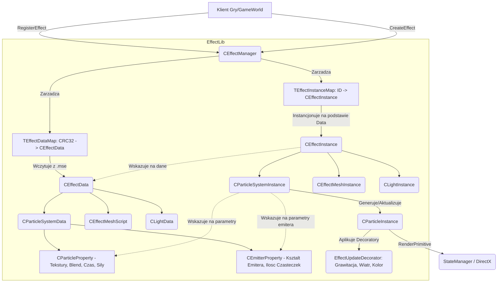

# Dokumentacja Podsystemu: EffectLib - Silnik Czasteczek 3D i System Efektow Wizualnych

## 1. Cel Architektoniczny i Rola Modulu

**Cel i Odpowiedzialnosc:**
Modul `EffectLib` odpowiada za zarzadzanie, ladowanie, renderowanie i aktualizacje efektow wizualnych w kliencie gry (najprawdopodobniej Metin2). Stanowi on centralny punkt dla systemow czasteczkowych (Particle Systems), siatek (Meshes) uzywanych w efektach oraz prostego oswietlenia, oferujac pelny cykl zycia od wczytania skryptu efektu do jego zniszczenia. Zarzadza zjawiskami wizualnymi takimi jak swiecenie broni (+9), wybuchy, czary, efekty uderzen czy animacje otoczenia. 

**Zaleznosci:**
*   **Wywolywany przez:** Modul ten jest wywolywany glownie przez nadrzedny system renderujacy klienta, czesto polaczony z obiektami postaci (np. `CInstanceBase`, czy menedzery obiektow graficznych). Elementy ze swiata wywoluja `CEffectManager` w celu zarejestrowania, uruchomienia i usuniecia efektu przypisanego do wspolrzednych lub konkretnego punktu przyczepu na obiekcie (Bone).
*   **Korzysta z bibliotek:**
    *   **DirectX / D3D8 / D3D9 (`d3dx8.h` / `d3dx9.h`):** Do operacji na wektorach i macierzach, jak rowniez definiowania podstawowych struktur dla wierzcholkow (`TPTVertex`). Wykorzystywany do nakladania stanow renderowania (`STATEMANAGER`).
    *   **EterLib (`GrpObjectInstance.h`, `Pool.h`, `GrpImageInstance.h`):** Do korzystania z puli pamieci (Pool) zapobiegajacej fragmentacji sterty (Heap), dziedziczenia podstawowych obiektow graficznych ekranu i instancji obrazkow (tekstury). W szczegolnosci uzywa interfejsu EterLib do zarzadzania zasobami tekstur (DDS/TGA).
    *   **EterBase:** Obliczanie sum kontrolnych CRC32.
    *   **MilesLib (`Type.h`):** Uzywany do systemow dzwiekowych sprzezonych z efektami (np. wyzwalanie dzwieku eksplozji w okreslonej klatce trwania efektu).

## 2. Diagram Architektury i Przeplywu Danych

## 3. Rejestr Struktur Danych i Pamieci (Memory & Struct Layout)

Ze wzgledu na to, ze wiele pol jest dodawanych klasycznie, layout jest dosc otwarty. Najwazniejsze struktury powiazane z modulem to (odtworzone na podstawie plikow C++).

### Wyliczenia (Enums)

**W `CEffectManager`**
*   `EEffectType`: `EFFECT_TYPE_NONE = 0`, `EFFECT_TYPE_PARTICLE = 1`, `EFFECT_TYPE_ANIMATION_TEXTURE = 2`, `EFFECT_TYPE_MESH = 3`, `EFFECT_TYPE_SIMPLE_LIGHT = 4`, `EFFECT_TYPE_MAX_NUM = 4`. Okresla, jakiego typu jest element efektu.

**W `CEmitterProperty`**
*   Ksztalt Emitera: `EMITTER_SHAPE_POINT`, `EMITTER_SHAPE_ELLIPSE`, `EMITTER_SHAPE_SQUARE`, `EMITTER_SHAPE_SPHERE`.
*   Typ Zaawansowany: `EMITTER_ADVANCED_TYPE_FREE`, `EMITTER_ADVANCED_TYPE_OUTER`, `EMITTER_ADVANCED_TYPE_INNER`.

**W `CParticleProperty`**
*   Rotacja: `ROTATION_TYPE_NONE`, `ROTATION_TYPE_TIME_EVENT`, `ROTATION_TYPE_CW`, `ROTATION_TYPE_CCW`, `ROTATION_TYPE_RANDOM_DIRECTION`.
*   Animacja Tekstury: `TEXTURE_ANIMATION_TYPE_NONE`, `TEXTURE_ANIMATION_TYPE_CW`, `TEXTURE_ANIMATION_TYPE_CCW`, `TEXTURE_ANIMATION_TYPE_RANDOM_FRAME`, `TEXTURE_ANIMATION_TYPE_RANDOM_DIRECTION`.

### Struktury / Klasy

**Struktury danych czasu (Time Events - tablice kluczy z interpolacja)**
Rozsiane po strukturach (np. `TTimeEventTableFloat`, `TTimeEventTypeColor`). Skladaja sie zwykle z par (Czas (float), Wartosc). Uzywane m.in. dla koloru, kanalu Alpha, skali, rotacji.

**`CParticleInstance` (Okolo 112 bajtow na 32-bit, bez Decoratorow, zaleznie od wyrownania)**
*   `m_v3StartPosition` (`D3DXVECTOR3` / 12b) - Punkt poczatkowy (offset od lokalnej przestrzeni)
*   `m_v3Position` (`D3DXVECTOR3` / 12b) - Obecna pozycja
*   `m_v3LastPosition` (`D3DXVECTOR3` / 12b) - Pozycja w poprzedniej klatce
*   `m_v3Velocity` (`D3DXVECTOR3` / 12b) - Wektor predkosci kierunkowej
*   `m_v2HalfSize` (`D3DXVECTOR2` / 8b) - Aktualna pol-wielkosc czasteczki
*   `m_v2Scale` (`D3DXVECTOR2` / 8b) - Skala X/Y z TimeEvent
*   `m_fRotation` (`float` / 4b) - Obecna rotacja w radianach
*   `m_dcColor` (`DWORDCOLOR` / 4b) - Kolor (tylko klient - w WorldEditor zdefiniowany inaczej `D3DXCOLOR`)
*   `m_byTextureAnimationType` (`BYTE` / 1b)
*   `m_byFrameIndex` (`BYTE` / 1b) - Indeks ramki tekstury dla animacji
*   (Pad: 2 bajty)
*   `m_fLastFrameTime` (`float` / 4b)
*   `m_fLifeTime` (`float` / 4b) - Calkowity dozwolony czas zycia.
*   `m_fLastLifeTime` (`float` / 4b) - Ostatni zanotowany czas.
*   `m_pParticleProperty` (`CParticleProperty*` / 4b/8b)
*   `m_pEmitterProperty` (`CEmitterProperty*` / 4b/8b)
*   `m_fAirResistance`, `m_fRotationSpeed`, `m_fGravity` (`float` * 3 = 12b) - parametry fizyczne wyliczane na klatke.
*   `m_pDecorator` (`CBaseDecorator*` / 4b/8b) - Wskaznik do polimorficznego wzorca dekoratora operujacego fizyka na czasteczce (wzorce m.in. Grawitacji).
*   `m_ParticleMesh[4]` (`TPTVertex` - Prawdopodobnie x,y,z, kolor, u,v) - Cztery wierzcholki formujace Quad (Billboard) renderowany na ekranie dla konkretnej czasteczki.

## 4. Rejestr Klas i Metod (API Reference)

### `CEffectManager` - Singleton Zarzadca (Zarzadza pamiecia, pulami, wywolywaniem renderu)
*   `RegisterEffect(const char* c_szFileName, bool isExistDelete, bool isNeedCache) -> BOOL`
    *   Wczytuje skrypt `.mse` wykorzystujac klucz `dwCRC = GetCaseCRC32(...)`. Jesli efekt juz istnieje w `m_kEftDataMap` i flaga `isExistDelete` jest prawda to zwalnia stary `CEffectData`.
    *   Generuje nowy `CEffectData` instrukcja z puli, wykonuje na nim `LoadScript`.
    *   Jesli ustawione jest `isNeedCache`, tworzy pierwsza uspiona instancje `CEffectInstance` w `m_kEftCacheMap`, aby zaciagnac i skeszowac sprzetowe zasoby do pamieci VRAM.
*   `CreateEffect(DWORD dwID, const D3DXVECTOR3& c_rv3Position, const D3DXVECTOR3& c_rv3Rotation) -> int`
    *   Tworzy instancje efektu (wyciaga puste ID przy uzyciu `GetEmptyIndex()`). Inicjuje instancje przez `CreateEffectInstance`. Ustawia jej macierz rotacji (YawPitchRoll) z podanych wektorow i lokuje pozycje, dodajac w `m_kEftInstMap`. Zwraca przydzielone ID.
*   `Update()`
    *   Iteruje po aktywnych instancjach `m_kEftInstMap`. Wywoluje `pEffectInstance->Update()`. Jesli funkcja zwroci, ze efekt jest martwy (`!pEffectInstance->isAlive()`), zarzadca zwalnia instancje (wraca ja do puli) uzywajac `CEffectInstance::Delete`.
*   `Render()`
    *   Oczyszcza sloty tekstur w `STATEMANAGER`. Sortuje obiekty efektow (jesli opcja sortowania renderingu nie jest wylaczona) przy uzyciu struktury funkcyjnej sprawdzajacej `LessRenderOrder` i ostatecznie renderuje obiekty w z-orderingu wywolujac `Render()`.
*   `SetEffectTextures(DWORD dwID, std::vector<std::string> textures)`
    *   Podmienia "w locie" w modelu efektu liste tekstur czasteczek. Szuka `CParticleSystemData` i na nim wywoluje `ChangeTexture()`. 

### `CEffectData` - Obiekt Danych
Reprezentuje statyczne dane konfiguracyjne zaladowane z pliku `.mse` uzywane do zasilania instancji. Przechowuje wektory wskaznikow do danych partykli (`m_ParticleVector`), danych obiektow mesh (`m_MeshVector`) oraz swiatel (`m_LightVector`).
*   `LoadScript(const char * c_szFileName)`:
    *   Rozbija plik konfiguracyjny (parser), tworzac bloki odpowiednich danych (Particle/Mesh). Wczytuje takze dane sfery brzegowej przydatnej do frustum culling.

### `CEffectInstance` - Glowny Byt Skryptowy
Reprezentuje jedna uruchomiona, trwajaca animacje efektu (np. plomien przypisany do dloni postaci). Zbudowany z kontenerow innych instancji takich jak systemy czasteczkowe, siatki.
*   `SetGlobalMatrix(const D3DXMATRIX& c_rmatGlobal)`
    *   Aktualizuje `m_matGlobal` z macierza podana jako wejscie i deleguje ta sama lokalna pozycje na kazda swoja instancje potomna czastek lub siatki (mesh).
*   `OnUpdate()` i `UpdateSound()`
    *   Aktualizuje stan czasu, aktualizuje pozycje obiektów podrzednych. Gra dzwiek w odpowiednich momentach (klatkach). Wykonuje check na czas zycia by ustalic flage `m_isAlive`.

### `CParticleSystemInstance`
Zarzadza "emiterem" konkretnego strumienia czasteczek.
*   `CreateParticles(float fElapsedTime)`
    *   Rdzen silnika czasteczkowego. Wylicza, ile nowych czasteczek powinno w tym ulamku sekundy `fElapsedTime` zostac wyemitowanych na podstawie krzywych `GetEmissionCountPerSecond(m_fLocalTime, &fEmissionCount)`. Oblicza pozostala reszte (tzw. `m_fEmissionResidue`), by zapobiec przerwom podczas naglych skokow FPS.
    *   Dla nowej czasteczki z puli oblicza wyjsciowy cykl zycia, kierunek promieniowania (zalezny od typu emitera: Kula, Elipsa, Punkt). Inicjuje predkosci kierunkowe czasteczki.
    *   Odczytuje poczatkowa Rotacje (np. `Lie` na podlozu - dodaje lokalna rotacje, co jest krytyczne przy umieszczaniu aury czaru na nierownym podlozu). Wrzuca ulozona strukture `CParticleInstance` pod odpowiedni index ramki (Frame) dla animowanych tekstur w wektorze `m_ParticleInstanceListVector`.
*   `OnUpdate(float fElapsedTime)`
    *   Decyduje o zapetleniu animacji badz wygaszeniu. Odswieza sile wiatru / grawitacje na kazdej instancji w liscie za pomoca funkcji `pInstance->Update`. Niszczy martwe czasteczki zwalniajac je do puli.
*   `OnRender()`
    *   Pobiera reguly Blendowania src/dest ustawiajac stany karty graficznej. Na podstawie `m_pParticleProperty->m_byBillboardType` uzywa odpowiedniego Functora. Functory takie jak `TwoSideRenderer` renderuja 2 prymitywy kwadratu w przestrzeni `D3DPT_TRIANGLESTRIP` (odwrocone o 30 i -30 stopni dla tworzenia zludzenia glebi np. snopa swiatla pod katem z kazdej strony). Zwykly (jeden) billboard bedzie zorientowany prostopadle do kamery przy pomocy wektorow lokalnych z transformacja DirectXa.

### `CParticleInstance`
*   `Update(float fElapsedTime, float fAngle) -> BOOL`
    *   Sprawdza czy zyje (`m_fLastLifeTime > m_fLifeTime`).
    *   Wywoluje liste powiazanych modyfikatorow `m_pDecorator->Execute(this)`. Typy dekoratorow obejmuja zmienianie skalera predkosci z uplywem czasu, spadek / nabieranie mocy Alpha czasteczki (zanikanie ognia w dym) itd. Wzorce dekoratora sa skladane dynamicznie podczas jej narodzin.
*   `Transform(const D3DXMATRIX * c_matLocal, const float c_fZRotation)`
    *   Buduje macierz punktowa. Wylicza uklad wierzcholkow (Vertex 4-punkty ulozone jak prostokat - quad), dodajac ewentualne przypisanie do obrotu kosci. Skaluje je przez `m_v2HalfSize` w wymiarach XY. Zapisuje wartosci koloru z klatki i koordynaty U, V (odpowiadajace ramce animowanej tekstury jesli dzieli ona teksture na kratki grid) prosto na GPU za posrednictwem wierzcholkow.

### `CParticleSystemData`
Klasa odpowiadajaca za deserializacje tekstu pliku `.mse` przez `CTextFileLoader` prosto do dwoch glownych struktur: `m_ParticleProperty` (Cechy samej czasteczki) i `m_EmitterProperty` (Cechy emitera rzucajacego nimi). Posiada mechanizm kompozytowania (builder) dekoratorow przyznajacych dynamicznie atrybuty np. Wiatr, Zmiana Koloru (`BuildDecorator(CParticleInstance * pInstance)`), ktore tworza lancuch odpowiedzialnosci (Chain of Responsibility) dodawany w systemie.

## 5. Punkty Styku (Cross-Subsystem Integration)

*   **Pule Pamieci (EterLib Pool.h):** Kazdy najmniejszy element ulega agresywnemu poolingowi ze wzgledu na obciazenie iloscia instancji. Modul masowo uzywa CDynamicPool. Na przyklad `CDynamicPool<CParticleInstance> CParticleInstance::ms_kPool`. Alokacja obiektu przez `New()` wyciagnie tylko wskaznik ze stosu. 
*   **DirectX / Sprzet (VRAM):** Integracja za pomoca `StateManager.h`. Menedzer unika bezposrednich wywolan w D3D API, uzywajac keszowania stanow (RenderState: SrcBlend, DestBlend, Texture). System opiera sie o software'owe wyliczanie obwiedni wierzcholkow i wyslanie ich prosto do bufora w wywolaniu `STATEMANAGER.DrawPrimitiveUP`.
*   **EterPack / Zewnetrzny swiat:** Sciezki do tekstur odczytywane jako instancje `CGraphicImageInstance` opieraja wczytanie przez EterPack. Czesc nazw jest zmieniana z wzglednych na sciezke podlegajaca virtual file systemowi. Modul korzysta rowniez z `GetCaseCRC32` przy rejestrowaniu skryptow.
*   **Swiecenie Broni (Weapon Glow):** Parametr `SetEffectTextures` ma kluczowe znaczenie. Mechanizm ulepszen borni od +7 do +9 nadaje specyficzny skrypt `.mse`, a funkcja ta pozwala na nadpisanie w locie (bez koniecznosci posiadania wielu plikow .mse) uzytej tekstury tak, aby np. dla +9 wczytac zlota/niebieska aure, a dla +8 czerwona. Do nakladania efektu prosto na kosc broni uzywana jest flaga z systemu emitera `m_bAttachFlag` (oraz typ przestrzeni lokalnej) powiazany ze struktura GrpObject (EterLib).

## 6. Pulapki, Antywzorce i Ograniczenia

1.  **Zlozonosc Decoratorow / Narzut CPU (Ograniczenie/Antywzorzec):**
    Kazda wyemitowana czasteczka aktualizowana jest na procesorze glownym. System fizyki to wzorzec Decorator oparty o wskazniki w tablicy polimorficznej iterowanej za kazdym frame'em przez pointer (`m_pDecorator->Execute(this)` w `Update`). Skutkuje to masowym "cache miss" dla procesora. Nie jest to nowoczesny system GPU-particles z uzyciem Compute Shaderow, wiec przy wybuchu na 10,000 czasteczek FPS dramatycznie spada.
2.  **Cykl Zycia zablokowany w Mapach CRC:**
    Raz utworzone i zakechowane dane `CEffectData` utrzymuja swoj stan i rezyduja w pamieci operacyjnej do calkowitego resetu klienta. Zrzut buforow i przeliczanie `m_kEftCacheMap` trzyma instancje w nieskonczonosc. Przeciek ten moze doprowadzic do Memory Bloatu jesli w grze beda pojawiac sie unikatowe i proceduralne sciezki (zwracajace unikalny Hash).
3.  **Kolejnosc Renderowania (Z-Order Problemy):**
    Efekty wykorzystuja materialy posiadajace blendowanie z tlem kanalem Alpha, z wylaczonym buforem glebi zapisu (Z-Write Off). Menedzer implementuje customowe sortowanie `CEffectManager_LessEffectInstancePtrRenderOrder`. Jednak zlozone efekty nachodzace na siebie z roznych emiterow nierzadko daja "Glitch" wizualny gdzie tyl wyrenderowal sie nad przodem przez splaszczona matryce i brak spojnego ulozenia dystansu w strukturze EterLib CScreen (Kolejnosc podyktowana czasem powstania instancji, a nie jej Z-Depth po transformacji).
4.  **Brak Thread-Safety (Watki):**
    Dodanie, usuniecie i wykonanie petli symulacji efektow (`Update`) i czasteczek oparte jest o obiekty STL takie jak `std::list` lub `std::vector` (czesto w `CParticleSystemInstance`). Zadna sekcja renderujaca, ani zarzadzajaca efektem nie jest chroniona mutexem (nie uwzgledniajac mechanizmow alokacji EterLib). Jakakolwiek ingerencja asynchronicznego skryptu ladowania grozi naruszeniem ochrony pamieci i bledem Access Violation.
