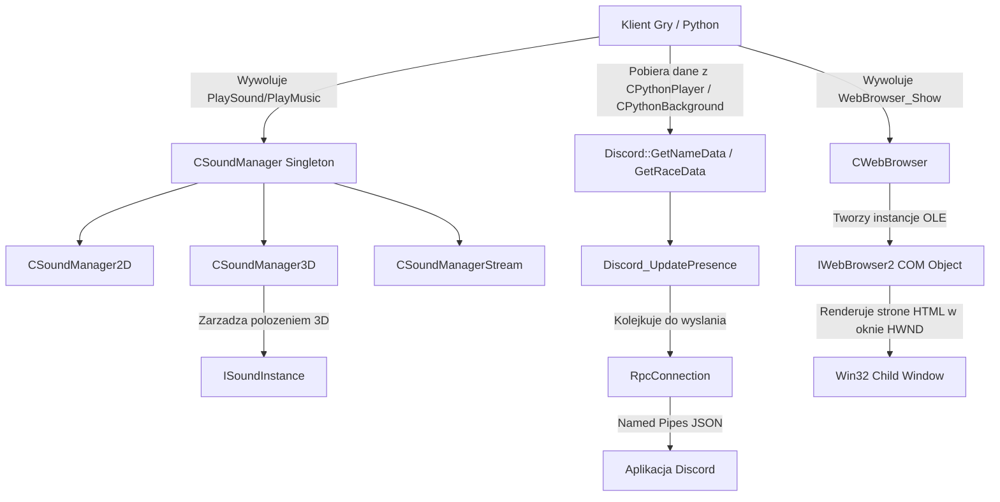

# Dokumentacja Podsystemu: MilesLib (Sound), Discord RPC oraz CWebBrowser

## 1. Cel Architektoniczny i Rola Modulu
Ten podsystem agreguje trzy rozne, lecz wazne elementy klienta gry:
- **MilesLib (SoundManager)**: Odpowiada za odtwarzanie dzwiekow SFX (2D/3D), muzyki w tle (BGM) oraz dzwiekow otoczenia (Ambience). Obsluguje pozycjonowanie 3D (skalowanie dystansu) oraz efekty plynnosci dzwieku (fade in/out). Opiera sie na silniku dzwiekowym (Miles Sound System) i wzorcu Singleton. Zaleznosci: biblioteki dzwiekowe oraz system VFS (do ladowania strumieni BGM).
- **Discord RPC**: Zarzadza wyswietlaniem aktywnosci gracza (Rich Presence) w komunikatorze Discord. Umozliwia przesylanie informacji o postaci (klasa, krolestwo) oraz o lokalizacji (nazwa mapy i kanalu). Dziala asynchronicznie poprzez wewnetrzne watki (IoThread) i wymienia dane po JSON przez RpcConnection. Zaleznosci: API Python (do pobierania danych gracza, np. `CPythonPlayer`), biblioteka JSON.
- **CWebBrowser**: Zapewnia renderowanie stron WWW wewnatrz okna DirectX poprzez osadzenie (OLE embedding) kontrolki Internet Explorera (IWebBrowser2). Zaleznosci: Win32 API, system COM/OLE (`OleInitialize`, `CoGetClassObject`).

## 2. Diagram Architektury i Przeplywu Danych (Mermaid)

## 3. Rejestr Struktur Danych i Pamieci (Memory & Struct Layout)

### MilesLib - SoundManager.h
- **enum EMusicState**: Okresla stan muzyki w tle.
  - `MUSIC_STATE_OFF = 0`
  - `MUSIC_STATE_PLAY = 1`
  - `MUSIC_STATE_FADE_IN = 2`
  - `MUSIC_STATE_FADE_OUT = 3`
  - `MUSIC_STATE_FADE_LIMIT_OUT = 4`
- **struct SMusicInstance (TMusicInstance)**: Stan instancji strumienia muzycznego. Brak specjalnego wyrownania.
  - `DWORD dwMusicFileNameCRC;` - CRC32 nazwy pliku.
  - `EMusicState MusicState;` - Obecny stan (enum).
  - `float fVolume;` - Biezaca glosnosc.
  - `float fLimitVolume;` - Docelowy limit glosnosci (dla fade).
  - `float fVolumeSpeed;` - Predkosc zmian glosnosci na ramke (domyslnie 0.016f).

### Discord RPC - rpc_connection.h / Discord.h
- **DCDATA**: `std::pair<std::string, std::string>` - przechowuje powiazane pary stringow (np. nazwa pliku obrazka i podpis z nim zwiazany).
- **struct RpcConnection::MessageFrameHeader**: Naglowek ramki wiadomosci RPC. Wyrownanie domyslne dla 32-bit.
  - `Opcode opcode;` (`uint32_t`) - Typ operacji (np. Handshake = 0, Frame = 1).
  - `uint32_t length;` - Dlugosc ramki danych.
- **struct RpcConnection::MessageFrame**: Rozszerza MessageFrameHeader o bufor.
  - `char message[MaxRpcFrameSize - sizeof(MessageFrameHeader)];` gdzie `MaxRpcFrameSize = 64 * 1024`.

### CWebBrowser - CWebBrowser.c
To klasyczne API typu C eksponujace funkcje bez struktur widocznych w naglowku. Kod dziala na globalnych statycznych uchwytach:
- `static HINSTANCE gs_hInstance;`
- `static HWND gs_hWndWebBrowser;`
- `static HWND gs_hWndParent;`

## 4. Rejestr Klas i Metod (API Reference)

### CSoundManager (Dziedziczy z CSingleton<CSoundManager>)
- **float __ConvertGradeVolumeToApplyVolume(int nVolumeGrade)**: Zamienia inty (od 1 do 5) na logarytmiczne skale volume wywolujac `__ConvertRatioVolumeToApplyVolume(nVolumeGrade/5.0f)`.
- **float __ConvertRatioVolumeToApplyVolume(float fRatioVolume)**: Zwraca logarytmiczna glosnosc. Jesli ratio < 0.1, to bez zmian, powyzej robi `pow(10.0f, (-1.0f + fRatioVolume))`.
- **void PlaySound3D(float fx, float fy, float fz, const char * c_szFileName, int iPlayCount)**: Rejestruje plik przez `ms_SoundManager3D.SetInstance`, po czym pobiera z niego instancje. Wylicza wektor polozenia zalezny od `m_fxPosition`, `m_fyPosition`, `m_fzPosition` podzielonych przez `m_fSoundScale`, aplikuje glosnosc i uruchamia dzwiek na ilosc zapetlen (`iPlayCount`).
- **void PlayCharacterSound3D(...)**: Ma flage `bCheckFrequency`. Jesli jest wlaczona, a kwadrat dystansu (X, Y) do gracza przekracza `5000*5000`, funkcja odrzuca zgloszenie. Zabezpiecza takze przed czestotliwoscia wywolan tego samego pliku co najmniej 0.3 sekundy z wykorzystaniem `m_PlaySoundHistoryMap` i aktualnego czasu z `CTimer`.
- **void FadeInMusic / FadeOutMusic / FadeLimitOutMusic**: Zmienia `MusicState` odpowiedniego indexu w tablicy `m_MusicInstances` na wlasciwy typ i ustawia `fVolumeSpeed` modyfikatora przejsc.
- **void SaveVolume() / RestoreVolume()**: Tryb wyciszenia tymczasowego, np. przy minimizacji gry (`m_isSoundDisable`). Backupowane sa ustawienia uzytkownika a volume wymuszany na 0.

### Discord
- **DCDATA GetNameData()**: Otrzymuje przez `CPythonBackground::Instance().GetWarpMapName()` nazwe mapy, mapuje ja recznie dla podstawowych miast (np. 'metin2_map_a1' -> 'Yongan'). Dolacza takze imie gracza i gildie, generujac pary (Mapa, Postac-Gildia).
- **DCDATA GetRaceData()**: Zwraca pare: obrazek `race_<id>` oraz nazwe klasy ('Warrior', 'Assassin', 'Sura', 'Shaman', 'Lycan').
- **DCDATA GetEmpireData()**: Zwraca pare: obrazek `empire_<id>` oraz nazwe krolestwa ('Shinsoo', 'Chunjo', 'Jinno').
- **extern "C" void Discord_Initialize(...)**: Eksportowana na swiat z `discord_rpc.cpp`, inicjalizuje logike, tworzy pamieci pod polaczenie (`RpcConnection::Create`) i wola `IoThread->Start()`.
- **extern "C" void Discord_UpdatePresence(const DiscordRichPresence* presence)**: Formatuje strukture presence do JSON, zaklada lock na `PresenceMutex` i zglasza zadanie do kolejki. Thread asynchronicznie wrzuci to przez `RpcConnection::Write`.
- **extern "C" void Discord_RunCallbacks()**: Cyklicznie uruchamiana przez glowny watek aplikacji. Sprawdza co przyszlo od serwera Discord (np. Requesty o dolaczenie, Ready, Disconnect) i wykonuje zarejestrowane wskazniki na funkcje.

### WebBrowser
- **int WebBrowser_Startup(HINSTANCE hInstance)**: Odpala COM (`OleInitialize`) i rejestruje globalna klase okna `WEBBROWSER_CLASSNAME` z wlasnym callbackiem `WebBrowser_WindowProc`.
- **int WebBrowser_Show(HWND parent, const char* addr, const RECT* rcWebBrowser)**: Weryfikuje istnienie. Tworzy sub-okno OLE za pomoca `CreateWindowEx`. Otwiera podana strone docelowa (addr). Uzywane glownie pod ItemShop i inne eventowe okienka InGame.
- **LRESULT CALLBACK WebBrowser_WindowProc(...)**: Przechwytuje np. `WM_CREATE` gdzie wolana jest funkcja narzedziowa `EmbedBrowserObject(hwnd)` instancjonujaca klase `IWebBrowser2` via `CoGetClassObject`.

## 5. Punkty Styku (Cross-Subsystem Integration)
- **Zaleznosc od Systemu Sceny i Kamery**: MilesLib pobiera przez `SetPosition` i `SetDirection` wektory ze srodowiska kamery DirectX. Wszystkie instancje dzwiekow 3D sa skalowane odpowiednio `m_fSoundScale` wzgledem pozycji tych zmiennych by uwzglednic metryczne pozycje w grze.
- **Zaleznosc Python Player/Background (Discord)**: Modul w pliku `Discord.h` zalezy od stanow Singletonow z Pythona: `CPythonPlayer` (dla identyfikatora i imienia), `CPythonBackground` (do identyfikowania id mapy), `CPythonCharacterManager` (dla glownej instancji - klasa, krolestwo).
- **Zaleznosc sieciowa i OLE (CWebBrowser)**: Funkcja web w calosci opiera sie o srodowisko zewnetrznego interpretera IE OLE co powoduje wspoldzielenie pakietow sieciowych (HTTP) z zewnetrznymi bilbiotekami MS w tym samym watku komunikacyjnym, wymagajac zainicjalizowania Ole API.

## 6. Pulapki, Antywzorce i Ograniczenia
- **Silnik IE w CWebBrowser**: `IWebBrowser2` opiera sie czesto o archaiczne silniki IE. Trzeba zadbac o klucze w rejestrze typu `FEATURE_BROWSER_EMULATION` aby strona nie renderowala sie w trybie IE7. Ponadto system web przegladarki nie obsluguje natywnie wlasnych zdarzen DirectX okna nakladki, co czesto prowadzi do bledow interfejsu (bleeding kontrolek OLE nad HUD gry).
- **Ograniczenia odleglosci w MilesLib**: `PlayCharacterSound3D` ucina dystans hardcodowana wartoscia kwadratu odleglosci `5000*5000` (`s_fLimitDistance`). Dodatkowo naklada reczny debouncer (0.3s) sprawdzany iteratorem po c-stringu w mapie co moze byc malo optymalne jesli adres char* z API pochodzi z buforow tymczasowych bez alokacji (`std::map<std::string, float>`). Wypadaloby czyscic mape aby nie rosnac na starych wpisach.
- **Zagrozenia wielowatkowosci (Discord)**: Rpc connection zarzadza blokadami na zewnetrznym watku (IoThread) oraz watek glowny. Opiera sie na mutexach i stalych kolejkach. Zaniedbanie wywolan `Discord_RunCallbacks()` blokuje czyszczenie kolejki i asynchroniczna obsluge wejsc.
- **Skala muzyki TMusicInstance i brak zwalniania c-string**: Przechowuje stan BGM, ale brak tu zaawansowanego algorytmu zarzadzania glosnoscia bazujacym na plynnych krzywych (Fade). Uzywa liniowego przelicznika predkosci zmian `fVolumeSpeed`, przez co fade wydaje sie skokowy, a nie akustycznie zbalansowany.
