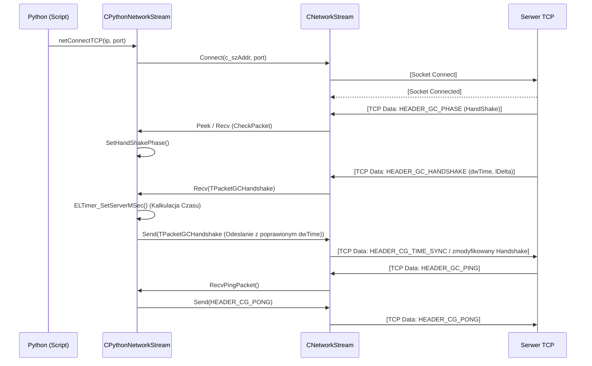

# Dekonstrukcja CPythonNetworkStream: Rdzen Gniazda TCP i Faza Handshake

## 1. Cel Architektoniczny i Rola Modulu
Klasa `CPythonNetworkStream` stanowi glowne ogniwo komunikacyjne miedzy klientem gry (warstwa logiki i UI) a serwerem (logowanie, wybor postaci, sama gra). Jest ona rozwinieciem bazowej klasy `CNetworkStream` (nalezacej do biblioteki EterLib), dodajac specyficzna logike protokolu klienta (fazy, autoryzacja, mechanizmy time-sync, handshake).

- **Odpowiedzialnosc bazowa (`CNetworkStream`)**: Niskopoziomowa obsluga gniazda TCP, asynchroniczne i nieblokujace przesylanie buforow (`m_recvBuf`, `m_sendBuf`), szyfrowanie (TEA / ulepszone szyfrowanie z wykorzystaniem biblioteki Crypto++ m.in Diffie-Hellman), pakietowanie zgodne ze statycznym lub dynamicznym rozmiarem naglowka.
- **Odpowiedzialnosc wysokopoziomowa (`CPythonNetworkStream`)**: Abstrakcja dla warstwy Python, mapowanie zdarzen serwera (np. odswiezanie UI) na odpowiednie hooki, utrzymanie stanu rozgrywki (tzw. "Fazy": OffLine, HandShake, Login, Select, Loading, Game). Faza HandShake (uzywajaca pakietu `HEADER_GC_HANDSHAKE` i pakietu `HEADER_GC_BINDUDP`) pozwala na synchronizacje czasu lokalnego ze strefa serwera oraz przesylanie poczatkowych kluczy kryptograficznych (w przypadku pakietow `HEADER_GC_HYBRIDCRYPT_KEYS`).

## 2. Diagram Architektury i Przeplywu Danych (Mermaid)
Ponizszy diagram obrazuje przeplyw danych w fazie inicjalizacji i Handshake.

## 3. Rejestr Struktur Danych i Pamieci (Memory & Struct Layout)

Struktury w ukladzie pamieci uzywane przez sieciowe gniazda:

### Struktura: `TPacketGCHandshake` (Z pliku `Packet.h`)
Reprezentuje informacje przesylane podczas synchronizacji czasu pomiedzy klientem a serwerem.
- `BYTE header`: (1 bajt) Oznaczenie operacji, np. `HEADER_GC_HANDSHAKE` (0xFF).
- `DWORD dwHandshake`: (4 bajty) Unikalny numer iteracji badz identyfikatora handshake'u.
- `DWORD dwTime`: (4 bajty) Aktualny czas na serwerze (w milisekundach).
- `LONG lDelta`: (4 bajty) Opoznienie / delta czasowa (moze byc ujemna, dlatego LONG).
- **Rozmiar calkowity**: 13 bajtow (Brak jawnego wyrownywania pamieci/packingu za pomoca pragma, standardowe wyrownanie C++ bedzie obejmowac padding miedzy byte a dword, zazwyczaj osiagajac 16 bajtow).

### Struktura pomocnicza w `CPythonNetworkStream`: `SServerTimeSync`
Struktura sluzaca do plynnego zapisu czasu serwerowego.
- `DWORD m_dwChangeServerTime`: Czas serwera zapisany w chwili handshake'a.
- `DWORD m_dwChangeClientTime`: Czas lokalny klienta `ELTimer_GetMSec()` w chwili handshake'a.

### Klasa CNetworkStream
Zawiera obiekty uzywane w bazowym procesie TCP:
- `m_recvBuf`, `m_recvTEABuf` (bufory pamieci, rozszerzane do wielokrotnosci 8 dla algorytmu TEA `m_recvTEABufSize = ((m_recvBufSize>>3)+1)<<3;`).
- `m_sendBuf`, `m_sendTEABuf` (bufory pamieci dla operacji wysylania, analogiczny przydzial).

### Enumy Fazy:
- `PHASE_WINDOW_LOGO`
- `PHASE_WINDOW_LOGIN`
- `PHASE_WINDOW_SELECT`
- `PHASE_WINDOW_CREATE`
- `PHASE_WINDOW_LOAD`
- `PHASE_WINDOW_GAME`
- `PHASE_WINDOW_EMPIRE`

## 4. Rejestr Klas i Metod (API Reference)

### CNetworkStream (Bazowa)
- `bool CNetworkStream::Connect(const char* c_szAddr, int port, int limitSec)`
  **Logika:** Tworzy gniazdo TCP (non-blocking). Ustala `m_connectLimitTime` aby w razie timeoutu rozlaczyc klienta. Konfiguruje bufory obiorcze.
- `bool CNetworkStream::__RecvInternalBuffer()`
  **Logika:** Bezposrednie pobranie danych z socketu TCP (`recv` WINAPI). Jesli dane przyszly, przenosi `m_recvBufOutputPos` oraz odszyfrowuje dane w locie z uzyciem kluczy m_szDecryptKey jezeli wlaczony jest `m_isSecurityMode` (badz ulepszony system Crypto++).
- `bool CNetworkStream::CheckPacket(TPacketHeader * pRetHeader)` (Uzyte przez klase podrzedna)
  **Logika:** Korzysta z `CNetworkPacketHeaderMap` by dynamicznie zidentyfikowac rozmiar pakietu (dynamiczny vs statyczny wielkosciowy - `isDynamicSizePacket`). 

### CPythonNetworkStream (Kontekst Fazy Handshake)
- `void CPythonNetworkStream::HandShakePhase()`
  **Logika:** Glowne wejscie w kontekscie pakietow TCP. 
  1. Pobiera header uzywajac `CheckPacket`.
  2. Sprawdza naglowek: 
     - `HEADER_GC_PHASE`: zmienia na nastepna faze
     - `HEADER_GC_HANDSHAKE`: uruchamia synchronizacje (pobiera pakiet, sumuje czas `m_HandshakeData.dwTime + m_HandshakeData.lDelta`, po czym nadpisuje dane z uzyciem `ELTimer_SetServerMSec()` by zaaplikowac delte i odsyla spowrotem do serwera zmodyfikowany pakiet jako test / odpowiedz synchronizacyjna).
     - `HEADER_GC_PING`: Wywoluje `RecvPingPacket()`.
     - `HEADER_GC_HYBRIDCRYPT_KEYS` / `HEADER_GC_HYBRIDCRYPT_SDB`: Akceptuje klucze oraz bazy SDB (Security Data Blocks) EterPack Managera, uzywajac wielkosci zmiennej naglowka dynamicznego (DynamicSizePacketHeader).
- `void CPythonNetworkStream::SetHandShakePhase()`
  **Logika:** Odpina funkcje poprzedniej fazy (`m_phaseLeaveFunc.Run()`), podpina procesowanie zdarzen fazy handshake'a: `m_phaseProcessFunc.Set(this, &CPythonNetworkStream::HandShakePhase)`. Zawiadamia Pythona przez metode wirtualnego okna `PyCallClassMemberFunc(m_apoPhaseWnd[PHASE_WINDOW_LOGIN], "OnHandShake", Py_BuildValue("()"))`.
- `bool CPythonNetworkStream::RecvPingPacket()`
  **Logika:** Odczytuje ping (od serwera), ustala tick-rate ping'u lokalnie (`m_dwLastGamePingTime = ELTimer_GetMSec()`) i odpowiada za pomoca naglowka `HEADER_CG_PONG` wykorzystujac standardowy wysyl `Send()`. Zabezpieczenie Sequence (`m_bUseSequence`) sprawdza tu sekwencje jesli wymagana.

## 5. Punkty Styku (Cross-Subsystem Integration)

- **Powiazanie z Pythonem**: API narazane w `PythonNetworkStreamModule.cpp` tworzy bridge miedzy C++ a Pythonem: `netConnectTCP` umozliwia zainicjowanie komunikatu z ip. Integracje uzywaja makr Pythona (np. `Py_BuildValue`, `PyTuple_GetInteger`) by parsowac argumenty przeslane bezposrednio z `loginwindow.py` czy `introLogin.py`. Callbacks sa uzywane by przekierowac wykonanie eventu handshake poprzez wirtualne interfejsy faz, w tym np `OnHandShake()`.
- **Powiazanie z Systemem Czasu**: Zaleznosc od `ELTimer` z biblioteki `EterBase`. Zmienne czasowe w procesie ping-pong oraz handshake wplywaja w 100% na synchronizacje efektow w grze. Opoznienie pomiedzy `ELTimer_GetMSec()` a `dwTime` z serwera definiuje czy gracz ma lagi i jak przewidywac fizyke ruchu z uwzglednieniem animacji.
- **Bezpieczenstwo - Cryptography/Hackshield/XTrap**: Wewnatrz obslugi HandshakePhase istnialy historycznie pakiety odbierajace informacje odnosnie kluczy hybrydowych EterPack (`RecvHybridCryptKeyPacket`). Plik `PythonNetworkStreamPhaseHandShake.cpp` wspiera tez zadania X-Trap oraz HackShield (`RecvHSCheckRequest`, `RecvXTrapVerifyRequest`), wymuszajac na kliencie odeslanie prawidlowego, zwalidowanego hasha (AhnHS_MakeResponse) w przeciwnym razie powodujac przymusowy disconnect w razie ataku pamieci.
- **Powiazanie z DirectX (CUIWindow)**: Modul mial rowniez powiazania bezposrednie z markerem Discorda i UI - przejscia miedzy fazami aktywujace `Discord_Update(false / true)`.

## 6. Pulapki, Antywzorce i Ograniczenia

1. **Struktury pakietow (Alignment / Packing Issues)**: `TPacketGCHandshake` w `Packet.h` nie posiada pragma `pack(1)`, przez co 32-bitowy kompilator VS vs nowy kompilator moga dokonywac paddingu miedzy BYTE a DWORD, generujac potencjalne problemy jezeli serwer (np oparty na BSD i gcc 4.9+ z `pack(1)`) skompiluje te sama strukture na wielkosc 13 byte a nie 16. Jest to bardzo wazny punkt przy aktualizacji klienta.
2. **Desynchronizacja Handshake (`CTimer::Instance().SetBaseTime()`)**: Podwojne modyfikowanie czasu `m_HandshakeData.dwTime = m_HandshakeData.dwTime + m_HandshakeData.lDelta + m_HandshakeData.lDelta` ma na celu przewidzenie trasy Round-Trip (RTT). Gdy ping wynosi duzo powyzej 500ms kalkulacja lDelta prowadzi do skrajnego over-compensation i ruch jednostek lokalnych staje sie szarpany. 
3. **Nieefektywnosc TEA Buffer Allocation (`NetStream.cpp`)**: Algorytm TEA obrabia bloki 8 bajtowe. Alokacja bufora ma wzor: `m_recvTEABufSize = ((m_recvBufSize>>3)+1)<<3`. Bufor ulega calkowitej wymianie przy wywolaniu `SetSendBufferSize` (wywoluje `delete [] m_sendBuf` w ulamku sekundy), ryzykujac fragmentacja sterty przy czestych relokacjach przez system.
4. **Brak Timeoutu na Faze Handshake**: Nie ma wyraznego ogranicznika czasu (State Machine Timer) ktory po uplywie 10 sekund zamykalby polaczenie jesli serwer zwiesilby sie na etapie handshake (jedynie `ConnectLimitSec` dba o zestawienie sesji TCP, lecz nie chroni to przed pol-otwartymi gniazdami w ktorych faza `HandShake` wisi permanentnie).
