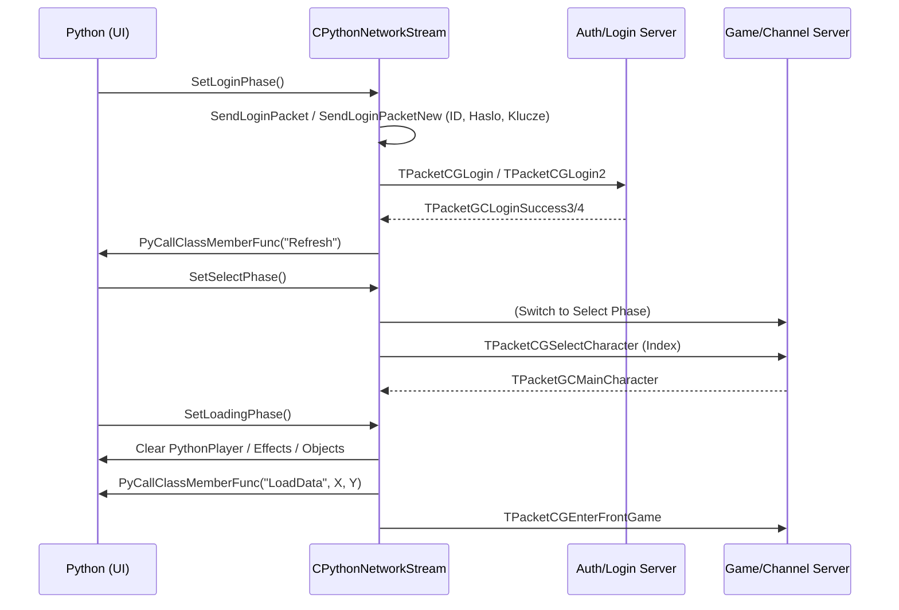

# CPythonNetworkStream: Faza Logowania, Wyboru Postaci i Ladowania

## 1. Cel Architektoniczny i Rola Modulu

`CPythonNetworkStream` to glowny zarzadca komunikacji sieciowej w kliencie gry, podzielony wewnetrznie na mechanike stanow (faz - *phases*). Niniejsza dokumentacja obejmuje fazy:
- **LoginPhase (`SetLoginPhase`, `LoginPhase`)**: Obsluga logowania konta, przesylanie poswiadczen (ID, haslo), ewentualna sprzetowa autoryzacja (Matrix/Passpod) oraz wymiana kluczy autoryzacyjnych na serwerze logowania.
- **SelectPhase (`SetSelectPhase`, `SelectPhase`)**: Operacje w obrebie wyboru postaci (tworzenie, kasowanie, zmiana nazwy), wyboru krolestwa i obior pelnej listy postaci przypisanych do konta po udanym logowaniu.
- **LoadingPhase (`SetLoadingPhase`, `LoadingPhase`)**: Rejestrowanie podstawowych danych na temat wlasnej postaci (VID, profesja, koordynaty) z serwera po wybraniu postaci, co odpala logike wczytywania zasobow mapy, interfejsu (UI) i wlasciwego zaladowania rozgrywki.

### Zaleznosci:
- **Python**: Interfejsy uzytkownika, graficzne wywolania, zmiany stanow gry (m.in. `PyCallClassMemberFunc`).
- **Cryptographic/EterPack**: Operacje hybrydowej kryptografii klienta, modyfikacja naglowkow oraz wymiana kluczy z uzyciem implementacji hybrydowych.
- **CAccountConnector**: Uzywane glownie w LoginPhase do czyszczenia w pamieci podanego hasla, bez jego przetrzymywania.
- **Packet.h**: Podstawowe struktury dla wczesnego logowania, autoryzacji (RSA, XTEA), opcjonalnie `_IMPROVED_PACKET_ENCRYPTION_`.

## 2. Diagram Architektury i Przeplywu Danych (Mermaid)

## 3. Rejestr Struktur Danych i Pamieci (Memory & Struct Layout)

Ponizej glowne struktury analizowane w powyzszych fazach (zdefiniowane zwykle w `Packet.h` i modyfikowane przez opkody, obslugiwane przez stream).

- `TPacketCGLogin` / `TPacketCGLogin2`: Pakiet autoryzacyjny wysylany do serwera logowania. `TPacketCGLogin2` dodatkowo implementuje 4-elementowe tablice kluczy szyfrujacych i deszyfrujacych `adwClientKey` oraz id logowania `login_key`. Zawieraja `char name[ID_MAX_NUM+1]` oraz `char pwd[PASS_MAX_NUM+1]`.
- `TPacketGCLoginSuccess3` / `TPacketGCLoginSuccess4`: Pakiety zawierajace tabele postaci. `akSimplePlayerInformation` zawiera 3 lub 4 rekordy na koncie, wraz z `guild_id` i `guild_name` (wszystkie bajtowo zrownane wg standardow `Packet.h`). Posiada takze informacje autoryzacyjne w obrebie gildii (np. `handle` i `random_key`).
- `TPacketGCLoginFailure`: Zwraca string `szStatus`, opisujacy blad logowania przesylany do Pythona.
- `TPacketCGEmpire`: Pakiet z bajtem (BYTE) identyfikujacym id imperium (1-3).
- `TPacketCGSelectCharacter`: Pakiet `HEADER_CG_PLAYER_SELECT` wysylajacy `BYTE player_index` uzywany do autoryzacji wyboru postaci.
- `TPacketCGCreateCharacter` / `TPacketCGDestroyCharacter`: Definiuja parametry zakladania i kasowania postaci (`job`, `shape`, `CON`, `INT`, `STR`, `DEX` dla kreacji i `szPrivateCode` 7-znakowe dla usuwania postaci).
- `TPacketGCMainCharacter` (oraz jego warianty 2, 3, 4): Pakiety przesylane w `LoadingPhase`. `dwVID` to 32-bitowe unikalne ID actora glownego gracza, `wRaceNum` to klasa, `lX` i `lY` okreslaja wektor koordynatow docelowych postaci. Warianty rozszerzaja sie o byEmpire (ID Imperium) czy muzyke mapy (BGMName).

## 4. Rejestr Klas i Metod (API Reference)

### Faza Login (`CPythonNetworkStreamPhaseLogin.cpp`)

- `void CPythonNetworkStream::SetLoginPhase()`
  **Opis:** Inicjalizacja fazy Login. Pobiera klucz autoryzacji (z `LocaleService`), deleguje przypisanie stanow `LoginPhase` jako procesor w `m_phaseProcessFunc`. Wymusza wyslanie pakietu zewnetrznego (ID/Haslo), a nastepnie natychmiast czysci podane haslo z pamieci operacyjnej z wykorzystaniem `CAccountConnector::ClearLoginInfo()`. Powiadamia Pythonowe okno `PHASE_WINDOW_LOGIN` o starcie funkcji `OnLoginStart`.

- `void CPythonNetworkStream::LoginPhase()`
  **Opis:** Funkcja petli glownej analizujaca po stronie maszyny stanow kazdy przychodzacy pakiet z Socketow w oparciu o ich naglowki (Header). Zawiera glownie obsluge autoryzacji: Matrix, Passpod, pobranie kluczy, sukces logowania, blad logowania oraz obsluge szyfrowania hybrydowego (`HEADER_GC_HYBRIDCRYPT_KEYS`, `HEADER_GC_HYBRIDCRYPT_SDB`).

- `bool CPythonNetworkStream::SendLoginPacketNew(const char * c_szName, const char * c_szPassword)`
  **Opis:** Przygotowuje strukture `TPacketCGLogin2`. Uzupelnia ID, ale zewnetrznie generowane klucze `g_adwEncryptKey` wysyla do serwera. Wykonuje `SendSequence()` po czym wlacza natywny tryb bezpieczny kryptografii XTEA (jezeli makro `_IMPROVED_PACKET_ENCRYPTION_` nie nadpisuje logiki autorskiej szyfracji).

- `bool CPythonNetworkStream::__RecvLoginSuccessPacket4()`
  **Opis:** Odczytuje liste postaci dla danego konta (`PLAYER_PER_ACCOUNT4`). Zapamietuje zwrocone `guild_id`, `guild_name` i informacje na temet profili do `m_akSimplePlayerInfo`. Na koniec powiadamia Python (`PHASE_WINDOW_SELECT`), ze ma odswiezyc widoki uzywajac `PyCallClassMemberFunc(..., "Refresh", ...)`.

### Faza Select (`CPythonNetworkStreamPhaseSelect.cpp`)

- `void CPythonNetworkStream::SetSelectPhase()`
  **Opis:** Aktywuje logike fazy Select. Zalezne od trybu bezposredniego wejscia (`__DirectEnterMode_IsSet()`), automatycznie przelacza do ladowania mapy lub - w trybie standardowym - powiadamia Python do odpalenia fazy zarzadzania oknem krolestwa (`SetSelectEmpirePhase`) lub wyborem postaci (`SetSelectCharacterPhase`), o ile imperium (Krolestwo) jest zdefiniowane.

- `bool CPythonNetworkStream::SendCreateCharacterPacket(BYTE index, const char *name, BYTE job, BYTE shape, BYTE byCON, BYTE byINT, BYTE bySTR, BYTE byDEX)`
  **Opis:** Tworzy w pakiecie parametry wejsciowe i statystyki poczatkowe postaci po zakodowaniu ich w `TPacketCGCreateCharacter`. Wymaga autoryzacji indeksu postaci. Wysyla `SendSequence()`. 

- `bool CPythonNetworkStream::__RecvPlayerCreateSuccessPacket()`
  **Opis:** Odbiera pakiet powiadamiajacy, ze serwer zatwierdzil budowe konta. Dodaje od razu ta nowa postac do tablicy `m_akSimplePlayerInfo[kCreateSuccessPacket.bAccountCharacterSlot]` a pozniej odpala event Pythona `OnCreateSuccess` w oknie `PHASE_WINDOW_CREATE`. Wykonuje walidacje czy slot w pakiecie nie przekracza `PLAYER_PER_ACCOUNT4` (zabezpieczenie out-of-bounds).

- `bool CPythonNetworkStream::__RecvPlayerDestroySuccessPacket()`
  **Opis:** Usuniecie postaci ze slotu z uwzglednieniem jej czyszczenia (`memset`) w lokalnym buforze `m_akSimplePlayerInfo` oraz zresetowaniem struktury gildii (ID = 0). Komunikuje event `OnDeleteSuccess` w Pythonie.

### Faza Loading (`CPythonNetworkStreamPhaseLoading.cpp`)

- `void CPythonNetworkStream::SetLoadingPhase()`
  **Opis:** Ekran "wczytywania mapy" pomiedzy wyborem postaci a wejsciem do gry (faza z paskiem postepu w UI). Inicjalizuje zresetowanie postaci poprzez `CPythonPlayer::Instance().Clear()`. Purguje cala 3D fizyke (`CFlyingManager`) oraz efekty wizualne (`CEffectManager`), by zapewnic czysty stan silnika. Nastepnie odpala petle stanow fazy ladownia.

- `bool CPythonNetworkStream::RecvMainCharacter()` (oraz warianty z BGM i EMPIRE)
  **Opis:** Kluczowe pakiety definujace glowna postac. Odbiera ID (VID) z gry, podaje ID Krolestwa, podaje plik `.mp3` background music (`__SetFieldMusicFileName`). Ustala nazwe glownego actora poprzez `CPythonPlayer::Instance().SetName()`. Dodatkowo wymusza renderowanie i pobranie swiata wysylajac informatywne dane w `PyCallClassMemberFunc("LoadData", lX, lY)` o kordynatach lX, lY do wykreowania mini-mapy czy pobierania elementow otoczenia z VFS. Wysyla takze wersje klienta do serwera (`SendClientVersionPacket()`).

- `bool CPythonNetworkStream::SendEnterGame()`
  **Opis:** Przygotowuje i rozsyla zapytanie `HEADER_CG_ENTERGAME` (rozpoczynajace pelny wjazd glownego Avatara do silnika fazy gry, przejscie ze statusu _Loading_ na _Game_). Dodatkowo flushuje wenetrzne bufory sieciowe `__SendInternalBuffer()`.

## 5. Punkty Styku (Cross-Subsystem Integration)

1. **Python i UI**: Zbudowano glebokie zaleznosci za pomoca `PyCallClassMemberFunc`. Uzyto okien: `PHASE_WINDOW_LOGIN`, `PHASE_WINDOW_SELECT`, `PHASE_WINDOW_CREATE` oraz `PHASE_WINDOW_LOAD`. Pakiety sukcesow przesylane sa zawsze zwrotnie do skryptow (.py), by odrysowywac elementy (np. odswiezanie slotow przez `.Refresh()`).
2. **Kryptografia (EterPack/Security)**: Logowanie zintegrowane jest w modelu autoryzacji serwera po przez `LocaleService_GetSecurityKey` oraz pakiety wymiany kluczy kryptograficznych `_IMPROVED_PACKET_ENCRYPTION_` w razie obecnosci zaawansowanego algorytmu hybrydowego (`HEADER_GC_HYBRIDCRYPT_KEYS`).
3. **Menedzery Stanow (EterBase / CPythonPlayer)**: Wszystkie fazy logowania korzystaja z CAccountConnector (czyszczenie passow) dla prewencji, oraz czyszcza silniki renderowania efektow w GameLib (`CEffectManager`, `CFlyingManager`) w ladowaniu fazowym dla bezpiecznej alokacji pamieci nowej mapy. CPythonPlayer przechowuje statystyki i VID od razu po przeslaniu listy postaci.

## 6. Pulapki, Antywzorce i Ograniczenia

1. **Haslo w Logach i Pamieci**: Haslo (pwd) mimo wywolywania `ClearLoginInfo()` i memset, przez krotki czas i tak przebywa niezaszyfrowane w samej strukturze `TPacketCGLogin` przed wysylaniem w buffor Socketow. Moze to prowadzic do problemu Memory Dump Attack przed wykonaniem procedury szyfrowania w strumieniu pamieci pakietow.
2. **Rozmiary Tablic**: Rozmiar `m_akSimplePlayerInfo` czesto sztywnie jest ustawiany jako `PLAYER_PER_ACCOUNT3` lub `4`, w zaleznosci od wersji logowania (metoda V3 vs V4). Jesli serwer zaktualizuje tablice o np. 5 postac (slot wariant), w przypadku wylapania na kliencie doprowadzi do `TraceError` (co jednak oprogramowano w `__RecvPlayerCreateSuccessPacket`), ale moze powodowac ucieczki pamieci gdy indeks out of bounds nie zostanie skontrolowany w samej metodzie `OnCreateSuccess` w samym interfejsie Pythona (gdzie python nadal odniesie sie np do slotu 5, chociaz w kliencie to zablokowano).
3. **Synchronizacja Kluczy Szyfrujacych (`_IMPROVED_PACKET_ENCRYPTION_`)**: Podczas `SendLoginPacketNew` uzywana jest globalna stala `g_adwEncryptKey` i `g_adwDecryptKey`. Jesli wystapi desynchronizacja naglowka pingu lub reczna renegocjacja klucza zawiedzie przed polaczeniem TCP z nowym portem GameServera podczas `SelectPhase`, klient sie natychmiast zrywa badz zapetla bledy pakietow az zerwie TimeOut-em.
