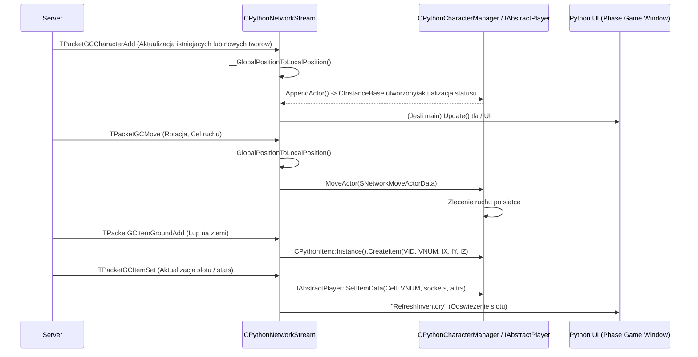

# CPythonNetworkStream: Faza Gry - Aktorzy, Ruch i Przedmioty

## 1. Cel Architektoniczny i Rola Modulu
Podsystem odpowiedzialny za przetwarzanie pakietow sieciowych (odbieranie od serwera) dla kluczowych elementow symulacji swiata gry, takich jak instancje aktorow (gracze, NPC, potwory), obsluga ich ruchu i animacji oraz operacji zwiazanych z przedmiotami w swiecie gry i w ekwipunku (dodawanie do plecaka, wyrzucanie, uzywanie, pojawianie sie na mapie jako lupy). Glowna funkcjonalnosc polega na rozpakowywaniu danych z bufora sieciowego (`Recv`), synchronizacji tych danych z lokalnymi managerami obiektow takimi jak `CPythonCharacterManager` i `CPythonItem` oraz wyzwalaniu interfejsu graficznego i odpowiednich animacji przez wywolania metod UI w Pythonie. 

Ten system pelni role mostu: synchronizuje lokalny stan swiata klienta z autorytatywnym stanem na serwerze i propaguje zmiany w swiecie gry do struktur danych oraz do interfejsu.

### Zaleznosci:
- **Wykorzystuje moduly:** 
    - EterBase, m.in. operacje na plikach, abstrakcja streamu. 
    - `CPythonCharacterManager` (z GameLib) do rejestrowania i aktualizowania `CInstanceBase` oraz obslugi siatek kolizji (aktorzy, moby).
    - `CPythonItem` do zarzadzania instancjami przedmiotow podnoszonych z ziemi.
    - `IAbstractPlayer` (centralny gracz) do synchronizacji informacji o glownej postaci.
    - `CPythonMiniMap` / `CPythonBackground` (do rejestrowania widocznosci gildii/ziemi na mapie, efektow scenerii).
    - Python (poprzez `PyCallClassMemberFunc`) do zarzadzania wydarzeniami na poziomie UI (np. powiadomienie o braku miejsca w ekwipunku).

## 2. Diagram Architektury i Przeplywu Danych (Mermaid)

## 3. Rejestr Struktur Danych i Pamieci (Memory & Struct Layout)

Struktury definiuja format pakietow przychodzacych od serwera (z pliku `Packet.h`). Kazda struktura musi byc parsowana bajt po bajcie za pomoca `Recv`. Wyrownanie jest wazne ze wzgledu na zgodnosc w systemie sieciowym. (domyslne wyrownanie MSVC `#pragma pack(1)` dla plikow sieciowych, co nalezy zakladac).

* `TPacketGCCharacterAdd` - Tworzenie / dodanie aktora
  - `BYTE header;` (naglowek pakietu: HEADER_GC_CHARACTER_ADD = 1)
  - `DWORD dwVID;` (unikalne ID wirtualne aktora)
  - `float angle;` (kat patrzenia / obrot)
  - `long x, y, z;` (wspolrzedne globalne)
  - `BYTE bType;` (typ bytu: gracz, mob, npc)
  - `WORD wRaceNum;` (VNUM potwora lub klasa postaci)
  - `BYTE bMovingSpeed;` (szybkosc ruchu)
  - `BYTE bAttackSpeed;` (szybkosc ataku)
  - `BYTE bStateFlag;` (stany nakladajace sie, np bity oznaczajace atak/ruch)
  - `DWORD dwAffectFlag[2];` (maska flag efektow wizualnych/statystycznych, np poison, stun)
  *(Wystepuje rowniez rozszerzona wersja `TPacketGCCharacterAdd2` z dodatkami na czesci wyposazenia, gildie, mounty).*

* `TPacketGCCharacterUpdate` - Aktualizacja stanow istniejacego aktora
  - `BYTE header;` (HEADER_GC_CHARACTER_UPDATE = 19)
  - `DWORD dwVID;` 
  - `WORD awPart[CHR_EQUIPPART_NUM];` (czesci wyposazenia: pancerz, bron, wlosy itp.)
  - `BYTE bMovingSpeed;` 
  - `BYTE bAttackSpeed;`
  - `BYTE bStateFlag;`
  - `DWORD dwAffectFlag[2];`
  - `DWORD dwGuildID;` (ID gildii)
  - `short sAlignment;` (punkty rangi)
  - `BYTE bPKMode;`
  - `DWORD dwMountVnum;` (VNUM zwierza wierzchowego)

* `TPacketGCMove` - Pakiet ruchu aktora po mapie
  - `BYTE bHeader;` (HEADER_GC_CHARACTER_MOVE = 3)
  - `BYTE bFunc;` (funkcja ruchu: MOVE_FUNC_MOVE, MOVE_FUNC_STOP)
  - `BYTE bArg;`
  - `BYTE bRot;` (obrot przeskalowany do 255. Mnozony przez 5.0f w kliencie)
  - `DWORD dwVID;` (kto sie rusza)
  - `LONG lX, lY;` (nowe koordynaty / cel)
  - `DWORD dwTime;` (czas synchronizacji / stempel)
  - `DWORD dwDuration;` (czas animacji / przejscia trasy)

* `TPacketGCItemSet` - Ustawienie parametrow itemu w ekwipunku / oknie
  - `BYTE header;` (HEADER_GC_ITEM_SET = 20/21)
  - `TItemPos Cell;` (Window ID oraz numer komorki)
  - `DWORD vnum;` (ID przedmiotu)
  - `BYTE count;` (ilosc)
  - `long alSockets[ITEM_SOCKET_SLOT_MAX_NUM];` (wartosci wprawionych kamieni)
  - `TPlayerItemAttribute aAttr[ITEM_ATTRIBUTE_SLOT_MAX_NUM];` (statystyki z bonow 1-5, typ i wartosc)

* `TPacketGCItemGroundAdd` - Upuszczenie przemiotu na ziemie (drop)
  - `BYTE bHeader;` (HEADER_GC_ITEM_GROUND_ADD = 26)
  - `long lX, lY, lZ;` (koordynaty lupu na mapie)
  - `DWORD dwVID;` (wirtualne unikalne ID przedmiotu lezacego na ziemi)
  - `DWORD dwVnum;` (VNUM przedmiotu)

## 4. Rejestr Klas i Metod (API Reference)

### `CPythonNetworkStream`

#### Obsluga aktorow i ruchu:
* `bool RecvCharacterAppendPacket()` / `bool RecvCharacterAppendPacketNew()`
  **Opis:** Czyta bajty o rozmiarze odpowiednio `TPacketGCCharacterAdd` i tworzy lokalny byt aktora. Dane struktury parsuje na `SNetworkActorData`. Funkcja uzywa we wnetrzu (na SNetworkActorData) delegata wywolania: `__RecvCharacterAppendPacket()`, ktory sprawdza czy nowy VID jest rowny VID postaci wiodacej klienta (main character). Jesli tak, aktualizuje UI/Mape `CPythonBackground::Instance().Update()`. Konczy sie wywolaniem managera `m_rokNetActorMgr->AppendActor()`, dodajac jednostke 3D do menadzera instancji. Zwraca true przy sukcesie odczytu.
* `bool RecvCharacterUpdatePacket()` / `bool RecvCharacterUpdatePacketNew()`
  **Opis:** Czyta z bufora `TPacketGCCharacterUpdate` do `SNetworkUpdateActorData`. Jesli zmienil sie wiodacy aktor, odswieza powiazane okna: statystyki, eq, ekwipunek wywolujac metody prywatne (np. `__RefreshInventoryWindow()`, co wykonuje Call Class Member do Pythona). W przeciwnym razie aktualizuje model wizualny innego gracza przez `m_rokNetActorMgr->UpdateActor()`.
* `bool RecvCharacterDeletePacket()`
  **Opis:** Odbiera pakiet zniszczenia, odczytuje sam VID wroga/gracza. Usuwa aktora z pamiaci 3D ( `m_rokNetActorMgr->RemoveActor()` ) i jednoczesnie wywoluje w systemie okiennym Python: `"BINARY_PrivateShop_Disappear"(VID)` - zamykajac potencjalny sklep nalezacy do aktora, ktory znika.
* `bool RecvCharacterMovePacket()`
  **Opis:** Odczytuje `TPacketGCMove`. Pobiera pozycje globalne i tlumaczy na koordynaty wewnetrznego silnika `__GlobalPositionToLocalPosition()`. Mapuje zrotowana wartosc z pakietu `bRot * 5.0f` jako stopnie kata i pakuje do `SNetworkMoveActorData`. Nakazuje postaci ruch zlecajac `m_rokNetActorMgr->MoveActor(...)`. Odtwarza to plynna animacje podazania pomiedzy klatkami interpolowana przez klienta wg obrotu, pingu i plynnych stanow `bArg` / `bFunc`.

#### Obsluga przedmiotow:
* `bool RecvItemSetPacket()` / `bool RecvItemSetPacket2()`
  **Opis:** Odbiera pakiety wypelniajace ekwipunki lub inne okna magazynowe danymi o przedmiocie (kieszen, Vnum, ilosc, sokety, bonusy). Zmienia wartosci w centralnym systemie postaci za pomoca `IAbstractPlayer::GetSingleton().SetItemData()`. Nastepnie decyduje, jakie GUI po stronie Pythona odswiezyc w zaleznosci od identyfikatora okna (window_type). Dla `INVENTORY` (ekwipunek uzytkownika), wysyla sygnal do Pythona `"RefreshInventory"`. Dla magazynow itp.: `"RefreshSafebox"`, `"RefreshMall"`.
* `bool RecvItemGroundAddPacket()`
  **Opis:** Tworzy widoczny na mapie drop / zrzucony przedmiot. Analizuje pakiet `TPacketGCItemGroundAdd`. Konwertuje wspolrzedne swiata do obszaru kamery i silnika (`__GlobalPositionToLocalPosition()`). Tworzy instancje lupu `CPythonItem::Instance().CreateItem(dwVID, dwVnum, lX, lY, lZ)`. Dodatkowo, rzutuje wlasnosc `CPythonItem::Instance().SetOwnership()`, jesli to my ten lup otrzymalismy. Jesli podniesiemy my, lub zrobimy cos - pojawi sie sygnal Drop Sound.
* `bool RecvItemGroundDelPacket()`
  **Opis:** Odbiera usuniecie instancji przedmiotu z ziemi (z powodu czasu zycia lub podniesienia go przez gracza). Wolana jest funkcja `CPythonItem::Instance().DeleteItem(dwVID)` usuwajaca meshe z przestrzeni D3D.

## 5. Punkty Styku (Cross-Subsystem Integration)

1. **Python UI (Phase Game Window):**
   - Aktualizowanie GUI nastepuje po odebraniu waznych akcji (np. Update na ekwipunek, upuszczenie):
     - `PyCallClassMemberFunc(m_apoPhaseWnd[PHASE_WINDOW_GAME], "RefreshInventory", Py_BuildValue("()"))` wywolywany zeby wymusic na UI skryptach zaladowanie slotow od nowa.
     - `PyCallClassMemberFunc(m_apoPhaseWnd[PHASE_WINDOW_GAME], "BINARY_PrivateShop_Disappear", Py_BuildValue("(i)", VID))` usuwa tablice / model sklepu gdy usuwany jest aktor go wystawiajacy.

2. **Server / Network Packets (Packet.h):**
   - Kod dziala na naglowkach: `HEADER_GC_CHARACTER_ADD`, `HEADER_GC_CHARACTER_UPDATE`, `HEADER_GC_CHARACTER_MOVE`, `HEADER_GC_ITEM_SET`, `HEADER_GC_ITEM_GROUND_ADD`. Wielkosci struktur pakietowych odczytywane sa statycznie za pomoca `Recv(sizeof(TPacket...), &packet_struct)`. 

3. **GameLib / Instancje D3D:**
   - Wywolywany bezposrednio jest interfejs `m_rokNetActorMgr` (czyli `CPythonCharacterManager`) obslugujacy pule obiektow 3D `CInstanceBase`. Dodawanie, ruch, nakladanie efektow (np stref target, affect flagow) sprowadza sie do przekazania struktur typu `SNetworkActorData` dalej, aby odizolowac siec od renderowania.
   - `CPythonItem::Instance()` operuje na podsystemie silnika fizycznego/graficznego (Efekty z plikow mse wyswietlajace nazwy na ziemi i paski wlasnosci lupu).

## 6. Pulapki, Antywzorce i Ograniczenia
* **Brak mechanizmow buforujacych pakiety (wielowatkowosc):** Odbieranie pakietow w `CPythonNetworkStream` odbywa sie w watku sieciowym / glownym game loop, bez bezposredniego opozniania kolejkowania widocznosci na UI, co sprawia, ze gra jest wysoce wrazliwa na duzy ruch i tzw. packet dropy. Gdy gubi synchronizacje (niepoprawny naglowek, blad sizeof struktury w stosunku do oczekiwanej na serwerze wielkosci (tzw size mismatch przy zmianach wersji klienta)), wylacza sie polaczenie sieciowe: (zwracanie `false` w funkcjach `Recv`).
* **Synchronizacja koordynat:** Konwersja za pomoca globalnej matrycy: `__GlobalPositionToLocalPosition` wykorzystuje wewnetrzne struktury przestrzeni swiata (`CPythonBackground`). Jesli odbierzemy pakiet ruchu (GCMove) od postaci ktora lezy na mapie poza wczytanymi bouncami przestrzeni CArea klienta, lub wylamuje sie ze zdalnego QuadTree (korekty serwera wzgledem anty-speedhack), pozycja postaci 'zesnapuje' sie blyskawicznie na pozycje docelowa, co uzytkownicy postrzegaja jako lag/teleport, a nie plynny ruch, z powodu utraty plynnego algorytmu Catmull-Rom. 
* **Utrata danych w UI (CUIWindow / Python memory leaks):** Cykliczne wywolywanie `PyCallClassMemberFunc` (co tworzy nowe `PyTuple` via `Py_BuildValue`) bez prawidlowej gospodarki referencjami DECREF, jest glownym zrodlem subtelnych memory-leakow Pythona (i wyjatkow), lecz w tym pliku (na etapie strumienia), abstrakcje to czesciowo przykrywaja poprzez wrapper silnika EterPythonLib. Nalezy sprawdzac te wrappery, czy obsluguja `Py_DECREF`.
* **Sila i Obronny VNUM (VNUM bron):** `__SetWeaponPower(rkPlayer, pkNetActorData->m_dwWeapon)` wymusza w modelu gracza ustawienie odpowiednich kosci (`weapon_bone`). Gdy pakiet przekaze ID broni niezarejestrowanej w `CItemManager`, wystapi problem rendera Granny lub crashe D3D zwiazane z modelem postaci.
