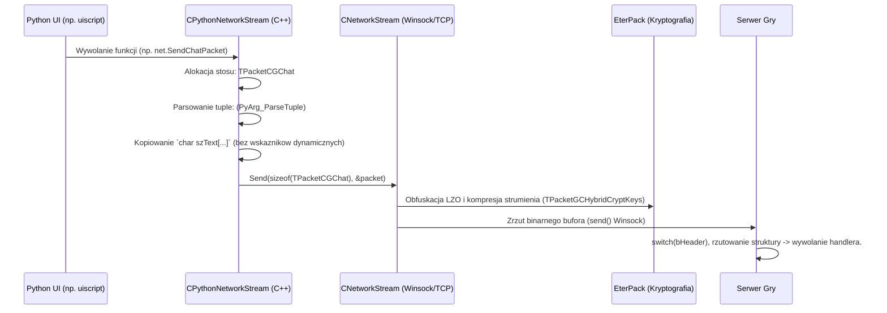

# Podsystem Pakietow CG (Client-to-Server) - Kompletna Dekonstrukcja Packet.h

## 1. Cel Architektoniczny i Rola Modulu
Modul `Packet.h` w ramach inzynierii sieciowej podsystemu Metin2 C++ ma rygorystyczne zadanie definiowania struktur transportowych typu POD (Plain Old Data). Mapuja sie one jednoznacznie (1:1) na bufory w gniazdach TCP, pelniac role warstwy aplikacji w komunikacji `CNetworkStream` <-> Game Server.
Odpowiedzialnosci architektoniczne:
- Pelni wylacznie strukturalny model definicji payloadow. Nie zawiera implementacji wirtualnych.
- Silnie paruje wywolania zdarzen klienckich Pythona (`CPythonNetworkStream`) tlumaczac zmienne tekstowe i liczbowe na odpowiednie tablice `char[]` oraz typy maszynowe (`BYTE`, `WORD`, `DWORD`).
- Gwarantuje jednolity uklad bitowy z serwerem. Zmiany w tych polach wymagaja identycznej re-kompilacji demona `game` po stronie serwera.

## 2. Diagram Architektury i Przeplywu Danych (Mermaid)


## 3. Rejestr Struktur Danych i Pamieci (Memory & Struct Layout)
Kluczowa zasada dla sieciowego protokolu klienta jest wylaczenie paddingu kompilatora, co dokonuje sie uzywajac `#pragma pack(1)`. Bez tego kazdy element np. 1-bajtowy w srodku zostalby popchniety do rownania slownego maszynowego 32-bit (4 bajty), generujac niezgodny z serwerem uklad binarny.

### Lista Opkodow Header CG (Naglowki Identyfikacyjne)
- `HEADER_CG_LOGIN` : `1`
- `HEADER_CG_ATTACK` : `2`
- `HEADER_CG_CHAT` : `3`
- `HEADER_CG_PLAYER_CREATE` : `4`
- `HEADER_CG_PLAYER_DESTROY` : `5`
- `HEADER_CG_PLAYER_SELECT` : `6`
- `HEADER_CG_CHARACTER_MOVE` : `7`
- `HEADER_CG_SYNC_POSITION` : `8`
- `HEADER_CG_DIRECT_ENTER` : `9`
- `HEADER_CG_ENTERGAME` : `10`
- `HEADER_CG_ITEM_USE` : `11`
- `HEADER_CG_ITEM_DROP` : `12`
- `HEADER_CG_ITEM_MOVE` : `13`
- `HEADER_CG_ITEM_PICKUP` : `15`
- `HEADER_CG_QUICKSLOT_ADD` : `16`
- `HEADER_CG_QUICKSLOT_DEL` : `17`
- `HEADER_CG_QUICKSLOT_SWAP` : `18`
- `HEADER_CG_WHISPER` : `19`
- `HEADER_CG_ITEM_DROP2` : `20`
- `HEADER_CG_ON_CLICK` : `26`
- `HEADER_CG_EXCHANGE` : `27`
- `HEADER_CG_CHARACTER_POSITION` : `28`
- `HEADER_CG_SCRIPT_ANSWER` : `29`
- `HEADER_CG_QUEST_INPUT_STRING` : `30`
- `HEADER_CG_QUEST_CONFIRM` : `31`
- `HEADER_CG_PVP` : `41`
- `HEADER_CG_SHOP` : `50`
- `HEADER_CG_FLY_TARGETING` : `51`
- `HEADER_CG_USE_SKILL` : `52`
- `HEADER_CG_ADD_FLY_TARGETING` : `53`
- `HEADER_CG_SHOOT` : `54`
- `HEADER_CG_MYSHOP` : `55`
- `HEADER_CG_ITEM_USE_TO_ITEM` : `60`
- `HEADER_CG_TARGET` : `61`
- `HEADER_CG_WARP` : `65`
- `HEADER_CG_SCRIPT_BUTTON` : `66`
- `HEADER_CG_MESSENGER` : `67`
- `HEADER_CG_MALL_CHECKOUT` : `69`
- `HEADER_CG_SAFEBOX_CHECKIN` : `70`
- `HEADER_CG_SAFEBOX_CHECKOUT` : `71`
- `HEADER_CG_PARTY_INVITE` : `72`
- `HEADER_CG_PARTY_INVITE_ANSWER` : `73`
- `HEADER_CG_PARTY_REMOVE` : `74`
- `HEADER_CG_PARTY_SET_STATE` : `75`
- `HEADER_CG_PARTY_USE_SKILL` : `76`
- `HEADER_CG_SAFEBOX_ITEM_MOVE` : `77`
- `HEADER_CG_PARTY_PARAMETER` : `78`
- `HEADER_CG_GUILD` : `80`
- `HEADER_CG_ANSWER_MAKE_GUILD` : `81`
- `HEADER_CG_FISHING` : `82`
- `HEADER_CG_GIVE_ITEM` : `83`
- `HEADER_CG_EMPIRE` : `90`
- `HEADER_CG_REFINE` : `96`
- `HEADER_CG_MARK_LOGIN` : `100`
- `HEADER_CG_MARK_CRCLIST` : `101`
- `HEADER_CG_MARK_UPLOAD` : `102`
- `HEADER_CG_MARK_IDXLIST` : `104`
- `HEADER_CG_CRC_REPORT` : `103`
- `HEADER_CG_HACK` : `105`
- `HEADER_CG_CHANGE_NAME` : `106`
- `HEADER_CG_SMS` : `107`
- `HEADER_CG_CHINA_MATRIX_CARD` : `108`
- `HEADER_CG_LOGIN2` : `109`
- `HEADER_CG_DUNGEON` : `110`
- `HEADER_CG_LOGIN3` : `111`
- `HEADER_CG_GUILD_SYMBOL_UPLOAD` : `112`
- `HEADER_CG_GUILD_SYMBOL_CRC` : `113`
- `HEADER_CG_SCRIPT_SELECT_ITEM` : `114`
- `HEADER_CG_LOGIN4` : `115`
- `HEADER_CG_LOGIN5_OPENID` : `116`
- `HEADER_CG_RUNUP_MATRIX_ANSWER` : `201`
- `HEADER_CG_NEWCIBN_PASSPOD_ANSWER` : `202`
- `HEADER_CG_HS_ACK` : `203`
- `HEADER_CG_XTRAP_ACK` : `204`
- `HEADER_CG_DRAGON_SOUL_REFINE` : `205`
- `HEADER_CG_STATE_CHECKER` : `206`
- `HEADER_CG_AUCTION_CMD` : `205`
- `HEADER_CG_KEY_AGREEMENT` : `0`
- `HEADER_CG_TIME_SYNC` : `0`
- `HEADER_CG_CLIENT_VERSION` : `0`
- `HEADER_CG_CLIENT_VERSION2` : `0`
- `HEADER_CG_PONG` : `0`
- `HEADER_CG_HANDSHAKE` : `0`


### Dekonstrukcja Algorytmiczna Kazdego Payloadu
#### Element Komunikacyjny: `TPacketCGMarkLogin`
```cpp
typedef struct command_mark_login
{
    BYTE    header;
    DWORD   handle;
    DWORD   random_key;
} TPacketCGMarkLogin;
```
- **Cel Architektoniczny**: Logowanie uzytkownika do serwera (faza AUTH).
- **Algorytmiczne dzialanie po serializacji**: Wysyla login, haslo (czesto zahashowane w nowszych wersjach) klienta.
- **Wyzwalacz Kliencki (Trigger)**: Klikniecie 'Zaloguj' (OnLoginButton) na ekranie logowania.
- **Memory Layout i Packing**: Suma prymitywnych pol wlasnych bez wliczania stacjonarnych tablic: okolo 13 bajtow. Posiada plaski uklad wymuszany zablokowaniem wyrownywania bitowego (brak narzutu vtable).

#### Element Komunikacyjny: `TPacketCGMarkUpload`
```cpp
typedef struct command_mark_upload
{
    BYTE    header;
    DWORD   gid;
    BYTE    image[16*12*4];
} TPacketCGMarkUpload;
```
- **Cel Architektoniczny**: Wgranie wlasnego znaczka gildii.
- **Algorytmiczne dzialanie po serializacji**: Przesyla 16x12 pikseli surowych bajtow w celu propagacji z serwerem.
- **Wyzwalacz Kliencki (Trigger)**: Mistrz gildii wybiera 'Wgraj ikone' w oknie z `.bmp` lub `.tga`.
- **Memory Layout i Packing**: Suma prymitywnych pol wlasnych bez wliczania stacjonarnych tablic: okolo 7 bajtow. Zawiera alokacje wielkosci `[16*12*4]`. Posiada plaski uklad wymuszany zablokowaniem wyrownywania bitowego (brak narzutu vtable).

#### Element Komunikacyjny: `TPacketCGMarkIDXList`
```cpp
typedef struct command_mark_idxlist
{
    BYTE    header;
} TPacketCGMarkIDXList;
```
- **Cel Architektoniczny**: Przekazuje obsluge biznesowa wywolywana w UI powiazana ze scislym identyfikatorem struktury TPacketCGMarkIDXList.
- **Algorytmiczne dzialanie po serializacji**: Kopiuje wartosci podane przez pythona (`PyArg_ParseTuple`) do sformalizowanych surowych elementow struktury i aplikuje hash.
- **Wyzwalacz Kliencki (Trigger)**: Zdarzenia event loop z modulu `net` (np. uiscript, interakcje w oknie gry).
- **Memory Layout i Packing**: Suma prymitywnych pol wlasnych bez wliczania stacjonarnych tablic: okolo 1 bajtow. Posiada plaski uklad wymuszany zablokowaniem wyrownywania bitowego (brak narzutu vtable).

#### Element Komunikacyjny: `TPacketCGMarkCRCList`
```cpp
typedef struct command_mark_crclist
{
    BYTE    header;
    BYTE    imgIdx;
    DWORD   crclist[80];
} TPacketCGMarkCRCList;
```
- **Cel Architektoniczny**: Przekazuje obsluge biznesowa wywolywana w UI powiazana ze scislym identyfikatorem struktury TPacketCGMarkCRCList.
- **Algorytmiczne dzialanie po serializacji**: Kopiuje wartosci podane przez pythona (`PyArg_ParseTuple`) do sformalizowanych surowych elementow struktury i aplikuje hash.
- **Wyzwalacz Kliencki (Trigger)**: Zdarzenia event loop z modulu `net` (np. uiscript, interakcje w oknie gry).
- **Memory Layout i Packing**: Suma prymitywnych pol wlasnych bez wliczania stacjonarnych tablic: okolo 2 bajtow. Zawiera alokacje wielkosci `[80]`. Posiada plaski uklad wymuszany zablokowaniem wyrownywania bitowego (brak narzutu vtable).

#### Element Komunikacyjny: `TPacketCGSymbolUpload`
```cpp
typedef struct command_symbol_upload
{
	BYTE	header;
	WORD	size;
	DWORD	handle;
} TPacketCGSymbolUpload;
```
- **Cel Architektoniczny**: Przekazuje obsluge biznesowa wywolywana w UI powiazana ze scislym identyfikatorem struktury TPacketCGSymbolUpload.
- **Algorytmiczne dzialanie po serializacji**: Kopiuje wartosci podane przez pythona (`PyArg_ParseTuple`) do sformalizowanych surowych elementow struktury i aplikuje hash.
- **Wyzwalacz Kliencki (Trigger)**: Zdarzenia event loop z modulu `net` (np. uiscript, interakcje w oknie gry).
- **Memory Layout i Packing**: Suma prymitywnych pol wlasnych bez wliczania stacjonarnych tablic: okolo 9 bajtow. Posiada plaski uklad wymuszany zablokowaniem wyrownywania bitowego (brak narzutu vtable).

#### Element Komunikacyjny: `TPacketCGSymbolCRC`
```cpp
typedef struct command_symbol_crc
{
	BYTE	header;
	DWORD	dwGuildID;
	DWORD	dwCRC;
	DWORD	dwSize;
} TPacketCGSymbolCRC;
```
- **Cel Architektoniczny**: Przekazuje obsluge biznesowa wywolywana w UI powiazana ze scislym identyfikatorem struktury TPacketCGSymbolCRC.
- **Algorytmiczne dzialanie po serializacji**: Kopiuje wartosci podane przez pythona (`PyArg_ParseTuple`) do sformalizowanych surowych elementow struktury i aplikuje hash.
- **Wyzwalacz Kliencki (Trigger)**: Zdarzenia event loop z modulu `net` (np. uiscript, interakcje w oknie gry).
- **Memory Layout i Packing**: Suma prymitywnych pol wlasnych bez wliczania stacjonarnych tablic: okolo 19 bajtow. Posiada plaski uklad wymuszany zablokowaniem wyrownywania bitowego (brak narzutu vtable).

#### Element Komunikacyjny: `TPacketGCGuildSymbolData`
```cpp
typedef struct packet_symbol_data
{
    BYTE header;
    WORD size;
    DWORD guild_id;
} TPacketGCGuildSymbolData;
```
- **Cel Architektoniczny**: Wiele akcji gildiowych zarzadzanych z jednego naglowka.
- **Algorytmiczne dzialanie po serializacji**: Rozdzielane za pomoca pola bSubHeader (wyplacenie kasy, awans, wykopanie z gildii).
- **Wyzwalacz Kliencki (Trigger)**: Uzycie Okna Gildii.
- **Memory Layout i Packing**: Suma prymitywnych pol wlasnych bez wliczania stacjonarnych tablic: okolo 9 bajtow. Posiada plaski uklad wymuszany zablokowaniem wyrownywania bitowego (brak narzutu vtable).

#### Element Komunikacyjny: `TPacketCGCheckin`
```cpp
typedef struct command_checkin
{
	BYTE header;
	char name[ID_MAX_NUM+1];
	char pwd[PASS_MAX_NUM+1];
} TPacketCGCheckin;
```
- **Cel Architektoniczny**: Przekazuje obsluge biznesowa wywolywana w UI powiazana ze scislym identyfikatorem struktury TPacketCGCheckin.
- **Algorytmiczne dzialanie po serializacji**: Kopiuje wartosci podane przez pythona (`PyArg_ParseTuple`) do sformalizowanych surowych elementow struktury i aplikuje hash.
- **Wyzwalacz Kliencki (Trigger)**: Zdarzenia event loop z modulu `net` (np. uiscript, interakcje w oknie gry).
- **Memory Layout i Packing**: Suma prymitywnych pol wlasnych bez wliczania stacjonarnych tablic: okolo 1 bajtow. Zawiera alokacje wielkosci `[ID_MAX_NUM+1]`. Zawiera alokacje wielkosci `[PASS_MAX_NUM+1]`. Posiada plaski uklad wymuszany zablokowaniem wyrownywania bitowego (brak narzutu vtable).

#### Element Komunikacyjny: `TPacketCGLogin`
```cpp
typedef struct command_login
{
    BYTE header;
    char name[ID_MAX_NUM + 1];
    char pwd[PASS_MAX_NUM + 1];
} TPacketCGLogin;
```
- **Cel Architektoniczny**: Logowanie uzytkownika do serwera (faza AUTH).
- **Algorytmiczne dzialanie po serializacji**: Wysyla login, haslo (czesto zahashowane w nowszych wersjach) klienta.
- **Wyzwalacz Kliencki (Trigger)**: Klikniecie 'Zaloguj' (OnLoginButton) na ekranie logowania.
- **Memory Layout i Packing**: Suma prymitywnych pol wlasnych bez wliczania stacjonarnych tablic: okolo 1 bajtow. Zawiera alokacje wielkosci `[ID_MAX_NUM + 1]`. Zawiera alokacje wielkosci `[PASS_MAX_NUM + 1]`. Posiada plaski uklad wymuszany zablokowaniem wyrownywania bitowego (brak narzutu vtable).

#### Element Komunikacyjny: `TPacketCGLogin2`
```cpp
typedef struct command_login2
{
	BYTE	header;
	char	name[ID_MAX_NUM + 1];
	DWORD	login_key;
    DWORD	adwClientKey[4];
} TPacketCGLogin2;
```
- **Cel Architektoniczny**: Logowanie uzytkownika do serwera (faza AUTH).
- **Algorytmiczne dzialanie po serializacji**: Wysyla login, haslo (czesto zahashowane w nowszych wersjach) klienta.
- **Wyzwalacz Kliencki (Trigger)**: Klikniecie 'Zaloguj' (OnLoginButton) na ekranie logowania.
- **Memory Layout i Packing**: Suma prymitywnych pol wlasnych bez wliczania stacjonarnych tablic: okolo 7 bajtow. Zawiera alokacje wielkosci `[ID_MAX_NUM + 1]`. Zawiera alokacje wielkosci `[4]`. Posiada plaski uklad wymuszany zablokowaniem wyrownywania bitowego (brak narzutu vtable).

#### Element Komunikacyjny: `TPacketCGLogin3`
```cpp
typedef struct command_login3
{
    BYTE	header;
    char	name[ID_MAX_NUM + 1];
    char	pwd[PASS_MAX_NUM + 1];
    DWORD	adwClientKey[4];
} TPacketCGLogin3;
```
- **Cel Architektoniczny**: Logowanie uzytkownika do serwera (faza AUTH).
- **Algorytmiczne dzialanie po serializacji**: Wysyla login, haslo (czesto zahashowane w nowszych wersjach) klienta.
- **Wyzwalacz Kliencki (Trigger)**: Klikniecie 'Zaloguj' (OnLoginButton) na ekranie logowania.
- **Memory Layout i Packing**: Suma prymitywnych pol wlasnych bez wliczania stacjonarnych tablic: okolo 1 bajtow. Zawiera alokacje wielkosci `[ID_MAX_NUM + 1]`. Zawiera alokacje wielkosci `[PASS_MAX_NUM + 1]`. Zawiera alokacje wielkosci `[4]`. Posiada plaski uklad wymuszany zablokowaniem wyrownywania bitowego (brak narzutu vtable).

#### Element Komunikacyjny: `TPacketCGLogin5`
```cpp
typedef struct command_login5
{
    BYTE	header;
    char	authKey[OPENID_AUTHKEY_LEN + 1];
    DWORD	adwClientKey[4];
} TPacketCGLogin5;
```
- **Cel Architektoniczny**: Logowanie uzytkownika do serwera (faza AUTH).
- **Algorytmiczne dzialanie po serializacji**: Wysyla login, haslo (czesto zahashowane w nowszych wersjach) klienta.
- **Wyzwalacz Kliencki (Trigger)**: Klikniecie 'Zaloguj' (OnLoginButton) na ekranie logowania.
- **Memory Layout i Packing**: Suma prymitywnych pol wlasnych bez wliczania stacjonarnych tablic: okolo 1 bajtow. Zawiera alokacje wielkosci `[OPENID_AUTHKEY_LEN + 1]`. Zawiera alokacje wielkosci `[4]`. Posiada plaski uklad wymuszany zablokowaniem wyrownywania bitowego (brak narzutu vtable).

#### Element Komunikacyjny: `TPacketCGDirectEnter`
```cpp
typedef struct command_direct_enter
{
    BYTE        bHeader;
    char        login[ID_MAX_NUM + 1];
    char        passwd[PASS_MAX_NUM + 1];
    BYTE        index;
} TPacketCGDirectEnter;
```
- **Cel Architektoniczny**: Bezposrednie wejscie (zwykle dla debuggowania).
- **Algorytmiczne dzialanie po serializacji**: Wysyla pusty naglowek, zadajac przeniesienia.
- **Wyzwalacz Kliencki (Trigger)**: Metody testowe lub relog w obrebie mapy.
- **Memory Layout i Packing**: Suma prymitywnych pol wlasnych bez wliczania stacjonarnych tablic: okolo 2 bajtow. Zawiera alokacje wielkosci `[ID_MAX_NUM + 1]`. Zawiera alokacje wielkosci `[PASS_MAX_NUM + 1]`. Posiada plaski uklad wymuszany zablokowaniem wyrownywania bitowego (brak narzutu vtable).

#### Element Komunikacyjny: `TPacketCGSelectCharacter`
```cpp
typedef struct command_player_select
{
	BYTE	header;
	BYTE	player_index;
} TPacketCGSelectCharacter;
```
- **Cel Architektoniczny**: Przekazuje obsluge biznesowa wywolywana w UI powiazana ze scislym identyfikatorem struktury TPacketCGSelectCharacter.
- **Algorytmiczne dzialanie po serializacji**: Kopiuje wartosci podane przez pythona (`PyArg_ParseTuple`) do sformalizowanych surowych elementow struktury i aplikuje hash.
- **Wyzwalacz Kliencki (Trigger)**: Zdarzenia event loop z modulu `net` (np. uiscript, interakcje w oknie gry).
- **Memory Layout i Packing**: Suma prymitywnych pol wlasnych bez wliczania stacjonarnych tablic: okolo 2 bajtow. Posiada plaski uklad wymuszany zablokowaniem wyrownywania bitowego (brak narzutu vtable).

#### Element Komunikacyjny: `TPacketCGAttack`
```cpp
typedef struct command_attack
{
	BYTE	header;
	BYTE	bType;			// °ø°Ý À¯Çü
	DWORD	dwVictimVID;	// Àû VID
	BYTE	bCRCMagicCubeProcPiece;
	BYTE	bCRCMagicCubeFilePiece;
} TPacketCGAttack;
```
- **Cel Architektoniczny**: Wysyla pings ataku do weryfikacji serwerowej (hit detection).
- **Algorytmiczne dzialanie po serializacji**: Przesyla `vid` celu by serwer odjal HP. Zabezpiecza to klienta przed 'WaihHackami' wymuszajac bycie obok.
- **Wyzwalacz Kliencki (Trigger)**: LPM na mobie, wcisnieta Spacja (autoatak).
- **Memory Layout i Packing**: Suma prymitywnych pol wlasnych bez wliczania stacjonarnych tablic: okolo 10 bajtow. Posiada plaski uklad wymuszany zablokowaniem wyrownywania bitowego (brak narzutu vtable).

#### Element Komunikacyjny: `TPacketCGChat`
```cpp
typedef struct command_chat
{
	BYTE	header;
	WORD	length;
	BYTE	type;
} TPacketCGChat;
```
- **Cel Architektoniczny**: Komunikacja tekstowa miedzy graczami (czat lokalny/globalny).
- **Algorytmiczne dzialanie po serializacji**: Zawiera staly bufor `szText` ktory obcina dlugie zdania, oraz typ (SHOUT, NORMAL).
- **Wyzwalacz Kliencki (Trigger)**: Wpisanie tekstu w pasku czatu i zatwierdzenie ENTER.
- **Memory Layout i Packing**: Suma prymitywnych pol wlasnych bez wliczania stacjonarnych tablic: okolo 4 bajtow. Posiada plaski uklad wymuszany zablokowaniem wyrownywania bitowego (brak narzutu vtable).

#### Element Komunikacyjny: `TPacketCGWhisper`
```cpp
typedef struct command_whisper
{
    BYTE        bHeader;
    WORD        wSize;
    char        szNameTo[CHARACTER_NAME_MAX_LEN + 1];
} TPacketCGWhisper;
```
- **Cel Architektoniczny**: Wiadomosc prywatna (Szept).
- **Algorytmiczne dzialanie po serializacji**: Zawiera nick adresata i tresc w sztywnym bloku.
- **Wyzwalacz Kliencki (Trigger)**: Uzycie okna Szeptu /whisper [nick].
- **Memory Layout i Packing**: Suma prymitywnych pol wlasnych bez wliczania stacjonarnych tablic: okolo 3 bajtow. Zawiera alokacje wielkosci `[CHARACTER_NAME_MAX_LEN + 1]`. Posiada plaski uklad wymuszany zablokowaniem wyrownywania bitowego (brak narzutu vtable).

#### Element Komunikacyjny: `TPacketCGSMS`
```cpp
typedef struct command_sms
{
    BYTE        bHeader;
    WORD        wSize;
    char        szNameTo[CHARACTER_NAME_MAX_LEN + 1];
} TPacketCGSMS;
```
- **Cel Architektoniczny**: Przekazuje obsluge biznesowa wywolywana w UI powiazana ze scislym identyfikatorem struktury TPacketCGSMS.
- **Algorytmiczne dzialanie po serializacji**: Kopiuje wartosci podane przez pythona (`PyArg_ParseTuple`) do sformalizowanych surowych elementow struktury i aplikuje hash.
- **Wyzwalacz Kliencki (Trigger)**: Zdarzenia event loop z modulu `net` (np. uiscript, interakcje w oknie gry).
- **Memory Layout i Packing**: Suma prymitywnych pol wlasnych bez wliczania stacjonarnych tablic: okolo 3 bajtow. Zawiera alokacje wielkosci `[CHARACTER_NAME_MAX_LEN + 1]`. Posiada plaski uklad wymuszany zablokowaniem wyrownywania bitowego (brak narzutu vtable).

#### Element Komunikacyjny: `TPacketCGEnterFrontGame`
```cpp
typedef struct command_EnterFrontGame
{
	BYTE header;
} TPacketCGEnterFrontGame;
```
- **Cel Architektoniczny**: Przekazuje obsluge biznesowa wywolywana w UI powiazana ze scislym identyfikatorem struktury TPacketCGEnterFrontGame.
- **Algorytmiczne dzialanie po serializacji**: Kopiuje wartosci podane przez pythona (`PyArg_ParseTuple`) do sformalizowanych surowych elementow struktury i aplikuje hash.
- **Wyzwalacz Kliencki (Trigger)**: Zdarzenia event loop z modulu `net` (np. uiscript, interakcje w oknie gry).
- **Memory Layout i Packing**: Suma prymitywnych pol wlasnych bez wliczania stacjonarnych tablic: okolo 1 bajtow. Posiada plaski uklad wymuszany zablokowaniem wyrownywania bitowego (brak narzutu vtable).

#### Element Komunikacyjny: `TPacketCGItemUse`
```cpp
typedef struct command_item_use
{
	BYTE header;
	TItemPos pos;
} TPacketCGItemUse;
```
- **Cel Architektoniczny**: Zadanie uzycia przedmiotu (konsumpcja lub ekwipowanie).
- **Algorytmiczne dzialanie po serializacji**: Przesyla indeks slotu `pos`. Logika dzialania potiona / zalozenia zbroi jest wykonywana wylacznie po stronie serwera.
- **Wyzwalacz Kliencki (Trigger)**: PPM na przedmiot w oknie Ekwipunku.
- **Memory Layout i Packing**: Suma prymitywnych pol wlasnych bez wliczania stacjonarnych tablic: okolo 1 bajtow. Posiada plaski uklad wymuszany zablokowaniem wyrownywania bitowego (brak narzutu vtable).

#### Element Komunikacyjny: `TPacketCGItemUseToItem`
```cpp
typedef struct command_item_use_to_item
{
	BYTE header;
	TItemPos source_pos;
	TItemPos target_pos;
} TPacketCGItemUseToItem;
```
- **Cel Architektoniczny**: Zadanie uzycia przedmiotu (konsumpcja lub ekwipowanie).
- **Algorytmiczne dzialanie po serializacji**: Przesyla indeks slotu `pos`. Logika dzialania potiona / zalozenia zbroi jest wykonywana wylacznie po stronie serwera.
- **Wyzwalacz Kliencki (Trigger)**: PPM na przedmiot w oknie Ekwipunku.
- **Memory Layout i Packing**: Suma prymitywnych pol wlasnych bez wliczania stacjonarnych tablic: okolo 1 bajtow. Posiada plaski uklad wymuszany zablokowaniem wyrownywania bitowego (brak narzutu vtable).

#### Element Komunikacyjny: `TPacketCGItemDrop`
```cpp
typedef struct command_item_drop
{
	BYTE  header;
	TItemPos pos;
	DWORD elk;
} TPacketCGItemDrop;
```
- **Cel Architektoniczny**: Wyrzucenie przedmiotu na ziemie.
- **Algorytmiczne dzialanie po serializacji**: Obejmuje slota oraz wspolrzedne wyrzucenia.
- **Wyzwalacz Kliencki (Trigger)**: Przeciagniecie (Drag&Drop) itemu poza UI ekwipunku.
- **Memory Layout i Packing**: Suma prymitywnych pol wlasnych bez wliczania stacjonarnych tablic: okolo 7 bajtow. Posiada plaski uklad wymuszany zablokowaniem wyrownywania bitowego (brak narzutu vtable).

#### Element Komunikacyjny: `TPacketCGItemDrop2`
```cpp
typedef struct command_item_drop2
{
    BYTE        header;
    TItemPos pos;
    DWORD       gold;
    BYTE        count;
} TPacketCGItemDrop2;
```
- **Cel Architektoniczny**: Wyrzucenie przedmiotu na ziemie.
- **Algorytmiczne dzialanie po serializacji**: Obejmuje slota oraz wspolrzedne wyrzucenia.
- **Wyzwalacz Kliencki (Trigger)**: Przeciagniecie (Drag&Drop) itemu poza UI ekwipunku.
- **Memory Layout i Packing**: Suma prymitywnych pol wlasnych bez wliczania stacjonarnych tablic: okolo 8 bajtow. Posiada plaski uklad wymuszany zablokowaniem wyrownywania bitowego (brak narzutu vtable).

#### Element Komunikacyjny: `TPacketCGItemMove`
```cpp
typedef struct command_item_move
{
	BYTE header;
	TItemPos pos;
	TItemPos change_pos;
	BYTE num;
} TPacketCGItemMove;
```
- **Cel Architektoniczny**: Przemieszczenie elementu w ekwipunku (zamiana miejsc).
- **Algorytmiczne dzialanie po serializacji**: Zrodlowy `pos` i docelowy `pos`.
- **Wyzwalacz Kliencki (Trigger)**: Drag&Drop przedmiotu na inny slot ekwipunku.
- **Memory Layout i Packing**: Suma prymitywnych pol wlasnych bez wliczania stacjonarnych tablic: okolo 2 bajtow. Posiada plaski uklad wymuszany zablokowaniem wyrownywania bitowego (brak narzutu vtable).

#### Element Komunikacyjny: `TPacketCGItemPickUp`
```cpp
typedef struct command_item_pickup
{
	BYTE header;
	DWORD vid;
} TPacketCGItemPickUp;
```
- **Cel Architektoniczny**: Przekazuje obsluge biznesowa wywolywana w UI powiazana ze scislym identyfikatorem struktury TPacketCGItemPickUp.
- **Algorytmiczne dzialanie po serializacji**: Kopiuje wartosci podane przez pythona (`PyArg_ParseTuple`) do sformalizowanych surowych elementow struktury i aplikuje hash.
- **Wyzwalacz Kliencki (Trigger)**: Zdarzenia event loop z modulu `net` (np. uiscript, interakcje w oknie gry).
- **Memory Layout i Packing**: Suma prymitywnych pol wlasnych bez wliczania stacjonarnych tablic: okolo 7 bajtow. Posiada plaski uklad wymuszany zablokowaniem wyrownywania bitowego (brak narzutu vtable).

#### Element Komunikacyjny: `TPacketCGQuickSlotAdd`
```cpp
typedef struct command_quickslot_add
{
    BYTE        header;
    BYTE        pos;
	TQuickSlot	slot;
}TPacketCGQuickSlotAdd;
```
- **Cel Architektoniczny**: Przekazuje obsluge biznesowa wywolywana w UI powiazana ze scislym identyfikatorem struktury TPacketCGQuickSlotAdd.
- **Algorytmiczne dzialanie po serializacji**: Kopiuje wartosci podane przez pythona (`PyArg_ParseTuple`) do sformalizowanych surowych elementow struktury i aplikuje hash.
- **Wyzwalacz Kliencki (Trigger)**: Zdarzenia event loop z modulu `net` (np. uiscript, interakcje w oknie gry).
- **Memory Layout i Packing**: Suma prymitywnych pol wlasnych bez wliczania stacjonarnych tablic: okolo 2 bajtow. Posiada plaski uklad wymuszany zablokowaniem wyrownywania bitowego (brak narzutu vtable).

#### Element Komunikacyjny: `TPacketCGQuickSlotDel`
```cpp
typedef struct command_quickslot_del
{
    BYTE        header;
    BYTE        pos;
}TPacketCGQuickSlotDel;
```
- **Cel Architektoniczny**: Przekazuje obsluge biznesowa wywolywana w UI powiazana ze scislym identyfikatorem struktury TPacketCGQuickSlotDel.
- **Algorytmiczne dzialanie po serializacji**: Kopiuje wartosci podane przez pythona (`PyArg_ParseTuple`) do sformalizowanych surowych elementow struktury i aplikuje hash.
- **Wyzwalacz Kliencki (Trigger)**: Zdarzenia event loop z modulu `net` (np. uiscript, interakcje w oknie gry).
- **Memory Layout i Packing**: Suma prymitywnych pol wlasnych bez wliczania stacjonarnych tablic: okolo 2 bajtow. Posiada plaski uklad wymuszany zablokowaniem wyrownywania bitowego (brak narzutu vtable).

#### Element Komunikacyjny: `TPacketCGQuickSlotSwap`
```cpp
typedef struct command_quickslot_swap
{
    BYTE        header;
    BYTE        pos;
    BYTE        change_pos;
}TPacketCGQuickSlotSwap;
```
- **Cel Architektoniczny**: Przekazuje obsluge biznesowa wywolywana w UI powiazana ze scislym identyfikatorem struktury TPacketCGQuickSlotSwap.
- **Algorytmiczne dzialanie po serializacji**: Kopiuje wartosci podane przez pythona (`PyArg_ParseTuple`) do sformalizowanych surowych elementow struktury i aplikuje hash.
- **Wyzwalacz Kliencki (Trigger)**: Zdarzenia event loop z modulu `net` (np. uiscript, interakcje w oknie gry).
- **Memory Layout i Packing**: Suma prymitywnych pol wlasnych bez wliczania stacjonarnych tablic: okolo 3 bajtow. Posiada plaski uklad wymuszany zablokowaniem wyrownywania bitowego (brak narzutu vtable).

#### Element Komunikacyjny: `TPacketCGOnClick`
```cpp
typedef struct command_on_click
{
	BYTE		header;
	DWORD		vid;
} TPacketCGOnClick;
```
- **Cel Architektoniczny**: Zgloszenie interakcji LPM z aktorem (NPC, Metin).
- **Algorytmiczne dzialanie po serializacji**: Odsyla VID (Virtual ID) obiektu, by otworzyc sklep/rozmowe.
- **Wyzwalacz Kliencki (Trigger)**: LPM na model NPC / wroga z ktorym wystepuje event klikniecia.
- **Memory Layout i Packing**: Suma prymitywnych pol wlasnych bez wliczania stacjonarnych tablic: okolo 7 bajtow. Posiada plaski uklad wymuszany zablokowaniem wyrownywania bitowego (brak narzutu vtable).

#### Element Komunikacyjny: `TPacketCGShop`
```cpp
typedef struct command_shop
{
	BYTE        header;
	BYTE		subheader;
} TPacketCGShop;
```
- **Cel Architektoniczny**: Operacje w sklepie NPC (kupno/sprzedaz).
- **Algorytmiczne dzialanie po serializacji**: Pakiet korzysta z sub-opcodu (Buy/Sell) i przesyla indeks na wirtualnej liscie (lub ID z inventory przy sprzedazy).
- **Wyzwalacz Kliencki (Trigger)**: LPM na item u handlarza z intencja kupna/sprzedazy.
- **Memory Layout i Packing**: Suma prymitywnych pol wlasnych bez wliczania stacjonarnych tablic: okolo 2 bajtow. Posiada plaski uklad wymuszany zablokowaniem wyrownywania bitowego (brak narzutu vtable).

#### Element Komunikacyjny: `TPacketCGExchange`
```cpp
typedef struct command_exchange
{
	BYTE		header;
	BYTE		subheader;
	DWORD		arg1;
	BYTE		arg2;
	TItemPos	Pos;
} TPacketCGExchange;
```
- **Cel Architektoniczny**: Modul handlu (Handel miedzy graczami).
- **Algorytmiczne dzialanie po serializacji**: Obsluguje rozne pod-operacje (dodaj, akceptuj, anuluj). Wymaga uzycia subheadera.
- **Wyzwalacz Kliencki (Trigger)**: Zaproponowanie handlu / uzycie okna Trade.
- **Memory Layout i Packing**: Suma prymitywnych pol wlasnych bez wliczania stacjonarnych tablic: okolo 9 bajtow. Posiada plaski uklad wymuszany zablokowaniem wyrownywania bitowego (brak narzutu vtable).

#### Element Komunikacyjny: `TPacketCGPosition`
```cpp
typedef struct command_position
{   
    BYTE        header;
    BYTE        position;
} TPacketCGPosition;
```
- **Cel Architektoniczny**: Przekazuje obsluge biznesowa wywolywana w UI powiazana ze scislym identyfikatorem struktury TPacketCGPosition.
- **Algorytmiczne dzialanie po serializacji**: Kopiuje wartosci podane przez pythona (`PyArg_ParseTuple`) do sformalizowanych surowych elementow struktury i aplikuje hash.
- **Wyzwalacz Kliencki (Trigger)**: Zdarzenia event loop z modulu `net` (np. uiscript, interakcje w oknie gry).
- **Memory Layout i Packing**: Suma prymitywnych pol wlasnych bez wliczania stacjonarnych tablic: okolo 2 bajtow. Posiada plaski uklad wymuszany zablokowaniem wyrownywania bitowego (brak narzutu vtable).

#### Element Komunikacyjny: `TPacketCGScriptAnswer`
```cpp
typedef struct command_script_answer
{
    BYTE        header;
	BYTE		answer;
} TPacketCGScriptAnswer;
```
- **Cel Architektoniczny**: Zwrotka do okienka dialogowego Questow.
- **Algorytmiczne dzialanie po serializacji**: Odsyla wybrany indeks z listy questboarda by kontynuowac logike `quest_manager`.
- **Wyzwalacz Kliencki (Trigger)**: Klikniecie w opcje z odpowiedzia u NPC (np. 'Zgadzam sie').
- **Memory Layout i Packing**: Suma prymitywnych pol wlasnych bez wliczania stacjonarnych tablic: okolo 2 bajtow. Posiada plaski uklad wymuszany zablokowaniem wyrownywania bitowego (brak narzutu vtable).

#### Element Komunikacyjny: `TPacketCGScriptButton`
```cpp
typedef struct command_script_button
{
    BYTE        header;
	unsigned int			idx;
} TPacketCGScriptButton;
```
- **Cel Architektoniczny**: Klikniecie w element UI questboarda.
- **Algorytmiczne dzialanie po serializacji**: Wywoluje konkretny tag w skrypcie Lua serwera.
- **Wyzwalacz Kliencki (Trigger)**: Uzycie interface Questa.
- **Memory Layout i Packing**: Suma prymitywnych pol wlasnych bez wliczania stacjonarnych tablic: okolo 5 bajtow. Posiada plaski uklad wymuszany zablokowaniem wyrownywania bitowego (brak narzutu vtable).

#### Element Komunikacyjny: `TPacketCGTarget`
```cpp
typedef struct command_target
{
    BYTE        header;
    DWORD       dwVID;
} TPacketCGTarget;
```
- **Cel Architektoniczny**: Zaznaczenie celu w przestrzeni (Highlight).
- **Algorytmiczne dzialanie po serializacji**: Wysyla VID gracza do podswietlenia (np. przycisk na gorze ekranu).
- **Wyzwalacz Kliencki (Trigger)**: LPM celujace na danego moba bez odpalenia ataku.
- **Memory Layout i Packing**: Suma prymitywnych pol wlasnych bez wliczania stacjonarnych tablic: okolo 7 bajtow. Posiada plaski uklad wymuszany zablokowaniem wyrownywania bitowego (brak narzutu vtable).

#### Element Komunikacyjny: `TPacketCGMove`
```cpp
typedef struct command_move
{
	BYTE		bHeader;
	BYTE		bFunc;
	BYTE		bArg;
	BYTE		bRot;
	LONG		lX;
	LONG		lY;
	DWORD		dwTime;	
} TPacketCGMove;
```
- **Cel Architektoniczny**: Przekazuje obsluge biznesowa wywolywana w UI powiazana ze scislym identyfikatorem struktury TPacketCGMove.
- **Algorytmiczne dzialanie po serializacji**: Kopiuje wartosci podane przez pythona (`PyArg_ParseTuple`) do sformalizowanych surowych elementow struktury i aplikuje hash.
- **Wyzwalacz Kliencki (Trigger)**: Zdarzenia event loop z modulu `net` (np. uiscript, interakcje w oknie gry).
- **Memory Layout i Packing**: Suma prymitywnych pol wlasnych bez wliczania stacjonarnych tablic: okolo 10 bajtow. Posiada plaski uklad wymuszany zablokowaniem wyrownywania bitowego (brak narzutu vtable).

#### Element Komunikacyjny: `TPacketCGSyncPositionElement`
```cpp
typedef struct command_sync_position_element 
{ 
    DWORD       dwVID; 
    long        lX; 
    long        lY; 
} TPacketCGSyncPositionElement; 
```
- **Cel Architektoniczny**: Wymuszona synchronizacja polozenia.
- **Algorytmiczne dzialanie po serializacji**: Wywolywane gdy ping jest wysoki by uniknac Rubberbandingu.
- **Wyzwalacz Kliencki (Trigger)**: Timer w kliencie wywolujacy net.SendSyncPosition().
- **Memory Layout i Packing**: Suma prymitywnych pol wlasnych bez wliczania stacjonarnych tablic: okolo 14 bajtow. Posiada plaski uklad wymuszany zablokowaniem wyrownywania bitowego (brak narzutu vtable).

#### Element Komunikacyjny: `TPacketCGSyncPosition`
```cpp
typedef struct command_sync_position
{ 
    BYTE        bHeader;
	WORD		wSize;
} TPacketCGSyncPosition; 
```
- **Cel Architektoniczny**: Wymuszona synchronizacja polozenia.
- **Algorytmiczne dzialanie po serializacji**: Wywolywane gdy ping jest wysoki by uniknac Rubberbandingu.
- **Wyzwalacz Kliencki (Trigger)**: Timer w kliencie wywolujacy net.SendSyncPosition().
- **Memory Layout i Packing**: Suma prymitywnych pol wlasnych bez wliczania stacjonarnych tablic: okolo 3 bajtow. Posiada plaski uklad wymuszany zablokowaniem wyrownywania bitowego (brak narzutu vtable).

#### Element Komunikacyjny: `TPacketCGFlyTargeting`
```cpp
typedef struct command_fly_targeting
{
	BYTE		bHeader;
	DWORD		dwTargetVID;
	long		lX;
	long		lY;
} TPacketCGFlyTargeting;
```
- **Cel Architektoniczny**: Aktualizacja celu lecacego pocisku (CFlyingManager).
- **Algorytmiczne dzialanie po serializacji**: Namierzanie strzaly dla fizyki 3D (IFlyTargetableObject).
- **Wyzwalacz Kliencki (Trigger)**: Lecenie strzaly/zaklecia wymuszajace update pozycji.
- **Memory Layout i Packing**: Suma prymitywnych pol wlasnych bez wliczania stacjonarnych tablic: okolo 15 bajtow. Posiada plaski uklad wymuszany zablokowaniem wyrownywania bitowego (brak narzutu vtable).

#### Element Komunikacyjny: `TPacketCGShoot`
```cpp
typedef struct packet_shoot
{   
    BYTE		bHeader;                
    BYTE		bType;
} TPacketCGShoot;
```
- **Cel Architektoniczny**: Wyzwolenie ataku dystansowego (z luku).
- **Algorytmiczne dzialanie po serializacji**: Odwoluje sie do uzycia luku/broni dystansowej na VID docelowe.
- **Wyzwalacz Kliencki (Trigger)**: Wystrzelenie pocisku (animacja ataku bowa).
- **Memory Layout i Packing**: Suma prymitywnych pol wlasnych bez wliczania stacjonarnych tablic: okolo 2 bajtow. Posiada plaski uklad wymuszany zablokowaniem wyrownywania bitowego (brak narzutu vtable).

#### Element Komunikacyjny: `TPacketCGWarp`
```cpp
typedef struct command_warp
{
	BYTE			bHeader;
} TPacketCGWarp;
```
- **Cel Architektoniczny**: Uzycie zwoju powrotu (wewnetrzny warp).
- **Algorytmiczne dzialanie po serializacji**: Sygnal przeniesienia gracza wg skryptu.
- **Wyzwalacz Kliencki (Trigger)**: Zwoj powrotu/obraczka slubna.
- **Memory Layout i Packing**: Suma prymitywnych pol wlasnych bez wliczania stacjonarnych tablic: okolo 1 bajtow. Posiada plaski uklad wymuszany zablokowaniem wyrownywania bitowego (brak narzutu vtable).

#### Element Komunikacyjny: `TPacketCGMessenger`
```cpp
typedef struct command_messenger
{
    BYTE header;
    BYTE subheader;
} TPacketCGMessenger;
```
- **Cel Architektoniczny**: Zarzadzanie lista przyjaciol.
- **Algorytmiczne dzialanie po serializacji**: Dodanie, usuniecie po imieniu gracza (sub_headers).
- **Wyzwalacz Kliencki (Trigger)**: Otwarcie okna Friends i akcja 'Dodaj'.
- **Memory Layout i Packing**: Suma prymitywnych pol wlasnych bez wliczania stacjonarnych tablic: okolo 2 bajtow. Posiada plaski uklad wymuszany zablokowaniem wyrownywania bitowego (brak narzutu vtable).

#### Element Komunikacyjny: `TPacketCGMessengerRemove`
```cpp
typedef struct command_messenger_remove
{
	BYTE length;
} TPacketCGMessengerRemove;
```
- **Cel Architektoniczny**: Zarzadzanie lista przyjaciol.
- **Algorytmiczne dzialanie po serializacji**: Dodanie, usuniecie po imieniu gracza (sub_headers).
- **Wyzwalacz Kliencki (Trigger)**: Otwarcie okna Friends i akcja 'Dodaj'.
- **Memory Layout i Packing**: Suma prymitywnych pol wlasnych bez wliczania stacjonarnych tablic: okolo 1 bajtow. Posiada plaski uklad wymuszany zablokowaniem wyrownywania bitowego (brak narzutu vtable).

#### Element Komunikacyjny: `TPacketCGSafeboxMoney`
```cpp
typedef struct command_safebox_money
{
    BYTE        bHeader;
    BYTE        bState;
    DWORD       dwMoney;
} TPacketCGSafeboxMoney;
```
- **Cel Architektoniczny**: Przekazuje obsluge biznesowa wywolywana w UI powiazana ze scislym identyfikatorem struktury TPacketCGSafeboxMoney.
- **Algorytmiczne dzialanie po serializacji**: Kopiuje wartosci podane przez pythona (`PyArg_ParseTuple`) do sformalizowanych surowych elementow struktury i aplikuje hash.
- **Wyzwalacz Kliencki (Trigger)**: Zdarzenia event loop z modulu `net` (np. uiscript, interakcje w oknie gry).
- **Memory Layout i Packing**: Suma prymitywnych pol wlasnych bez wliczania stacjonarnych tablic: okolo 8 bajtow. Posiada plaski uklad wymuszany zablokowaniem wyrownywania bitowego (brak narzutu vtable).

#### Element Komunikacyjny: `TPacketCGSafeboxCheckout`
```cpp
typedef struct command_safebox_checkout
{
    BYTE        bHeader;
    BYTE        bSafePos;
    TItemPos	ItemPos;
} TPacketCGSafeboxCheckout;
```
- **Cel Architektoniczny**: Przekazuje obsluge biznesowa wywolywana w UI powiazana ze scislym identyfikatorem struktury TPacketCGSafeboxCheckout.
- **Algorytmiczne dzialanie po serializacji**: Kopiuje wartosci podane przez pythona (`PyArg_ParseTuple`) do sformalizowanych surowych elementow struktury i aplikuje hash.
- **Wyzwalacz Kliencki (Trigger)**: Zdarzenia event loop z modulu `net` (np. uiscript, interakcje w oknie gry).
- **Memory Layout i Packing**: Suma prymitywnych pol wlasnych bez wliczania stacjonarnych tablic: okolo 2 bajtow. Posiada plaski uklad wymuszany zablokowaniem wyrownywania bitowego (brak narzutu vtable).

#### Element Komunikacyjny: `TPacketCGSafeboxCheckin`
```cpp
typedef struct command_safebox_checkin
{
    BYTE        bHeader;
    BYTE        bSafePos;
    TItemPos	ItemPos;
} TPacketCGSafeboxCheckin;
```
- **Cel Architektoniczny**: Przekazuje obsluge biznesowa wywolywana w UI powiazana ze scislym identyfikatorem struktury TPacketCGSafeboxCheckin.
- **Algorytmiczne dzialanie po serializacji**: Kopiuje wartosci podane przez pythona (`PyArg_ParseTuple`) do sformalizowanych surowych elementow struktury i aplikuje hash.
- **Wyzwalacz Kliencki (Trigger)**: Zdarzenia event loop z modulu `net` (np. uiscript, interakcje w oknie gry).
- **Memory Layout i Packing**: Suma prymitywnych pol wlasnych bez wliczania stacjonarnych tablic: okolo 2 bajtow. Posiada plaski uklad wymuszany zablokowaniem wyrownywania bitowego (brak narzutu vtable).

#### Element Komunikacyjny: `TPacketCGMallCheckout`
```cpp
typedef struct command_mall_checkout
{
    BYTE        bHeader;
    BYTE        bMallPos;
    TItemPos	ItemPos;
} TPacketCGMallCheckout;
```
- **Cel Architektoniczny**: Przekazuje obsluge biznesowa wywolywana w UI powiazana ze scislym identyfikatorem struktury TPacketCGMallCheckout.
- **Algorytmiczne dzialanie po serializacji**: Kopiuje wartosci podane przez pythona (`PyArg_ParseTuple`) do sformalizowanych surowych elementow struktury i aplikuje hash.
- **Wyzwalacz Kliencki (Trigger)**: Zdarzenia event loop z modulu `net` (np. uiscript, interakcje w oknie gry).
- **Memory Layout i Packing**: Suma prymitywnych pol wlasnych bez wliczania stacjonarnych tablic: okolo 2 bajtow. Posiada plaski uklad wymuszany zablokowaniem wyrownywania bitowego (brak narzutu vtable).

#### Element Komunikacyjny: `TPacketCGUseSkill`
```cpp
typedef struct command_use_skill
{
    BYTE                bHeader;
    DWORD               dwVnum;
	DWORD				dwTargetVID;
} TPacketCGUseSkill;
```
- **Cel Architektoniczny**: Uzycie umiejetnosci bojowej/buffujacej.
- **Algorytmiczne dzialanie po serializacji**: Wysyla VID umiejetnosci i VID ewentualnego celu.
- **Wyzwalacz Kliencki (Trigger)**: Zastosowanie np. Aury Miecza (spacja/bind).
- **Memory Layout i Packing**: Suma prymitywnych pol wlasnych bez wliczania stacjonarnych tablic: okolo 13 bajtow. Posiada plaski uklad wymuszany zablokowaniem wyrownywania bitowego (brak narzutu vtable).

#### Element Komunikacyjny: `TPacketCGPartyInvite`
```cpp
typedef struct command_party_invite
{
    BYTE header;
    DWORD vid;
} TPacketCGPartyInvite;
```
- **Cel Architektoniczny**: Wyslanie zaproszenia do grupy (Grupa/Party).
- **Algorytmiczne dzialanie po serializacji**: Przesyla nick docelowy.
- **Wyzwalacz Kliencki (Trigger)**: Przycisk 'Zapros' po nacisnieciu gracza LPM.
- **Memory Layout i Packing**: Suma prymitywnych pol wlasnych bez wliczania stacjonarnych tablic: okolo 7 bajtow. Posiada plaski uklad wymuszany zablokowaniem wyrownywania bitowego (brak narzutu vtable).

#### Element Komunikacyjny: `TPacketCGPartyInviteAnswer`
```cpp
typedef struct command_party_invite_answer
{
    BYTE header;
    DWORD leader_pid;
    BYTE accept;
} TPacketCGPartyInviteAnswer;
```
- **Cel Architektoniczny**: Wyslanie zaproszenia do grupy (Grupa/Party).
- **Algorytmiczne dzialanie po serializacji**: Przesyla nick docelowy.
- **Wyzwalacz Kliencki (Trigger)**: Przycisk 'Zapros' po nacisnieciu gracza LPM.
- **Memory Layout i Packing**: Suma prymitywnych pol wlasnych bez wliczania stacjonarnych tablic: okolo 8 bajtow. Posiada plaski uklad wymuszany zablokowaniem wyrownywania bitowego (brak narzutu vtable).

#### Element Komunikacyjny: `TPacketCGPartyRemove`
```cpp
typedef struct command_party_remove
{
    BYTE header;
    DWORD pid;
} TPacketCGPartyRemove;
```
- **Cel Architektoniczny**: Przekazuje obsluge biznesowa wywolywana w UI powiazana ze scislym identyfikatorem struktury TPacketCGPartyRemove.
- **Algorytmiczne dzialanie po serializacji**: Kopiuje wartosci podane przez pythona (`PyArg_ParseTuple`) do sformalizowanych surowych elementow struktury i aplikuje hash.
- **Wyzwalacz Kliencki (Trigger)**: Zdarzenia event loop z modulu `net` (np. uiscript, interakcje w oknie gry).
- **Memory Layout i Packing**: Suma prymitywnych pol wlasnych bez wliczania stacjonarnych tablic: okolo 7 bajtow. Posiada plaski uklad wymuszany zablokowaniem wyrownywania bitowego (brak narzutu vtable).

#### Element Komunikacyjny: `TPacketCGPartySetState`
```cpp
typedef struct command_party_set_state
{
    BYTE byHeader;
    DWORD dwVID;
	BYTE byState;
    BYTE byFlag;
} TPacketCGPartySetState;
```
- **Cel Architektoniczny**: Przekazuje obsluge biznesowa wywolywana w UI powiazana ze scislym identyfikatorem struktury TPacketCGPartySetState.
- **Algorytmiczne dzialanie po serializacji**: Kopiuje wartosci podane przez pythona (`PyArg_ParseTuple`) do sformalizowanych surowych elementow struktury i aplikuje hash.
- **Wyzwalacz Kliencki (Trigger)**: Zdarzenia event loop z modulu `net` (np. uiscript, interakcje w oknie gry).
- **Memory Layout i Packing**: Suma prymitywnych pol wlasnych bez wliczania stacjonarnych tablic: okolo 9 bajtow. Posiada plaski uklad wymuszany zablokowaniem wyrownywania bitowego (brak narzutu vtable).

#### Element Komunikacyjny: `TPacketCGPartyUseSkill`
```cpp
typedef struct command_party_use_skill
{
    BYTE byHeader;
	BYTE bySkillIndex;
    DWORD dwTargetVID;
} TPacketCGPartyUseSkill;
```
- **Cel Architektoniczny**: Uzycie umiejetnosci bojowej/buffujacej.
- **Algorytmiczne dzialanie po serializacji**: Wysyla VID umiejetnosci i VID ewentualnego celu.
- **Wyzwalacz Kliencki (Trigger)**: Zastosowanie np. Aury Miecza (spacja/bind).
- **Memory Layout i Packing**: Suma prymitywnych pol wlasnych bez wliczania stacjonarnych tablic: okolo 8 bajtow. Posiada plaski uklad wymuszany zablokowaniem wyrownywania bitowego (brak narzutu vtable).

#### Element Komunikacyjny: `TPacketCGGuild`
```cpp
typedef struct command_guild
{
    BYTE byHeader;
	BYTE bySubHeader;
} TPacketCGGuild;
```
- **Cel Architektoniczny**: Wiele akcji gildiowych zarzadzanych z jednego naglowka.
- **Algorytmiczne dzialanie po serializacji**: Rozdzielane za pomoca pola bSubHeader (wyplacenie kasy, awans, wykopanie z gildii).
- **Wyzwalacz Kliencki (Trigger)**: Uzycie Okna Gildii.
- **Memory Layout i Packing**: Suma prymitywnych pol wlasnych bez wliczania stacjonarnych tablic: okolo 2 bajtow. Posiada plaski uklad wymuszany zablokowaniem wyrownywania bitowego (brak narzutu vtable).

#### Element Komunikacyjny: `TPacketCGAnswerMakeGuild`
```cpp
typedef struct command_guild_answer_make_guild
{
	BYTE header;
	char guild_name[GUILD_NAME_MAX_LEN+1];
} TPacketCGAnswerMakeGuild; 
```
- **Cel Architektoniczny**: Wiele akcji gildiowych zarzadzanych z jednego naglowka.
- **Algorytmiczne dzialanie po serializacji**: Rozdzielane za pomoca pola bSubHeader (wyplacenie kasy, awans, wykopanie z gildii).
- **Wyzwalacz Kliencki (Trigger)**: Uzycie Okna Gildii.
- **Memory Layout i Packing**: Suma prymitywnych pol wlasnych bez wliczania stacjonarnych tablic: okolo 1 bajtow. Zawiera alokacje wielkosci `[GUILD_NAME_MAX_LEN+1]`. Posiada plaski uklad wymuszany zablokowaniem wyrownywania bitowego (brak narzutu vtable).

#### Element Komunikacyjny: `TPacketCGGiveItem`
```cpp
typedef struct command_give_item
{
	BYTE byHeader;
	DWORD dwTargetVID;
	TItemPos ItemPos;
	BYTE byItemCount;
} TPacketCGGiveItem;
```
- **Cel Architektoniczny**: Rozmowa z kowalem i oddanie materialu.
- **Algorytmiczne dzialanie po serializacji**: Poddanie materialow na refining.
- **Wyzwalacz Kliencki (Trigger)**: Wrzucenie ulepszacza.
- **Memory Layout i Packing**: Suma prymitywnych pol wlasnych bez wliczania stacjonarnych tablic: okolo 8 bajtow. Posiada plaski uklad wymuszany zablokowaniem wyrownywania bitowego (brak narzutu vtable).

#### Element Komunikacyjny: `TPacketCGHack`
```cpp
typedef struct SPacketCGHack
{
    BYTE        bHeader;
    char        szBuf[255 + 1];
} TPacketCGHack;
```
- **Cel Architektoniczny**: Anty-Hack zgloszenie wyjatku (obsolete).
- **Algorytmiczne dzialanie po serializacji**: Wyslanie stringu raportujacego.
- **Wyzwalacz Kliencki (Trigger)**: Reakcja HShielda lub wewnetrznego engine'u EterLib.
- **Memory Layout i Packing**: Suma prymitywnych pol wlasnych bez wliczania stacjonarnych tablic: okolo 1 bajtow. Zawiera alokacje wielkosci `[255 + 1]`. Posiada plaski uklad wymuszany zablokowaniem wyrownywania bitowego (brak narzutu vtable).

#### Element Komunikacyjny: `TPacketCGDungeon`
```cpp
typedef struct command_dungeon
{
	BYTE		bHeader;
	WORD		size;
} TPacketCGDungeon;
```
- **Cel Architektoniczny**: Przekazuje obsluge biznesowa wywolywana w UI powiazana ze scislym identyfikatorem struktury TPacketCGDungeon.
- **Algorytmiczne dzialanie po serializacji**: Kopiuje wartosci podane przez pythona (`PyArg_ParseTuple`) do sformalizowanych surowych elementow struktury i aplikuje hash.
- **Wyzwalacz Kliencki (Trigger)**: Zdarzenia event loop z modulu `net` (np. uiscript, interakcje w oknie gry).
- **Memory Layout i Packing**: Suma prymitywnych pol wlasnych bez wliczania stacjonarnych tablic: okolo 3 bajtow. Posiada plaski uklad wymuszany zablokowaniem wyrownywania bitowego (brak narzutu vtable).

#### Element Komunikacyjny: `TPacketCGMyShop`
```cpp
typedef struct SPacketCGMyShop
{
    BYTE        bHeader;
    char        szSign[SHOP_SIGN_MAX_LEN + 1];
    BYTE        bCount;	// count of TShopItemTable, max 39
} TPacketCGMyShop;
```
- **Cel Architektoniczny**: Operacje w sklepie NPC (kupno/sprzedaz).
- **Algorytmiczne dzialanie po serializacji**: Pakiet korzysta z sub-opcodu (Buy/Sell) i przesyla indeks na wirtualnej liscie (lub ID z inventory przy sprzedazy).
- **Wyzwalacz Kliencki (Trigger)**: LPM na item u handlarza z intencja kupna/sprzedazy.
- **Memory Layout i Packing**: Suma prymitywnych pol wlasnych bez wliczania stacjonarnych tablic: okolo 2 bajtow. Zawiera alokacje wielkosci `[SHOP_SIGN_MAX_LEN + 1]`. Posiada plaski uklad wymuszany zablokowaniem wyrownywania bitowego (brak narzutu vtable).

#### Element Komunikacyjny: `TPacketCGRefine`
```cpp
typedef struct SPacketCGRefine
{
	BYTE		header;
	BYTE		pos;
	BYTE		type;
} TPacketCGRefine;
```
- **Cel Architektoniczny**: Ulepszanie przedmiotu (Kowal).
- **Algorytmiczne dzialanie po serializacji**: Wysyla numer slotu ekwipunku wybranej zbroi by sprobowac 'upnac'. Zwraca result do klienta.
- **Wyzwalacz Kliencki (Trigger)**: Klikniecie 'OK' na oknie kowala (TRefineTable).
- **Memory Layout i Packing**: Suma prymitywnych pol wlasnych bez wliczania stacjonarnych tablic: okolo 3 bajtow. Posiada plaski uklad wymuszany zablokowaniem wyrownywania bitowego (brak narzutu vtable).

#### Element Komunikacyjny: `TPacketCGChangeName`
```cpp
typedef struct SPacketCGChangeName
{
    BYTE header;
    BYTE index;
    char name[CHARACTER_NAME_MAX_LEN+1];
} TPacketCGChangeName;
```
- **Cel Architektoniczny**: Zgloszenie intencji zmiany nicku (Item Shop).
- **Algorytmiczne dzialanie po serializacji**: Pakiet z nowa nazwa w char array.
- **Wyzwalacz Kliencki (Trigger)**: Uzycie przedmiotu Olejek Wygnania (Change Name).
- **Memory Layout i Packing**: Suma prymitywnych pol wlasnych bez wliczania stacjonarnych tablic: okolo 2 bajtow. Zawiera alokacje wielkosci `[CHARACTER_NAME_MAX_LEN+1]`. Posiada plaski uklad wymuszany zablokowaniem wyrownywania bitowego (brak narzutu vtable).

#### Element Komunikacyjny: `TPacketCGClientVersion`
```cpp
typedef struct command_client_version
{
	BYTE header;
	char filename[32+1];
	char timestamp[32+1];
} TPacketCGClientVersion;
```
- **Cel Architektoniczny**: Przekazuje obsluge biznesowa wywolywana w UI powiazana ze scislym identyfikatorem struktury TPacketCGClientVersion.
- **Algorytmiczne dzialanie po serializacji**: Kopiuje wartosci podane przez pythona (`PyArg_ParseTuple`) do sformalizowanych surowych elementow struktury i aplikuje hash.
- **Wyzwalacz Kliencki (Trigger)**: Zdarzenia event loop z modulu `net` (np. uiscript, interakcje w oknie gry).
- **Memory Layout i Packing**: Suma prymitywnych pol wlasnych bez wliczania stacjonarnych tablic: okolo 1 bajtow. Zawiera alokacje wielkosci `[32+1]`. Zawiera alokacje wielkosci `[32+1]`. Posiada plaski uklad wymuszany zablokowaniem wyrownywania bitowego (brak narzutu vtable).

#### Element Komunikacyjny: `TPacketCGClientVersion2`
```cpp
typedef struct command_client_version2
{
	BYTE header;
	char filename[32+1];
	char timestamp[32+1];
} TPacketCGClientVersion2;
```
- **Cel Architektoniczny**: Przekazuje obsluge biznesowa wywolywana w UI powiazana ze scislym identyfikatorem struktury TPacketCGClientVersion2.
- **Algorytmiczne dzialanie po serializacji**: Kopiuje wartosci podane przez pythona (`PyArg_ParseTuple`) do sformalizowanych surowych elementow struktury i aplikuje hash.
- **Wyzwalacz Kliencki (Trigger)**: Zdarzenia event loop z modulu `net` (np. uiscript, interakcje w oknie gry).
- **Memory Layout i Packing**: Suma prymitywnych pol wlasnych bez wliczania stacjonarnych tablic: okolo 1 bajtow. Zawiera alokacje wielkosci `[32+1]`. Zawiera alokacje wielkosci `[32+1]`. Posiada plaski uklad wymuszany zablokowaniem wyrownywania bitowego (brak narzutu vtable).

#### Element Komunikacyjny: `TPacketCGCRCReport`
```cpp
typedef struct command_crc_report
{
	BYTE header;
	BYTE byPackMode;
	DWORD dwBinaryCRC32;
	DWORD dwProcessCRC32;
	DWORD dwRootPackCRC32;
} TPacketCGCRCReport;
```
- **Cel Architektoniczny**: Anty-Hack: Wyslanie logu sum kontrolnych.
- **Algorytmiczne dzialanie po serializacji**: Zawiera zsumowane bajty i MD5/CRC pliku by sprawdzic integralnosc .epk.
- **Wyzwalacz Kliencki (Trigger)**: Proces startowy ladowania mapy (Client Anti-cheat).
- **Memory Layout i Packing**: Suma prymitywnych pol wlasnych bez wliczania stacjonarnych tablic: okolo 20 bajtow. Posiada plaski uklad wymuszany zablokowaniem wyrownywania bitowego (brak narzutu vtable).

#### Element Komunikacyjny: `TPacketCGChinaMatrixCard`
```cpp
typedef struct command_china_matrix_card
{
	BYTE	bHeader;
	char	szAnswer[CHINA_MATRIX_ANSWER_MAX_LEN + 1];
} TPacketCGChinaMatrixCard;
```
- **Cel Architektoniczny**: Autoryzacja 2-step (Chiny).
- **Algorytmiczne dzialanie po serializacji**: Macierz autoryzacyjna (matryca chinska).
- **Wyzwalacz Kliencki (Trigger)**: Okienko po logowaniu.
- **Memory Layout i Packing**: Suma prymitywnych pol wlasnych bez wliczania stacjonarnych tablic: okolo 1 bajtow. Zawiera alokacje wielkosci `[CHINA_MATRIX_ANSWER_MAX_LEN + 1]`. Posiada plaski uklad wymuszany zablokowaniem wyrownywania bitowego (brak narzutu vtable).

#### Element Komunikacyjny: `TPacketCGRunupMatrixAnswer`
```cpp
typedef struct command_runup_matrix_answer
{
	BYTE	bHeader;
	char	szAnswer[RUNUP_MATRIX_ANSWER_MAX_LEN + 1];
} TPacketCGRunupMatrixAnswer;
```
- **Cel Architektoniczny**: Przekazuje obsluge biznesowa wywolywana w UI powiazana ze scislym identyfikatorem struktury TPacketCGRunupMatrixAnswer.
- **Algorytmiczne dzialanie po serializacji**: Kopiuje wartosci podane przez pythona (`PyArg_ParseTuple`) do sformalizowanych surowych elementow struktury i aplikuje hash.
- **Wyzwalacz Kliencki (Trigger)**: Zdarzenia event loop z modulu `net` (np. uiscript, interakcje w oknie gry).
- **Memory Layout i Packing**: Suma prymitywnych pol wlasnych bez wliczania stacjonarnych tablic: okolo 1 bajtow. Zawiera alokacje wielkosci `[RUNUP_MATRIX_ANSWER_MAX_LEN + 1]`. Posiada plaski uklad wymuszany zablokowaniem wyrownywania bitowego (brak narzutu vtable).

#### Element Komunikacyjny: `TPacketCGNEWCIBNPasspodAnswer`
```cpp
typedef struct command_newcibn_passpod_answer
{
	BYTE	bHeader;
	char	szAnswer[NEWCIBN_PASSPOD_ANSWER_MAX_LEN + 1];
} TPacketCGNEWCIBNPasspodAnswer;
```
- **Cel Architektoniczny**: Przekazuje obsluge biznesowa wywolywana w UI powiazana ze scislym identyfikatorem struktury TPacketCGNEWCIBNPasspodAnswer.
- **Algorytmiczne dzialanie po serializacji**: Kopiuje wartosci podane przez pythona (`PyArg_ParseTuple`) do sformalizowanych surowych elementow struktury i aplikuje hash.
- **Wyzwalacz Kliencki (Trigger)**: Zdarzenia event loop z modulu `net` (np. uiscript, interakcje w oknie gry).
- **Memory Layout i Packing**: Suma prymitywnych pol wlasnych bez wliczania stacjonarnych tablic: okolo 1 bajtow. Zawiera alokacje wielkosci `[NEWCIBN_PASSPOD_ANSWER_MAX_LEN + 1]`. Posiada plaski uklad wymuszany zablokowaniem wyrownywania bitowego (brak narzutu vtable).

#### Element Komunikacyjny: `TPacketCGPartyParameter`
```cpp
typedef struct command_party_parameter
{
    BYTE        bHeader;
    BYTE        bDistributeMode;
} TPacketCGPartyParameter;
```
- **Cel Architektoniczny**: Przekazuje obsluge biznesowa wywolywana w UI powiazana ze scislym identyfikatorem struktury TPacketCGPartyParameter.
- **Algorytmiczne dzialanie po serializacji**: Kopiuje wartosci podane przez pythona (`PyArg_ParseTuple`) do sformalizowanych surowych elementow struktury i aplikuje hash.
- **Wyzwalacz Kliencki (Trigger)**: Zdarzenia event loop z modulu `net` (np. uiscript, interakcje w oknie gry).
- **Memory Layout i Packing**: Suma prymitywnych pol wlasnych bez wliczania stacjonarnych tablic: okolo 2 bajtow. Posiada plaski uklad wymuszany zablokowaniem wyrownywania bitowego (brak narzutu vtable).

#### Element Komunikacyjny: `TPacketCGQuestInputString`
```cpp
typedef struct command_quest_input_string
{
    BYTE        bHeader;
    char		szString[QUEST_INPUT_STRING_MAX_NUM+1];
} TPacketCGQuestInputString;
```
- **Cel Architektoniczny**: Przesyla wlasny wpis testowy doquesta.
- **Algorytmiczne dzialanie po serializacji**: Uzupelnia skrypt lua po stronie serwera pobierajacy ciag.
- **Wyzwalacz Kliencki (Trigger)**: Okienko typu inputbox z questa (np. wpisanie hasla eventowego).
- **Memory Layout i Packing**: Suma prymitywnych pol wlasnych bez wliczania stacjonarnych tablic: okolo 1 bajtow. Zawiera alokacje wielkosci `[QUEST_INPUT_STRING_MAX_NUM+1]`. Posiada plaski uklad wymuszany zablokowaniem wyrownywania bitowego (brak narzutu vtable).

#### Element Komunikacyjny: `TPacketCGQuestConfirm`
```cpp
typedef struct command_quest_confirm
{
    BYTE header;
    BYTE answer;
    DWORD requestPID;
} TPacketCGQuestConfirm;
```
- **Cel Architektoniczny**: Zgoda na zadanie / zaproszenie.
- **Algorytmiczne dzialanie po serializacji**: Odsyla bit (Tak/Nie).
- **Wyzwalacz Kliencki (Trigger)**: Klikniecie OK na monicie questa.
- **Memory Layout i Packing**: Suma prymitywnych pol wlasnych bez wliczania stacjonarnych tablic: okolo 8 bajtow. Posiada plaski uklad wymuszany zablokowaniem wyrownywania bitowego (brak narzutu vtable).

#### Element Komunikacyjny: `TPacketCGScriptSelectItem`
```cpp
typedef struct command_script_select_item
{
    BYTE header;
    DWORD selection;
} TPacketCGScriptSelectItem;
```
- **Cel Architektoniczny**: Przekazuje obsluge biznesowa wywolywana w UI powiazana ze scislym identyfikatorem struktury TPacketCGScriptSelectItem.
- **Algorytmiczne dzialanie po serializacji**: Kopiuje wartosci podane przez pythona (`PyArg_ParseTuple`) do sformalizowanych surowych elementow struktury i aplikuje hash.
- **Wyzwalacz Kliencki (Trigger)**: Zdarzenia event loop z modulu `net` (np. uiscript, interakcje w oknie gry).
- **Memory Layout i Packing**: Suma prymitywnych pol wlasnych bez wliczania stacjonarnych tablic: okolo 7 bajtow. Posiada plaski uklad wymuszany zablokowaniem wyrownywania bitowego (brak narzutu vtable).

#### Element Komunikacyjny: `TPacketCGCreateCharacter`
```cpp
typedef struct command_player_create
{
	BYTE        header;
	BYTE        index;
	char        name[CHARACTER_NAME_MAX_LEN + 1];
	WORD        job;
	BYTE		shape;
	BYTE		CON;
	BYTE		INT;
	BYTE		STR;
	BYTE		DEX;
} TPacketCGCreateCharacter;
```
- **Cel Architektoniczny**: Przekazuje obsluge biznesowa wywolywana w UI powiazana ze scislym identyfikatorem struktury TPacketCGCreateCharacter.
- **Algorytmiczne dzialanie po serializacji**: Kopiuje wartosci podane przez pythona (`PyArg_ParseTuple`) do sformalizowanych surowych elementow struktury i aplikuje hash.
- **Wyzwalacz Kliencki (Trigger)**: Zdarzenia event loop z modulu `net` (np. uiscript, interakcje w oknie gry).
- **Memory Layout i Packing**: Suma prymitywnych pol wlasnych bez wliczania stacjonarnych tablic: okolo 9 bajtow. Zawiera alokacje wielkosci `[CHARACTER_NAME_MAX_LEN + 1]`. Posiada plaski uklad wymuszany zablokowaniem wyrownywania bitowego (brak narzutu vtable).

#### Element Komunikacyjny: `TPacketGCPlayerCreateSuccess`
```cpp
typedef struct command_player_create_success
{
    BYTE						header;
    BYTE						bAccountCharacterSlot;
    TSimplePlayerInformation	kSimplePlayerInfomation;
} TPacketGCPlayerCreateSuccess;
```
- **Cel Architektoniczny**: Zadanie utworzenia nowej postaci.
- **Algorytmiczne dzialanie po serializacji**: Przesyla parametry (job, statystyki poczatkowe, nazwe) by zapisac w bazie.
- **Wyzwalacz Kliencki (Trigger)**: Klikniecie 'Stworz' (Create) w fazie wyboru postaci (SelectPhase).
- **Memory Layout i Packing**: Suma prymitywnych pol wlasnych bez wliczania stacjonarnych tablic: okolo 2 bajtow. Posiada plaski uklad wymuszany zablokowaniem wyrownywania bitowego (brak narzutu vtable).

#### Element Komunikacyjny: `TPacketGCCreateFailure`
```cpp
typedef struct command_create_failure
{
	BYTE	header;
	BYTE	bType;
} TPacketGCCreateFailure;
```
- **Cel Architektoniczny**: Przekazuje obsluge biznesowa wywolywana w UI powiazana ze scislym identyfikatorem struktury TPacketGCCreateFailure.
- **Algorytmiczne dzialanie po serializacji**: Kopiuje wartosci podane przez pythona (`PyArg_ParseTuple`) do sformalizowanych surowych elementow struktury i aplikuje hash.
- **Wyzwalacz Kliencki (Trigger)**: Zdarzenia event loop z modulu `net` (np. uiscript, interakcje w oknie gry).
- **Memory Layout i Packing**: Suma prymitywnych pol wlasnych bez wliczania stacjonarnych tablic: okolo 2 bajtow. Posiada plaski uklad wymuszany zablokowaniem wyrownywania bitowego (brak narzutu vtable).

#### Element Komunikacyjny: `TPacketCGDestroyCharacter`
```cpp
typedef struct command_player_delete
{
	BYTE        header;
	BYTE        index;
	char		szPrivateCode[PRIVATE_CODE_LENGTH];
} TPacketCGDestroyCharacter;
```
- **Cel Architektoniczny**: Przekazuje obsluge biznesowa wywolywana w UI powiazana ze scislym identyfikatorem struktury TPacketCGDestroyCharacter.
- **Algorytmiczne dzialanie po serializacji**: Kopiuje wartosci podane przez pythona (`PyArg_ParseTuple`) do sformalizowanych surowych elementow struktury i aplikuje hash.
- **Wyzwalacz Kliencki (Trigger)**: Zdarzenia event loop z modulu `net` (np. uiscript, interakcje w oknie gry).
- **Memory Layout i Packing**: Suma prymitywnych pol wlasnych bez wliczania stacjonarnych tablic: okolo 2 bajtow. Zawiera alokacje wielkosci `[PRIVATE_CODE_LENGTH]`. Posiada plaski uklad wymuszany zablokowaniem wyrownywania bitowego (brak narzutu vtable).

#### Element Komunikacyjny: `TPacketGCGlobalTime`
```cpp
typedef struct packet_GlobalTime
{
	BYTE	header;
	float	GlobalTime;
} TPacketGCGlobalTime;
```
- **Cel Architektoniczny**: Przekazuje obsluge biznesowa wywolywana w UI powiazana ze scislym identyfikatorem struktury TPacketGCGlobalTime.
- **Algorytmiczne dzialanie po serializacji**: Kopiuje wartosci podane przez pythona (`PyArg_ParseTuple`) do sformalizowanych surowych elementow struktury i aplikuje hash.
- **Wyzwalacz Kliencki (Trigger)**: Zdarzenia event loop z modulu `net` (np. uiscript, interakcje w oknie gry).
- **Memory Layout i Packing**: Suma prymitywnych pol wlasnych bez wliczania stacjonarnych tablic: okolo 5 bajtow. Posiada plaski uklad wymuszany zablokowaniem wyrownywania bitowego (brak narzutu vtable).

#### Element Komunikacyjny: `TPacketCGPong`
```cpp
typedef struct packet_pong
{
	BYTE		bHeader;
} TPacketCGPong;
```
- **Cel Architektoniczny**: Przekazuje obsluge biznesowa wywolywana w UI powiazana ze scislym identyfikatorem struktury TPacketCGPong.
- **Algorytmiczne dzialanie po serializacji**: Kopiuje wartosci podane przez pythona (`PyArg_ParseTuple`) do sformalizowanych surowych elementow struktury i aplikuje hash.
- **Wyzwalacz Kliencki (Trigger)**: Zdarzenia event loop z modulu `net` (np. uiscript, interakcje w oknie gry).
- **Memory Layout i Packing**: Suma prymitywnych pol wlasnych bez wliczania stacjonarnych tablic: okolo 1 bajtow. Posiada plaski uklad wymuszany zablokowaniem wyrownywania bitowego (brak narzutu vtable).

#### Element Komunikacyjny: `TPacketCGEmpire`
```cpp
typedef struct command_empire
{
    BYTE        bHeader;
    BYTE        bEmpire;
} TPacketCGEmpire;
```
- **Cel Architektoniczny**: Pakiet wyboru krolestwa (rzadko uzywany).
- **Algorytmiczne dzialanie po serializacji**: Wysyla 1, 2 lub 3 (Shinsoo, Chunjo, Jinno).
- **Wyzwalacz Kliencki (Trigger)**: Event Wyboru Imperium na poczatku nowej postaci.
- **Memory Layout i Packing**: Suma prymitywnych pol wlasnych bez wliczania stacjonarnych tablic: okolo 2 bajtow. Posiada plaski uklad wymuszany zablokowaniem wyrownywania bitowego (brak narzutu vtable).

#### Element Komunikacyjny: `TPacketGCGuild`
```cpp
typedef struct packet_guild
{
    BYTE header;
    WORD size;
    BYTE subheader;
} TPacketGCGuild;
```
- **Cel Architektoniczny**: Wiele akcji gildiowych zarzadzanych z jednego naglowka.
- **Algorytmiczne dzialanie po serializacji**: Rozdzielane za pomoca pola bSubHeader (wyplacenie kasy, awans, wykopanie z gildii).
- **Wyzwalacz Kliencki (Trigger)**: Uzycie Okna Gildii.
- **Memory Layout i Packing**: Suma prymitywnych pol wlasnych bez wliczania stacjonarnych tablic: okolo 4 bajtow. Posiada plaski uklad wymuszany zablokowaniem wyrownywania bitowego (brak narzutu vtable).

#### Element Komunikacyjny: `TPacketGCGuildSubGrade`
```cpp
typedef struct packet_guild_sub_grade
{
	char grade_name[GUILD_GRADE_NAME_MAX_LEN+1]; // 8+1 ±æµåÀå, ±æµå¿ø µîÀÇ À̸§
	BYTE auth_flag;
} TPacketGCGuildSubGrade;
```
- **Cel Architektoniczny**: Wiele akcji gildiowych zarzadzanych z jednego naglowka.
- **Algorytmiczne dzialanie po serializacji**: Rozdzielane za pomoca pola bSubHeader (wyplacenie kasy, awans, wykopanie z gildii).
- **Wyzwalacz Kliencki (Trigger)**: Uzycie Okna Gildii.
- **Memory Layout i Packing**: Suma prymitywnych pol wlasnych bez wliczania stacjonarnych tablic: okolo 1 bajtow. Zawiera alokacje wielkosci `[GUILD_GRADE_NAME_MAX_LEN+1]`. Posiada plaski uklad wymuszany zablokowaniem wyrownywania bitowego (brak narzutu vtable).

#### Element Komunikacyjny: `TPacketGCGuildSubMember`
```cpp
typedef struct packet_guild_sub_member
{
	DWORD pid;
	BYTE byGrade;
	BYTE byIsGeneral;
	BYTE byJob;
	BYTE byLevel;
	DWORD dwOffer;
	BYTE byNameFlag;
// if NameFlag is TRUE, name is sent from server.
//	char szName[CHARACTER_ME_MAX_LEN+1];
} TPacketGCGuildSubMember;
```
- **Cel Architektoniczny**: Wiele akcji gildiowych zarzadzanych z jednego naglowka.
- **Algorytmiczne dzialanie po serializacji**: Rozdzielane za pomoca pola bSubHeader (wyplacenie kasy, awans, wykopanie z gildii).
- **Wyzwalacz Kliencki (Trigger)**: Uzycie Okna Gildii.
- **Memory Layout i Packing**: Suma prymitywnych pol wlasnych bez wliczania stacjonarnych tablic: okolo 17 bajtow. Zawiera alokacje wielkosci `[CHARACTER_ME_MAX_LEN+1]`. Posiada plaski uklad wymuszany zablokowaniem wyrownywania bitowego (brak narzutu vtable).

#### Element Komunikacyjny: `TPacketGCGuildInfo`
```cpp
typedef struct packet_guild_sub_info
{
    WORD member_count;
    WORD max_member_count;
	DWORD guild_id;
    DWORD master_pid;
    DWORD exp;
    BYTE level;
    char name[GUILD_NAME_MAX_LEN+1];
	DWORD gold;
	BYTE hasLand;
} TPacketGCGuildInfo;
```
- **Cel Architektoniczny**: Wiele akcji gildiowych zarzadzanych z jednego naglowka.
- **Algorytmiczne dzialanie po serializacji**: Rozdzielane za pomoca pola bSubHeader (wyplacenie kasy, awans, wykopanie z gildii).
- **Wyzwalacz Kliencki (Trigger)**: Uzycie Okna Gildii.
- **Memory Layout i Packing**: Suma prymitywnych pol wlasnych bez wliczania stacjonarnych tablic: okolo 30 bajtow. Zawiera alokacje wielkosci `[GUILD_NAME_MAX_LEN+1]`. Posiada plaski uklad wymuszany zablokowaniem wyrownywania bitowego (brak narzutu vtable).

#### Element Komunikacyjny: `TPacketGCGuildWar`
```cpp
typedef struct packet_guild_war
{
    DWORD       dwGuildSelf;
    DWORD       dwGuildOpp;
    BYTE        bType;
    BYTE        bWarState;
} TPacketGCGuildWar;
```
- **Cel Architektoniczny**: Wiele akcji gildiowych zarzadzanych z jednego naglowka.
- **Algorytmiczne dzialanie po serializacji**: Rozdzielane za pomoca pola bSubHeader (wyplacenie kasy, awans, wykopanie z gildii).
- **Wyzwalacz Kliencki (Trigger)**: Uzycie Okna Gildii.
- **Memory Layout i Packing**: Suma prymitywnych pol wlasnych bez wliczania stacjonarnych tablic: okolo 14 bajtow. Posiada plaski uklad wymuszany zablokowaniem wyrownywania bitowego (brak narzutu vtable).

#### Element Komunikacyjny: `TPacketCGAuctionCmd`
```cpp
typedef struct SPacketCGAuctionCmd
{
	BYTE bHeader;
	BYTE cmd;
	int arg1;
	int arg2;
	int arg3;
	int arg4;
} TPacketCGAuctionCmd;
```
- **Cel Architektoniczny**: Przekazuje obsluge biznesowa wywolywana w UI powiazana ze scislym identyfikatorem struktury TPacketCGAuctionCmd.
- **Algorytmiczne dzialanie po serializacji**: Kopiuje wartosci podane przez pythona (`PyArg_ParseTuple`) do sformalizowanych surowych elementow struktury i aplikuje hash.
- **Wyzwalacz Kliencki (Trigger)**: Zdarzenia event loop z modulu `net` (np. uiscript, interakcje w oknie gry).
- **Memory Layout i Packing**: Suma prymitywnych pol wlasnych bez wliczania stacjonarnych tablic: okolo 18 bajtow. Posiada plaski uklad wymuszany zablokowaniem wyrownywania bitowego (brak narzutu vtable).

#### Element Komunikacyjny: `TPacketCGDragonSoulRefine`
```cpp
typedef struct SPacketCGDragonSoulRefine
{
	SPacketCGDragonSoulRefine() : header (HEADER_CG_DRAGON_SOUL_REFINE)
	{}
	BYTE header;
	BYTE bSubType;
	TItemPos ItemGrid[DS_REFINE_WINDOW_MAX_NUM];
} TPacketCGDragonSoulRefine;
```
- **Cel Architektoniczny**: Ulepszanie przedmiotu (Kowal).
- **Algorytmiczne dzialanie po serializacji**: Wysyla numer slotu ekwipunku wybranej zbroi by sprobowac 'upnac'. Zwraca result do klienta.
- **Wyzwalacz Kliencki (Trigger)**: Klikniecie 'OK' na oknie kowala (TRefineTable).
- **Memory Layout i Packing**: Suma prymitywnych pol wlasnych bez wliczania stacjonarnych tablic: okolo 2 bajtow. Zawiera alokacje wielkosci `[DS_REFINE_WINDOW_MAX_NUM]`. Posiada plaski uklad wymuszany zablokowaniem wyrownywania bitowego (brak narzutu vtable).

#### Element Komunikacyjny: `TPacketCGDragonSoulRefine`
```cpp
typedef struct SPacketCGDragonSoulRefine
{
	SPacketCGDragonSoulRefine() : header (HEADER_CG_DRAGON_SOUL_REFINE)
	{}
	BYTE header;
	BYTE bSubType;
	TItemPos ItemGrid[DS_REFINE_WINDOW_MAX_NUM];
} TPacketCGDragonSoulRefine;
```
- **Cel Architektoniczny**: Ulepszanie przedmiotu (Kowal).
- **Algorytmiczne dzialanie po serializacji**: Wysyla numer slotu ekwipunku wybranej zbroi by sprobowac 'upnac'. Zwraca result do klienta.
- **Wyzwalacz Kliencki (Trigger)**: Klikniecie 'OK' na oknie kowala (TRefineTable).
- **Memory Layout i Packing**: Suma prymitywnych pol wlasnych bez wliczania stacjonarnych tablic: okolo 2 bajtow. Zawiera alokacje wielkosci `[DS_REFINE_WINDOW_MAX_NUM]`. Posiada plaski uklad wymuszany zablokowaniem wyrownywania bitowego (brak narzutu vtable).

## 4. Rejestr Klas i Metod (API Reference)
Wewnatrz pliku `Packet.h` wystepuja wylacznie deklaracje struktur - nie zawiera on bezposrednich definicji funkcji logiki biznesowej, a jedynie formuje wzorce odniesienia (API Reference polega wiec na korzystaniu z pol bez metod wlasnych).
Implementacja fizyczna wysylania opiera sie na zewnetrznym API w `CPythonNetworkStream`:
- `CPythonNetworkStream::Send(int nSize, const void* pData)`: To glowna metoda mostkujaca wysylanie binariow. Cialo klasy pobiera wielkosc wskazanej struktury operatorem `sizeof`, wyznacza adres pamieci surowej operatorem `&` i tlumaczy pakiety wedle sesji GamePhase/LoginPhase.
- Cykl wewnetrzny Pythona to np.: `PyObject* netSendAttack(PyObject* poSelf, PyObject* poArgs)` gdzie wnetrze robi instancje struktury na stosie w C++, ustawia jej header = opcodowi z listy wyzej, parsowany z tuple VID int/long i przesyla w tlo.

## 5. Punkty Styku (Cross-Subsystem Integration)
- **Integracja EterPack i Kryptografia Sieciowa**: Serwer nakazuje szyfrowanie wymiany (karta matryc, RSA/TEA). Wszystkie te struktury po wrzuceniu w NetworkStream przechodza algorytm `EterPackPolicy_CSHybridCrypt`, ktory miesza bajty. Bez tego proces serwera zamknie polaczenie za tzw. Invalid Packet.
- **DirectX i 3D Math (D3DXVECTOR3)**: Punkty wspolrzednych w pakietach pozycjonowania jak MOVE uzywaja `long`. W systemie gry `D3DXVECTOR3` opiera sie na float (np. pozycja 350.55). Przed wrzuceniem w struct pakietu, C++ rzutuje ta wartosc: pozycje float sa ucinane na serwer z minimalizowana precyzja, zeby zredukowac narzut sieciowy i zapewnic precyzyjna kolizje uzywajac calkowitych siatek terenowych `CMapOutdoor`.
- **System Zdarzen Pythona (PythonNetworkStreamPhase*.cpp)**: Pliki definiujace fazy bezposrednio korzystaja z tych form, stanowiacych bezposrednie wywolania bindowane jako callbacki (metody statyczne z tabeli `PyMethodDef`).

## 6. Pulapki, Antywzorce i Ograniczenia
- **Zniszczenie ukladu pamieci przez domyslny Packing (Buffer Alignment Issues)**: Kazda nowa edycja struktury w `Packet.h` bez poprawnego narzucenia `#pragma pack(1)` dla calego bloku sprawi, ze standardowy kompilator C++ (MSVC 32-bit) doda niezadeklarowany `padding` by ulepszyc pobieranie z rejestrow CPU. Sprawi to ze caly layout po stronie serwera ulegnie trwalemu rozsypaniu przy uzyciu rzutowania struct, poniewaz bajty przesuna sie np. o 3 w lewo.
- **Uzycie wskaznikow na obiekty dynamiczne (`std::string`, pTr)**: Obiekty w tych pakietach musza byc wylacznie POD. Posiadaja wyliczany w czasie kompilacji uklad. Dodanie obiektu wektorowego C++ (`std::string`) poskutkuje proba transmisji wskaznika adresowego pamieci RAM (stosu) a nie samych stringow, powodujac natychmiastowy naruszenie pamieci Access Violation po stronie odbiornika.
- **Null-Terminator uciekajacy w kosmos (`char[]`)**: Gdy string Pythona kopiowany jest metoda `strncpy(pack.name, input, length)`, zaniedbanie doliczenia bajtu terminujacego `\0` i zapelnienie sztywnej tablicy do maksa sprawi, ze C++ na serwerze bedzie ciagnal string uzywajac `strlen` poza ramy tego elementu na sterte/inne pakiety.
- **Mitygacja Endians (Architektura procesorow)**: Metin i powiazane zrodla EterLib nie wykorzystuja ustandaryzowanego ukladania sieciowego `ntohs/htons` Big-Endian, uzywajac slepego wlania bajtow w siec. Protokoly te odgornie narzucaja wykorzystanie wylacznie platform na architekturze Little-Endian (Windows x86/x64).
