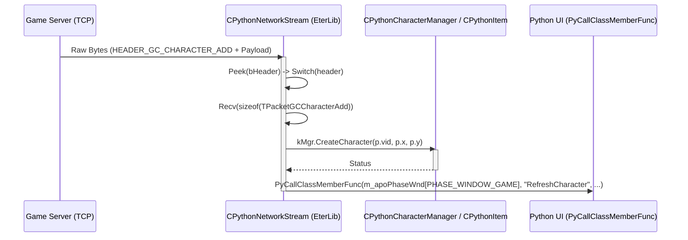

# Modul Pakietow Serwer -> Klient (GC)

## 1. Cel Architektoniczny i Rola Modulu
Modul Pakietow GC (Game Client) jest kluczowym komponentem warstwy sieciowej, odpowiedzialnym za odbieranie, deseralizacje i przetwarzanie danych przesylanych od serwera (Game Server) do klienta gry (C++). Glowna osia tej komunikacji jest protokol oparty na TCP/IP.
Pakiet GC definiuje pelen stan widocznego swiata gry, postaci, inwentarza, walki (PvE/PvP) oraz interakcji z UI.
`CPythonNetworkStream` dziala jako glowny dekoder i rozdzielacz (dispatcher), ktory parsuje naglowki (`HEADER_GC_*`) zdefiniowane w `source/UserInterface/Packet.h`, a nastepnie odczytuje reszte pakietu (strukture C typu `POD` - Plain Old Data) rzutujac bajty w pamieci na odpowiednie struktury `TPacketGC*`. Wymagane jest tu scisle wyrownanie pamieci (`#pragma pack(1)`).
Dane po zdekodowaniu przekazywane sa do odpowiednich podsystemow (np. `CPythonCharacterManager` dla postaci, `CPythonItem` dla przedmiotow) lub bezposrednio wywoluja funkcje Python API via `PyCallClassMemberFunc`.

## 2. Diagram Architektury i Przeplywu Danych

## 3. Rejestr Struktur Danych i Pamieci (Memory & Struct Layout)

Wszystkie struktury wykorzystuja scisle pakowanie pamieci, zazwyczaj ustawiane przez `#pragma pack(1)` na poziomie pliku lub kompilatora, co zapobiega dodawaniu pustych bajtow (paddingu) przez kompilator C++ (zgodnosc z serwerem).

### Enums (Wyliczenia)
#### `(Anonimowy Enum)`
- `HEADER_CG_LOGIN								= 1,`
- `HEADER_CG_ATTACK							= 2,`
- `HEADER_CG_CHAT								= 3,`
- `HEADER_CG_PLAYER_CREATE						= 4,		// »õ·Î¿î Ç÷¡À̾ »ý¼º`
- `HEADER_CG_PLAYER_DESTROY					= 5,		// Ç÷¡À̾ »èÁ¦.`
- `HEADER_CG_PLAYER_SELECT						= 6,`
- `HEADER_CG_CHARACTER_MOVE					= 7,`
- `HEADER_CG_SYNC_POSITION  					= 8,`
- `HEADER_CG_DIRECT_ENTER						= 9,`
- `HEADER_CG_ENTERGAME							= 10,`
- `HEADER_CG_ITEM_USE							= 11,`
- `HEADER_CG_ITEM_DROP							= 12,`
- `HEADER_CG_ITEM_MOVE							= 13,`
- `HEADER_CG_ITEM_PICKUP						= 15,`
- `HEADER_CG_QUICKSLOT_ADD                     = 16,`
- `HEADER_CG_QUICKSLOT_DEL                     = 17,`
- `HEADER_CG_QUICKSLOT_SWAP                    = 18,`
- `HEADER_CG_WHISPER							= 19,`
- `HEADER_CG_ITEM_DROP2                        = 20,`
- `HEADER_CG_ON_CLICK							= 26,`
- `HEADER_CG_EXCHANGE							= 27,`
- `HEADER_CG_CHARACTER_POSITION                = 28,`
- `HEADER_CG_SCRIPT_ANSWER						= 29,`
- `HEADER_CG_QUEST_INPUT_STRING				= 30,`
- `HEADER_CG_QUEST_CONFIRM                     = 31,`
- `HEADER_CG_PVP								= 41,`
- `HEADER_CG_SHOP								= 50,`
- `HEADER_CG_FLY_TARGETING						= 51,`
- `HEADER_CG_USE_SKILL							= 52,`
- `HEADER_CG_ADD_FLY_TARGETING                 = 53,`
- `HEADER_CG_SHOOT								= 54,`
- `HEADER_CG_MYSHOP                            = 55,`
- `HEADER_CG_ITEM_USE_TO_ITEM					= 60,`
- `HEADER_CG_TARGET                            = 61,`
- `HEADER_CG_WARP								= 65,`
- `HEADER_CG_SCRIPT_BUTTON						= 66,`
- `HEADER_CG_MESSENGER                         = 67,`
- `HEADER_CG_MALL_CHECKOUT                     = 69,`
- `HEADER_CG_SAFEBOX_CHECKIN                   = 70,   // ¾ÆÀÌÅÛÀ» â°í¿¡ ³Ö´Â´Ù.`
- `HEADER_CG_SAFEBOX_CHECKOUT                  = 71,   // ¾ÆÀÌÅÛÀ» â°í·Î ºÎÅÍ »©¿Â´Ù.`
- `HEADER_CG_PARTY_INVITE                      = 72,`
- `HEADER_CG_PARTY_INVITE_ANSWER               = 73,`
- `HEADER_CG_PARTY_REMOVE                      = 74,`
- `HEADER_CG_PARTY_SET_STATE                   = 75,`
- `HEADER_CG_PARTY_USE_SKILL                   = 76,`
- `HEADER_CG_SAFEBOX_ITEM_MOVE                 = 77,`
- `HEADER_CG_PARTY_PARAMETER                   = 78,`
- `HEADER_CG_GUILD								= 80,`
- `HEADER_CG_ANSWER_MAKE_GUILD					= 81,`
- `HEADER_CG_FISHING                           = 82,`
- `HEADER_CG_GIVE_ITEM                         = 83,`
- `HEADER_CG_EMPIRE                            = 90,`
- `HEADER_CG_REFINE                            = 96,`
- `HEADER_CG_MARK_LOGIN						= 100,`
- `HEADER_CG_MARK_CRCLIST						= 101,`
- `HEADER_CG_MARK_UPLOAD						= 102,`
- `HEADER_CG_MARK_IDXLIST						= 104,`
- `HEADER_CG_CRC_REPORT						= 103,`
- `HEADER_CG_HACK								= 105,`
- `HEADER_CG_CHANGE_NAME                       = 106,`
- `HEADER_CG_SMS                               = 107,`
- `HEADER_CG_CHINA_MATRIX_CARD                 = 108,`
- `HEADER_CG_LOGIN2                            = 109,`
- `HEADER_CG_DUNGEON							= 110,`
- `HEADER_CG_LOGIN3							= 111,`
- `HEADER_CG_GUILD_SYMBOL_UPLOAD				= 112,`
- `HEADER_CG_GUILD_SYMBOL_CRC					= 113,`
- `HEADER_CG_SCRIPT_SELECT_ITEM				= 114,`
- `HEADER_CG_LOGIN4							= 115,`
- `HEADER_CG_LOGIN5_OPENID						= 116,	//OpenID : ½ÇÇà½Ã ¹ÞÀº ÀÎÁõÅ°¸¦ ¼­¹ö¿¡ º¸³¿.`
- `HEADER_CG_RUNUP_MATRIX_ANSWER               = 201,`
- `HEADER_CG_NEWCIBN_PASSPOD_ANSWER			= 202,`
- `HEADER_CG_HS_ACK							= 203,`
- `HEADER_CG_XTRAP_ACK							= 204,`
- `HEADER_CG_DRAGON_SOUL_REFINE			= 205,`
- `HEADER_CG_STATE_CHECKER					= 206,`
- `#ifdef __AUCTION__`
- `HEADER_CG_AUCTION_CMD							= 205,`
- `#endif`
- `HEADER_CG_KEY_AGREEMENT						= 0xfb, // _IMPROVED_PACKET_ENCRYPTION_`
- `HEADER_CG_TIME_SYNC							= 0xfc,`
- `HEADER_CG_CLIENT_VERSION					= 0xfd,`
- `HEADER_CG_CLIENT_VERSION2					= 0xf1,`
- `HEADER_CG_PONG								= 0xfe,`
- `HEADER_CG_HANDSHAKE                         = 0xff,`
- `HEADER_GC_CHARACTER_ADD						= 1,`
- `HEADER_GC_CHARACTER_DEL						= 2,`
- `HEADER_GC_CHARACTER_MOVE					= 3,`
- `HEADER_GC_CHAT								= 4,`
- `HEADER_GC_SYNC_POSITION 					= 5,`
- `HEADER_GC_LOGIN_SUCCESS3					= 6,`
- `HEADER_GC_LOGIN_FAILURE						= 7,`
- `HEADER_GC_PLAYER_CREATE_SUCCESS				= 8,`
- `HEADER_GC_PLAYER_CREATE_FAILURE				= 9,`
- `HEADER_GC_PLAYER_DELETE_SUCCESS				= 10,`
- `HEADER_GC_PLAYER_DELETE_WRONG_SOCIAL_ID		= 11,`
- `HEADER_GC_STUN								= 13,`
- `HEADER_GC_DEAD								= 14,`
- `HEADER_GC_MAIN_CHARACTER					= 15,`
- `HEADER_GC_PLAYER_POINTS						= 16,`
- `HEADER_GC_PLAYER_POINT_CHANGE				= 17,`
- `HEADER_GC_CHANGE_SPEED						= 18,`
- `HEADER_GC_CHARACTER_UPDATE                  = 19,`
- `#if defined(GAIDEN)`
- `HEADER_GC_ITEM_DEL							= 20, // ¾ÆÀÌÅÛ Ã¢¿¡ Ãß°¡`
- `HEADER_GC_ITEM_SET							= 21, // ¾ÆÀÌÅÛ Ã¢¿¡ Ãß°¡`
- `#else`
- `HEADER_GC_ITEM_SET							= 20, // ¾ÆÀÌÅÛ Ã¢¿¡ Ãß°¡`
- `HEADER_GC_ITEM_SET2							= 21, // ¾ÆÀÌÅÛ Ã¢¿¡ Ãß°¡`
- `#endif`
- `HEADER_GC_ITEM_USE							= 22, // ¾ÆÀÌÅÛ »ç¿ë (ÁÖÀ§ »ç¶÷µé¿¡°Ô º¸¿©ÁÖ±â À§ÇØ)`
- `HEADER_GC_ITEM_DROP							= 23, // ¾ÆÀÌÅÛ ¹ö¸®±â`
- `HEADER_GC_ITEM_UPDATE						= 25, // ¾ÆÀÌÅÛ ¼öÄ¡ ¾÷µ¥ÀÌÆ®`
- `HEADER_GC_ITEM_GROUND_ADD					= 26, // ¹Ù´Ú¿¡ ¾ÆÀÌÅÛ Ãß°¡`
- `HEADER_GC_ITEM_GROUND_DEL					= 27, // ¹Ù´Ú¿¡¼­ ¾ÆÀÌÅÛ »èÁ¦`
- `HEADER_GC_QUICKSLOT_ADD                     = 28,`
- `HEADER_GC_QUICKSLOT_DEL                     = 29,`
- `HEADER_GC_QUICKSLOT_SWAP                    = 30,`
- `HEADER_GC_ITEM_OWNERSHIP					= 31,`
- `HEADER_GC_LOGIN_SUCCESS4					= 32,`
- `HEADER_GC_ITEM_UNBIND_TIME					= 33,`
- `HEADER_GC_WHISPER							= 34,`
- `HEADER_GC_ALERT								= 35,`
- `HEADER_GC_MOTION							= 36,`
- `HEADER_GC_SHOP							    = 38,`
- `HEADER_GC_SHOP_SIGN							= 39,`
- `HEADER_GC_DUEL_START						= 40,`
- `HEADER_GC_PVP								= 41,`
- `HEADER_GC_EXCHANGE							= 42,`
- `HEADER_GC_CHARACTER_POSITION                = 43,`
- `HEADER_GC_PING								= 44,`
- `HEADER_GC_SCRIPT							= 45,`
- `HEADER_GC_QUEST_CONFIRM                     = 46,`
- `HEADER_GC_MOUNT								= 61,`
- `HEADER_GC_OWNERSHIP                         = 62,`
- `HEADER_GC_TARGET                            = 63,`
- `HEADER_GC_WARP								= 65,`
- `HEADER_GC_ADD_FLY_TARGETING                 = 69,`
- `HEADER_GC_CREATE_FLY						= 70,`
- `HEADER_GC_FLY_TARGETING						= 71,`
- `HEADER_GC_SKILL_LEVEL						= 72,`
- `HEADER_GC_SKILL_COOLTIME_END				= 73,`
- `HEADER_GC_MESSENGER                         = 74,`
- `HEADER_GC_GUILD								= 75,`
- `HEADER_GC_SKILL_LEVEL_NEW					= 76,`
- `HEADER_GC_PARTY_INVITE                      = 77,`
- `HEADER_GC_PARTY_ADD                         = 78,`
- `HEADER_GC_PARTY_UPDATE                      = 79,`
- `HEADER_GC_PARTY_REMOVE                      = 80,`
- `HEADER_GC_QUEST_INFO                        = 81,`
- `HEADER_GC_REQUEST_MAKE_GUILD                = 82,`
- `HEADER_GC_PARTY_PARAMETER                   = 83,`
- `HEADER_GC_SAFEBOX_MONEY_CHANGE              = 84,`
- `HEADER_GC_SAFEBOX_SET                       = 85,`
- `HEADER_GC_SAFEBOX_DEL                       = 86,`
- `HEADER_GC_SAFEBOX_WRONG_PASSWORD            = 87,`
- `HEADER_GC_SAFEBOX_SIZE                      = 88,`
- `HEADER_GC_FISHING                           = 89,`
- `HEADER_GC_EMPIRE                            = 90,`
- `HEADER_GC_PARTY_LINK                        = 91,`
- `HEADER_GC_PARTY_UNLINK                      = 92,`
- `HEADER_GC_REFINE_INFORMATION                = 95,`
- `HEADER_GC_OBSERVER_ADD						= 96,`
- `HEADER_GC_OBSERVER_REMOVE					= 97,`
- `HEADER_GC_OBSERVER_MOVE						= 98,`
- `HEADER_GC_VIEW_EQUIP                        = 99,`
- `HEADER_GC_MARK_BLOCK						= 100,`
- `HEADER_GC_MARK_DIFF_DATA                    = 101,`
- `HEADER_GC_MARK_IDXLIST						= 102,`
- `HEADER_GC_TIME                              = 106,`
- `HEADER_GC_CHANGE_NAME                       = 107,`
- `HEADER_GC_DUNGEON							= 110,`
- `HEADER_GC_WALK_MODE							= 111,`
- `HEADER_GC_CHANGE_SKILL_GROUP				= 112,`
- `#if defined(GAIDEN)`
- `HEADER_GC_MAIN_CHARACTER					= 113,`
- `HEADER_GC_MAIN_CHARACTER3_BGM				= 137,`
- `HEADER_GC_MAIN_CHARACTER4_BGM_VOL			= 138,`
- `#else`
- `HEADER_GC_MAIN_CHARACTER2_EMPIRE			= 113,`
- `#endif`
- `HEADER_GC_SEPCIAL_EFFECT                    = 114,`
- `HEADER_GC_NPC_POSITION						= 115,`
- `HEADER_GC_CHINA_MATRIX_CARD                 = 116,`
- `HEADER_GC_CHARACTER_UPDATE2                 = 117,`
- `HEADER_GC_LOGIN_KEY                         = 118,`
- `HEADER_GC_REFINE_INFORMATION_NEW            = 119,`
- `HEADER_GC_CHARACTER_ADD2                    = 120,`
- `HEADER_GC_CHANNEL                           = 121,`
- `HEADER_GC_MALL_OPEN                         = 122,`
- `HEADER_GC_TARGET_UPDATE                     = 123,`
- `HEADER_GC_TARGET_DELETE                     = 124,`
- `HEADER_GC_TARGET_CREATE_NEW                 = 125,`
- `HEADER_GC_AFFECT_ADD                        = 126,`
- `HEADER_GC_AFFECT_REMOVE                     = 127,`
- `HEADER_GC_MALL_SET                          = 128,`
- `HEADER_GC_MALL_DEL                          = 129,`
- `HEADER_GC_LAND_LIST                         = 130,`
- `HEADER_GC_LOVER_INFO						= 131,`
- `HEADER_GC_LOVE_POINT_UPDATE					= 132,`
- `HEADER_GC_GUILD_SYMBOL_DATA					= 133,`
- `HEADER_GC_DIG_MOTION                        = 134,`
- `HEADER_GC_DAMAGE_INFO						= 135,`
- `HEADER_GC_CHAR_ADDITIONAL_INFO				= 136,`
- `HEADER_GC_MAIN_CHARACTER3_BGM				= 137,`
- `HEADER_GC_MAIN_CHARACTER4_BGM_VOL			= 138,`
- `HEADER_GC_AUTH_SUCCESS                      = 150,`
- `HEADER_GC_PANAMA_PACK						= 151,`
- `HEADER_GC_HYBRIDCRYPT_KEYS					= 152,`
- `HEADER_GC_HYBRIDCRYPT_SDB					= 153, // SDB means Supplmentary Data Blocks`
- `HEADER_GC_AUTH_SUCCESS_OPENID				= 154,`
- `HEADER_GC_RUNUP_MATRIX_QUIZ                 = 201,`
- `HEADER_GC_NEWCIBN_PASSPOD_REQUEST			= 202,`
- `HEADER_GC_NEWCIBN_PASSPOD_FAILURE			= 203,`
- `#if defined(GAIDEN)`
- `HEADER_GC_ONTIME							= 204,`
- `HEADER_GC_RESET_ONTIME						= 205,`
- `HEADER_GC_AUTOBAN_QUIZ						= 206,`
- `HEADER_GC_HS_REQUEST						= 207,	// Origially it's 204 on devel branch`
- `#else`
- `HEADER_GC_HS_REQUEST						= 204,`
- `HEADER_GC_XTRAP_CS1_REQUEST					= 205,`
- `#endif`
- `#ifdef __AUCTION__`
- `HEADER_GC_AUCTOIN_ITEM_LIST					= 206,`
- `#endif`
- `HEADER_GC_SPECIFIC_EFFECT					= 208,`
- `HEADER_GC_DRAGON_SOUL_REFINE						= 209,`
- `HEADER_GC_RESPOND_CHANNELSTATUS				= 210,`
- `HEADER_GC_KEY_AGREEMENT_COMPLETED			= 0xfa, // _IMPROVED_PACKET_ENCRYPTION_`
- `HEADER_GC_KEY_AGREEMENT						= 0xfb, // _IMPROVED_PACKET_ENCRYPTION_`
- `HEADER_GC_HANDSHAKE_OK						= 0xfc, // 252`
- `HEADER_GC_PHASE								= 0xfd,	// 253`
- `HEADER_GC_BINDUDP                           = 0xfe, // 254`
- `HEADER_GC_HANDSHAKE                         = 0xff, // 255`
- `/*`
- `HEADER_CC_STATE_WAITING						= 1,`
- `HEADER_CC_STATE_WALKING						= 2,`
- `HEADER_CC_STATE_GOING						= 3,`
- `HEADER_CC_EVENT_NORMAL_ATTACKING			= 4,`
- `HEADER_CC_EVENT_COMBO_ATTACKING				= 5,`
- `HEADER_CC_EVENT_HIT							= 6,`
- `*/`

#### `(Anonimowy Enum)`
- `ID_MAX_NUM = 30,`
- `PASS_MAX_NUM = 16,`
- `CHAT_MAX_NUM = 128,`
- `PATH_NODE_MAX_NUM = 64,`
- `SHOP_SIGN_MAX_LEN = 32,`
- `PLAYER_PER_ACCOUNT3 = 3,`
- `PLAYER_PER_ACCOUNT4 = 4,`
- `PLAYER_ITEM_SLOT_MAX_NUM = 20,		// Ç÷¡À̾îÀÇ ½½·Ô´ç µé¾î°¡´Â °¹¼ö.`
- `QUICKSLOT_MAX_LINE = 4,`
- `QUICKSLOT_MAX_COUNT_PER_LINE = 8, // Ŭ¶oÀ̾ðÆ® ÀOÀÇ °áÁ¤°ª`
- `QUICKSLOT_MAX_COUNT = QUICKSLOT_MAX_LINE * QUICKSLOT_MAX_COUNT_PER_LINE,`
- `QUICKSLOT_MAX_NUM = 36, // ¼­¹ö¿Í ¸ÂÃçÁ® ÀÖ´Â °ª`
- `SHOP_HOST_ITEM_MAX_NUM = 40,`
- `METIN_SOCKET_COUNT = 6,`
- `PARTY_AFFECT_SLOT_MAX_NUM = 7,`
- `GUILD_GRADE_NAME_MAX_LEN = 8,`
- `GUILD_NAME_MAX_LEN = 12,`
- `GUILD_GRADE_COUNT = 15,`
- `GULID_COMMENT_MAX_LEN = 50,`
- `MARK_CRC_NUM = 8*8,`
- `MARK_DATA_SIZE = 16*12,`
- `SYMBOL_DATA_SIZE = 128*256,`
- `QUEST_INPUT_STRING_MAX_NUM = 64,`
- `PRIVATE_CODE_LENGTH = 8,`
- `REFINE_MATERIAL_MAX_NUM = 5,`
- `CHINA_MATRIX_ANSWER_MAX_LEN	= 8,`
- `RUNUP_MATRIX_QUIZ_MAX_LEN	= 8,`
- `RUNUP_MATRIX_ANSWER_MAX_LEN = 4,`
- `NEWCIBN_PASSPOD_ANSWER_MAX_LEN = 8,`
- `NEWCIBN_PASSPOD_FAILURE_MAX_LEN = 128,`
- `WEAR_MAX_NUM = 11,`
- `OPENID_AUTHKEY_LEN = 32,`
- `SHOP_TAB_NAME_MAX = 32,`
- `SHOP_TAB_COUNT_MAX = 3,`

#### `EBattleMode`
- `BATTLEMODE_ATTACK = 0,`
- `BATTLEMODE_DEFENSE = 1,`

#### `(Anonimowy Enum)`
- `SHOP_SUBHEADER_CG_END,`
- `SHOP_SUBHEADER_CG_BUY,`
- `SHOP_SUBHEADER_CG_SELL,`
- `SHOP_SUBHEADER_CG_SELL2,`

#### `(Anonimowy Enum)`
- `EXCHANGE_SUBHEADER_CG_START,			// arg1 == vid of target character`
- `EXCHANGE_SUBHEADER_CG_ITEM_ADD,		// arg1 == position of item`
- `EXCHANGE_SUBHEADER_CG_ITEM_DEL,		// arg1 == position of item`
- `EXCHANGE_SUBHEADER_CG_ELK_ADD,			// arg1 == amount of elk`
- `EXCHANGE_SUBHEADER_CG_ACCEPT,			// arg1 == not used`
- `EXCHANGE_SUBHEADER_CG_CANCEL,			// arg1 == not used`

#### `(Anonimowy Enum)`
- `MESSENGER_SUBHEADER_GC_LIST,`
- `MESSENGER_SUBHEADER_GC_LOGIN,`
- `MESSENGER_SUBHEADER_GC_LOGOUT,`
- `MESSENGER_SUBHEADER_GC_INVITE,`
- `MESSENGER_SUBHEADER_GC_MOBILE,`

#### `(Anonimowy Enum)`
- `MESSENGER_CONNECTED_STATE_OFFLINE,`
- `MESSENGER_CONNECTED_STATE_ONLINE,`
- `MESSENGER_CONNECTED_STATE_MOBILE,`

#### `(Anonimowy Enum)`
- `MESSENGER_SUBHEADER_CG_ADD_BY_VID,`
- `MESSENGER_SUBHEADER_CG_ADD_BY_NAME,`
- `MESSENGER_SUBHEADER_CG_REMOVE,`

#### `(Anonimowy Enum)`
- `SAFEBOX_MONEY_STATE_SAVE,`
- `SAFEBOX_MONEY_STATE_WITHDRAW,`

#### `(Anonimowy Enum)`
- `GUILD_SUBHEADER_CG_ADD_MEMBER,`
- `GUILD_SUBHEADER_CG_REMOVE_MEMBER,`
- `GUILD_SUBHEADER_CG_CHANGE_GRADE_NAME,`
- `GUILD_SUBHEADER_CG_CHANGE_GRADE_AUTHORITY,`
- `GUILD_SUBHEADER_CG_OFFER,`
- `GUILD_SUBHEADER_CG_POST_COMMENT,`
- `GUILD_SUBHEADER_CG_DELETE_COMMENT,`
- `GUILD_SUBHEADER_CG_REFRESH_COMMENT,`
- `GUILD_SUBHEADER_CG_CHANGE_MEMBER_GRADE,`
- `GUILD_SUBHEADER_CG_USE_SKILL,`
- `GUILD_SUBHEADER_CG_CHANGE_MEMBER_GENERAL,`
- `GUILD_SUBHEADER_CG_GUILD_INVITE_ANSWER,`
- `GUILD_SUBHEADER_CG_CHARGE_GSP,`
- `GUILD_SUBHEADER_CG_DEPOSIT_MONEY,`
- `GUILD_SUBHEADER_CG_WITHDRAW_MONEY,`

#### `EPartyExpDistributionType`
- `PARTY_EXP_DISTRIBUTION_NON_PARITY,`
- `PARTY_EXP_DISTRIBUTION_PARITY,`

#### `EPhase`
- `PHASE_CLOSE,				// ²÷±â´Â »oÅ (¶Ç´Â ²÷±â Àü »oÅÂ)`
- `PHASE_HANDSHAKE,			// ¾Ç¼ö..;;`
- `PHASE_LOGIN,				// ·Î±×ÀÎ Áß`
- `PHASE_SELECT,				// ij¸¯ÅÍ ¼±Åà ȭ¸é`
- `PHASE_LOADING,				// ¼±Åà ÈÄ ·Îµù È­¸é`
- `PHASE_GAME,					// °ÔÀO È­¸é`
- `PHASE_DEAD,					// Á×¾úÀ» ¶§.. (°ÔÀO ¾È¿¡ ÀÖ´Â °ÍÀÏ ¼öµµ..)`
- `PHASE_DBCLIENT_CONNECTING,	// ¼­¹ö¿ë`
- `PHASE_DBCLIENT,				// ¼­¹ö¿ë`
- `PHASE_P2P,					// ¼­¹ö¿ë`
- `PHASE_AUTH,					// ·Î±×ÀÎ ÀÎÁõ ¿ë`

#### `(Anonimowy Enum)`
- `LOGIN_STATUS_MAX_LEN = 8`

#### `(Anonimowy Enum)`
- `ADD_CHARACTER_STATE_DEAD   = (1 << 0),`
- `ADD_CHARACTER_STATE_SPAWN  = (1 << 1),`
- `ADD_CHARACTER_STATE_GUNGON = (1 << 2),`
- `ADD_CHARACTER_STATE_KILLER = (1 << 3),`
- `ADD_CHARACTER_STATE_PARTY  = (1 << 4),`

#### `EPKModes`
- `PK_MODE_PEACE,`
- `PK_MODE_REVENGE,`
- `PK_MODE_FREE,`
- `PK_MODE_PROTECT,`
- `PK_MODE_GUILD,`
- `PK_MODE_MAX_NUM,`

#### `ECharacterEquipmentPart`
- `CHR_EQUIPPART_ARMOR,`
- `CHR_EQUIPPART_WEAPON,`
- `CHR_EQUIPPART_HEAD,`
- `CHR_EQUIPPART_HAIR,`
- `CHR_EQUIPPART_NUM,`

#### `EChatType`
- `CHAT_TYPE_TALKING,  /* ±×³É äÆà */`
- `CHAT_TYPE_INFO,     /* Á¤º¸ (¾ÆÀÌÅÛÀ» Áý¾ú´Ù, °æÇèÄ¡¸¦ ¾ò¾ú´Ù. µî) */`
- `CHAT_TYPE_NOTICE,   /* °øÁö»çÇ× */`
- `CHAT_TYPE_PARTY,    /* ÆÄƼ¸» */`
- `CHAT_TYPE_GUILD,    /* ±æµå¸» */`
- `CHAT_TYPE_COMMAND,	/* ¸í·É */`
- `CHAT_TYPE_SHOUT,	/* ¿ÜÄ¡±â */`
- `CHAT_TYPE_WHISPER,	// ¼­¹ö¿Í´Â ¿¬µ¿µÇÁö ¾Ê´Â Only Client Enum`
- `CHAT_TYPE_BIG_NOTICE,`
- `CHAT_TYPE_MAX_NUM,`

#### `(Anonimowy Enum)`
- `MUSIC_NAME_MAX_LEN = 24,`

#### `(Anonimowy Enum)`
- `MUSIC_NAME_MAX_LEN = 24,`

#### `EPointTypes`
- `POINT_NONE,                 // 0`
- `POINT_LEVEL,                // 1`
- `POINT_VOICE,                // 2`
- `POINT_EXP,                  // 3`
- `POINT_NEXT_EXP,             // 4`
- `POINT_HP,                   // 5`
- `POINT_MAX_HP,               // 6`
- `POINT_SP,                   // 7`
- `POINT_MAX_SP,               // 8`
- `POINT_STAMINA,              // 9  ½ºÅ׹̳Ê`
- `POINT_MAX_STAMINA,          // 10 ÃÖ´ë ½ºÅ׹̳Ê`
- `POINT_GOLD,                 // 11`
- `POINT_ST,                   // 12 ±Ù·Â`
- `POINT_HT,                   // 13 ü·Â`
- `POINT_DX,                   // 14 ¹Îø¼º`
- `POINT_IQ,                   // 15 Á¤½Å·Â`
- `POINT_ATT_POWER,            // 16 °ø°Ý·Â`
- `POINT_ATT_SPEED,            // 17 °ø°Ý¼Oµµ`
- `POINT_EVADE_RATE,           // 18 ȸÇÇÀ²`
- `POINT_MOV_SPEED,            // 19 À̵¿¼Oµµ`
- `POINT_DEF_GRADE,            // 20 ¹æ¾îµî±Þ`
- `POINT_CASTING_SPEED,        // 21 ÁÖ¹®¼Oµµ (Äð´Ù¿îŸÀO*100) / (100 + ÀÌ°ª) = ÃÖÁ¾ Äð´Ù¿î ŸÀO`
- `POINT_MAGIC_ATT_GRADE,      // 22 ¸¶¹ý°ø°Ý·Â`
- `POINT_MAGIC_DEF_GRADE,      // 23 ¸¶¹ý¹æ¾î·Â`
- `POINT_EMPIRE_POINT,         // 24 Á¦±¹Á¡¼ö`
- `POINT_LEVEL_STEP,           // 25 ÇÑ ·¹º§¿¡¼­ÀÇ ´Ü°è.. (1 2 3 µÉ ¶§ º¸»o, 4 µÇ¸é ·¹º§ ¾÷)`
- `POINT_STAT,                 // 26 ´É·ÂÄ¡ ¿Ã¸± ¼ö ÀÖ´Â °³¼ö`
- `POINT_SUB_SKILL,            // 27 º¸Á¶ ½ºÅ³ Æ÷ÀÎÆ®`
- `POINT_SKILL,                // 28 ¾×Ƽºê ½ºÅ³ Æ÷ÀÎÆ®`
- `POINT_MIN_ATK,				// 29 ÃÖ¼Ò Æı«·Â`
- `POINT_MAX_ATK,				// 30 ÃÖ´ë Æı«·Â`
- `POINT_PLAYTIME,             // 31 Ç÷¹À̽ð£`
- `POINT_HP_REGEN,             // 32 HP ȸº¹·ü`
- `POINT_SP_REGEN,             // 33 SP ȸº¹·ü`
- `POINT_BOW_DISTANCE,         // 34 È° »çÁ¤°Å¸® Áõ°¡Ä¡ (meter)`
- `POINT_HP_RECOVERY,          // 35 ü·Â ȸº¹ Áõ°¡·®`
- `POINT_SP_RECOVERY,          // 36 Á¤½Å·Â ȸº¹ Áõ°¡·®`
- `POINT_POISON_PCT,           // 37 µ¶ È®·ü`
- `POINT_STUN_PCT,             // 38 ±âÀý È®·ü`
- `POINT_SLOW_PCT,             // 39 ½½·Î¿ì È®·ü`
- `POINT_CRITICAL_PCT,         // 40 Å©¸®Æ¼Äà Ȯ·ü`
- `POINT_PENETRATE_PCT,        // 41 °üÅëŸ°Ý È®·ü`
- `POINT_CURSE_PCT,            // 42 ÀúÁÖ È®·ü`
- `POINT_ATTBONUS_HUMAN,       // 43 Àΰ£¿¡°Ô °­ÇÔ`
- `POINT_ATTBONUS_ANIMAL,      // 44 µ¿¹°¿¡°Ô µ¥¹ÌÁö % Áõ°¡`
- `POINT_ATTBONUS_ORC,         // 45 ¿õ±Í¿¡°Ô µ¥¹ÌÁö % Áõ°¡`
- `POINT_ATTBONUS_MILGYO,      // 46 ¹Ð±³¿¡°Ô µ¥¹ÌÁö % Áõ°¡`
- `POINT_ATTBONUS_UNDEAD,      // 47 ½Ãü¿¡°Ô µ¥¹ÌÁö % Áõ°¡`
- `POINT_ATTBONUS_DEVIL,       // 48 ¸¶±Í(¾Ç¸¶)¿¡°Ô µ¥¹ÌÁö % Áõ°¡`
- `POINT_ATTBONUS_INSECT,      // 49 ¹ú·¹Á·`
- `POINT_ATTBONUS_FIRE,        // 50 È­¿°Á·`
- `POINT_ATTBONUS_ICE,         // 51 ºù¼³Á·`
- `POINT_ATTBONUS_DESERT,      // 52 »ç¸·Á·`
- `POINT_ATTBONUS_UNUSED0,     // 53 UNUSED0`
- `POINT_ATTBONUS_UNUSED1,     // 54 UNUSED1`
- `POINT_ATTBONUS_UNUSED2,     // 55 UNUSED2`
- `POINT_ATTBONUS_UNUSED3,     // 56 UNUSED3`
- `POINT_ATTBONUS_UNUSED4,     // 57 UNUSED4`
- `POINT_ATTBONUS_UNUSED5,     // 58 UNUSED5`
- `POINT_ATTBONUS_UNUSED6,     // 59 UNUSED6`
- `POINT_ATTBONUS_UNUSED7,     // 60 UNUSED7`
- `POINT_ATTBONUS_UNUSED8,     // 61 UNUSED8`
- `POINT_ATTBONUS_UNUSED9,     // 62 UNUSED9`
- `POINT_STEAL_HP,             // 63 »ý¸í·Â Èí¼ö`
- `POINT_STEAL_SP,             // 64 Á¤½Å·Â Èí¼ö`
- `POINT_MANA_BURN_PCT,        // 65 ¸¶³ª ¹ø`
- `POINT_DAMAGE_SP_RECOVER,    // 66 °ø°Ý´çÇÒ ½Ã Á¤½Å·Â ȸº¹ È®·ü`
- `POINT_BLOCK,                // 67 ºí·°À²`
- `POINT_DODGE,                // 68 ȸÇÇÀ²`
- `POINT_RESIST_SWORD,         // 69`
- `POINT_RESIST_TWOHAND,       // 70`
- `POINT_RESIST_DAGGER,        // 71`
- `POINT_RESIST_BELL,          // 72`
- `POINT_RESIST_FAN,           // 73`
- `POINT_RESIST_BOW,           // 74  È­»ì   ÀúÇ×   : ´ë¹ÌÁö °¨¼Ò`
- `POINT_RESIST_FIRE,          // 75  È­¿°   ÀúÇ×   : È­¿°°ø°Ý¿¡ ´ëÇÑ ´ë¹ÌÁö °¨¼Ò`
- `POINT_RESIST_ELEC,          // 76  Àü±â   ÀúÇ×   : Àü±â°ø°Ý¿¡ ´ëÇÑ ´ë¹ÌÁö °¨¼Ò`
- `POINT_RESIST_MAGIC,         // 77  ¼ú¹ý   ÀúÇ×   : ¸ðµç¼ú¹ý¿¡ ´ëÇÑ ´ë¹ÌÁö °¨¼Ò`
- `POINT_RESIST_WIND,          // 78  ¹Ù¶÷   ÀúÇ×   : ¹Ù¶÷°ø°Ý¿¡ ´ëÇÑ ´ë¹ÌÁö °¨¼Ò`
- `POINT_REFLECT_MELEE,        // 79 °ø°Ý ¹Ý»ç`
- `POINT_REFLECT_CURSE,        // 80 ÀúÁÖ ¹Ý»ç`
- `POINT_POISON_REDUCE,        // 81 µ¶µ¥¹ÌÁö °¨¼Ò`
- `POINT_KILL_SP_RECOVER,      // 82 Àû ¼Ò¸ê½Ã MP ȸº¹`
- `POINT_EXP_DOUBLE_BONUS,     // 83`
- `POINT_GOLD_DOUBLE_BONUS,    // 84`
- `POINT_ITEM_DROP_BONUS,      // 85`
- `POINT_POTION_BONUS,         // 86`
- `POINT_KILL_HP_RECOVER,      // 87`
- `POINT_IMMUNE_STUN,          // 88`
- `POINT_IMMUNE_SLOW,          // 89`
- `POINT_IMMUNE_FALL,          // 90`
- `POINT_PARTY_ATT_GRADE,      // 91`
- `POINT_PARTY_DEF_GRADE,      // 92`
- `POINT_ATT_BONUS,            // 93`
- `POINT_DEF_BONUS,            // 94`
- `POINT_ATT_GRADE_BONUS,			// 95`
- `POINT_DEF_GRADE_BONUS,			// 96`
- `POINT_MAGIC_ATT_GRADE_BONUS,	// 97`
- `POINT_MAGIC_DEF_GRADE_BONUS,	// 98`
- `POINT_RESIST_NORMAL_DAMAGE,		// 99`
- `POINT_STAT_RESET_COUNT = 112,`
- `POINT_HORSE_SKILL = 113,`
- `POINT_MALL_ATTBONUS,		// 114 °ø°Ý·Â +x%`
- `POINT_MALL_DEFBONUS,		// 115 ¹æ¾î·Â +x%`
- `POINT_MALL_EXPBONUS,		// 116 °æÇèÄ¡ +x%`
- `POINT_MALL_ITEMBONUS,		// 117 ¾ÆÀÌÅÛ µå·OÀ² x/10¹è`
- `POINT_MALL_GOLDBONUS,		// 118 µ· µå·OÀ² x/10¹è`
- `POINT_MAX_HP_PCT,			// 119 ÃÖ´ë»ý¸í·Â +x%`
- `POINT_MAX_SP_PCT,			// 120 ÃÖ´ëÁ¤½Å·Â +x%`
- `POINT_SKILL_DAMAGE_BONUS,       // 121 ½ºÅ³ µ¥¹ÌÁö *(100+x)%`
- `POINT_NORMAL_HIT_DAMAGE_BONUS,  // 122 ÆòŸ µ¥¹ÌÁö *(100+x)%`
- `POINT_SKILL_DEFEND_BONUS,       // 123 ½ºÅ³ ¹æ¾î µ¥¹ÌÁö`
- `POINT_NORMAL_HIT_DEFEND_BONUS,  // 124 ÆòŸ ¹æ¾î µ¥¹ÌÁö`
- `POINT_PC_BANG_EXP_BONUS,        // 125`
- `POINT_PC_BANG_DROP_BONUS,       // 126 PC¹æ Àü¿ë µå·O·ü º¸³Ê½º`
- `POINT_ENERGY = 128,				// 128 ±â·Â`
- `POINT_ENERGY_END_TIME = 129,	// 129 ±â·Â Á¾·á ½Ã°£`
- `POINT_MIN_WEP = 200,`
- `POINT_MAX_WEP,`
- `POINT_MIN_MAGIC_WEP,`
- `POINT_MAX_MAGIC_WEP,`
- `POINT_HIT_RATE,`

#### `EPacketShopSubHeaders`
- `SHOP_SUBHEADER_GC_START,`
- `SHOP_SUBHEADER_GC_END,`
- `SHOP_SUBHEADER_GC_UPDATE_ITEM,`
- `SHOP_SUBHEADER_GC_UPDATE_PRICE,`
- `SHOP_SUBHEADER_GC_OK,`
- `SHOP_SUBHEADER_GC_NOT_ENOUGH_MONEY,`
- `SHOP_SUBHEADER_GC_SOLDOUT,`
- `SHOP_SUBHEADER_GC_INVENTORY_FULL,`
- `SHOP_SUBHEADER_GC_INVALID_POS,`
- `SHOP_SUBHEADER_GC_SOLD_OUT,`
- `SHOP_SUBHEADER_GC_START_EX,`
- `SHOP_SUBHEADER_GC_NOT_ENOUGH_MONEY_EX,`

#### `(Anonimowy Enum)`
- `EXCHANGE_SUBHEADER_GC_START,			// arg1 == vid`
- `EXCHANGE_SUBHEADER_GC_ITEM_ADD,		// arg1 == vnum  arg2 == pos  arg3 == count`
- `EXCHANGE_SUBHEADER_GC_ITEM_DEL,		// arg1 == pos`
- `EXCHANGE_SUBHEADER_GC_ELK_ADD,			// arg1 == elk`
- `EXCHANGE_SUBHEADER_GC_ACCEPT,			// arg1 == accept`
- `EXCHANGE_SUBHEADER_GC_END,				// arg1 == not used`
- `EXCHANGE_SUBHEADER_GC_ALREADY,			// arg1 == not used`
- `EXCHANGE_SUBHEADER_GC_LESS_ELK,		// arg1 == not used`

#### `(Anonimowy Enum)`
- `QUEST_SEND_IS_BEGIN         = 1 << 0,`
- `QUEST_SEND_TITLE            = 1 << 1,  // 28ÀÚ ±îÁö`
- `QUEST_SEND_CLOCK_NAME       = 1 << 2,  // 16ÀÚ ±îÁö`
- `QUEST_SEND_CLOCK_VALUE      = 1 << 3,`
- `QUEST_SEND_COUNTER_NAME     = 1 << 4,  // 16ÀÚ ±îÁö`
- `QUEST_SEND_COUNTER_VALUE    = 1 << 5,`
- `QUEST_SEND_ICON_FILE		= 1 << 6,  // 24ÀÚ ±îÁö`

#### `EPVPModes`
- `PVP_MODE_NONE,`
- `PVP_MODE_AGREE,`
- `PVP_MODE_FIGHT,`
- `PVP_MODE_REVENGE,`

#### `(Anonimowy Enum)`
- `FISHING_SUBHEADER_GC_START,`
- `FISHING_SUBHEADER_GC_STOP,`
- `FISHING_SUBHEADER_GC_REACT,`
- `FISHING_SUBHEADER_GC_SUCCESS,`
- `FISHING_SUBHEADER_GC_FAIL,`
- `FISHING_SUBHEADER_GC_FISH,`

#### `(Anonimowy Enum)`
- `GUILD_SUBHEADER_GC_LOGIN,`
- `GUILD_SUBHEADER_GC_LOGOUT,`
- `GUILD_SUBHEADER_GC_LIST,`
- `GUILD_SUBHEADER_GC_GRADE,`
- `GUILD_SUBHEADER_GC_ADD,`
- `GUILD_SUBHEADER_GC_REMOVE,`
- `GUILD_SUBHEADER_GC_GRADE_NAME,`
- `GUILD_SUBHEADER_GC_GRADE_AUTH,`
- `GUILD_SUBHEADER_GC_INFO,`
- `GUILD_SUBHEADER_GC_COMMENTS,`
- `GUILD_SUBHEADER_GC_CHANGE_EXP,`
- `GUILD_SUBHEADER_GC_CHANGE_MEMBER_GRADE,`
- `GUILD_SUBHEADER_GC_SKILL_INFO,`
- `GUILD_SUBHEADER_GC_CHANGE_MEMBER_GENERAL,`
- `GUILD_SUBHEADER_GC_GUILD_INVITE,`
- `GUILD_SUBHEADER_GC_WAR,`
- `GUILD_SUBHEADER_GC_GUILD_NAME,`
- `GUILD_SUBHEADER_GC_GUILD_WAR_LIST,`
- `GUILD_SUBHEADER_GC_GUILD_WAR_END_LIST,`
- `GUILD_SUBHEADER_GC_WAR_POINT,`
- `GUILD_SUBHEADER_GC_MONEY_CHANGE,`

#### `(Anonimowy Enum)`
- `GUILD_AUTH_ADD_MEMBER       = (1 << 0),`
- `GUILD_AUTH_REMOVE_MEMBER    = (1 << 1),`
- `GUILD_AUTH_NOTICE           = (1 << 2),`
- `GUILD_AUTH_SKILL            = (1 << 3),`

#### `EGuildWarState`
- `GUILD_WAR_NONE,`
- `GUILD_WAR_SEND_DECLARE,`
- `GUILD_WAR_REFUSE,`
- `GUILD_WAR_RECV_DECLARE,`
- `GUILD_WAR_WAIT_START,`
- `GUILD_WAR_CANCEL,`
- `GUILD_WAR_ON_WAR,`
- `GUILD_WAR_END,`
- `GUILD_WAR_DURATION = 2*60*60, // 2½Ã°£`

#### `(Anonimowy Enum)`
- `DUNGEON_SUBHEADER_GC_TIME_ATTACK_START = 0,`
- `DUNGEON_SUBHEADER_GC_DESTINATION_POSITION = 1,`

#### `(Anonimowy Enum)`
- `WALKMODE_RUN,`
- `WALKMODE_WALK,`

#### `SPECIAL_EFFECT`
- `SE_NONE,`
- `SE_HPUP_RED,`
- `SE_SPUP_BLUE,`
- `SE_SPEEDUP_GREEN,`
- `SE_DXUP_PURPLE,`
- `SE_CRITICAL,`
- `SE_PENETRATE,`
- `SE_BLOCK,`
- `SE_DODGE,`
- `SE_CHINA_FIREWORK,`
- `SE_SPIN_TOP,`
- `SE_SUCCESS,`
- `SE_FAIL,`
- `SE_FR_SUCCESS,`
- `SE_LEVELUP_ON_14_FOR_GERMANY,	//·¹º§¾÷ 14À϶§ ( µ¶ÀÏÀü¿ë )`
- `SE_LEVELUP_UNDER_15_FOR_GERMANY,//·¹º§¾÷ 15À϶§ ( µ¶ÀÏÀü¿ë )`
- `SE_PERCENT_DAMAGE1,`
- `SE_PERCENT_DAMAGE2,`
- `SE_PERCENT_DAMAGE3,`
- `SE_AUTO_HPUP,`
- `SE_AUTO_SPUP,`
- `SE_EQUIP_RAMADAN_RING,			// Ãʽ´ÞÀÇ ¹ÝÁö¸¦ Âø¿ëÇÏ´Â ¼ø°£¿¡ ¹ßµ¿ÇÏ´Â ÀÌÆåÆ®`
- `SE_EQUIP_HALLOWEEN_CANDY,		// ÇÒ·ÎÀ© »çÅÁÀ» Âø¿ë(-_-;)ÇÑ ¼ø°£¿¡ ¹ßµ¿ÇÏ´Â ÀÌÆåÆ®`
- `SE_EQUIP_HAPPINESS_RING,		// Å©¸®½º¸¶½º ÇູÀÇ ¹ÝÁö¸¦ Âø¿ëÇÏ´Â ¼ø°£¿¡ ¹ßµ¿ÇÏ´Â ÀÌÆåÆ®`
- `SE_EQUIP_LOVE_PENDANT,		// ¹ß·»Å¸ÀÎ »ç¶ûÀÇ ÆÒ´øÆ®(71145) Âø¿ëÇÒ ¶§ ÀÌÆåÆ® (¹ßµ¿ÀÌÆåÆ®ÀO, Áö¼OÀÌÆåÆ® ¾Æ´Ô)`

#### `EBlockAction`
- `BLOCK_EXCHANGE              = (1 << 0),`
- `BLOCK_PARTY_INVITE          = (1 << 1),`
- `BLOCK_GUILD_INVITE          = (1 << 2),`
- `BLOCK_WHISPER               = (1 << 3),`
- `BLOCK_MESSENGER_INVITE      = (1 << 4),`
- `BLOCK_PARTY_REQUEST         = (1 << 5),`

#### `(Anonimowy Enum)`
- `CREATE_TARGET_TYPE_NONE,`
- `CREATE_TARGET_TYPE_LOCATION,`
- `CREATE_TARGET_TYPE_CHARACTER,`

#### `EDragonSoulRefineWindowRefineType`
- `DragonSoulRefineWindow_UPGRADE,`
- `DragonSoulRefineWindow_IMPROVEMENT,`
- `DragonSoulRefineWindow_REFINE,`

#### `EPacketCGDragonSoulSubHeaderType`
- `DS_SUB_HEADER_OPEN,`
- `DS_SUB_HEADER_CLOSE,`
- `DS_SUB_HEADER_DO_UPGRADE,`
- `DS_SUB_HEADER_DO_IMPROVEMENT,`
- `DS_SUB_HEADER_DO_REFINE,`
- `DS_SUB_HEADER_REFINE_FAIL,`
- `DS_SUB_HEADER_REFINE_FAIL_MAX_REFINE,`
- `DS_SUB_HEADER_REFINE_FAIL_INVALID_MATERIAL,`
- `DS_SUB_HEADER_REFINE_FAIL_NOT_ENOUGH_MONEY,`
- `DS_SUB_HEADER_REFINE_FAIL_NOT_ENOUGH_MATERIAL,`
- `DS_SUB_HEADER_REFINE_FAIL_TOO_MUCH_MATERIAL,`
- `DS_SUB_HEADER_REFINE_SUCCEED,`

### `TPacketGCAffectAdd`
- **Pola i Typy (Wyrownanie pragma pack 1)**:
  - `BYTE bHeader;`
  - `TPacketAffectElement elem;`

### `TPacketGCAffectRemove`
- **Pola i Typy (Wyrownanie pragma pack 1)**:
  - `BYTE bHeader;`
  - `DWORD dwType;`
  - `BYTE bApplyOn;`

### `TPacketGCAttack`
- **Pola i Typy (Wyrownanie pragma pack 1)**:
  - `BYTE        header;`
  - `DWORD       dwVID;`
  - `DWORD       dwVictimVID;    // Àû VID`
  - `BYTE        bType;          // °ø°Ý À¯Çü`

### `TPacketGCAuctionItemListPack`
- **Pola i Typy (Wyrownanie pragma pack 1)**:
  - `BYTE bHeader;`
  - `BYTE bNumbers;`

### `TPacketGCAuthSuccess`
- **Pola i Typy (Wyrownanie pragma pack 1)**:
  - `BYTE        bHeader;`
  - `DWORD       dwLoginKey;`
  - `BYTE        bResult;`

### `TPacketGCAuthSuccessOpenID`
- **Pola i Typy (Wyrownanie pragma pack 1)**:
  - `BYTE        bHeader;`
  - `DWORD       dwLoginKey;`
  - `BYTE        bResult;`
  - `char		login[ID_MAX_NUM + 1];`

### `TPacketGCAutoBanQuiz`
- **Pola i Typy (Wyrownanie pragma pack 1)**:
  - `BYTE bHeader;`
  - `BYTE bDuration;`
  - `BYTE bCaptcha[64*32];`
  - `char szQuiz[256];`

### `TPacketGCBindUDP`
- **Pola i Typy (Wyrownanie pragma pack 1)**:
  - `BYTE		header;`
  - `DWORD		addr;`
  - `WORD		port;`

### `TPacketGCBlankDynamic`
- **Pola i Typy (Wyrownanie pragma pack 1)**:
  - `BYTE		header;`
  - `WORD		size;`

### `TPacketGCC2C`
- **Pola i Typy (Wyrownanie pragma pack 1)**:
  - `BYTE		header;`
  - `WORD		wSize;`

### `TPacketGCChangeName`
- **Pola i Typy (Wyrownanie pragma pack 1)**:
  - `BYTE header;`
  - `DWORD pid;`
  - `char name[CHARACTER_NAME_MAX_LEN+1];`

### `TPacketGCChangeSkillGroup`
- **Pola i Typy (Wyrownanie pragma pack 1)**:
  - `BYTE        header;`
  - `BYTE        skill_group;`

### `TPacketGCChangeSpeed`
- **Pola i Typy (Wyrownanie pragma pack 1)**:
  - `BYTE		header;`
  - `DWORD		vid;`
  - `WORD		moving_speed;`

### `TPacketGCChannel`
- **Pola i Typy (Wyrownanie pragma pack 1)**:
  - `BYTE header;`
  - `BYTE channel;`

### `TPacketGCCharacterAdd`
- **Pola i Typy (Wyrownanie pragma pack 1)**:
  - `BYTE        header;`
  - `DWORD       dwVID;`
  - `float       angle;`
  - `long        x;`
  - `long        y;`
  - `long        z;`
  - `BYTE		bType;`
  - `WORD        wRaceNum;`
  - `BYTE        bMovingSpeed;`
  - `BYTE        bAttackSpeed;`
  - `BYTE        bStateFlag;`
  - `DWORD       dwAffectFlag[2];        // ??`

### `TPacketGCCharacterAdd2`
- **Pola i Typy (Wyrownanie pragma pack 1)**:
  - `BYTE        header;`
  - `DWORD       dwVID;`
  - `char        name[CHARACTER_NAME_MAX_LEN + 1];`
  - `float       angle;`
  - `long        x;`
  - `long        y;`
  - `long        z;`
  - `BYTE		bType;`
  - `WORD        wRaceNum;`
  - `WORD        awPart[CHR_EQUIPPART_NUM];`
  - `BYTE        bMovingSpeed;`
  - `BYTE        bAttackSpeed;`
  - `BYTE        bStateFlag;`
  - `DWORD       dwAffectFlag[2];        // ??`
  - `BYTE        bEmpire;`
  - `DWORD       dwGuild;`
  - `short       sAlignment;`
  - `BYTE		bPKMode;`
  - `DWORD		dwMountVnum;`

### `TPacketGCCharacterAdditionalInfo`
- **Pola i Typy (Wyrownanie pragma pack 1)**:
  - `BYTE    header;`
  - `DWORD   dwVID;`
  - `char    name[CHARACTER_NAME_MAX_LEN + 1];`
  - `WORD    awPart[CHR_EQUIPPART_NUM];`
  - `BYTE	bEmpire;`
  - `DWORD   dwGuildID;`
  - `DWORD   dwLevel;`
  - `short   sAlignment; //¼±¾ÇÄ¡`
  - `BYTE    bPKMode;`
  - `DWORD   dwMountVnum;`

### `TPacketGCCharacterDelete`
- **Pola i Typy (Wyrownanie pragma pack 1)**:
  - `BYTE	header;`
  - `DWORD	dwVID;`

### `TPacketGCCharacterUpdate`
- **Pola i Typy (Wyrownanie pragma pack 1)**:
  - `BYTE        header;`
  - `DWORD       dwVID;`
  - `WORD        awPart[CHR_EQUIPPART_NUM];`
  - `BYTE        bMovingSpeed;`
  - `BYTE		bAttackSpeed;`
  - `BYTE        bStateFlag;`
  - `DWORD       dwAffectFlag[2];`
  - `DWORD		dwGuildID;`
  - `short       sAlignment;`
  - `BYTE		bPKMode;`
  - `DWORD		dwMountVnum;`

### `TPacketGCCharacterUpdate2`
- **Pola i Typy (Wyrownanie pragma pack 1)**:
  - `BYTE        header;`
  - `DWORD       dwVID;`
  - `WORD        awPart[CHR_EQUIPPART_NUM];`
  - `BYTE        bMovingSpeed;`
  - `BYTE		bAttackSpeed;`
  - `BYTE        bStateFlag;`
  - `DWORD       dwAffectFlag[2];`
  - `DWORD		dwGuildID;`
  - `short       sAlignment;`
  - `BYTE		bPKMode;`
  - `DWORD		dwMountVnum;`

### `TPacketGCChat`
- **Pola i Typy (Wyrownanie pragma pack 1)**:
  - `BYTE	header;`
  - `WORD	size;`
  - `BYTE	type;`
  - `DWORD	dwVID;`
  - `BYTE	bEmpire;`

### `TPacketGCChinaMatrixCard`
- **Pola i Typy (Wyrownanie pragma pack 1)**:
  - `BYTE	bHeader;`
  - `DWORD	dwRows;`
  - `DWORD	dwCols;`

### `TPacketGCCreateFailure`
- **Pola i Typy (Wyrownanie pragma pack 1)**:
  - `BYTE	header;`
  - `BYTE	bType;`

### `TPacketGCCreateFly`
- **Pola i Typy (Wyrownanie pragma pack 1)**:
  - `BYTE        bHeader;`
  - `BYTE        bType;`
  - `DWORD       dwStartVID;`
  - `DWORD       dwEndVID;`

### `TPacketGCDamageInfo`
- **Pola i Typy (Wyrownanie pragma pack 1)**:
  - `BYTE header;`
  - `DWORD dwVID;`
  - `BYTE flag;`
  - `int  damage;`

### `TPacketGCDead`
- **Pola i Typy (Wyrownanie pragma pack 1)**:
  - `BYTE		header;`
  - `DWORD		vid;`

### `TPacketGCDestroyCharacterSuccess`
- **Pola i Typy (Wyrownanie pragma pack 1)**:
  - `BYTE        header;`
  - `BYTE        account_index;`

### `TPacketGCDigMotion`
- **Pola i Typy (Wyrownanie pragma pack 1)**:
  - `BYTE header;`
  - `DWORD vid;`
  - `DWORD target_vid;`
  - `BYTE count;`

### `TPacketGCDuelStart`
- **Pola i Typy (Wyrownanie pragma pack 1)**:
  - `BYTE	header ;`
  - `WORD	wSize ;	// DWORD°¡ ¸î°³? °³¼ö = (wSize - sizeof(TPacketGCPVPList)) / 4`

### `TPacketGCDungeon`
- **Pola i Typy (Wyrownanie pragma pack 1)**:
  - `BYTE		bHeader;`
  - `WORD		size;`
  - `BYTE		subheader;`

### `TPacketGCEmpire`
- **Pola i Typy (Wyrownanie pragma pack 1)**:
  - `BYTE        bHeader;`
  - `BYTE        bEmpire;`

### `TPacketGCExchange`
- **Pola i Typy (Wyrownanie pragma pack 1)**:
  - `BYTE        header;`
  - `BYTE        subheader;`
  - `BYTE        is_me;`
  - `DWORD       arg1;`
  - `TItemPos       arg2;`
  - `DWORD       arg3;`
  - `long		alValues[ITEM_SOCKET_SLOT_MAX_NUM];`
  - `TPlayerItemAttribute aAttr[ITEM_ATTRIBUTE_SLOT_MAX_NUM];`

### `TPacketGCFishing`
- **Pola i Typy (Wyrownanie pragma pack 1)**:
  - `BYTE header;`
  - `BYTE subheader;`
  - `DWORD info;`
  - `BYTE dir;`

### `TPacketGCFlyTargeting`
- **Pola i Typy (Wyrownanie pragma pack 1)**:
  - `BYTE        bHeader;`
  - `DWORD		dwShooterVID;`
  - `DWORD		dwTargetVID;`
  - `long		lX;`
  - `long		lY;`

### `TPacketGCGlobalTime`
- **Pola i Typy (Wyrownanie pragma pack 1)**:
  - `BYTE	header;`
  - `float	GlobalTime;`

### `TPacketGCGuild`
- **Pola i Typy (Wyrownanie pragma pack 1)**:
  - `BYTE header;`
  - `WORD size;`
  - `BYTE subheader;`

### `TPacketGCGuildInfo`
- **Pola i Typy (Wyrownanie pragma pack 1)**:
  - `WORD member_count;`
  - `WORD max_member_count;`
  - `DWORD guild_id;`
  - `DWORD master_pid;`
  - `DWORD exp;`
  - `BYTE level;`
  - `char name[GUILD_NAME_MAX_LEN+1];`
  - `DWORD gold;`
  - `BYTE hasLand;`

### `TPacketGCGuildSubGrade`
- **Pola i Typy (Wyrownanie pragma pack 1)**:
  - `char grade_name[GUILD_GRADE_NAME_MAX_LEN+1]; // 8+1 ±æµåÀå, ±æµå¿ø µîÀÇ À̸§`
  - `BYTE auth_flag;`

### `TPacketGCGuildSubMember`
- **Pola i Typy (Wyrownanie pragma pack 1)**:
  - `DWORD pid;`
  - `BYTE byGrade;`
  - `BYTE byIsGeneral;`
  - `BYTE byJob;`
  - `BYTE byLevel;`
  - `DWORD dwOffer;`
  - `BYTE byNameFlag;`

### `TPacketGCGuildSymbolData`
- **Pola i Typy (Wyrownanie pragma pack 1)**:
  - `BYTE header;`
  - `WORD size;`
  - `DWORD guild_id;`

### `TPacketGCGuildWar`
- **Pola i Typy (Wyrownanie pragma pack 1)**:
  - `DWORD       dwGuildSelf;`
  - `DWORD       dwGuildOpp;`
  - `BYTE        bType;`
  - `BYTE        bWarState;`

### `TPacketGCHandshake`
- **Pola i Typy (Wyrownanie pragma pack 1)**:
  - `BYTE		header;`
  - `DWORD		dwHandshake;`
  - `DWORD		dwTime;`
  - `LONG		lDelta;`

### `TPacketGCItemDel`
- **Pola i Typy (Wyrownanie pragma pack 1)**:
  - `BYTE        header;`
  - `BYTE        pos;`

### `TPacketGCItemGroundAdd`
- **Pola i Typy (Wyrownanie pragma pack 1)**:
  - `BYTE        bHeader;`
  - `long        lX;`
  - `long		lY;`
  - `long		lZ;`
  - `DWORD       dwVID;`
  - `DWORD       dwVnum;`

### `TPacketGCItemGroundDel`
- **Pola i Typy (Wyrownanie pragma pack 1)**:
  - `BYTE		header;`
  - `DWORD		vid;`

### `TPacketGCItemOwnership`
- **Pola i Typy (Wyrownanie pragma pack 1)**:
  - `BYTE        bHeader;`
  - `DWORD       dwVID;`
  - `char        szName[CHARACTER_NAME_MAX_LEN + 1];`

### `TPacketGCItemSet`
- **Pola i Typy (Wyrownanie pragma pack 1)**:
  - `BYTE		header;`
  - `TItemPos	Cell;`
  - `DWORD		vnum;`
  - `BYTE		count;`
  - `long		alSockets[ITEM_SOCKET_SLOT_MAX_NUM];`
  - `TPlayerItemAttribute aAttr[ITEM_ATTRIBUTE_SLOT_MAX_NUM];`

### `TPacketGCItemSet2`
- **Pola i Typy (Wyrownanie pragma pack 1)**:
  - `BYTE		header;`
  - `TItemPos	Cell;`
  - `DWORD		vnum;`
  - `BYTE		count;`
  - `DWORD		flags;	// Ç÷¡±× Ãß°¡`
  - `DWORD		anti_flags;	// Ç÷¡±× Ãß°¡`
  - `bool		highlight;`
  - `long		alSockets[ITEM_SOCKET_SLOT_MAX_NUM];`
  - `TPlayerItemAttribute aAttr[ITEM_ATTRIBUTE_SLOT_MAX_NUM];`

### `TPacketGCItemUpdate`
- **Pola i Typy (Wyrownanie pragma pack 1)**:
  - `BYTE		header;`
  - `TItemPos	Cell;`
  - `BYTE		count;`
  - `long		alSockets[ITEM_SOCKET_SLOT_MAX_NUM];`
  - `TPlayerItemAttribute aAttr[ITEM_ATTRIBUTE_SLOT_MAX_NUM];`

### `TPacketGCItemUse`
- **Pola i Typy (Wyrownanie pragma pack 1)**:
  - `BYTE		header;`
  - `TItemPos	Cell;`
  - `DWORD		ch_vid;`
  - `DWORD		victim_vid;`
  - `DWORD		vnum;`

### `TPacketGCLandList`
- **Pola i Typy (Wyrownanie pragma pack 1)**:
  - `BYTE        header;`
  - `WORD        size;`

### `TPacketGCLoginFailure`
- **Pola i Typy (Wyrownanie pragma pack 1)**:
  - `BYTE	header;`
  - `char	szStatus[LOGIN_STATUS_MAX_LEN + 1];`

### `TPacketGCLoginKey`
- **Pola i Typy (Wyrownanie pragma pack 1)**:
  - `BYTE	bHeader;`
  - `DWORD	dwLoginKey;`

### `TPacketGCLoginSuccess3`
- **Pola i Typy (Wyrownanie pragma pack 1)**:
  - `BYTE						header;`
  - `TSimplePlayerInformation	akSimplePlayerInformation[PLAYER_PER_ACCOUNT3];`
  - `DWORD						guild_id[PLAYER_PER_ACCOUNT3];`
  - `char						guild_name[PLAYER_PER_ACCOUNT3][GUILD_NAME_MAX_LEN+1];`
  - `DWORD handle;`
  - `DWORD random_key;`

### `TPacketGCLoginSuccess4`
- **Pola i Typy (Wyrownanie pragma pack 1)**:
  - `BYTE						header;`
  - `TSimplePlayerInformation	akSimplePlayerInformation[PLAYER_PER_ACCOUNT4];`
  - `DWORD						guild_id[PLAYER_PER_ACCOUNT4];`
  - `char						guild_name[PLAYER_PER_ACCOUNT4][GUILD_NAME_MAX_LEN+1];`
  - `DWORD handle;`
  - `DWORD random_key;`

### `TPacketGCLovePointUpdate`
- **Pola i Typy (Wyrownanie pragma pack 1)**:
  - `BYTE bHeader;`
  - `BYTE byLovePoint;`

### `TPacketGCLoverInfo`
- **Pola i Typy (Wyrownanie pragma pack 1)**:
  - `BYTE bHeader;`
  - `char szName[CHARACTER_NAME_MAX_LEN + 1];`
  - `BYTE byLovePoint;`

### `TPacketGCMainCharacter`
- **Pola i Typy (Wyrownanie pragma pack 1)**:
  - `BYTE        header;`
  - `DWORD       dwVID;`
  - `WORD		wRaceNum;`
  - `char        szName[CHARACTER_NAME_MAX_LEN + 1];`
  - `long        lX, lY, lZ;`
  - `BYTE		bySkillGroup;`

### `TPacketGCMainCharacter2_EMPIRE`
- **Pola i Typy (Wyrownanie pragma pack 1)**:
  - `BYTE        header;`
  - `DWORD       dwVID;`
  - `WORD		wRaceNum;`
  - `char        szName[CHARACTER_NAME_MAX_LEN + 1];`
  - `long        lX, lY, lZ;`
  - `BYTE		byEmpire;`
  - `BYTE		bySkillGroup;`

### `TPacketGCMallOpen`
- **Pola i Typy (Wyrownanie pragma pack 1)**:
  - `BYTE bHeader;`
  - `BYTE bSize;`

### `TPacketGCMarkBlock`
- **Pola i Typy (Wyrownanie pragma pack 1)**:
  - `BYTE    header;`
  - `DWORD   bufSize;`
  - `BYTE	imgIdx;`
  - `DWORD   count;`

### `TPacketGCMarkIDXList`
- **Pola i Typy (Wyrownanie pragma pack 1)**:
  - `BYTE    header;`
  - `DWORD	bufSize;`
  - `WORD    count;`

### `TPacketGCMessenger`
- **Pola i Typy (Wyrownanie pragma pack 1)**:
  - `BYTE header;`
  - `WORD size;`
  - `BYTE subheader;`

### `TPacketGCMessengerListOffline`
- **Pola i Typy (Wyrownanie pragma pack 1)**:
  - `BYTE connected; // always 0`
  - `BYTE length;`

### `TPacketGCMessengerListOnline`
- **Pola i Typy (Wyrownanie pragma pack 1)**:
  - `BYTE connected;`
  - `BYTE length;`

### `TPacketGCMessengerLogin`
- **Pola i Typy (Wyrownanie pragma pack 1)**:
  - `BYTE length;`

### `TPacketGCMessengerLogout`
- **Pola i Typy (Wyrownanie pragma pack 1)**:
  - `BYTE length;`

### `TPacketGCMotion`
- **Pola i Typy (Wyrownanie pragma pack 1)**:
  - `BYTE		header;`
  - `DWORD		vid;`
  - `DWORD		victim_vid;`
  - `WORD		motion;`

### `TPacketGCMount`
- **Pola i Typy (Wyrownanie pragma pack 1)**:
  - `BYTE        header;`
  - `DWORD       vid;`
  - `DWORD       mount_vid;`
  - `BYTE        pos;`
  - `DWORD		_x, _y;`

### `TPacketGCMove`
- **Pola i Typy (Wyrownanie pragma pack 1)**:
  - `BYTE		bHeader;`
  - `BYTE		bFunc;`
  - `BYTE		bArg;`
  - `BYTE		bRot;`
  - `DWORD		dwVID;`
  - `LONG		lX;`
  - `LONG		lY;`
  - `DWORD		dwTime;`
  - `DWORD		dwDuration;`

### `TPacketGCNEWCIBNPasspodFailure`
- **Pola i Typy (Wyrownanie pragma pack 1)**:
  - `BYTE	bHeader;`
  - `char	szMessage[NEWCIBN_PASSPOD_FAILURE_MAX_LEN + 1];`

### `TPacketGCNEWCIBNPasspodRequest`
- **Pola i Typy (Wyrownanie pragma pack 1)**:
  - `BYTE	bHeader;`

### `TPacketGCNPCPosition`
- **Pola i Typy (Wyrownanie pragma pack 1)**:
  - `BYTE header;`
  - `WORD size;`
  - `WORD count;`

### `TPacketGCObserverAdd`
- **Pola i Typy (Wyrownanie pragma pack 1)**:
  - `BYTE	header;`
  - `DWORD	vid;`
  - `WORD	x;`
  - `WORD	y;`

### `TPacketGCObserverMove`
- **Pola i Typy (Wyrownanie pragma pack 1)**:
  - `BYTE	header;`
  - `DWORD	vid;`
  - `WORD	x;`
  - `WORD	y;`

### `TPacketGCObserverRemove`
- **Pola i Typy (Wyrownanie pragma pack 1)**:
  - `BYTE	header;`
  - `DWORD	vid;`

### `TPacketGCOnTime`
- **Pola i Typy (Wyrownanie pragma pack 1)**:
  - `BYTE header;`
  - `int ontime;     // sec`

### `TPacketGCOwnership`
- **Pola i Typy (Wyrownanie pragma pack 1)**:
  - `BYTE                bHeader;`
  - `DWORD               dwOwnerVID;`
  - `DWORD               dwVictimVID;`

### `TPacketGCPVP`
- **Pola i Typy (Wyrownanie pragma pack 1)**:
  - `BYTE		header;`
  - `DWORD		dwVIDSrc;`
  - `DWORD		dwVIDDst;`
  - `BYTE		bMode;`

### `TPacketGCPanamaPack`
- **Pola i Typy (Wyrownanie pragma pack 1)**:
  - `BYTE    bHeader;`
  - `char    szPackName[256];`
  - `BYTE    abIV[32];`

### `TPacketGCPartyAdd`
- **Pola i Typy (Wyrownanie pragma pack 1)**:
  - `BYTE header;`
  - `DWORD pid;`
  - `char name[CHARACTER_NAME_MAX_LEN+1];`

### `TPacketGCPartyInvite`
- **Pola i Typy (Wyrownanie pragma pack 1)**:
  - `BYTE header;`
  - `DWORD leader_pid;`

### `TPacketGCPartyLink`
- **Pola i Typy (Wyrownanie pragma pack 1)**:
  - `BYTE header;`
  - `DWORD pid;`
  - `DWORD vid;`

### `TPacketGCPartyParameter`
- **Pola i Typy (Wyrownanie pragma pack 1)**:
  - `BYTE        bHeader;`
  - `BYTE        bDistributeMode;`

### `TPacketGCPartyRemove`
- **Pola i Typy (Wyrownanie pragma pack 1)**:
  - `BYTE header;`
  - `DWORD pid;`

### `TPacketGCPartyUnlink`
- **Pola i Typy (Wyrownanie pragma pack 1)**:
  - `BYTE header;`
  - `DWORD pid;`
  - `DWORD vid;`

### `TPacketGCPartyUpdate`
- **Pola i Typy (Wyrownanie pragma pack 1)**:
  - `BYTE header;`
  - `DWORD pid;`
  - `BYTE state;`
  - `BYTE percent_hp;`
  - `short affects[PARTY_AFFECT_SLOT_MAX_NUM];`

### `TPacketGCPhase`
- **Pola i Typy (Wyrownanie pragma pack 1)**:
  - `BYTE        header;`
  - `BYTE        phase;`

### `TPacketGCPing`
- **Pola i Typy (Wyrownanie pragma pack 1)**:
  - `BYTE		header;`

### `TPacketGCPlayerCreateSuccess`
- **Pola i Typy (Wyrownanie pragma pack 1)**:
  - `BYTE						header;`
  - `BYTE						bAccountCharacterSlot;`
  - `TSimplePlayerInformation	kSimplePlayerInfomation;`

### `TPacketGCPointChange`
- **Pola i Typy (Wyrownanie pragma pack 1)**:
  - `int         header;`
  - `DWORD		dwVID;`
  - `BYTE		Type;`
  - `long        amount; // ¹Ù²ï °ª`
  - `long        value;  // ÇöÀç °ª`

### `TPacketGCPoints`
- **Pola i Typy (Wyrownanie pragma pack 1)**:
  - `BYTE        header;`
  - `long        points[POINT_MAX_NUM];`

### `TPacketGCPosition`
- **Pola i Typy (Wyrownanie pragma pack 1)**:
  - `BYTE        header;`
  - `DWORD		vid;`
  - `BYTE        position;`

### `TPacketGCQuestConfirm`
- **Pola i Typy (Wyrownanie pragma pack 1)**:
  - `BYTE header;`
  - `char msg[64+1];`
  - `long timeout;`
  - `DWORD requestPID;`

### `TPacketGCQuestInfo`
- **Pola i Typy (Wyrownanie pragma pack 1)**:
  - `BYTE header;`
  - `WORD size;`
  - `WORD index;`
  - `BYTE flag;`

### `TPacketGCQuickSlotAdd`
- **Pola i Typy (Wyrownanie pragma pack 1)**:
  - `BYTE        header;`
  - `BYTE        pos;`
  - `TQuickSlot	slot;`

### `TPacketGCQuickSlotDel`
- **Pola i Typy (Wyrownanie pragma pack 1)**:
  - `BYTE        header;`
  - `BYTE        pos;`

### `TPacketGCQuickSlotSwap`
- **Pola i Typy (Wyrownanie pragma pack 1)**:
  - `BYTE        header;`
  - `BYTE        pos;`
  - `BYTE        change_pos;`

### `TPacketGCRefineInformation`
- **Pola i Typy (Wyrownanie pragma pack 1)**:
  - `BYTE			header;`
  - `BYTE			pos;`
  - `TRefineTable	refine_table;`

### `TPacketGCRefineInformationNew`
- **Pola i Typy (Wyrownanie pragma pack 1)**:
  - `BYTE			header;`
  - `BYTE			type;`
  - `BYTE			pos;`
  - `TRefineTable	refine_table;`

### `TPacketGCResetOnTime`
- **Pola i Typy (Wyrownanie pragma pack 1)**:
  - `BYTE header;`

### `TPacketGCRunupMatrixQuiz`
- **Pola i Typy (Wyrownanie pragma pack 1)**:
  - `BYTE	bHeader;`
  - `char	szQuiz[RUNUP_MATRIX_QUIZ_MAX_LEN + 1];`

### `TPacketGCSafeboxMoneyChange`
- **Pola i Typy (Wyrownanie pragma pack 1)**:
  - `BYTE bHeader;`
  - `DWORD dwMoney;`

### `TPacketGCSafeboxSize`
- **Pola i Typy (Wyrownanie pragma pack 1)**:
  - `BYTE bHeader;`
  - `BYTE bSize;`

### `TPacketGCSafeboxWrongPassword`
- **Pola i Typy (Wyrownanie pragma pack 1)**:
  - `BYTE        bHeader;`

### `TPacketGCScript`
- **Pola i Typy (Wyrownanie pragma pack 1)**:
  - `BYTE		header;`
  - `WORD        size;`
  - `BYTE		skin;`
  - `WORD        src_size;`

### `TPacketGCShop`
- **Pola i Typy (Wyrownanie pragma pack 1)**:
  - `BYTE        header;`
  - `WORD		size;`
  - `BYTE        subheader;`

### `TPacketGCShopSign`
- **Pola i Typy (Wyrownanie pragma pack 1)**:
  - `BYTE        bHeader;`
  - `DWORD       dwVID;`
  - `char        szSign[SHOP_SIGN_MAX_LEN + 1];`

### `TPacketGCShopStart`
- **Pola i Typy (Wyrownanie pragma pack 1)**:
  - `struct packet_shop_item		items[SHOP_HOST_ITEM_MAX_NUM];`

### `TPacketGCShopUpdateItem`
- **Pola i Typy (Wyrownanie pragma pack 1)**:
  - `BYTE						pos;`
  - `struct packet_shop_item		item;`

### `TPacketGCShopUpdatePrice`
- **Pola i Typy (Wyrownanie pragma pack 1)**:
  - `int iElkAmount;`

### `TPacketGCSkillCoolTimeEnd`
- **Pola i Typy (Wyrownanie pragma pack 1)**:
  - `BYTE		header;`
  - `BYTE		bSkill;`

### `TPacketGCSkillLevel`
- **Pola i Typy (Wyrownanie pragma pack 1)**:
  - `BYTE        bHeader;`
  - `BYTE        abSkillLevels[SKILL_MAX_NUM];`

### `TPacketGCSkillLevelNew`
- **Pola i Typy (Wyrownanie pragma pack 1)**:
  - `BYTE bHeader;`
  - `TPlayerSkill skills[SKILL_MAX_NUM];`

### `TPacketGCSpecialEffect`
- **Pola i Typy (Wyrownanie pragma pack 1)**:
  - `BYTE header;`
  - `BYTE type;`
  - `DWORD vid;`

### `TPacketGCSpecificEffect`
- **Pola i Typy (Wyrownanie pragma pack 1)**:
  - `BYTE header;`
  - `DWORD vid;`
  - `char effect_file[128];`

### `TPacketGCStun`
- **Pola i Typy (Wyrownanie pragma pack 1)**:
  - `BYTE		header;`
  - `DWORD		vid;`

### `TPacketGCSyncPosition`
- **Pola i Typy (Wyrownanie pragma pack 1)**:
  - `BYTE        bHeader;`
  - `WORD		wSize;`

### `TPacketGCSyncPositionElement`
- **Pola i Typy (Wyrownanie pragma pack 1)**:
  - `DWORD       dwVID;`
  - `long        lX;`
  - `long        lY;`

### `TPacketGCTarget`
- **Pola i Typy (Wyrownanie pragma pack 1)**:
  - `BYTE        header;`
  - `DWORD       dwVID;`
  - `BYTE        bHPPercent;`

### `TPacketGCTargetCreate`
- **Pola i Typy (Wyrownanie pragma pack 1)**:
  - `BYTE        bHeader;`
  - `long        lID;`
  - `char        szTargetName[32+1];`

### `TPacketGCTargetCreateNew`
- **Pola i Typy (Wyrownanie pragma pack 1)**:
  - `BYTE		bHeader;`
  - `long		lID;`
  - `char		szTargetName[32+1];`
  - `DWORD		dwVID;`
  - `BYTE		byType;`

### `TPacketGCTargetDelete`
- **Pola i Typy (Wyrownanie pragma pack 1)**:
  - `BYTE        bHeader;`
  - `long        lID;`

### `TPacketGCTargetUpdate`
- **Pola i Typy (Wyrownanie pragma pack 1)**:
  - `BYTE        bHeader;`
  - `long        lID;`
  - `long        lX, lY;`

### `TPacketGCTime`
- **Pola i Typy (Wyrownanie pragma pack 1)**:
  - `BYTE        bHeader;`
  - `time_t      time;`

### `TPacketGCViewEquip`
- **Pola i Typy (Wyrownanie pragma pack 1)**:
  - `BYTE header;`
  - `DWORD dwVID;`
  - `TEquipmentItemSet equips[WEAR_MAX_NUM];`

### `TPacketGCWalkMode`
- **Pola i Typy (Wyrownanie pragma pack 1)**:
  - `BYTE        header;`
  - `DWORD       vid;`
  - `BYTE        mode;`

### `TPacketGCWarp`
- **Pola i Typy (Wyrownanie pragma pack 1)**:
  - `BYTE			bHeader;`
  - `LONG			lX;`
  - `LONG			lY;`
  - `LONG			lAddr;`
  - `WORD			wPort;`

## 4. Rejestr Klas i Metod (API Reference) Oraz Dekonstrukcja Pakietow

Klasa `CPythonNetworkStream` zawiera zbior metod `Recv*` dla kazdego opkodu. Ponizej kompletna dekonstrukcja pakietow `HEADER_GC_*` i reakcji klienta:

### Naglowki Pakietow (Opcodes) i ich Przeznaczenie

#### `HEADER_GC_CHARACTER_ADD` (Opkod: 1)
- **Struktura Powiazana**: `TPacketGCCharacterAdd`
- **Funkcja Obslugujaca**: `RecvCharacterAppendPacket()`
- **Logika Biznesowa**: Odczytuje strukture `chrAddPacket` przy uzyciu `Recv()`. Wewnetrzna logika wykonuje m.in. operacje przypisania zmiennych: `m_dwGuildID`, `m_sAlignment`, `m_dwHair`.

#### `HEADER_GC_CHARACTER_DEL` (Opkod: 2)
- **Struktura Powiazana**: `TPacketGCCharacterDelete`
- **Funkcja Obslugujaca**: `RecvCharacterDeletePacket()`
- **Logika Biznesowa**: Odczytuje strukture `chrDelPacket` przy uzyciu `Recv()`. Asynchronicznie aktualizuje warstwe Python poprzez wywolanie funkcji `BINARY_PrivateShop_Disappear` na obiekcie UI.

#### `HEADER_GC_CHARACTER_MOVE` (Opkod: 3)
- **Struktura Powiazana**: `UNKNOWN`
- **Funkcja Obslugujaca**: `RecvCharacterMovePacket()`
- **Logika Biznesowa**: Odczytuje strukture `TPacketGCMove` przy uzyciu `Recv()`.

#### `HEADER_GC_CHAT` (Opkod: 4)
- **Struktura Powiazana**: `TPacketGCChat`
- **Funkcja Obslugujaca**: `RecvChatPacket()`
- **Logika Biznesowa**: Odczytuje strukture `kChat` przy uzyciu `Recv()`. Wywoluje metode `RegisterChatTail` na singletonie `CPythonTextTail` w celu aktualizacji stanu modulu. Wywoluje metode `AppendChat` na singletonie `CPythonChat` w celu aktualizacji stanu modulu. Asynchronicznie aktualizuje warstwe Python poprzez wywolanie funkcji `BINARY_SetBigMessage` na obiekcie UI. Asynchronicznie aktualizuje warstwe Python poprzez wywolanie funkcji `BINARY_SetTipMessage` na obiekcie UI.

#### `HEADER_GC_SYNC_POSITION` (Opkod: 5)
- **Struktura Powiazana**: `TPacketGCSyncPosition`
- **Funkcja Obslugujaca**: `RecvSyncPositionPacket()`
- **Logika Biznesowa**: Odczytuje strukture `kPacketSyncPos` przy uzyciu `Recv()`. Wewnetrzna logika wykonuje m.in. operacje przypisania zmiennych: `iSyncPos`.

#### `HEADER_GC_LOGIN_SUCCESS3` (Opkod: 6)
- **Struktura Powiazana**: `TPacketGCLoginSuccess3`
- **Funkcja Obslugujaca**: `if()`
- **Logika Biznesowa**: Przetwarza dane na podstawie struktury pakietu.

#### `HEADER_GC_LOGIN_FAILURE` (Opkod: 7)
- **Struktura Powiazana**: `TPacketGCLoginFailure`
- **Funkcja Obslugujaca**: `if()`
- **Logika Biznesowa**: Przetwarza dane na podstawie struktury pakietu.

#### `HEADER_GC_PLAYER_CREATE_SUCCESS` (Opkod: 8)
- **Struktura Powiazana**: `TPacketGCPlayerCreateSuccess`
- **Funkcja Obslugujaca**: `if()`
- **Logika Biznesowa**: Przetwarza dane na podstawie struktury pakietu.

#### `HEADER_GC_PLAYER_CREATE_FAILURE` (Opkod: 9)
- **Struktura Powiazana**: `UNKNOWN`
- **Funkcja Obslugujaca**: `if()`
- **Logika Biznesowa**: Przetwarza dane na podstawie struktury pakietu.

#### `HEADER_GC_PLAYER_DELETE_SUCCESS` (Opkod: 10)
- **Struktura Powiazana**: `UNKNOWN`
- **Funkcja Obslugujaca**: `if()`
- **Logika Biznesowa**: Przetwarza dane na podstawie struktury pakietu.

#### `HEADER_GC_PLAYER_DELETE_WRONG_SOCIAL_ID` (Opkod: 11)
- **Struktura Powiazana**: `UNKNOWN`
- **Funkcja Obslugujaca**: `if()`
- **Logika Biznesowa**: Przetwarza dane na podstawie struktury pakietu.

#### `HEADER_GC_STUN` (Opkod: 13)
- **Struktura Powiazana**: `TPacketGCStun`
- **Funkcja Obslugujaca**: `RecvStunPacket()`
- **Logika Biznesowa**: Odczytuje strukture `StunPacket` przy uzyciu `Recv()`. Wywoluje metode `GetMainInstancePtr` na singletonie `CPythonCharacterManager` w celu aktualizacji stanu modulu.

#### `HEADER_GC_DEAD` (Opkod: 14)
- **Struktura Powiazana**: `TPacketGCDead`
- **Funkcja Obslugujaca**: `RecvDeadPacket()`
- **Logika Biznesowa**: Odczytuje strukture `DeadPacket` przy uzyciu `Recv()`. Wywoluje metode `NotifyDeadMainCharacter` na singletonie `CPythonPlayer` w celu aktualizacji stanu modulu. Asynchronicznie aktualizuje warstwe Python poprzez wywolanie funkcji `OnGameOver` na obiekcie UI.

#### `HEADER_GC_MAIN_CHARACTER` (Opkod: 15)
- **Struktura Powiazana**: `TPacketGCMainCharacter`
- **Funkcja Obslugujaca**: `if()`
- **Logika Biznesowa**: Przetwarza dane na podstawie struktury pakietu.

#### `HEADER_GC_PLAYER_POINTS` (Opkod: 16)
- **Struktura Powiazana**: `UNKNOWN`
- **Funkcja Obslugujaca**: `__RecvPlayerPoints()`
- **Logika Biznesowa**: Odczytuje strukture `TPacketGCPoints` przy uzyciu `Recv()`. Wywoluje metode `SetStatus` na singletonie `CPythonPlayer` w celu aktualizacji stanu modulu. Asynchronicznie aktualizuje warstwe Python poprzez wywolanie funkcji `RefreshStatus` na obiekcie UI.

#### `HEADER_GC_PLAYER_POINT_CHANGE` (Opkod: 17)
- **Struktura Powiazana**: `UNKNOWN`
- **Funkcja Obslugujaca**: `RecvPointChange()`
- **Logika Biznesowa**: Odczytuje strukture `TPacketGCPointChange` przy uzyciu `Recv()`. Wywoluje metode `GetMainInstancePtr` na singletonie `CPythonCharacterManager` w celu aktualizacji stanu modulu. Wywoluje metode `GetInstancePtr` na singletonie `CPythonCharacterManager` w celu aktualizacji stanu modulu. Asynchronicznie aktualizuje warstwe Python poprzez wywolanie funkcji `OnPickMoney` na obiekcie UI.

#### `HEADER_GC_CHANGE_SPEED` (Opkod: 18)
- **Struktura Powiazana**: `TPacketGCChangeSpeed`
- **Funkcja Obslugujaca**: `RecvChangeSpeedPacket()`
- **Logika Biznesowa**: Odczytuje strukture `TPacketGCChangeSpeed` przy uzyciu `Recv()`. Wywoluje metode `GetInstancePtr` na singletonie `CPythonCharacterManager` w celu aktualizacji stanu modulu.

#### `HEADER_GC_CHARACTER_UPDATE` (Opkod: 19)
- **Struktura Powiazana**: `TPacketGCCharacterUpdate`
- **Funkcja Obslugujaca**: `RecvCharacterUpdatePacket()`
- **Logika Biznesowa**: Odczytuje strukture `chrUpdatePacket` przy uzyciu `Recv()`.

#### `HEADER_GC_ITEM_DEL` (Opkod: 20)
- **Struktura Powiazana**: `TPacketGCItemDel`
- **Funkcja Obslugujaca**: Dynamiczna lub brak explicit delegacji.
- **Logika Biznesowa**: Pakiet przetwarzany w specjalnej petli lub delegowany do podsystemu nizszego poziomu, zazwyczaj aktualizuje wartosci z `TPacketGC*`.

#### `HEADER_GC_ITEM_SET` (Opkod: 21)
- **Struktura Powiazana**: `TPacketGCItemSet`
- **Funkcja Obslugujaca**: `RecvItemSetPacket()`
- **Logika Biznesowa**: Odczytuje strukture `TPacketGCItemSet` przy uzyciu `Recv()`. Wewnetrzna logika wykonuje m.in. operacje przypisania zmiennych: `i`, `flags`, `j`.

#### `HEADER_GC_ITEM_SET2` (Opkod: 21)
- **Struktura Powiazana**: `TPacketGCItemSet2`
- **Funkcja Obslugujaca**: `RecvItemSetPacket2()`
- **Logika Biznesowa**: Odczytuje strukture `TPacketGCItemSet2` przy uzyciu `Recv()`. Asynchronicznie aktualizuje warstwe Python poprzez wywolanie funkcji `BINARY_Highlight_Item` na obiekcie UI. Wewnetrzna logika wykonuje m.in. operacje przypisania zmiennych: `i`, `j`.

#### `HEADER_GC_ITEM_USE` (Opkod: 22)
- **Struktura Powiazana**: `TPacketGCItemUse`
- **Funkcja Obslugujaca**: `RecvItemUsePacket()`
- **Logika Biznesowa**: Odczytuje strukture `TPacketGCItemUse` przy uzyciu `Recv()`.

#### `HEADER_GC_ITEM_DROP` (Opkod: 23)
- **Struktura Powiazana**: `UNKNOWN`
- **Funkcja Obslugujaca**: Dynamiczna lub brak explicit delegacji.
- **Logika Biznesowa**: Pakiet przetwarzany w specjalnej petli lub delegowany do podsystemu nizszego poziomu, zazwyczaj aktualizuje wartosci z `TPacketGC*`.

#### `HEADER_GC_ITEM_UPDATE` (Opkod: 25)
- **Struktura Powiazana**: `TPacketGCItemUpdate`
- **Funkcja Obslugujaca**: `RecvItemUpdatePacket()`
- **Logika Biznesowa**: Odczytuje strukture `TPacketGCItemUpdate` przy uzyciu `Recv()`. Wewnetrzna logika wykonuje m.in. operacje przypisania zmiennych: `i`, `j`.

#### `HEADER_GC_ITEM_GROUND_ADD` (Opkod: 26)
- **Struktura Powiazana**: `TPacketGCItemGroundAdd`
- **Funkcja Obslugujaca**: `RecvItemGroundAddPacket()`
- **Logika Biznesowa**: Odczytuje strukture `TPacketGCItemGroundAdd` przy uzyciu `Recv()`. Wywoluje metode `CreateItem` na singletonie `CPythonItem` w celu aktualizacji stanu modulu.

#### `HEADER_GC_ITEM_GROUND_DEL` (Opkod: 27)
- **Struktura Powiazana**: `TPacketGCItemGroundDel`
- **Funkcja Obslugujaca**: `RecvItemGroundDelPacket()`
- **Logika Biznesowa**: Odczytuje strukture `TPacketGCItemGroundDel` przy uzyciu `Recv()`. Wywoluje metode `DeleteItem` na singletonie `CPythonItem` w celu aktualizacji stanu modulu.

#### `HEADER_GC_QUICKSLOT_ADD` (Opkod: 28)
- **Struktura Powiazana**: `UNKNOWN`
- **Funkcja Obslugujaca**: `RecvQuickSlotAddPacket()`
- **Logika Biznesowa**: Odczytuje strukture `TPacketGCQuickSlotAdd` przy uzyciu `Recv()`.

#### `HEADER_GC_QUICKSLOT_DEL` (Opkod: 29)
- **Struktura Powiazana**: `UNKNOWN`
- **Funkcja Obslugujaca**: `RecvQuickSlotDelPacket()`
- **Logika Biznesowa**: Odczytuje strukture `TPacketGCQuickSlotDel` przy uzyciu `Recv()`.

#### `HEADER_GC_QUICKSLOT_SWAP` (Opkod: 30)
- **Struktura Powiazana**: `UNKNOWN`
- **Funkcja Obslugujaca**: `RecvQuickSlotMovePacket()`
- **Logika Biznesowa**: Odczytuje strukture `TPacketGCQuickSlotSwap` przy uzyciu `Recv()`.

#### `HEADER_GC_ITEM_OWNERSHIP` (Opkod: 31)
- **Struktura Powiazana**: `TPacketGCItemOwnership`
- **Funkcja Obslugujaca**: `RecvItemOwnership()`
- **Logika Biznesowa**: Odczytuje strukture `TPacketGCItemOwnership` przy uzyciu `Recv()`. Wywoluje metode `SetOwnership` na singletonie `CPythonItem` w celu aktualizacji stanu modulu.

#### `HEADER_GC_LOGIN_SUCCESS4` (Opkod: 32)
- **Struktura Powiazana**: `TPacketGCLoginSuccess4`
- **Funkcja Obslugujaca**: `if()`
- **Logika Biznesowa**: Przetwarza dane na podstawie struktury pakietu.

#### `HEADER_GC_ITEM_UNBIND_TIME` (Opkod: 33)
- **Struktura Powiazana**: `UNKNOWN`
- **Funkcja Obslugujaca**: Dynamiczna lub brak explicit delegacji.
- **Logika Biznesowa**: Pakiet przetwarzany w specjalnej petli lub delegowany do podsystemu nizszego poziomu, zazwyczaj aktualizuje wartosci z `TPacketGC*`.

#### `HEADER_GC_WHISPER` (Opkod: 34)
- **Struktura Powiazana**: `UNKNOWN`
- **Funkcja Obslugujaca**: `RecvWhisperPacket()`
- **Logika Biznesowa**: Odczytuje strukture `whisperPacket` przy uzyciu `Recv()`. Asynchronicznie aktualizuje warstwe Python poprzez wywolanie funkcji `OnRecvWhisperError` na obiekcie UI. Asynchronicznie aktualizuje warstwe Python poprzez wywolanie funkcji `OnRecvWhisperSystemMessage` na obiekcie UI. Asynchronicznie aktualizuje warstwe Python poprzez wywolanie funkcji `OnRecvWhisper` na obiekcie UI.

#### `HEADER_GC_ALERT` (Opkod: 35)
- **Struktura Powiazana**: `UNKNOWN`
- **Funkcja Obslugujaca**: Dynamiczna lub brak explicit delegacji.
- **Logika Biznesowa**: Pakiet przetwarzany w specjalnej petli lub delegowany do podsystemu nizszego poziomu, zazwyczaj aktualizuje wartosci z `TPacketGC*`.

#### `HEADER_GC_MOTION` (Opkod: 36)
- **Struktura Powiazana**: `TPacketGCMotion`
- **Funkcja Obslugujaca**: `RecvMotionPacket()`
- **Logika Biznesowa**: Odczytuje strukture `TPacketGCMotion` przy uzyciu `Recv()`. Wywoluje metode `GetInstancePtr` na singletonie `CPythonCharacterManager` w celu aktualizacji stanu modulu. Wewnetrzna logika wykonuje m.in. operacje przypisania zmiennych: `pVictimInstance`.

#### `HEADER_GC_SHOP` (Opkod: 38)
- **Struktura Powiazana**: `TPacketGCShop`
- **Funkcja Obslugujaca**: `RecvShopPacket()`
- **Logika Biznesowa**: Odczytuje strukture `packet_shop` przy uzyciu `Recv()`. Wywoluje metode `SetItemData` na singletonie `CPythonShop` w celu aktualizacji stanu modulu. Wywoluje metode `Clear` na singletonie `CPythonShop` w celu aktualizacji stanu modulu. Asynchronicznie aktualizuje warstwe Python poprzez wywolanie funkcji `RefreshShop` na obiekcie UI. Asynchronicznie aktualizuje warstwe Python poprzez wywolanie funkcji `SetShopSellingPrice` na obiekcie UI. Asynchronicznie aktualizuje warstwe Python poprzez wywolanie funkcji `OnShopError` na obiekcie UI. Asynchronicznie aktualizuje warstwe Python poprzez wywolanie funkcji `EndShop` na obiekcie UI. Asynchronicznie aktualizuje warstwe Python poprzez wywolanie funkcji `StartShop` na obiekcie UI.

#### `HEADER_GC_SHOP_SIGN` (Opkod: 39)
- **Struktura Powiazana**: `TPacketGCShopSign`
- **Funkcja Obslugujaca**: `RecvShopSignPacket()`
- **Logika Biznesowa**: Odczytuje strukture `TPacketGCShopSign` przy uzyciu `Recv()`. Asynchronicznie aktualizuje warstwe Python poprzez wywolanie funkcji `BINARY_PrivateShop_Appear` na obiekcie UI. Asynchronicznie aktualizuje warstwe Python poprzez wywolanie funkcji `BINARY_PrivateShop_Disappear` na obiekcie UI.

#### `HEADER_GC_DUEL_START` (Opkod: 40)
- **Struktura Powiazana**: `TPacketGCDuelStart`
- **Funkcja Obslugujaca**: `RecvDuelStartPacket()`
- **Logika Biznesowa**: Odczytuje strukture `kDuelStartPacket` przy uzyciu `Recv()`. Asynchronicznie aktualizuje warstwe Python poprzez wywolanie funkcji `CloseTargetBoard` na obiekcie UI. Wewnetrzna logika wykonuje m.in. operacje przypisania zmiennych: `i`.

#### `HEADER_GC_PVP` (Opkod: 41)
- **Struktura Powiazana**: `TPacketGCPVP`
- **Funkcja Obslugujaca**: `RecvPVPPacket()`
- **Logika Biznesowa**: Odczytuje strukture `kPVPPacket` przy uzyciu `Recv()`.

#### `HEADER_GC_EXCHANGE` (Opkod: 42)
- **Struktura Powiazana**: `TPacketGCExchange`
- **Funkcja Obslugujaca**: `RecvExchangePacket()`
- **Logika Biznesowa**: Odczytuje strukture `exchange_packet` przy uzyciu `Recv()`. Wywoluje metode `SetTargetName` na singletonie `CPythonExchange` w celu aktualizacji stanu modulu. Wywoluje metode `GetName` na singletonie `CPythonPlayer` w celu aktualizacji stanu modulu. Wywoluje metode `SetItemMetinSocketToTarget` na singletonie `CPythonExchange` w celu aktualizacji stanu modulu. Wywoluje metode `Clear` na singletonie `CPythonExchange` w celu aktualizacji stanu modulu. Wywoluje metode `SetElkToTarget` na singletonie `CPythonExchange` w celu aktualizacji stanu modulu. Wywoluje metode `SetAcceptToTarget` na singletonie `CPythonExchange` w celu aktualizacji stanu modulu. Wywoluje metode `SetItemMetinSocketToSelf` na singletonie `CPythonExchange` w celu aktualizacji stanu modulu. Wywoluje metode `SetElkToSelf` na singletonie `CPythonExchange` w celu aktualizacji stanu modulu. Wywoluje metode `SetAcceptToSelf` na singletonie `CPythonExchange` w celu aktualizacji stanu modulu. Wywoluje metode `SetItemAttributeToTarget` na singletonie `CPythonExchange` w celu aktualizacji stanu modulu. Wywoluje metode `SetItemToTarget` na singletonie `CPythonExchange` w celu aktualizacji stanu modulu. Wywoluje metode `SetItemAttributeToSelf` na singletonie `CPythonExchange` w celu aktualizacji stanu modulu. Wywoluje metode `SetSelfName` na singletonie `CPythonExchange` w celu aktualizacji stanu modulu. Wywoluje metode `DelItemOfSelf` na singletonie `CPythonExchange` w celu aktualizacji stanu modulu. Wywoluje metode `GetInstancePtr` na singletonie `CPythonCharacterManager` w celu aktualizacji stanu modulu. Wywoluje metode `SetItemToSelf` na singletonie `CPythonExchange` w celu aktualizacji stanu modulu. Wywoluje metode `Start` na singletonie `CPythonExchange` w celu aktualizacji stanu modulu. Wywoluje metode `End` na singletonie `CPythonExchange` w celu aktualizacji stanu modulu. Wywoluje metode `DelItemOfTarget` na singletonie `CPythonExchange` w celu aktualizacji stanu modulu. Asynchronicznie aktualizuje warstwe Python poprzez wywolanie funkcji `EndExchange` na obiekcie UI. Asynchronicznie aktualizuje warstwe Python poprzez wywolanie funkcji `StartExchange` na obiekcie UI.

#### `HEADER_GC_CHARACTER_POSITION` (Opkod: 43)
- **Struktura Powiazana**: `UNKNOWN`
- **Funkcja Obslugujaca**: `RecvCharacterPositionPacket()`
- **Logika Biznesowa**: Odczytuje strukture `TPacketGCPosition` przy uzyciu `Recv()`. Wywoluje metode `GetInstancePtr` na singletonie `CPythonCharacterManager` w celu aktualizacji stanu modulu.

#### `HEADER_GC_PING` (Opkod: 44)
- **Struktura Powiazana**: `TPacketGCPing`
- **Funkcja Obslugujaca**: `RecvPingPacket()`
- **Logika Biznesowa**: Odczytuje strukture `TPacketGCPing` przy uzyciu `Recv()`. Zawiera logike zarzadzania sekwencjami (`SendSequence`). Wewnetrzna logika wykonuje m.in. operacje przypisania zmiennych: `bHeader`.

#### `HEADER_GC_SCRIPT` (Opkod: 45)
- **Struktura Powiazana**: `TPacketGCScript`
- **Funkcja Obslugujaca**: `RecvScriptPacket()`
- **Logika Biznesowa**: Odczytuje strukture `TPacketGCScript` przy uzyciu `Recv()`. Wywoluje metode `RegisterEventSetFromString` na singletonie `CPythonEventManager` w celu aktualizacji stanu modulu. Wywoluje metode `SetVisibleLineCount` na singletonie `CPythonEventManager` w celu aktualizacji stanu modulu. Wywoluje metode `OnScriptEventStart` na singletonie `CPythonNetworkStream` w celu aktualizacji stanu modulu.

#### `HEADER_GC_QUEST_CONFIRM` (Opkod: 46)
- **Struktura Powiazana**: `TPacketGCQuestConfirm`
- **Funkcja Obslugujaca**: `RecvQuestConfirmPacket()`
- **Logika Biznesowa**: Odczytuje strukture `kQuestConfirmPacket` przy uzyciu `Recv()`. Asynchronicznie aktualizuje warstwe Python poprzez wywolanie funkcji `BINARY_OnQuestConfirm` na obiekcie UI.

#### `HEADER_GC_MOUNT` (Opkod: 61)
- **Struktura Powiazana**: `TPacketGCMount`
- **Funkcja Obslugujaca**: `RecvMountPacket()`
- **Logika Biznesowa**: Odczytuje strukture `TPacketGCMount` przy uzyciu `Recv()`. Wywoluje metode `IsMainCharacterIndex` na singletonie `CPythonPlayer` w celu aktualizacji stanu modulu. Wywoluje metode `SetRidingVehicleIndex` na singletonie `CPythonPlayer` w celu aktualizacji stanu modulu. Wywoluje metode `GetInstancePtr` na singletonie `CPythonCharacterManager` w celu aktualizacji stanu modulu.

#### `HEADER_GC_OWNERSHIP` (Opkod: 62)
- **Struktura Powiazana**: `TPacketGCItemOwnership`
- **Funkcja Obslugujaca**: `RecvOwnerShipPacket()`
- **Logika Biznesowa**: Odczytuje strukture `kPacketOwnership` przy uzyciu `Recv()`.

#### `HEADER_GC_TARGET` (Opkod: 63)
- **Struktura Powiazana**: `TPacketGCTarget`
- **Funkcja Obslugujaca**: `RecvTargetPacket()`
- **Logika Biznesowa**: Odczytuje strukture `TPacketGCTarget` przy uzyciu `Recv()`. Wywoluje metode `GetMainInstancePtr` na singletonie `CPythonCharacterManager` w celu aktualizacji stanu modulu. Wywoluje metode `GetInstancePtr` na singletonie `CPythonCharacterManager` w celu aktualizacji stanu modulu. Asynchronicznie aktualizuje warstwe Python poprzez wywolanie funkcji `CloseTargetBoard` na obiekcie UI. Asynchronicznie aktualizuje warstwe Python poprzez wywolanie funkcji `SetHPTargetBoard` na obiekcie UI. Asynchronicznie aktualizuje warstwe Python poprzez wywolanie funkcji `CloseTargetBoardIfDifferent` na obiekcie UI.

#### `HEADER_GC_WARP` (Opkod: 65)
- **Struktura Powiazana**: `TPacketGCWarp`
- **Funkcja Obslugujaca**: `RecvWarpPacket()`
- **Logika Biznesowa**: Odczytuje strukture `kWarpPacket` przy uzyciu `Recv()`.

#### `HEADER_GC_ADD_FLY_TARGETING` (Opkod: 69)
- **Struktura Powiazana**: `UNKNOWN`
- **Funkcja Obslugujaca**: `RecvAddFlyTargetingPacket()`
- **Logika Biznesowa**: Odczytuje strukture `kPacket` przy uzyciu `Recv()`. Wywoluje metode `GetHeight` na singletonie `CPythonBackground` w celu aktualizacji stanu modulu.

#### `HEADER_GC_CREATE_FLY` (Opkod: 70)
- **Struktura Powiazana**: `TPacketGCCreateFly`
- **Funkcja Obslugujaca**: `RecvCreateFlyPacket()`
- **Logika Biznesowa**: Odczytuje strukture `TPacketGCCreateFly` przy uzyciu `Recv()`.

#### `HEADER_GC_FLY_TARGETING` (Opkod: 71)
- **Struktura Powiazana**: `TPacketGCFlyTargeting`
- **Funkcja Obslugujaca**: `RecvFlyTargetingPacket()`
- **Logika Biznesowa**: Zazwyczaj odczytuje strukture `TPacketGCFlyTargeting`.

#### `HEADER_GC_SKILL_LEVEL` (Opkod: 72)
- **Struktura Powiazana**: `TPacketGCSkillLevel`
- **Funkcja Obslugujaca**: `RecvSkillLevel()`
- **Logika Biznesowa**: Odczytuje strukture `TPacketGCSkillLevel` przy uzyciu `Recv()`. Wewnetrzna logika wykonuje m.in. operacje przypisania zmiennych: `i`.

#### `HEADER_GC_SKILL_COOLTIME_END` (Opkod: 73)
- **Struktura Powiazana**: `UNKNOWN`
- **Funkcja Obslugujaca**: Dynamiczna lub brak explicit delegacji.
- **Logika Biznesowa**: Pakiet przetwarzany w specjalnej petli lub delegowany do podsystemu nizszego poziomu, zazwyczaj aktualizuje wartosci z `TPacketGC*`.

#### `HEADER_GC_MESSENGER` (Opkod: 74)
- **Struktura Powiazana**: `TPacketGCMessenger`
- **Funkcja Obslugujaca**: `RecvMessenger()`
- **Logika Biznesowa**: Odczytuje strukture `p` przy uzyciu `Recv()`. Wywoluje metode `OnFriendLogout` na singletonie `CPythonMessenger` w celu aktualizacji stanu modulu. Wywoluje metode `OnFriendLogin` na singletonie `CPythonMessenger` w celu aktualizacji stanu modulu. Wywoluje metode `SetMobile` na singletonie `CPythonMessenger` w celu aktualizacji stanu modulu.

#### `HEADER_GC_GUILD` (Opkod: 75)
- **Struktura Powiazana**: `TPacketGCGuild`
- **Funkcja Obslugujaca**: `RecvGuild()`
- **Logika Biznesowa**: Odczytuje strukture `GuildPacket` przy uzyciu `Recv()`. Wywoluje metode `LoginGuildMember` na singletonie `CPythonMessenger` w celu aktualizacji stanu modulu. Wywoluje metode `GetName` na singletonie `CPythonPlayer` w celu aktualizacji stanu modulu. Wywoluje metode `ChangeGuildMemberGeneralFlag` na singletonie `CPythonGuild` w celu aktualizacji stanu modulu. Wywoluje metode `ClearComment` na singletonie `CPythonGuild` w celu aktualizacji stanu modulu. Wywoluje metode `IsMainPlayer` na singletonie `CPythonGuild` w celu aktualizacji stanu modulu. Wywoluje metode `SetGuildEXP` na singletonie `CPythonGuild` w celu aktualizacji stanu modulu. Wywoluje metode `ChangeGVG` na singletonie `CPythonCharacterManager` w celu aktualizacji stanu modulu. Wywoluje metode `GetMemberDataPtrByPID` na singletonie `CPythonGuild` w celu aktualizacji stanu modulu. Wywoluje metode `AppendGuildMember` na singletonie `CPythonMessenger` w celu aktualizacji stanu modulu. Wywoluje metode `RemoveAllGuildMember` na singletonie `CPythonMessenger` w celu aktualizacji stanu modulu. Wywoluje metode `EnableGuild` na singletonie `CPythonGuild` w celu aktualizacji stanu modulu. Wywoluje metode `SetGradeName` na singletonie `CPythonGuild` w celu aktualizacji stanu modulu. Wywoluje metode `Destroy` na singletonie `CPythonGuild` w celu aktualizacji stanu modulu. Wywoluje metode `SetGuildMoney` na singletonie `CPythonGuild` w celu aktualizacji stanu modulu. Wywoluje metode `StartGuildWar` na singletonie `CPythonGuild` w celu aktualizacji stanu modulu. Wywoluje metode `RegisterGuildName` na singletonie `CPythonGuild` w celu aktualizacji stanu modulu. Wywoluje metode `RegisterMember` na singletonie `CPythonGuild` w celu aktualizacji stanu modulu. Wywoluje metode `ChangeGuildMemberGrade` na singletonie `CPythonGuild` w celu aktualizacji stanu modulu. Wywoluje metode `RemoveMember` na singletonie `CPythonGuild` w celu aktualizacji stanu modulu. Wywoluje metode `LogoutGuildMember` na singletonie `CPythonMessenger` w celu aktualizacji stanu modulu. Wywoluje metode `SetGradeData` na singletonie `CPythonGuild` w celu aktualizacji stanu modulu. Wywoluje metode `SetGradeAuthority` na singletonie `CPythonGuild` w celu aktualizacji stanu modulu. Wywoluje metode `RemoveGuildMember` na singletonie `CPythonMessenger` w celu aktualizacji stanu modulu. Wywoluje metode `RegisterComment` na singletonie `CPythonGuild` w celu aktualizacji stanu modulu. Wywoluje metode `GetGuildSkillDataRef` na singletonie `CPythonGuild` w celu aktualizacji stanu modulu. Wywoluje metode `GetGuildInfoRef` na singletonie `CPythonGuild` w celu aktualizacji stanu modulu. Wywoluje metode `EndGuildWar` na singletonie `CPythonGuild` w celu aktualizacji stanu modulu. Asynchronicznie aktualizuje warstwe Python poprzez wywolanie funkcji `BINARY_GuildWar_OnRecvDeclare` na obiekcie UI. Asynchronicznie aktualizuje warstwe Python poprzez wywolanie funkcji `BINARY_GuildWar_OnStart` na obiekcie UI. Asynchronicznie aktualizuje warstwe Python poprzez wywolanie funkcji `DeleteGuild` na obiekcie UI. Asynchronicznie aktualizuje warstwe Python poprzez wywolanie funkcji `BINARY_GuildWar_OnEnd` na obiekcie UI. Asynchronicznie aktualizuje warstwe Python poprzez wywolanie funkcji `BINARY_GuildWar_OnRecvPoint` na obiekcie UI. Asynchronicznie aktualizuje warstwe Python poprzez wywolanie funkcji `RefreshGuildGrade` na obiekcie UI. Asynchronicznie aktualizuje warstwe Python poprzez wywolanie funkcji `RecvGuildInviteQuestion` na obiekcie UI. Asynchronicznie aktualizuje warstwe Python poprzez wywolanie funkcji `BINARY_GuildWar_OnSendDeclare` na obiekcie UI.

#### `HEADER_GC_SKILL_LEVEL_NEW` (Opkod: 76)
- **Struktura Powiazana**: `TPacketGCSkillLevelNew`
- **Funkcja Obslugujaca**: `RecvSkillLevelNew()`
- **Logika Biznesowa**: Odczytuje strukture `TPacketGCSkillLevelNew` przy uzyciu `Recv()`. Wewnetrzna logika wykonuje m.in. operacje przypisania zmiennych: `i`.

#### `HEADER_GC_PARTY_INVITE` (Opkod: 77)
- **Struktura Powiazana**: `TPacketGCPartyInvite`
- **Funkcja Obslugujaca**: `RecvPartyInvite()`
- **Logika Biznesowa**: Odczytuje strukture `kPartyInvitePacket` przy uzyciu `Recv()`. Wywoluje metode `GetInstancePtr` na singletonie `CPythonCharacterManager` w celu aktualizacji stanu modulu. Asynchronicznie aktualizuje warstwe Python poprzez wywolanie funkcji `RecvPartyInviteQuestion` na obiekcie UI.

#### `HEADER_GC_PARTY_ADD` (Opkod: 78)
- **Struktura Powiazana**: `TPacketGCPartyAdd`
- **Funkcja Obslugujaca**: `RecvPartyAdd()`
- **Logika Biznesowa**: Odczytuje strukture `kPartyAddPacket` przy uzyciu `Recv()`. Wywoluje metode `AppendPartyMember` na singletonie `CPythonPlayer` w celu aktualizacji stanu modulu. Asynchronicznie aktualizuje warstwe Python poprzez wywolanie funkcji `AddPartyMember` na obiekcie UI.

#### `HEADER_GC_PARTY_UPDATE` (Opkod: 79)
- **Struktura Powiazana**: `TPacketGCPartyUpdate`
- **Funkcja Obslugujaca**: `RecvPartyUpdate()`
- **Logika Biznesowa**: Odczytuje strukture `kPartyUpdatePacket` przy uzyciu `Recv()`. Wywoluje metode `UpdatePartyMemberInfo` na singletonie `CPythonPlayer` w celu aktualizacji stanu modulu. Wywoluje metode `UpdatePartyMemberAffect` na singletonie `CPythonPlayer` w celu aktualizacji stanu modulu. Wywoluje metode `GetPartyMemberPtr` na singletonie `CPythonPlayer` w celu aktualizacji stanu modulu. Wywoluje metode `PartyMemberPIDToVID` na singletonie `CPythonPlayer` w celu aktualizacji stanu modulu. Asynchronicznie aktualizuje warstwe Python poprzez wywolanie funkcji `UpdatePartyMemberInfo` na obiekcie UI.

#### `HEADER_GC_PARTY_REMOVE` (Opkod: 80)
- **Struktura Powiazana**: `TPacketGCPartyRemove`
- **Funkcja Obslugujaca**: `RecvPartyRemove()`
- **Logika Biznesowa**: Odczytuje strukture `kPartyRemovePacket` przy uzyciu `Recv()`. Asynchronicznie aktualizuje warstwe Python poprzez wywolanie funkcji `RemovePartyMember` na obiekcie UI.

#### `HEADER_GC_QUEST_INFO` (Opkod: 81)
- **Struktura Powiazana**: `TPacketGCQuestInfo`
- **Funkcja Obslugujaca**: `RecvQuestInfoPacket()`
- **Logika Biznesowa**: Odczytuje strukture `TPacketGCQuestInfo` przy uzyciu `Recv()`. Wywoluje metode `RegisterQuestInstance` na singletonie `CPythonQuest` w celu aktualizacji stanu modulu. Asynchronicznie aktualizuje warstwe Python poprzez wywolanie funkcji `RefreshQuest` na obiekcie UI.

#### `HEADER_GC_REQUEST_MAKE_GUILD` (Opkod: 82)
- **Struktura Powiazana**: `UNKNOWN`
- **Funkcja Obslugujaca**: `RecvRequestMakeGuild()`
- **Logika Biznesowa**: Odczytuje strukture `blank` przy uzyciu `Recv()`. Asynchronicznie aktualizuje warstwe Python poprzez wywolanie funkcji `AskGuildName` na obiekcie UI.

#### `HEADER_GC_PARTY_PARAMETER` (Opkod: 83)
- **Struktura Powiazana**: `TPacketGCPartyParameter`
- **Funkcja Obslugujaca**: `RecvPartyParameter()`
- **Logika Biznesowa**: Odczytuje strukture `kPartyParameterPacket` przy uzyciu `Recv()`. Asynchronicznie aktualizuje warstwe Python poprzez wywolanie funkcji `ChangePartyParameter` na obiekcie UI.

#### `HEADER_GC_SAFEBOX_MONEY_CHANGE` (Opkod: 84)
- **Struktura Powiazana**: `TPacketGCSafeboxMoneyChange`
- **Funkcja Obslugujaca**: `RecvSafeBoxMoneyChangePacket()`
- **Logika Biznesowa**: Odczytuje strukture `kMoneyChange` przy uzyciu `Recv()`. Wywoluje metode `SetMoney` na singletonie `CPythonSafeBox` w celu aktualizacji stanu modulu. Asynchronicznie aktualizuje warstwe Python poprzez wywolanie funkcji `RefreshSafeboxMoney` na obiekcie UI.

#### `HEADER_GC_SAFEBOX_SET` (Opkod: 85)
- **Struktura Powiazana**: `UNKNOWN`
- **Funkcja Obslugujaca**: `RecvSafeBoxSetPacket()`
- **Logika Biznesowa**: Odczytuje strukture `kItemSet` przy uzyciu `Recv()`. Wywoluje metode `SetItemData` na singletonie `CPythonSafeBox` w celu aktualizacji stanu modulu. Wewnetrzna logika wykonuje m.in. operacje przypisania zmiennych: `iattr`, `isocket`.

#### `HEADER_GC_SAFEBOX_DEL` (Opkod: 86)
- **Struktura Powiazana**: `UNKNOWN`
- **Funkcja Obslugujaca**: `RecvSafeBoxDelPacket()`
- **Logika Biznesowa**: Odczytuje strukture `kItemDel` przy uzyciu `Recv()`. Wywoluje metode `DelItemData` na singletonie `CPythonSafeBox` w celu aktualizacji stanu modulu.

#### `HEADER_GC_SAFEBOX_WRONG_PASSWORD` (Opkod: 87)
- **Struktura Powiazana**: `TPacketGCSafeboxWrongPassword`
- **Funkcja Obslugujaca**: `RecvSafeBoxWrongPasswordPacket()`
- **Logika Biznesowa**: Odczytuje strukture `kSafeboxWrongPassword` przy uzyciu `Recv()`. Asynchronicznie aktualizuje warstwe Python poprzez wywolanie funkcji `OnSafeBoxError` na obiekcie UI.

#### `HEADER_GC_SAFEBOX_SIZE` (Opkod: 88)
- **Struktura Powiazana**: `TPacketGCSafeboxSize`
- **Funkcja Obslugujaca**: `RecvSafeBoxSizePacket()`
- **Logika Biznesowa**: Odczytuje strukture `kSafeBoxSize` przy uzyciu `Recv()`. Wywoluje metode `OpenSafeBox` na singletonie `CPythonSafeBox` w celu aktualizacji stanu modulu. Asynchronicznie aktualizuje warstwe Python poprzez wywolanie funkcji `OpenSafeboxWindow` na obiekcie UI.

#### `HEADER_GC_FISHING` (Opkod: 89)
- **Struktura Powiazana**: `TPacketGCFishing`
- **Funkcja Obslugujaca**: `RecvFishing()`
- **Logika Biznesowa**: Odczytuje strukture `FishingPacket` przy uzyciu `Recv()`. Wywoluje metode `GetMainInstancePtr` na singletonie `CPythonCharacterManager` w celu aktualizacji stanu modulu. Wywoluje metode `GetInstancePtr` na singletonie `CPythonCharacterManager` w celu aktualizacji stanu modulu. Asynchronicznie aktualizuje warstwe Python poprzez wywolanie funkcji `OnFishingSuccess` na obiekcie UI. Asynchronicznie aktualizuje warstwe Python poprzez wywolanie funkcji `OnFishingFailure` na obiekcie UI. Asynchronicznie aktualizuje warstwe Python poprzez wywolanie funkcji `OnFishingNotify` na obiekcie UI. Asynchronicznie aktualizuje warstwe Python poprzez wywolanie funkcji `OnFishingNotifyUnknown` na obiekcie UI.

#### `HEADER_GC_EMPIRE` (Opkod: 90)
- **Struktura Powiazana**: `TPacketGCMainCharacter2_EMPIRE`
- **Funkcja Obslugujaca**: `if()`
- **Logika Biznesowa**: Przetwarza dane na podstawie struktury pakietu.

#### `HEADER_GC_PARTY_LINK` (Opkod: 91)
- **Struktura Powiazana**: `TPacketGCPartyLink`
- **Funkcja Obslugujaca**: `RecvPartyLink()`
- **Logika Biznesowa**: Odczytuje strukture `kPartyLinkPacket` przy uzyciu `Recv()`. Wywoluje metode `LinkPartyMember` na singletonie `CPythonPlayer` w celu aktualizacji stanu modulu. Asynchronicznie aktualizuje warstwe Python poprzez wywolanie funkcji `LinkPartyMember` na obiekcie UI.

#### `HEADER_GC_PARTY_UNLINK` (Opkod: 92)
- **Struktura Powiazana**: `TPacketGCPartyUnlink`
- **Funkcja Obslugujaca**: `RecvPartyUnlink()`
- **Logika Biznesowa**: Odczytuje strukture `kPartyUnlinkPacket` przy uzyciu `Recv()`. Wywoluje metode `UnlinkPartyMember` na singletonie `CPythonPlayer` w celu aktualizacji stanu modulu. Wywoluje metode `IsMainCharacterIndex` na singletonie `CPythonPlayer` w celu aktualizacji stanu modulu. Asynchronicznie aktualizuje warstwe Python poprzez wywolanie funkcji `UnlinkAllPartyMember` na obiekcie UI. Asynchronicznie aktualizuje warstwe Python poprzez wywolanie funkcji `UnlinkPartyMember` na obiekcie UI.

#### `HEADER_GC_REFINE_INFORMATION` (Opkod: 95)
- **Struktura Powiazana**: `TPacketGCRefineInformation`
- **Funkcja Obslugujaca**: `RecvRefineInformationPacket()`
- **Logika Biznesowa**: Odczytuje strukture `kRefineInfoPacket` przy uzyciu `Recv()`. Asynchronicznie aktualizuje warstwe Python poprzez wywolanie funkcji `AppendMaterialToRefineDialog` na obiekcie UI. Asynchronicznie aktualizuje warstwe Python poprzez wywolanie funkcji `OpenRefineDialog` na obiekcie UI.

#### `HEADER_GC_OBSERVER_ADD` (Opkod: 96)
- **Struktura Powiazana**: `TPacketGCObserverAdd`
- **Funkcja Obslugujaca**: `RecvObserverAddPacket()`
- **Logika Biznesowa**: Odczytuje strukture `kObserverAddPacket` przy uzyciu `Recv()`. Wywoluje metode `AddObserver` na singletonie `CPythonMiniMap` w celu aktualizacji stanu modulu.

#### `HEADER_GC_OBSERVER_REMOVE` (Opkod: 97)
- **Struktura Powiazana**: `TPacketGCObserverRemove`
- **Funkcja Obslugujaca**: `RecvObserverRemovePacket()`
- **Logika Biznesowa**: Odczytuje strukture `kObserverRemovePacket` przy uzyciu `Recv()`. Wywoluje metode `RemoveObserver` na singletonie `CPythonMiniMap` w celu aktualizacji stanu modulu.

#### `HEADER_GC_OBSERVER_MOVE` (Opkod: 98)
- **Struktura Powiazana**: `TPacketGCObserverMove`
- **Funkcja Obslugujaca**: `RecvObserverMovePacket()`
- **Logika Biznesowa**: Odczytuje strukture `kObserverMovePacket` przy uzyciu `Recv()`. Wywoluje metode `MoveObserver` na singletonie `CPythonMiniMap` w celu aktualizacji stanu modulu.

#### `HEADER_GC_VIEW_EQUIP` (Opkod: 99)
- **Struktura Powiazana**: `TPacketGCViewEquip`
- **Funkcja Obslugujaca**: `RecvViewEquipPacket()`
- **Logika Biznesowa**: Odczytuje strukture `kViewEquipPacket` przy uzyciu `Recv()`. Asynchronicznie aktualizuje warstwe Python poprzez wywolanie funkcji `SetEquipmentDialogItem` na obiekcie UI. Asynchronicznie aktualizuje warstwe Python poprzez wywolanie funkcji `SetEquipmentDialogAttr` na obiekcie UI. Asynchronicznie aktualizuje warstwe Python poprzez wywolanie funkcji `OpenEquipmentDialog` na obiekcie UI. Asynchronicznie aktualizuje warstwe Python poprzez wywolanie funkcji `SetEquipmentDialogSocket` na obiekcie UI.

#### `HEADER_GC_MARK_BLOCK` (Opkod: 100)
- **Struktura Powiazana**: `TPacketGCMarkBlock`
- **Funkcja Obslugujaca**: Dynamiczna lub brak explicit delegacji.
- **Logika Biznesowa**: Pakiet przetwarzany w specjalnej petli lub delegowany do podsystemu nizszego poziomu, zazwyczaj aktualizuje wartosci z `TPacketGC*`.

#### `HEADER_GC_MARK_DIFF_DATA` (Opkod: 101)
- **Struktura Powiazana**: `UNKNOWN`
- **Funkcja Obslugujaca**: Dynamiczna lub brak explicit delegacji.
- **Logika Biznesowa**: Pakiet przetwarzany w specjalnej petli lub delegowany do podsystemu nizszego poziomu, zazwyczaj aktualizuje wartosci z `TPacketGC*`.

#### `HEADER_GC_MARK_IDXLIST` (Opkod: 102)
- **Struktura Powiazana**: `UNKNOWN`
- **Funkcja Obslugujaca**: Dynamiczna lub brak explicit delegacji.
- **Logika Biznesowa**: Pakiet przetwarzany w specjalnej petli lub delegowany do podsystemu nizszego poziomu, zazwyczaj aktualizuje wartosci z `TPacketGC*`.

#### `HEADER_GC_SLOW_TIMER` (Opkod: 105)
- **Struktura Powiazana**: `UNKNOWN`
- **Funkcja Obslugujaca**: Dynamiczna lub brak explicit delegacji.
- **Logika Biznesowa**: Pakiet przetwarzany w specjalnej petli lub delegowany do podsystemu nizszego poziomu, zazwyczaj aktualizuje wartosci z `TPacketGC*`.

#### `HEADER_GC_TIME` (Opkod: 106)
- **Struktura Powiazana**: `TPacketGCGlobalTime`
- **Funkcja Obslugujaca**: `RecvTimePacket()`
- **Logika Biznesowa**: Odczytuje strukture `TimePacket` przy uzyciu `Recv()`.

#### `HEADER_GC_CHANGE_NAME` (Opkod: 107)
- **Struktura Powiazana**: `TPacketGCChangeName`
- **Funkcja Obslugujaca**: `if()`
- **Logika Biznesowa**: Przetwarza dane na podstawie struktury pakietu.

#### `HEADER_GC_DUNGEON` (Opkod: 110)
- **Struktura Powiazana**: `TPacketGCDungeon`
- **Funkcja Obslugujaca**: `RecvDungeon()`
- **Logika Biznesowa**: Odczytuje strukture `DungeonPacket` przy uzyciu `Recv()`. Wywoluje metode `SetDungeonDestinationPosition` na singletonie `CPythonPlayer` w celu aktualizacji stanu modulu.

#### `HEADER_GC_WALK_MODE` (Opkod: 111)
- **Struktura Powiazana**: `TPacketGCWalkMode`
- **Funkcja Obslugujaca**: `RecvWalkModePacket()`
- **Logika Biznesowa**: Odczytuje strukture `WalkModePacket` przy uzyciu `Recv()`. Wywoluje metode `GetInstancePtr` na singletonie `CPythonCharacterManager` w celu aktualizacji stanu modulu.

#### `HEADER_GC_CHANGE_SKILL_GROUP` (Opkod: 112)
- **Struktura Powiazana**: `TPacketGCChangeSkillGroup`
- **Funkcja Obslugujaca**: `RecvChangeSkillGroupPacket()`
- **Logika Biznesowa**: Odczytuje strukture `ChangeSkillGroup` przy uzyciu `Recv()`. Wywoluje metode `NEW_ClearSkillData` na singletonie `CPythonPlayer` w celu aktualizacji stanu modulu.

#### `HEADER_GC_MAIN_CHARACTER3_BGM` (Opkod: 137)
- **Struktura Powiazana**: `UNKNOWN`
- **Funkcja Obslugujaca**: `if()`
- **Logika Biznesowa**: Przetwarza dane na podstawie struktury pakietu.

#### `HEADER_GC_MAIN_CHARACTER4_BGM_VOL` (Opkod: 138)
- **Struktura Powiazana**: `UNKNOWN`
- **Funkcja Obslugujaca**: `if()`
- **Logika Biznesowa**: Przetwarza dane na podstawie struktury pakietu.

#### `HEADER_GC_MAIN_CHARACTER2_EMPIRE` (Opkod: 113)
- **Struktura Powiazana**: `UNKNOWN`
- **Funkcja Obslugujaca**: `if()`
- **Logika Biznesowa**: Przetwarza dane na podstawie struktury pakietu.

#### `HEADER_GC_SEPCIAL_EFFECT` (Opkod: 114)
- **Struktura Powiazana**: `UNKNOWN`
- **Funkcja Obslugujaca**: `RecvSpecialEffect()`
- **Logika Biznesowa**: Odczytuje strukture `kSpecialEffect` przy uzyciu `Recv()`. Wywoluje metode `GetInstancePtr` na singletonie `CPythonCharacterManager` w celu aktualizacji stanu modulu. Wewnetrzna logika wykonuje m.in. operacje przypisania zmiennych: `bAttachEffect`, `bPlayPotionSound`, `bAttachEffect`.

#### `HEADER_GC_NPC_POSITION` (Opkod: 115)
- **Struktura Powiazana**: `UNKNOWN`
- **Funkcja Obslugujaca**: `RecvNPCList()`
- **Logika Biznesowa**: Odczytuje strukture `kNPCPosition` przy uzyciu `Recv()`. Wywoluje metode `RegisterAtlasMark` na singletonie `CPythonMiniMap` w celu aktualizacji stanu modulu. Wywoluje metode `ClearAtlasMarkInfo` na singletonie `CPythonMiniMap` w celu aktualizacji stanu modulu.

#### `HEADER_GC_CHINA_MATRIX_CARD` (Opkod: 116)
- **Struktura Powiazana**: `TPacketGCChinaMatrixCard`
- **Funkcja Obslugujaca**: `if()`
- **Logika Biznesowa**: Przetwarza dane na podstawie struktury pakietu.

#### `HEADER_GC_CHARACTER_UPDATE2` (Opkod: 117)
- **Struktura Powiazana**: `TPacketGCCharacterUpdate2`
- **Funkcja Obslugujaca**: `RecvCharacterUpdatePacketNew()`
- **Logika Biznesowa**: Odczytuje strukture `chrUpdatePacket` przy uzyciu `Recv()`.

#### `HEADER_GC_LOGIN_KEY` (Opkod: 118)
- **Struktura Powiazana**: `TPacketGCLoginKey`
- **Funkcja Obslugujaca**: `if()`
- **Logika Biznesowa**: Przetwarza dane na podstawie struktury pakietu.

#### `HEADER_GC_REFINE_INFORMATION_NEW` (Opkod: 119)
- **Struktura Powiazana**: `TPacketGCRefineInformationNew`
- **Funkcja Obslugujaca**: `RecvRefineInformationPacketNew()`
- **Logika Biznesowa**: Odczytuje strukture `kRefineInfoPacket` przy uzyciu `Recv()`. Asynchronicznie aktualizuje warstwe Python poprzez wywolanie funkcji `AppendMaterialToRefineDialog` na obiekcie UI. Asynchronicznie aktualizuje warstwe Python poprzez wywolanie funkcji `OpenRefineDialog` na obiekcie UI.

#### `HEADER_GC_CHARACTER_ADD2` (Opkod: 120)
- **Struktura Powiazana**: `TPacketGCCharacterAdd2`
- **Funkcja Obslugujaca**: `RecvCharacterAppendPacketNew()`
- **Logika Biznesowa**: Odczytuje strukture `chrAddPacket` przy uzyciu `Recv()`. Wewnetrzna logika wykonuje m.in. operacje przypisania zmiennych: `m_dwLevel`.

#### `HEADER_GC_CHANNEL` (Opkod: 121)
- **Struktura Powiazana**: `TPacketGCChannel`
- **Funkcja Obslugujaca**: `RecvChannelPacket()`
- **Logika Biznesowa**: Odczytuje strukture `kChannelPacket` przy uzyciu `Recv()`.

#### `HEADER_GC_MALL_OPEN` (Opkod: 122)
- **Struktura Powiazana**: `TPacketGCMallOpen`
- **Funkcja Obslugujaca**: `RecvMallOpenPacket()`
- **Logika Biznesowa**: Odczytuje strukture `kMallOpen` przy uzyciu `Recv()`. Wywoluje metode `OpenMall` na singletonie `CPythonSafeBox` w celu aktualizacji stanu modulu. Asynchronicznie aktualizuje warstwe Python poprzez wywolanie funkcji `OpenMallWindow` na obiekcie UI.

#### `HEADER_GC_TARGET_UPDATE` (Opkod: 123)
- **Struktura Powiazana**: `TPacketGCTargetUpdate`
- **Funkcja Obslugujaca**: `RecvTargetUpdatePacket()`
- **Logika Biznesowa**: Odczytuje strukture `kTargetUpdate` przy uzyciu `Recv()`. Wywoluje metode `AppendChat` na singletonie `CPythonChat` w celu aktualizacji stanu modulu.

#### `HEADER_GC_TARGET_DELETE` (Opkod: 124)
- **Struktura Powiazana**: `TPacketGCTargetDelete`
- **Funkcja Obslugujaca**: `RecvTargetDeletePacket()`
- **Logika Biznesowa**: Odczytuje strukture `kTargetDelete` przy uzyciu `Recv()`.

#### `HEADER_GC_TARGET_CREATE_NEW` (Opkod: 125)
- **Struktura Powiazana**: `TPacketGCTargetCreateNew`
- **Funkcja Obslugujaca**: `RecvTargetCreatePacketNew()`
- **Logika Biznesowa**: Odczytuje strukture `kTargetCreate` przy uzyciu `Recv()`. Wywoluje metode `AppendChat` na singletonie `CPythonChat` w celu aktualizacji stanu modulu. Asynchronicznie aktualizuje warstwe Python poprzez wywolanie funkcji `BINARY_OpenAtlasWindow` na obiekcie UI.

#### `HEADER_GC_AFFECT_ADD` (Opkod: 126)
- **Struktura Powiazana**: `TPacketGCAffectAdd`
- **Funkcja Obslugujaca**: `RecvAffectAddPacket()`
- **Logika Biznesowa**: Odczytuje strukture `kAffectAdd` przy uzyciu `Recv()`. Wywoluje metode `GetServerTimeStamp` na singletonie `CPythonApplication` w celu aktualizacji stanu modulu. Asynchronicznie aktualizuje warstwe Python poprzez wywolanie funkcji `BINARY_NEW_AddAffect` na obiekcie UI.

#### `HEADER_GC_AFFECT_REMOVE` (Opkod: 127)
- **Struktura Powiazana**: `TPacketGCAffectRemove`
- **Funkcja Obslugujaca**: `RecvAffectRemovePacket()`
- **Logika Biznesowa**: Odczytuje strukture `kAffectRemove` przy uzyciu `Recv()`. Asynchronicznie aktualizuje warstwe Python poprzez wywolanie funkcji `BINARY_NEW_RemoveAffect` na obiekcie UI.

#### `HEADER_GC_MALL_SET` (Opkod: 128)
- **Struktura Powiazana**: `UNKNOWN`
- **Funkcja Obslugujaca**: `RecvMallItemSetPacket()`
- **Logika Biznesowa**: Odczytuje strukture `kItemSet` przy uzyciu `Recv()`. Wywoluje metode `SetMallItemData` na singletonie `CPythonSafeBox` w celu aktualizacji stanu modulu. Wewnetrzna logika wykonuje m.in. operacje przypisania zmiennych: `iattr`, `isocket`.

#### `HEADER_GC_MALL_DEL` (Opkod: 129)
- **Struktura Powiazana**: `UNKNOWN`
- **Funkcja Obslugujaca**: `RecvMallItemDelPacket()`
- **Logika Biznesowa**: Odczytuje strukture `kItemDel` przy uzyciu `Recv()`. Wywoluje metode `DelMallItemData` na singletonie `CPythonSafeBox` w celu aktualizacji stanu modulu.

#### `HEADER_GC_LAND_LIST` (Opkod: 130)
- **Struktura Powiazana**: `TPacketGCLandList`
- **Funkcja Obslugujaca**: `RecvLandPacket()`
- **Logika Biznesowa**: Odczytuje strukture `kLandList` przy uzyciu `Recv()`. Wywoluje metode `NEW_GetMainActorPtr` na singletonie `CPythonPlayer` w celu aktualizacji stanu modulu.

#### `HEADER_GC_LOVER_INFO` (Opkod: 131)
- **Struktura Powiazana**: `TPacketGCLoverInfo`
- **Funkcja Obslugujaca**: `RecvLoverInfoPacket()`
- **Logika Biznesowa**: Odczytuje strukture `kLoverInfo` przy uzyciu `Recv()`. Asynchronicznie aktualizuje warstwe Python poprzez wywolanie funkcji `BINARY_LoverInfo` na obiekcie UI.

#### `HEADER_GC_LOVE_POINT_UPDATE` (Opkod: 132)
- **Struktura Powiazana**: `TPacketGCLovePointUpdate`
- **Funkcja Obslugujaca**: `RecvLovePointUpdatePacket()`
- **Logika Biznesowa**: Odczytuje strukture `kLovePointUpdate` przy uzyciu `Recv()`. Asynchronicznie aktualizuje warstwe Python poprzez wywolanie funkcji `BINARY_UpdateLovePoint` na obiekcie UI.

#### `HEADER_GC_GUILD_SYMBOL_DATA` (Opkod: 133)
- **Struktura Powiazana**: `TPacketGCGuildSymbolData`
- **Funkcja Obslugujaca**: Dynamiczna lub brak explicit delegacji.
- **Logika Biznesowa**: Pakiet przetwarzany w specjalnej petli lub delegowany do podsystemu nizszego poziomu, zazwyczaj aktualizuje wartosci z `TPacketGC*`.

#### `HEADER_GC_DIG_MOTION` (Opkod: 134)
- **Struktura Powiazana**: `TPacketGCDigMotion`
- **Funkcja Obslugujaca**: `RecvDigMotionPacket()`
- **Logika Biznesowa**: Odczytuje strukture `kDigMotion` przy uzyciu `Recv()`. Wewnetrzna logika wykonuje m.in. operacje przypisania zmiennych: `i`.

#### `HEADER_GC_DAMAGE_INFO` (Opkod: 135)
- **Struktura Powiazana**: `TPacketGCDamageInfo`
- **Funkcja Obslugujaca**: `RecvDamageInfoPacket()`
- **Logika Biznesowa**: Odczytuje strukture `TPacketGCDamageInfo` przy uzyciu `Recv()`. Wywoluje metode `GetMainInstancePtr` na singletonie `CPythonCharacterManager` w celu aktualizacji stanu modulu. Wywoluje metode `GetInstancePtr` na singletonie `CPythonCharacterManager` w celu aktualizacji stanu modulu.

#### `HEADER_GC_CHAR_ADDITIONAL_INFO` (Opkod: 136)
- **Struktura Powiazana**: `UNKNOWN`
- **Funkcja Obslugujaca**: `RecvCharacterAdditionalInfo()`
- **Logika Biznesowa**: Odczytuje strukture `chrInfoPacket` przy uzyciu `Recv()`. Wewnetrzna logika wykonuje m.in. operacje przypisania zmiennych: `kNetActorData`.

#### `HEADER_GC_AUTH_SUCCESS` (Opkod: 150)
- **Struktura Powiazana**: `TPacketGCAuthSuccess`
- **Funkcja Obslugujaca**: Dynamiczna lub brak explicit delegacji.
- **Logika Biznesowa**: Pakiet przetwarzany w specjalnej petli lub delegowany do podsystemu nizszego poziomu, zazwyczaj aktualizuje wartosci z `TPacketGC*`.

#### `HEADER_GC_PANAMA_PACK` (Opkod: 151)
- **Struktura Powiazana**: `TPacketGCPanamaPack`
- **Funkcja Obslugujaca**: Dynamiczna lub brak explicit delegacji.
- **Logika Biznesowa**: Pakiet przetwarzany w specjalnej petli lub delegowany do podsystemu nizszego poziomu, zazwyczaj aktualizuje wartosci z `TPacketGC*`.

#### `HEADER_GC_HYBRIDCRYPT_KEYS` (Opkod: 152)
- **Struktura Powiazana**: `UNKNOWN`
- **Funkcja Obslugujaca**: `RecvHybridCryptKeyPacket()`
- **Logika Biznesowa**: Przetwarza strumien TCP bezposrednio, aktualizujac wewnetrzne zmienne strumienia `CPythonNetworkStream` lub delegujac logike dalej.

#### `HEADER_GC_HYBRIDCRYPT_SDB` (Opkod: 153)
- **Struktura Powiazana**: `UNKNOWN`
- **Funkcja Obslugujaca**: `RecvHybridCryptSDBPacket()`
- **Logika Biznesowa**: Przetwarza strumien TCP bezposrednio, aktualizujac wewnetrzne zmienne strumienia `CPythonNetworkStream` lub delegujac logike dalej.

#### `HEADER_GC_AUTH_SUCCESS_OPENID` (Opkod: 154)
- **Struktura Powiazana**: `UNKNOWN`
- **Funkcja Obslugujaca**: Dynamiczna lub brak explicit delegacji.
- **Logika Biznesowa**: Pakiet przetwarzany w specjalnej petli lub delegowany do podsystemu nizszego poziomu, zazwyczaj aktualizuje wartosci z `TPacketGC*`.

#### `HEADER_GC_RUNUP_MATRIX_QUIZ` (Opkod: 201)
- **Struktura Powiazana**: `TPacketGCRunupMatrixQuiz`
- **Funkcja Obslugujaca**: `if()`
- **Logika Biznesowa**: Przetwarza dane na podstawie struktury pakietu.

#### `HEADER_GC_NEWCIBN_PASSPOD_REQUEST` (Opkod: 202)
- **Struktura Powiazana**: `UNKNOWN`
- **Funkcja Obslugujaca**: `if()`
- **Logika Biznesowa**: Przetwarza dane na podstawie struktury pakietu.

#### `HEADER_GC_NEWCIBN_PASSPOD_FAILURE` (Opkod: 203)
- **Struktura Powiazana**: `UNKNOWN`
- **Funkcja Obslugujaca**: `if()`
- **Logika Biznesowa**: Przetwarza dane na podstawie struktury pakietu.

#### `HEADER_GC_ONTIME` (Opkod: 204)
- **Struktura Powiazana**: `TPacketGCOnTime`
- **Funkcja Obslugujaca**: Dynamiczna lub brak explicit delegacji.
- **Logika Biznesowa**: Pakiet przetwarzany w specjalnej petli lub delegowany do podsystemu nizszego poziomu, zazwyczaj aktualizuje wartosci z `TPacketGC*`.

#### `HEADER_GC_RESET_ONTIME` (Opkod: 205)
- **Struktura Powiazana**: `UNKNOWN`
- **Funkcja Obslugujaca**: Dynamiczna lub brak explicit delegacji.
- **Logika Biznesowa**: Pakiet przetwarzany w specjalnej petli lub delegowany do podsystemu nizszego poziomu, zazwyczaj aktualizuje wartosci z `TPacketGC*`.

#### `HEADER_GC_AUTOBAN_QUIZ` (Opkod: 206)
- **Struktura Powiazana**: `UNKNOWN`
- **Funkcja Obslugujaca**: Dynamiczna lub brak explicit delegacji.
- **Logika Biznesowa**: Pakiet przetwarzany w specjalnej petli lub delegowany do podsystemu nizszego poziomu, zazwyczaj aktualizuje wartosci z `TPacketGC*`.

#### `HEADER_GC_HS_REQUEST` (Opkod: 207)
- **Struktura Powiazana**: `UNKNOWN`
- **Funkcja Obslugujaca**: `RecvHSCheckRequest()`
- **Logika Biznesowa**: Odczytuje strukture `packet` przy uzyciu `Recv()`. Wewnetrzna logika wykonuje m.in. operacje przypisania zmiennych: `bHeader`.

#### `HEADER_GC_XTRAP_CS1_REQUEST` (Opkod: 205)
- **Struktura Powiazana**: `UNKNOWN`
- **Funkcja Obslugujaca**: `RecvXTrapVerifyRequest()`
- **Logika Biznesowa**: Odczytuje strukture `packet` przy uzyciu `Recv()`. Wewnetrzna logika wykonuje m.in. operacje przypisania zmiennych: `bHeader`.

#### `HEADER_GC_AUCTOIN_ITEM_LIST` (Opkod: 206)
- **Struktura Powiazana**: `UNKNOWN`
- **Funkcja Obslugujaca**: Dynamiczna lub brak explicit delegacji.
- **Logika Biznesowa**: Pakiet przetwarzany w specjalnej petli lub delegowany do podsystemu nizszego poziomu, zazwyczaj aktualizuje wartosci z `TPacketGC*`.

#### `HEADER_GC_SPECIFIC_EFFECT` (Opkod: 208)
- **Struktura Powiazana**: `TPacketGCSpecificEffect`
- **Funkcja Obslugujaca**: `RecvSpecificEffect()`
- **Logika Biznesowa**: Odczytuje strukture `kSpecificEffect` przy uzyciu `Recv()`. Wywoluje metode `GetInstancePtr` na singletonie `CPythonCharacterManager` w celu aktualizacji stanu modulu.

#### `HEADER_GC_DRAGON_SOUL_REFINE` (Opkod: 209)
- **Struktura Powiazana**: `UNKNOWN`
- **Funkcja Obslugujaca**: `RecvDragonSoulRefine()`
- **Logika Biznesowa**: Odczytuje strukture `kDragonSoul` przy uzyciu `Recv()`. Asynchronicznie aktualizuje warstwe Python poprzez wywolanie funkcji `BINARY_DragonSoulRefineWindow_RefineSucceed` na obiekcie UI. Asynchronicznie aktualizuje warstwe Python poprzez wywolanie funkcji `BINARY_DragonSoulRefineWindow_Open` na obiekcie UI. Asynchronicznie aktualizuje warstwe Python poprzez wywolanie funkcji `BINARY_DragonSoulRefineWindow_RefineFail` na obiekcie UI.

#### `HEADER_GC_RESPOND_CHANNELSTATUS` (Opkod: 210)
- **Struktura Powiazana**: `UNKNOWN`
- **Funkcja Obslugujaca**: Dynamiczna lub brak explicit delegacji.
- **Logika Biznesowa**: Pakiet przetwarzany w specjalnej petli lub delegowany do podsystemu nizszego poziomu, zazwyczaj aktualizuje wartosci z `TPacketGC*`.

#### `HEADER_GC_KEY_AGREEMENT_COMPLETED` (Opkod: 0xfa)
- **Struktura Powiazana**: `UNKNOWN`
- **Funkcja Obslugujaca**: `RecvKeyAgreementCompletedPacket()`
- **Logika Biznesowa**: Odczytuje strukture `packet` przy uzyciu `Recv()`.

#### `HEADER_GC_KEY_AGREEMENT` (Opkod: 0xfb)
- **Struktura Powiazana**: `UNKNOWN`
- **Funkcja Obslugujaca**: `RecvKeyAgreementPacket()`
- **Logika Biznesowa**: Odczytuje strukture `packet` przy uzyciu `Recv()`. Wewnetrzna logika wykonuje m.in. operacje przypisania zmiennych: `bHeader`.

#### `HEADER_GC_HANDSHAKE_OK` (Opkod: 0xfc)
- **Struktura Powiazana**: `UNKNOWN`
- **Funkcja Obslugujaca**: `RecvHandshakeOKPacket()`
- **Logika Biznesowa**: Odczytuje strukture `TPacketGCBlank` przy uzyciu `Recv()`.

#### `HEADER_GC_PHASE` (Opkod: 0xfd)
- **Struktura Powiazana**: `TPacketGCPhase`
- **Funkcja Obslugujaca**: `RecvPhasePacket()`
- **Logika Biznesowa**: Odczytuje strukture `TPacketGCPhase` przy uzyciu `Recv()`.

#### `HEADER_GC_BINDUDP` (Opkod: 0xfe)
- **Struktura Powiazana**: `TPacketGCBindUDP`
- **Funkcja Obslugujaca**: Dynamiczna lub brak explicit delegacji.
- **Logika Biznesowa**: Pakiet przetwarzany w specjalnej petli lub delegowany do podsystemu nizszego poziomu, zazwyczaj aktualizuje wartosci z `TPacketGC*`.

#### `HEADER_GC_HANDSHAKE` (Opkod: 0xff)
- **Struktura Powiazana**: `TPacketGCHandshake`
- **Funkcja Obslugujaca**: `RecvHandshakePacket()`
- **Logika Biznesowa**: Odczytuje strukture `TPacketGCHandshake` przy uzyciu `Recv()`. Zawiera logike zarzadzania sekwencjami (`SendSequence`). Wewnetrzna logika wykonuje m.in. operacje przypisania zmiennych: `header`, `lDelta`.

#### `HEADER_GC_TIME_ATTACK_START` (Opkod: 0)
- **Struktura Powiazana**: `UNKNOWN`
- **Funkcja Obslugujaca**: Dynamiczna lub brak explicit delegacji.
- **Logika Biznesowa**: Pakiet przetwarzany w specjalnej petli lub delegowany do podsystemu nizszego poziomu, zazwyczaj aktualizuje wartosci z `TPacketGC*`.

#### `HEADER_GC_DESTINATION_POSITION` (Opkod: 1)
- **Struktura Powiazana**: `UNKNOWN`
- **Funkcja Obslugujaca**: Dynamiczna lub brak explicit delegacji.
- **Logika Biznesowa**: Pakiet przetwarzany w specjalnej petli lub delegowany do podsystemu nizszego poziomu, zazwyczaj aktualizuje wartosci z `TPacketGC*`.

## 5. Punkty Styku (Cross-Subsystem Integration)

- **Python UI (EterPythonLib)**: Wywolywanie metod interfejsu (np. odswiezenie inwentarza, powiadomienia na czacie) nastepuje asynchronicznie poprzez `PyCallClassMemberFunc`. Warstwa C++ narzuca zmiany stanu a skrypty Python reaguje aktualizujac interfejs uzytkownika.
- **DirectX (EterLib / EterGrnLib)**: Tworzenie aktorow (`HEADER_GC_CHARACTER_ADD`) lub wczytywanie map (`HEADER_GC_WARP`) bezposrednio uderza do systemow renderowania 3D, zmuszajac menedzery zasobow do pobrania modeli i tekstur (Granny 3D / DDS).
- **Zarzadzanie Przedmiotami (CItemManager)**: Pakiety operuja glownie identyfikatorami (vnum). Lokalnie te identyfikatory sa rzutowane na `CItemData` pobierane z plikow bazy przedmiotow klienta.
- **Bezpieczenstwo**: Pakiety hybrydowe (Panama, LZO, TEA) sa rozszyfrowywane w najnizszej warstwie socketow, tak wiec `PythonNetworkStream` operuje juz na jawnym buforze C++.

## 6. Pulapki, Antywzorce i Ograniczenia

1. **Brak Asynchronicznosci (Lag przy logowaniu / O(N^2) Spawny)**:
   Pakiety dodajace postacie sa synchroniczne i blokuja watek glownego renderowania. Masowe nagromadzenie postaci w 1 miejscu (np. event) moze unieruchomic klienta az do calkowitego odczytania bufora TCP.
2. **Buffer Overflow i Brak Walidacji**:
   Klient zaklada pelne zaufanie do danych z serwera. Tablice (np. `char name[256]`) moga nie posiadac null-terminatora przy przeslaniu bledu sieciowego, co przy wykorzystaniu bezposrednio w funkcjach formatujacych moze skonczyc sie Crashem w `sprintf`.
3. **Ghosting i Brak Kompensacji Lagow**:
   Klient i Serwer czesto gubia synchronizacje pozycji postaci (`HEADER_GC_SYNC_POSITION`). Klient uzywa ekstrapolacji punktow krzywych, jednak przy pakietowych utratach (packet loss) postacie wydaja sie przenikac przez obiekty lub teleportowac.
4. **Scisle Zaleznosci Strukturalne (#pragma pack 1)**:
   Dodanie pola bool lub int do srodka istniejacej struktury GC bez poinformowania serwera natychmiastowo niszczy wyrownanie, co przejawia sie "EOF/Rozlaczeniem", poniewaz pozostale dane pakietow beda odczytywane z przesunieciem.
