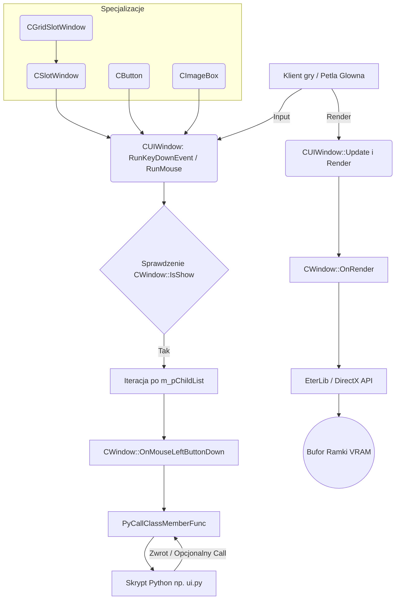

# EterPythonLib: CUIWindow - Podstawa Interfejsu Uzytkownika

## 1. Cel Architektoniczny i Rola Modulu

Podsystem `CUIWindow` stanowi glowny fundament architektoniczny i strukturalny dla interfejsu uzytkownika (UI) w kliencie gry (Metin2). Modul ten dziala jako warstwa posredniczaca pomiedzy renderowaniem sprzetowym (EterLib / DirectX) a logika biznesowa oskryptowana w jezyku Python.

**Glowne odpowiedzialnosci:**
- **Zarzadzanie Cyklem Zycia UI:** Hierarchiczne drzewo okien (rodzice i dzieci), inicjalizacja, niszczenie.
- **Routing Zdarzen:** Propagacja i obsluga zdarzen wejsciowych (klawiatura, mysz, IME) od okna korzenia w dol hierarchii i zglaszanie zdarzen do kodu Python.
- **Wizualizacja Zlozona:** Dostarczenie specjalizowanych klas dziedziczacych (SlotWindow, GridSlotWindow, Button, ImageBox, TextLine) gotowych do wyswietlania specyficznych elementow UI takich jak siatki ekwipunku, animowane ikony, tekst renderowany na GPU.
- **Stan Interfejsu:** Obliczanie relatywnych i absolutnych pozycji na ekranie, utrzymywanie stanow takich jak klikniecia, wcisniecia, przeciaganie mysza.

**Zaleznosci:**
- **Python C API:** Instancje `PyObject *` sluzace jako procedury obslugi (`m_poHandler`). System wywoluje metody na instancjach Pythona via `PyCallClassMemberFunc`.
- **EterLib (DirectX 8/9):** Polaczenie ze stanowymi buforami, systemem tekstu (`CGraphicTextInstance`), teksturami (`CGraphicImageInstance`) oraz prymitywami, by rysowac ramki, okna, i zawartosc w VRAM.

## 2. Diagram Architektury i Przeplywu Danych (Mermaid)

## 3. Rejestr Struktur Danych i Pamieci (Memory & Struct Layout)

Klasy i struktury sa mocno powiazane z silnikiem. Typowe wyrownanie pamieci (packing) to 4 bajty w srodowisku 32-bitowym (x86).

### Enumeracje z CWindow

- **EHorizontalAlign** (DWORD)
  - `HORIZONTAL_ALIGN_LEFT = 0`
  - `HORIZONTAL_ALIGN_CENTER = 1`
  - `HORIZONTAL_ALIGN_RIGHT = 2`
- **EVerticalAlign** (DWORD)
  - `VERTICAL_ALIGN_TOP = 0`
  - `VERTICAL_ALIGN_CENTER = 1`
  - `VERTICAL_ALIGN_BOTTOM = 2`
- **EFlags** (Flagi bitowe DWORD)
  - `FLAG_MOVABLE = (1 << 0)` - Okno mozna przesuwac.
  - `FLAG_LIMIT = (1 << 1)` - Ograniczenie do obszaru ekranu.
  - `FLAG_SNAP = (1 << 2)` - Przyciaganie (snapping).
  - `FLAG_DRAGABLE = (1 << 3)` - Przeciaganie okna (drag).
  - `FLAG_ATTACH = (1 << 4)` - Okno przytwierdzone do kursora.
  - `FLAG_RESTRICT_X = (1 << 5)` - Zablokowany ruch w osi X.
  - `FLAG_RESTRICT_Y = (1 << 6)` - Zablokowany ruch w osi Y.
  - `FLAG_NOT_CAPTURE = (1 << 7)` - Nie przechwytuje eventow.
  - `FLAG_FLOAT = (1 << 8)` - Pomiom Z, okno zawsze nad innymi, "plywajace".
  - `FLAG_NOT_PICK = (1 << 9)` - Okno ignorowane przy wyliczaniu "pick" myszy.
  - `FLAG_IGNORE_SIZE = (1 << 10)` - Ignorowanie sprawdzania granic okna.
  - `FLAG_RTL = (1 << 11)` - Renderowanie od prawej do lewej (Right-to-left).

### CWindow (Layout)
- `std::string m_strName;` - Nazwa uzywana do debagowania.
- `EHorizontalAlign m_HorizontalAlign;`
- `EVerticalAlign m_VerticalAlign;`
- `long m_x, m_y;` (offset w relacji do rodzica)
- `long m_lWidth, m_lHeight;`
- `RECT m_rect;` (pozycje globalne)
- `RECT m_limitBiasRect;` (bias dla granic ekranu)
- `bool m_bMovable;`
- `bool m_bShow;`
- `DWORD m_dwFlag;` - bitmask z `EFlags`.
- `PyObject * m_poHandler;` - Ref-count na obiekt skryptowy Pythona obslugujacy akcje UI.
- `CWindow * m_pParent;`
- `std::list<CWindow *> m_pChildList;` - Lista wskaznikow na dzieci.
- `BOOL m_isUpdatingChildren;`
- `std::list<CWindow *> m_pReserveChildList;` - Rezerwa uzywana, by nie modyfikowac glownej listy podczas iteracji aktualizacji.

### Struktury CSlotWindow
**TSlot** (okresla wlasciwosci pojedynczego slotu, np. w ekwipunku)
- `DWORD dwState;` (np. `SLOT_STATE_LOCK`, `SLOT_STATE_CANT_USE`, `SLOT_STATE_DISABLE`, `SLOT_STATE_ALWAYS_RENDER_COVER`).
- `DWORD dwSlotNumber;` - Index logiczny.
- `DWORD dwCenterSlotNumber;` - ID bazowe dla duzych (wielokomorkowych) przedmiotow.
- `DWORD dwItemIndex;` - Wskaznik/indeks vnum na item renderowany.
- `BOOL isItem;` - Flaga okreslajaca typ bytu.
- `float fCoolTime, fStartCoolTime;` - Sledzenie odnowienia (cooldown).
- `BOOL bActive;` - Flaga podswietlenia "toggle".
- `int ixPosition, iyPosition;` - Pozycja wewnatrz kontenera (offset).
- `int ixCellSize, iyCellSize;` - Rozmiary bazowe siatki.
- `BYTE byxPlacedItemSize, byyPlacedItemSize;` - Wymiary przedmiotu powiazanego ze slotem.
- `CGraphicImageInstance * pInstance;` - Tekstura ikony przedmiotu.
- `CNumberLine * pNumberLine;` - Tekst ilosci sztuk.
- `bool bRenderBaseSlotImage;`
- `CCoverButton * pCoverButton;`
- `CSlotButton * pSlotButton;`
- `CImageBox * pSignImage;`
- `CAniImageBox * pFinishCoolTimeEffect;`

## 4. Rejestr Klas i Metod (API Reference)

*Uwaga: API jest olbrzymie, opisy obejmuja najwazniejsze metody o znaczacym dzialaniu logicznym.*

### Klasa: `CWindow`
- `CWindow(PyObject * ppyObject)` - Konstruktor. Inicjuje zmienne polozenia i pobiera uchwyt pythonowy, bez inkrementowania referencji globalnej w zly sposob. 
- `static DWORD Type()` / `BOOL IsType(DWORD dwType)` - Bazuje na funkcji `GetCRC32("CWindow", ...)` do RTTI (Run-Time Type Information).
- `void Clear()` - Czysci liste dzieci i zwalnia je. Uwaga! Nie zwalnia pamieci samych obiektow okien (zarzadza nimi Python Window Manager).
- `void UpdateRect()` - Rekursywnie od rodzica lub od zera oblicza i wypelnia `m_rect` zgodnie z `m_x`, `m_y` (biorac pod uwage wyrownanie okna - `m_HorizontalAlign`, `m_VerticalAlign`). Zmiana modyfikuje pozycje bazowa renderingu.
- `CWindow * PickWindow(long x, long y)` - Zwraca wlasciwy CWindow na ktory wskazuje kurs myszy. Rekurencyjnie przeszukuje widoczne i "nieignorowane" (`!FLAG_NOT_PICK`) dzieci.
- **Routing Zdarzen (np. `RunKeyDownEvent`, `RunMouseLeftButtonDown`):** Przekazuje w dol drzewa zdarzenia. Dziecko na wierzchu listy (najbardziej zagniezdzone i wyrenderowane) przechwytuje event pierwsze. 
- **Eventy (np. `OnMouseLeftButtonDown()`):** Wykonuje `PyCallClassMemberFunc(m_poHandler, "OnMouseLeftButtonDown", BuildEmptyTuple(), &lValue)`. Jesli funkcja Pythona zwroci true (1), przechwytuje akcje na wylacznosc i zatrzymuje rozglaszanie (bubbling/capturing) w dol do innych okien.

### Klasa: `CTextLine`
- `void SetText(const char * c_szText)` - Inicjuje obiekt `CGraphicTextInstance`. Wykonuje rasteryzacje czcionki za pomoca GDI lub ladowania znakow, zapisujac je do instancji renderowanej w kolejce Direct3D.
- `void SetLimitWidth(float fWidth)` - Naklada maske ograniczajaca pole tekstowe - implementacja "ucinania" tekstu (clipping) uzywajac wlasciwosci bufora renderingu EterLib.

### Klasa: `CImageBox` / `CExpandedImageBox` / `CAniImageBox`
- `CImageBox::LoadImage(const char * c_szFileName)` - Komunikacja z `CResourceManager::Instance()`. Laduje (lub pobiera z cache) plik TGA/DDS.
- `CAniImageBox::OnUpdate()` - Algorytmiczne modyfikowanie `m_bycurIndex` (aktualna klatka obrazu) biorac pod uwage uplyw `m_bycurDelay` a nastepnie wyswietlanie kolejnych `CGraphicExpandedImageInstance`. Automatyczny reset klatek. Zglasza do skryptu `OnEndFrame` z uzyciem metody Pythona po zakonczeniu petli animacji.

### Klasa: `CSlotWindow`
Zarzadza zbiorami okien (gridem) przeznaczonych na ekwipunek, pasek szybkiego dostepu, magazyn.
- `void AppendSlot(DWORD dwIndex, int ixPosition, int iyPosition, int ixCellSize, int iyCellSize)` - Dodaje logiczny slot (`TSlot`) do wewnetrznej struktury `m_SlotList`. 
- `void SetSlot(DWORD dwIndex, DWORD dwVirtualNumber, BYTE byWidth, BYTE byHeight, CGraphicImage * pImage, D3DXCOLOR& diffuseColor)` - Przypisuje przedmiot (item) do danego slotu. Ustawia rozszerzona przestrzen, modyfikujac `byxPlacedItemSize` i instancje obrazu by odzwierciedlac wielokomorkowe itemy.
- `void OnRender()` - Przechodzi po calej liscie uzywajac iteratorow; najpierw rysuje obrazy bazowe (`RenderSlotBaseImage`), nastepnie iteruje rysujac ikony na `OnRenderSelectedSlot` a nastepnie efekty aktywne (`m_pSlotActiveEffect`).

### Klasa: `CGridSlotWindow`
Specjalizacja sluzaca bezposrednio do "kratkowanego" zarzadzania ekwipunkiem.
- `void ArrangeGridSlot(DWORD dwStartIndex, DWORD dwxCount, DWORD dwyCount, ...)` - Matematyczne i liniowe wypelnienie obszaru elementami slotowymi. Wylicza automatycznie przesuniecia X i Y dodajac sloty `AppendSlot`.
- `void OnRefreshSlot()` - Inicjuje obliczenia wielkosci (size checks). Algorytm sprawdza: dla kazdej duzej rzeczy wpisanej w kratke, iteruje po jej sub-komorkach (`xSub`, `ySub`) wpisujac im `dwCenterSlotNumber = pSlot->dwSlotNumber;` co symuluje zablokowanie podkratki przez czesc duzego modelu/ikony przedmiotu (np. 2x1 slot dla zbroi, 3x1 dla broni).
- `BOOL CheckMoving(DWORD dwSlotNumber, DWORD dwItemIndex, ...)` - Zabezpiecza logike przed niepoprawnym najechaniem na uzywany slot. Jesli iterowane `c_rSlotList` posiada rozne itemy w polach bazowych w odniesieniu do nowego podanego `dwItemIndex`, zglasza niemoznosc wykonania ruchu (kolizja ekwipunku po stronie klienta).

## 5. Punkty Styku (Cross-Subsystem Integration)

- **Interfejs Python (m_poHandler):** Wszelkie metody logiki biznesowej C++ koncza sie wywolaniem Pythonowych callbackow (poprzez API w `EterPythonLib/PythonWindowManager.cpp` i makra). Narzedziem wywolan jest min. `PyCallClassMemberFunc(m_poHandler, "OnSelectItemSlot", Py_BuildValue("(i)", iSlotNumber))`. Wycieki pamieci referencyjnej Pythona tu stanowia historycznie wazny punkt punktow styku - niszczenie UI przez pythona wymaga uwaznego operowania `Clear()`.
- **Renderowanie GPU (EterLib/DirectX):** `CUIWindow` nigdy same nie operuja bezposrednio na verteksach D3D; uzywaja abstrakcji `CGraphicExpandedImageInstance`, `CGraphicTextInstance`. Rysowanie bazuje na globalnych macierzach View/Proj narzucanych w EterLib dla modulu 2D (ortograficzna projekcja macierzy UI).
- **Zarzadzanie Zasobami:** Zaleznosc od VFS (Virtual File System / EterPack) poprzez klasy posredniczace do ladowania tekstur `.sub` (skrypty wycinkow tekstur), `.tga`, `.dds`.

## 6. Pulapki, Antywzorce i Ograniczenia

1. **Wycieki referencji w Pythonie (Circular References):** Instancja w Pythonie przechowuje wskaznik w ukladzie UI, a instancja w C++ przetrzymuje `PyObject*` (`m_poHandler`). Czeste zrodelko tzw. "ghost windows", gdy okna w C++ nie sa wlasciwie wyczyszczone (np. zapomniane `Destroy()`) zanim skrypt Python usunie obiekt nadrzedny.
2. **Kolejnosc niszczenia struktur (Destruction Order):** Klasa `CWindow::Clear()` musi byc poprawnie wywolywana. Zniszczenie `CWindow` w zlej kolejnosci powoduje segfaulty podczas zdarzen myszy i klawiatury dla nieistniejacego `m_pParent`. Rezerwa list dzieci `m_pReserveChildList` byla proba rozwiazania problemow wielowatkowego/rekursywnego dodawania dzieci w trakcie renderowania petli okien (`m_isUpdatingChildren`).
3. **Optymalizacja "IsShow":** Przechodzenie wszystkich zdarzen klawiatury reukrencyjnie przez cale ukryte galezie drzewa zostalo ukrocone przez `if (pWindow->IsShow())`. Jednako ignorowane obiekty sa ciagle obecne w pamieci. Zbyt wielkie drzewo wywoluje spadek wydajnosci na procesorze dla iteracji (zauwazalne przy duzych GridSlotWindow w banku/magazynie).
4. **D3DERR_DEVICELOST (Bledy buforow urzadzenia):** `CUIWindow` nie zajmuje sie regeneracja zasobow DirectX podczas utraty ekranu. Jesli `CGraphicImageInstance` lub `CGraphicTextInstance` zgubi zasob sprzetowy VRAM wewnatrz DX8/DX9 API (np. alt+tab na pelnym ekranie), calosc jest zarzadzana przez `CResourceManager` po restarcie sprzetu. Okna CUIWindow po prostu przestana sie renderowac lub beda wywolywac w EterLib bledy braku bitmapy.
