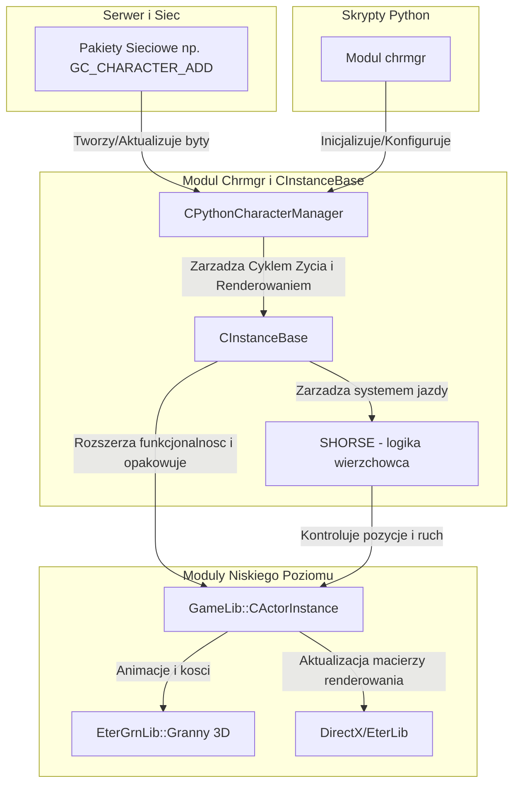

# Dokumentacja Techniczna: UserInterface: Modul 'chrmgr' oraz CInstanceBase

## 1. Cel Architektoniczny i Rola Modulu

### Glowna odpowiedzialnosc w architekturze klienta

Modul `chrmgr` (Python Character Manager) wraz z klasa `CInstanceBase` stanowi kluczowy most laczacy logike gry z graficznym renderowaniem postaci, potworow i NPC (aktorow) na ekranie.
`CPythonCharacterManager` zarzadza wszystkimi widocznymi instancjami w kadrze gracza, pelni role rejestru instancji, zarzadza ich cyklem zycia (tworzenie, usuwanie, aktualizacja) oraz renderowaniem i rzucaniem cieni.
`CInstanceBase` jest nakladka (wrapperem) wyzszego poziomu na `CActorInstance` z GameLib. `CInstanceBase` obsluguje logike unikalna dla klienta, taka jak stany postaci (Affects), widocznosc nickow (TextTail), gildii, emocji, efektow wizualnych broni i zbroi, i rasy postaci. Opowiada takze za osadzanie postaci na wierzchowcach i system kolizji/wykrywania uderzen miedzy postaciami z perspektywy klienta.

### Zaleznosci i Integracja

* **Wywolujacy:** Kod wewnetrzny Pythona wywoluje metody modulu `chrmgr` (np. do zmiany atrybutow, wczytywania rasy, tworzenia postaci). Modul ten rejestruje komendy dostepne z poziomu skryptow `.py`. Inne podsystemy (np. `CPythonNetworkStream`) bezposrednio uzywaja `CPythonCharacterManager`, aby tworzyc instancje na podstawie pakietow odebranych z serwera.
* **Wywolywane/Wykorzystywane:**
  * **GameLib (`CActorInstance`, `CRaceData`):** Logika ruchu, blendowania animacji, logiki kolizji fizycznej.
  * **EterGrnLib (Granny3D):** Obiekty `CGraphicThingInstance` do renderowania zlozonych modeli 3D z uzyciem CPU-skinning.
  * **EterLib/DirectX 8:** Do pozycjonowania 2D (kamera) i operacji matematycznych macierzy (np. renderowanie punktow w swiecie 3D).
  * **Python C API:** Bindowanie funkcji C++ jako metod modulu 'chrmgr'.

## 2. Diagram Architektury i Przeplywu Danych (Mermaid)

## 3. Rejestr Struktur Danych i Pamieci (Memory & Struct Layout)

Ponizsze struktury opisane sa na podstawie analizy `InstanceBase.h` oraz `PythonCharacterManager.h`.

### `CInstanceBase::SCreateData`

Struktura przekazywana przy kreacji nowej instancji postaci. Definiuje wstepny stan aktora, m.in. jego wyglad, atrybuty i parametry widocznosci.

| Pole | Typ | Przeznaczenie |
| --- | --- | --- |
| `m_bType` | `BYTE` (1 bajt) | Typ instancji (PC, NPC, Potwor, itp.). |
| `m_dwStateFlags` | `DWORD` (4 bajty) | Flagi stanu poczatkowego. |
| `m_dwEmpireID` | `DWORD` (4 bajty) | ID Imperium (krolestwa) do kolorowania nicku. |
| `m_dwGuildID` | `DWORD` (4 bajty) | ID Gildii, wykorzystywane do wyswietlania znaczka. |
| `m_dwLevel` | `DWORD` (4 bajty) | Poziom postaci. |
| `m_dwVID` | `DWORD` (4 bajty) | Virtual ID (unikalny identyfikator postaci z serwera). |
| `m_dwRace` | `DWORD` (4 bajty) | ID rasy modelu (np. Wojownik, Sura, konkretny potwor). |
| `m_dwMovSpd` | `DWORD` (4 bajty) | Predkosc poruszania. |
| `m_dwAtkSpd` | `DWORD` (4 bajty) | Predkosc ataku. |
| `m_lPosX` | `LONG` (4 bajty) | Kordynata X na mapie (jednostki silnika, setne centymetra). |
| `m_lPosY` | `LONG` (4 bajty) | Kordynata Y na mapie (jednostki silnika). |
| `m_fRot` | `FLOAT` (4 bajty) | Rotacja / zwrot postaci w osi Z. |
| `m_dwArmor` | `DWORD` (4 bajty) | Vnum zbroi. |
| `m_dwWeapon` | `DWORD` (4 bajty) | Vnum broni. |
| `m_dwHair` | `DWORD` (4 bajty) | Vnum fryzury. |
| `m_dwMountVnum` | `DWORD` (4 bajty) | Vnum wierzchowca. |
| `m_sAlignment` | `short` (2 bajty) | Ranga postaci (punkty karmy, wplyw na kolor). |
| `m_byPKMode` | `BYTE` (1 bajt) | Tryb PK (np. Wolny, Pokojowy, Wrogi). |
| `m_kAffectFlags` | `CAffectFlagContainer` | Kontener na flagi buffow i stanow statusowych (AFFECT). |
| `m_stName` | `std::string` | Zmienna dlugosc. Nazwa/Nick aktora wyswietlany w UI. |
| `m_isMain` | `bool` (1 bajt) | Flaga okreslajaca czy instancja jest naszym glownym bohaterem. |

*Wyrownanie (Packing):* Brak specyficznego dyrektywy `#pragma pack` oznacza domyslne wyrownanie ABI (prawdopodobnie 4 lub 8 bajtow). Z powodu wlaczenia `std::string`, kopiowanie bitowe (`memcpy`) tej struktury jest bledem i antywzorcem (naraza na wycieki i segment-faulty).

### `CInstanceBase::SHORSE`

Logika i stan wierzchowca (np. kon, dzik) przyczepionego do postaci.

| Pole | Typ | Przeznaczenie |
| --- | --- | --- |
| `m_isMounting` | `bool` (1 bajt) | Flaga czy gracz jest aktualnie na wierzchowcu. |
| `m_pkActor` | `CActorInstance*` (Wskaznik) | Wskaznik na graficzny byt konia sterowany oddzielnie. |

### Inne wazne enumy

* **EDirection:** `DIR_NORTH, DIR_NORTHEAST, DIR_EAST...` (8 kierunkow). Uzywane do orientacji na gridzie mapy.
* **Rodzaje Affectow (Bufow):** `AFFECT_POISON, AFFECT_STUN, AFFECT_INVISIBILITY` itp. Flagi w `m_kAffectFlags` obslugiwane przez makra i metody flag.

## 4. Rejestr Klas i Metod (API Reference)

### `CPythonCharacterManager`

Dziedziczy po `CSingleton<CPythonCharacterManager>`, umozliwia globalny dostep menadzera w kliencie. Zarzadza rejestrem i kolejnoscia rysowania obiektow w swiecie, mapujac po identyfikatorze `DWORD dwVID`.

* **`CPythonCharacterManager::CPythonCharacterManager()`**
  * Inicjalizuje glowne struktury. Kontenery: `m_kAliveInstMap` (slownik `[VID, CInstanceBase*]` na zyjace postaci) oraz `m_kDeadInstList` (lista martwych, usunietych lub zanikajacych postaci).
* **`CInstanceBase* CreateInstance(const CInstanceBase::SCreateData& c_rkCreateData)`**
  * *Logika biznesowa:* Rejestruje nowa instancje CInstanceBase z danymi paczki `c_rkCreateData`. Tworzy nowy obiekt `CInstanceBase`, podaje dane inicjalizujace. Ustawia nick, podlacza ewentualny znaczek gildii. Instancja dodawana jest do `m_kAliveInstMap`. Mapowanie nastepuje po VID (Virtual ID). Jesli to MainInstance (`m_isMain = true`), zapisuje go na boku w zmiennej `m_pkInstMain`.
* **`void DeleteInstance(DWORD VirtualID)`**
  * *Logika biznesowa:* Natychmiast usuwa aktora. Przeszukuje slownik `m_kAliveInstMap` po `VirtualID`. Jesli znajdzie, uwalnia obiekty powiazane z instancja i niszczy bazowy obiekt C++ z pamieci operacyjnej.
* **`void DeleteInstanceByFade(DWORD VirtualID)`**
  * *Logika biznesowa:* Sluzy do estetycznego ukrywania potworow/postaci (np. gdy wybiegaja z zasiegu widzenia). Przenosi instancje z `m_kAliveInstMap` do `m_kDeadInstList`. Wlacza efekt zanikania (Alpha Blending, zmniejszajaca sie przezroczystosc, wywolywane z UpdateDeleting). Po osiagnieciu progu, obiekt jest trwale niszczony.
* **`void Update()`**
  * *Logika biznesowa:* Metoda wywolywana w kazdej klatce (Game Loop). Odswieza plynne przechodzenie miedzy zywymi/martwymi aktorami. Odpowiada za aktualizacje fizyki, wywolywanie `Deform` wszystkich obiektow oraz usuwanie tych, ktore calkowicie zaniknely na liscie `m_kDeadInstList`. Wymusza pobranie pozycji uzytkownika do pozycjonowania cieni.
* **`void Render()` / `RenderShadowAllInstances()` / `RenderCollision()`**
  * *Logika biznesowa:* Iteruje odpowiednio po zywych instancjach, aby renderowac wlasciwy model z podpietymi bronmi (Render), narzucic dynamiczne cienie na pociete trojkaty mapy (RenderShadow) oraz opcjonalnie wyswietlac siatki sfer kolizyjnych (przy wlaczonym debuggowaniu).

### `CInstanceBase`

Glowny komponent dla kazdej jednostki poruszajacej sie (PC, NPC, Boss). Wrapper nad logika renderowania Granny.

* **`bool Create(const SCreateData& c_rkCreateData)`**
  * *Logika biznesowa:* Wywoluje metody z GameLib, rezerwujac i budujac pamiec dla graficznego ciala `CActorInstance` na podstawie `m_dwRace` oraz typu czesci ciala. Konfiguruje predkosc ruchu, ataku, bronie poczatkowe, tworzy `SHORSE` (jesli vnum mounta > 0). Zmienia model czlowieka, jesli gracz jedzie na wierzchowcu, aby wlaczyc specjalne animacje osiodlanego wierzchowca.
* **`void SetArmor(DWORD dwArmor)` / `void SetWeapon(DWORD dwWeapon)`**
  * *Logika biznesowa:* Sprawdza efekty udoskonalenia (+0 do +9). Przelicza vnum broni/zbroi, pobiera sciezke do geometrii lub textur od EterPack i podlacza ja do kosci (AttachToBone) w `CActorInstance`. Zbroje dla koni czesto modyfikuja bazowy wyglad postaci, podmieniajac czesciciala w Granny 3D.
* **`void SetAffect(UINT eAffect, bool isVisible)`**
  * *Logika biznesowa:* Flagi zdefiniowane jako maski bitowe dla postaci klienta. Jezeli np. `AFFECT_POISON` jest widoczny, podpina swiecacy zielony efekt nad glowa. Jesli `AFFECT_STUN`, postac zamraza animacje i generuje krecace sie gwiazdki. Odpowiada bezposrednio na logike wywolywana z pakietow serwerowych.
* **`void MovementProcess()` i `AttackProcess()`**
  * *Logika biznesowa:* Obliczanie cyklu poruszania (Walk, Run, Combo). Kiedy gracz zaznaczy punkt i kliknie, `MovementProcess` uzywa interpolacji pomiedzy m_kPPosDst (pozycja celowana), a aktualna, plynnie aktualizujac graficzny model (bez rwania na ekranie - smoothing/dead reckoning). `AttackProcess` odtwarza animacje wyciete w GameLib, podczepiajac pakiety obrazen (EffectDamage).
* **`void Update()`**
  * *Logika biznesowa:* Wywolywana co klatke przez PythonCharacterManager. Rozdziela obsluge fizyki i logiki GUI (TextTail, odswiezanie pozycji nicku nad postacia ze wzgledu na ruszajaca sie kamere gracza).

## 5. Punkty Styku (Cross-Subsystem Integration)

* **Z Pythonem (Bindingi w `PythonCharacterManagerModule.cpp`):**
  * Modul `chrmgr` (np. metody `chrmgrSetEmpireNameMode`, `chrmgrGetPickedVID`, `chrmgrLoadRaceData`) rejestrowany w `PyMethodDef s_methods[]`. Oczekuje parametrow poprzez `PyArg_ParseTuple` (np. parsowanie krotek na kordynaty), po czym wzywa funkcje globalnego managera `CPythonCharacterManager::Instance()`. Wyniki do Pythona sa odsylane z powrotem uzywajac `Py_BuildValue`. To umozliwia UI Pythonowe na tworzenie podgladu 3D w panelu (np. przy kreacji bohatera).
* **Z Serwerem (`NetworkStream` & `Packet.h`):**
  * Caly system CInstanceBase jest tworzony na zgloszenie sieciowe klienta z naglowka (np. `HEADER_GC_CHARACTER_ADD`). Pola w pakiecie mapowane sa 1:1 na strukture `CInstanceBase::SCreateData`. Serwer odpowiada za walidacje ruchu; `CInstanceBase` dba by ruch byl wizualnie plynny (tzw. "Client-side prediction").
* **Z DirectX i Granny (Rendery):**
  * Pod systemem CInstanceBase, `CActorInstance` trzyma wskazniki do `CGraphicThing` generowanych przez `CResourceManager`. Pozycje dla vertexow (DX8/9) sa przeliczane przy uzyciu macierzy transformacji CPU skinning z Granny.

## 6. Pulapki, Antywzorce i Ograniczenia

1. **Zanikanie Obiektow (Fading) a Wycieki Pamieci:** Logika w `DeleteInstanceByFade` nie zwalnia natychmiast pamieci modelu i przypisanych alokatorow (np. dynamiczne tablice `CDynamicPool`). Trzyma obiekty w `m_kDeadInstList`. Brak cyklicznego i pewnego czyszczenia tej listy moze prowadzic do gwaltownego wzrostu zuzycia RAM (tzw. memory leak wywolany uzyciem zasobu).
2. **Stringi w Strukturach POD:** `SCreateData` uzywa `std::string m_stName`. Jako ze kompilatory w starych standardach zarzadzaly wezlami znakow lokalnie na stercie, nadpisywanie instancji starymi funkcjami memcmp/memcpy doprowadzi do segfaultu (uszkodzenie wskaznikow na heapie pamieci).
3. **Brak Thread-Safety:** Cale zarzadzanie instancjami aktorow i lista martwych podmiotow wykorzystuje kontenery ze std (np. `std::map`, `std::list`). Brak lockow/mutexow podczas modyfikacji na glownej nitce gry wyklucza asynchroniczne dzialanie z osobnymi watkami ladujacymi.
4. **CPU Dependant Skinning:** Obiekty naleza do Grn 3D silnika. Podatnosc postaci na pancerze z duza iloscia wierzcholkow drastycznie zmniejsza ilosc FPS, ze wzgledu na brak przyspieszenia sprzetowego (GPU/Vertex Shader skinning), co silnie dlawi CPU w miejscach gdzie jest mnostwo instancji zarejestrowanych przez `CPythonCharacterManager` w tlumnym miescie.
