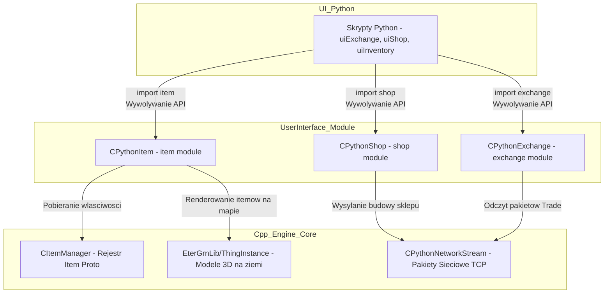

# Dokumentacja Techniczna: UserInterface - Moduly 'item', 'shop' oraz 'exchange'

## 1. Cel Architektoniczny i Rola Modulu
Moduly `CPythonItem`, `CPythonShop` oraz `CPythonExchange` pelnia role pomostu (warstwy abstrakcji) miedzy silnikiem gry C++ (logika, fizyka 3D, stan sieciowy) a interfejsem uzytkownika napisanym w Pythonie. 
*   **CPythonItem**: Zarzadza instancjami przedmiotow wyrzuconych na ziemie (`TGroundItemInstance`) - ich modelem 3D, fizyka opadania (rotacja oparta na kwaternionach), czasem wyswietlania, oraz logika podnoszenia (wykrywanie dystansu, raycasting z uzyciem myszy). Rejestruje moduly Pythona umozliwiajace wyswietlanie ikon, atrybutow i dzwiekow uzywania.
*   **CPythonShop**: Odpowiada za obsluge mechaniki sklepow. Wspiera system sklepow NPC (wiele zakladek, rozne typy walut - `SHOP_COIN_TYPE_GOLD`) oraz system sklepow prywatnych wystawianych przez graczy (kolekcjonowanie zapasow `TPrivateShopItemStock` i asynchroniczne powiadamianie serwera).
*   **CPythonExchange**: Implementuje logike okna bezpiecznego handlu miedzy graczami. Przechowuje niezalezny stan dwoch stron transakcji ("self" - inicjator, "victim" - cel), obslugujac numery VNUM, ilosci, gniazda kamieni (Metin Socket), atrybuty przedmiotu oraz walute (Elk) wraz z weryfikacja gotowosci (Accept).

## 2. Diagram Architektury i Przeplywu Danych (Mermaid)

## 3. Rejestr Struktur Danych i Pamieci (Memory & Struct Layout)

### CPythonItem::TGroundItemInstance (struct)
*   `DWORD dwVirtualNumber`: VNUM przedmiotu w bazie danych. (4 bajty)
*   `D3DXVECTOR3 v3EndPosition`: Docelowa pozycja (X, Y, Z) na mapie. (12 bajtow)
*   `D3DXVECTOR3 v3RotationAxis`: Wektor osi obrotu dla animacji spadania. (12 bajtow)
*   `D3DXQUATERNION qEnd`: Kwaternion reprezentujacy koncowa rotacje przedmiotu (animacja wyrzucania). (16 bajtow)
*   `D3DXVECTOR3 v3Center`: Wektor srodka przedmiotu (przesuniecie srodka ciezkosci). (12 bajtow)
*   `CGraphicThingInstance ThingInstance`: Obiekt graficzny EterGrnLib (model 3D). (Zlozona)
*   `DWORD dwStartTime` / `dwEndTime`: Czas w ms na kalkulacje animacji z `CTimer`. (4 + 4 bajty)
*   `DWORD eDropSoundType`: Typ dzwieku upadku z enuma (np. `DROPSOUND_WEAPON`). (4 bajty)
*   `bool bAnimEnded`: Flaga konca animacji upadku. (1 bajt, wyrownanie/padding do 4)
*   `DWORD dwEffectInstanceIndex`: ID przypietego efektu (np. lupy czy slupa swiatla nad itemem). (4 bajty)
*   `std::string stOwnership`: Zapisany ciag znakow nazwy wlasciciela (gracza ktory zabil potwora). (Zlozona, 24+ bajty)

### CPythonShop::ShopTab (struct)
*   `BYTE coinType`: Typ monety uzywanej w zakladce (0 = Gold, 1 = Secondary Coin). (1 bajt)
*   `std::string name`: Nazwa zakladki sklepu NPC. (Zlozona)
*   `TShopItemData items[SHOP_HOST_ITEM_MAX_NUM]`: Tablica struktury itemow wystawionych w tej zakladce (vnum, count, price, metins, attrs).

### CPythonExchange::TExchangeData (struct)
*   `char name[CHARACTER_NAME_MAX_LEN + 1]`: C-string nazwy postaci bioracej udzial w handlu. (25 bajtow)
*   `DWORD item_vnum[EXCHANGE_ITEM_MAX_NUM]`: Tablica (rozmiar 12) VNUM'ow w slocie handlu.
*   `BYTE item_count[EXCHANGE_ITEM_MAX_NUM]`: Tablica ilosci itemow w danym slocie.
*   `DWORD item_metin[EXCHANGE_ITEM_MAX_NUM][ITEM_SOCKET_SLOT_MAX_NUM]`: Dwuwymiarowa tablica przechowujaca gniazda Metin Socket.
*   `TPlayerItemAttribute item_attr[EXCHANGE_ITEM_MAX_NUM][ITEM_ATTRIBUTE_SLOT_MAX_NUM]`: Tablica atrybutow/bonusow dla kazdego przedmiotu w handlu.
*   `BYTE accept`: Flaga bool/byte czy gracz zaakceptowal handel (Gotow). (1 bajt)
*   `DWORD elk`: Ilosc waluty przekazywanej w okienku. (4 bajty)

## 4. Rejestr Klas i Metod (API Reference)

### Modul CPythonItem
*   `void CPythonItem::CreateItem(DWORD dwVirtualID, DWORD dwVirtualNumber, float x, float y, float z, bool bDrop)`: Inicjalizuje nowa instancje przedmiotu 3D wyrzucanego na ziemie. Przydziela z puli pamienci (DynamicPool), oblicza rotacje animacji i kwaterniony upadku na podstawie wektora normalnego (raycasting).
*   `bool CPythonItem::GetCloseItem(const TPixelPosition& c_rPixelPosition, DWORD* pdwItemID, DWORD dwDistance)`: Implementuje algorytm szukania najblizszego przedmiotu do podniesienia. Uzywa optymalizacji `DISTANCE_APPROX` (mnozenia bitowe i przesuniecia zamiast pierwiastkowania wektora X/Y) w celu zwrocenia identyfikatora itemu na wejscie `pdwItemID`.

**API Pythona (item module):**
*   `item.SelectItem(iIndex)`: Globalnie ustawia "aktywny" item wskazany przez CItemManager (wzorzec State/Singleton), by kolejne wywolania z Pythona nie musialy przesylac VNUM. Jesli VNUM nie istnieje, ustawia fallback na item `60001`.
*   `item.GetItemName()`: Zwraca nazwe wlasna (string) zaznaczonego przedmiotu.
*   `item.GetIconImage()`: Zwraca ID / Pointer do wczytanej ikony (TGA/DDS).
*   `item.SetUseSoundFileName(iUseSound, szFileName)`: Konfiguruje i podmienia sciezki plikow dzwiekowych dla konkretnych typow przedmiotow z enuma.

### Modul CPythonShop
*   `void CPythonShop::AddPrivateShopItemStock(TItemPos ItemPos, BYTE dwDisplayPos, DWORD dwPrice)`: Zapisuje chec wystawienia przedmiotu z eq (ItemPos) do mapy `TPrivateShopItemStock` pamieci podrecznej pod wskazana cene.
*   `void CPythonShop::BuildPrivateShop(const char * c_szName)`: Przeksztalca strukture std::map na posortowany (po display_pos) std::vector i wola CPythonNetworkStream::Instance().SendBuildPrivateShopPacket() w celu zatwierdzenia asynchronicznego utworzenia sklepu przez serwer.

**API Pythona (shop module):**
*   `shop.Open(isPrivateShop, isMainPrivateShop)`: Ustawia zmienne kontrolne trybu sklepu, aby okno UI w Pythonie wiedzialo czy wyswietlac siatke kupna/sprzedazy gracza czy NPC.
*   `shop.GetItemPrice(iIndex)`: Zwraca wartosc DWORD ceny przedmiotu NPC.
*   `shop.GetTabCount()` / `shop.GetTabCoinType(bTabIdx)`: Interfejs wspierajacy wielozakladkowe sklepy.

### Modul CPythonExchange
*   `void CPythonExchange::SetItemToTarget(DWORD pos, DWORD vnum, BYTE count)`: Aktualizuje wlasciwa strukture pod indeksem `pos` dla `m_victim` - sluzy to do poprawnego wizualizowania itemow dodawanych przez osobe po drugiej stronie okna handlu. Odczyt wspierany jest w analogicznych funkcjach Get.

**API Pythona (exchange module):**
*   `exchange.GetItemVnumFromSelf(pos)`: Dekoduje Integer z PyArg_ParseTuple i zwraca na stos Pythona Py_BuildValue typu integer VNUM przedmiotu wystawionego przez nas w danym polu siatki.
*   `exchange.GetAcceptFromTarget()`: Zwraca boolean / 1 jezeli ofiara wcisnela przycisk akceptacji.

## 5. Punkty Styku (Cross-Subsystem Integration)

1.  **Integracja z Pythonem (Py_BuildValue, PyArg_ParseTuple)**: 
    Czyste powiazanie z interpreterem za pomoca makr w `PythonItemModule.cpp`, `PythonShop.cpp`, `PythonExchangeModule.cpp`. Blad zlej interpretacji typow zwraca `Py_BuildException()`. Obsluga C++ jest stateful (singletony trzymajace stan) co rzutuje na koniecznosc synchronicznego wzywania z UI.
2.  **EterGrnLib / DirectX (VRAM)**:
    `CPythonItem` instancjuje `CGraphicThingInstance`, co prowadzi do ladowania `.gr2` do pamieci RAM oraz VRAM w DirectX8. Kalkulacje upadkow modyfikuja kwaterniony DirectX (`D3DXQUATERNION` oraz wektory). `CDynamicPool<TGroundItemInstance> m_GroundItemInstancePool;` optymalizuje koszty allokacji na ziemi zapobiegajac ciaglemu "new" w stercie.
3.  **Wiazania Sieciowe (Network Stream)**:
    Singletong sklep i wymiana sa pasywnymi strukturami danych (Rejestry). Zmiany w UI i w `PythonExchange` sa efektem powiadomien (Pakietow) przylatujacych z socketu TCP obslugiwanego przez siec `CPythonNetworkStream`.

## 6. Pulapki, Antywzorce i Ograniczenia

1.  **Stan Globalny (Singleton / Stateful API)**: API Pythona uzywa wzorca stanu (szczegolnie `item.SelectItem(vnum)` przed kazdym `item.GetItemName()`). Brak zachowania bezpieczenstwa wielowatkowego - w razie gdyby inna czesc kodu z innej nici zmienila "Selected Item" miedzy `SelectItem` a `GetItemName`, uzytkownik w Pythonie zobaczylby niepoprawne dane. 
2.  **Ograniczenie EXCHANGE_ITEM_MAX_NUM**: Hardkodowana tablica 12 slotow na handel `EXCHANGE_ITEM_MAX_NUM = 12`. Proba wywolania metody Pythona na slocie np. 13 powoduje wyjscie poza tablice pamieci C++. Klasy robia podstawowe `if (pos >= EXCHANGE_ITEM_MAX_NUM) return;`, jednak po stronie Pythona moze pojawiac sie wartosc garbage albo po cichu `0`.
3.  **Wycieki Pamieci w Ground Items**: Uzywanie `DeleteAllItems()` w module `CPythonItem` wymaga iterowania po calej mapie. Jesli referencje do `TGroundItemInstance` utknely gdzies indziej, a obiekt zostanie wyczyszczony i wrzucony z powrotem do poola `m_GroundItemInstancePool.Free()`, moga zaistniec warunki "dangling pointers" po stronie `CPythonTextTail` (tekst wciaz szukajacy usunietego pointera 3D). Nalezy zawsze czyscic TextTail w parze z uwalnianiem z Poola.
4.  **Bledy Precyzji DISTANCE_APPROX**: Metoda szukania najblizszego elementu polega na `DISTANCE_APPROX` ktora oszczedza na ukladzie kwadratowym ale ma odchylki pomiaru do kilkunastu procent, co na specyficznych katach perspektywy w grze powoduje niemoznosc podniesienia lezacego przedmiotu pod nogami mimo tego ze lezy w promieniu akceptacji.
