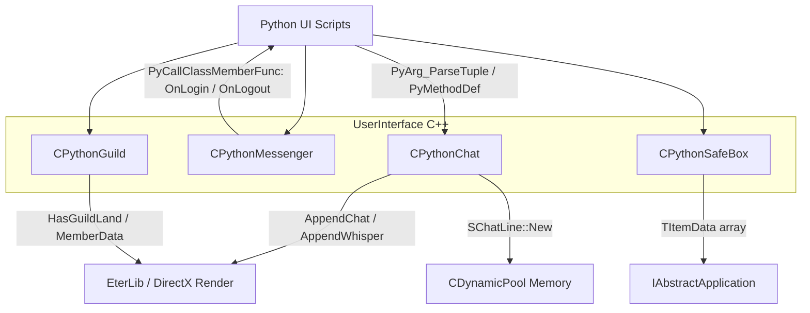

# Dokumentacja Techniczna: Moduly 'chat', 'messenger', 'guild' i 'safebox' (UserInterface)

## 1. Cel Architektoniczny i Rola Modulu
Moduly `chat`, `messenger`, `guild` i `safebox` pelnia role interfejsu pomiedzy mechanika gry C++ (C++ Client Game Logic / EterBase) a warstwa wizualna i skryptowa (Python UI) w grze (prawdopodobnie Metin2). Ich nadrzednym celem jest dostarczenie graczowi bezproblemowej obslugi funkcji spolecznosciowych (komunikacja, relacje) oraz zarzadzania prywatnym ekwipunkiem rozszerzonym (magazyn / safebox).
Moduly te rejestruja metody (przez makra PyMethodDef) wykorzystywane w interfejsie uzytkownika Python, wspolpracujac scisle z:
* **EterLib (DirectX)** - renderowanie tekstu (`CGraphicTextInstance`) dla czatu i szeptu.
* **CDynamicPool** (EterBase) - wydajna alokacja pamieci dla wielokrotnie powtarzajacych sie elementow jak obiekty czatu (linie) oraz szeptu (`CWhisper::SChatLine`, `CPythonChat::SChatLine`).
* **Python API** - poprzez modul PyCallClassMemberFunc, ktory dynamicznie wola metody UI, np. `OnLogin` czy `OnLogout` z instancji `CPythonMessenger`.

## 2. Diagram Architektury i Przeplywu Danych (Mermaid)

## 3. Rejestr Struktur Danych i Pamieci (Memory & Struct Layout)

### CPythonChat
* `enum EWhisperType` - Definiuje typy szeptow: `WHISPER_TYPE_CHAT = 0`, `WHISPER_TYPE_NOT_EXIST = 1`, `WHISPER_TYPE_TARGET_BLOCKED = 2`, `WHISPER_TYPE_SENDER_BLOCKED = 3`, `WHISPER_TYPE_ERROR = 4`, `WHISPER_TYPE_GM = 5`, `WHISPER_TYPE_SYSTEM = 0xFF`.
* `enum EBoardState` - Stany tablicy czatu: `BOARD_STATE_VIEW`, `BOARD_STATE_EDIT`, `BOARD_STATE_LOG`.
* `struct SChatLine`
  - `int iType` - typ komunikatu.
  - `float fAppendedTime` - stempel czasowy na podstawie `rApp.GetGlobalTime()`.
  - `D3DXCOLOR aColor[3]` - tablica z kolorami dla roznych stanow okien.
  - `CGraphicTextInstance Instance` - instancja obiektu graficznego DirectX dla renderowania tekstu.
  - Alokacja pamieci realizowana za pomoca `CDynamicPool<SChatLine> ms_kPool`.
* `struct TWaitChat`
  - `int iType`, `std::string strChat`, `DWORD dwAppendingTime`.
* `struct TChatSet`
  - Pozycje okna (`m_ix, m_iy, m_iHeight, m_iStep, m_fEndPos`).
  - Stan okna `m_iBoardState`.
  - Tryby wiadomosci `std::vector<int> m_iMode`.
  - Lista przypisanych wiadomosci `TChatLineList m_ShowingChatLineList`.

### CWhisper
* `struct SChatLine` - ubozsza wersja `SChatLine` z samego czatu, przechowujaca jedynie `CGraphicTextInstance Instance`. Alokacja pamieci rowniez poprzez pool: `CDynamicPool<SChatLine> ms_kPool`.

### CPythonMessenger
* `TFriendNameMap m_FriendNameMap` - zbior `std::set<std::string>` listujacy nicki uzytkownikow przyjaciol.
* `TGuildMemberStateMap m_GuildMemberStateMap` - mapa `std::map<std::string, BYTE>` statusow polaczenia czlonkow gildii.

### CPythonGuild
* `struct SGuildInfo` (TGuildInfo)
  - `DWORD dwGuildID` - ID gildii.
  - `char szGuildName[GUILD_NAME_MAX_LEN+1]` - Nazwa gildii.
  - `DWORD dwMasterPID` - ID wlasciciela/mistrza gildii.
  - `DWORD dwGuildLevel` - Poziom gildii.
  - `DWORD dwCurrentExperience` - Obecne doswiadczenie gildii.
  - `DWORD dwCurrentMemberCount` - Obecna liczba czlonkow gildii.
  - `DWORD dwMaxMemberCount` - Maksymalna liczba czlonkow gildii.
  - `DWORD dwGuildMoney` - Kasa gildii.
  - `BOOL bHasLand` - Czy gildia posiada ziemie.
* `struct SGuildGradeData` (TGuildGradeData)
  - `BYTE byAuthorityFlag`, `std::string strName`.
* `struct SGuildMemberData` (TGuildMemberData)
  - `DWORD dwPID`, `std::string strName`, `BYTE byGrade`, `BYTE byJob`, `BYTE byLevel`, `BYTE byGeneralFlag`, `DWORD dwOffer`.
* `struct SGuildBoardCommentData` (TGuildBoardCommentData)
  - `DWORD dwCommentID`, `std::string strName`, `std::string strComment`.
* `struct SGuildSkillData` (TGuildSkillData)
  - `BYTE bySkillPoint`, `BYTE bySkillLevel[GUILD_SKILL_MAX_NUM]`, `WORD wGuildPoint`, `WORD wMaxGuildPoint`.

### CPythonSafeBox
* `TItemInstanceVector m_ItemInstanceVector` i `m_MallItemInstanceVector` - `std::vector<TItemData>`, wektory symulujace plaska tablice 2D dla `SAFEBOX_PAGE_SIZE` (45 slotow, 5x9).
* `DWORD m_dwMoney` - przechowywane srodki uzytkownika w magazynie.

## 4. Rejestr Klas i Metod (API Reference)

### CPythonChat
* `CPythonChat::CPythonChat()` - Konstruktor. Wywoluje `__Initialize()`, w ktorym ustawia poczatkowe definicje kolorow D3DXCOLOR na podstawie elementow w `CHAT_TYPE_MAX_NUM`.
* `CPythonChat::~CPythonChat()` - Destruktor. Sprawdza asercjami czy mapy pamieci i listy sa puste.
* `void CPythonChat::SetChatColor(UINT eType, UINT r, UINT g, UINT b)` - Ustawia barwy z uwzglednieniem przezroczystosci dla konkretnego eType'u na tablicy m_akD3DXClrChat.
* `void CPythonChat::Destroy()` - Niszczy zasoby CPythonChat (szepty oraz wpisy chat), wywoluje metody DestroySystem dla pooli obslugiwanych przez szept.
* `void CPythonChat::Close()` - Cofa do stanu poczatkowego fAppendedTime w aktualnych listach chatow.
* `void CPythonChat::AppendChat(int iType, const char * c_szChat)`
  - **Algorytm**: Tworzy lub wyciaga z pamieci `SChatLine` poprzez `SChatLine::New()`. Podpina obiekt instancji renderowania tekstu EterLib pobierajac podstawowa czcionke `CGraphicText`. Wpycha instancje na koniec kontenera `m_ChatLineDeque`. Pilnuje stalego limitu `CHAT_LINE_MAX_NUM = 300` i w razie przekroczenia obcina przod deki za pomoca `pop_front()`, uwalniajac pamiec. Nastepnie decyduje do ktorego Set'a dopisac lub obrabiac przez `ArrangeShowingChat` na podstawie stanu `BOARD_STATE_EDIT` lub wpakowac w list.
* `void CPythonChat::AppendChatWithDelay(int iType, const char * c_szChat, int iDelay)`
  - **Algorytm**: Zamiast pisac prosto do okienka uzywa `CTimer::Instance().GetCurrentMillisecond() + iDelay` dodajac go do kolejki `m_WaitChatList`, oczekujacej az minie opoznienie zeby ja wprowadzic na chat glowny.
* `void CPythonChat::ArrangeShowingChat(DWORD dwID)` - Sklada widoczne wiadomosci chat (i uzupelnia list po limicie), sprawdza uzywany filter Mode `CheckMode`.
* `void CPythonChat::IgnoreCharacter(const char * c_szName)` - Przelacza blokade. Jezeli szukany `c_szName` jest w obrebie zbioru `m_IgnoreCharacterSet` to go usuwa, jezeli nie ma, to go insertuje ignorujac tego gracza.
* `BOOL CPythonChat::IsIgnoreCharacter(const char * c_szName)` - Sprawdza czy gracz o podanym nicku znajduje sie w m_IgnoreCharacterSet (zwracajac wynik operacji szukania std::set).
* `CWhisper * CPythonChat::CreateWhisper(const char * c_szName)` - Tworzy nowa przestrzen / okno szeptu poprzez `CWhisper::New` i wpisuje go w mape `m_WhisperMap` na podstawie nicka w postaci klucza. Zwraca utworzony instancje CWhisper.
* `void CPythonChat::AppendWhisper(int iType, const char * c_szName, const char * c_szChat)`
  - **Algorytm**: Wyszukuje po stringu nazwy w `m_WhisperMap`. Jesli okna szeptu (CWhisper) nie ma, automatycznie inicjalizuje nowe zlecajac `CreateWhisper()`. Nastepnie wywoluje delegatke `CWhisper::AppendChat()`.
* `void CPythonChat::ClearWhisper(const char * c_szName)` - Czysta destrukcja CWhisper przez Delete i erase m_WhisperMap bazujac na stringu `c_szName`.
* `BOOL CPythonChat::GetWhisper(const char * c_szName, CWhisper ** ppWhisper)` - Odszukuje z `m_WhisperMap` szept w celu dalszej ingerencji, zwraca True/False jezeli go znaleziono w mapie.
* `void CPythonChat::InitWhisper(PyObject * ppyObject)` - Dla kazdej wartosci w `m_WhisperMap`, uruchamia procedure Python-a wewnatrz glownego okna uzytkownika wywolujac na rzecznym argumencie PyCallClassMemberFunc `MakeWhisperButton` ze zmapowanym `strName`.

### CWhisper
* `CWhisper::CWhisper()` - Kontruktor, ustala bazowe stale i linestepy.
* `CWhisper::~CWhisper()` - Destruktor, czyci pule uzytkujac `SChatLine::Delete` dla calej mapy, potem czysci `m_ChatLineDeque`.
* `void CWhisper::Destroy()` - Czysci wektory iterujac przez wszystko, uslugujac funkcja std::for_each i powolujac na `SChatLine::Delete`.
* `void CWhisper::SetPosition(float fPosition)` - Ustala w srodku m_fcurPosition dana z fPosition, oraz przechodzi w `__ArrangeChat()`.
* `void CWhisper::SetBoxSize(float fWidth, float fHeight)` - Naklada nowe limitery dlugosci okna graficznie przez modyfikacje w `CGraphicTextInstance::SetLimitWidth` kazdej zdefiniowanej chatline.
* `void CWhisper::AppendChat(int iType, const char * c_szChat)` - Oblicza limit dlugosci z `m_fWidth`, powoluje domyslna/italicowa czcionke, tworzy i insertuje w wewnetrzne okno szeptu `SChatLine::New`. Mapuje uzyta czcionke oraz kolory w obrebie WHISPER_TYPE_*.
* `void CWhisper::Render(float fx, float fy)` - Odpowiada za proces odrysowania na obiekcie RenderEter. Weryfikuje granice ilosci linii z `m_fLineStep` uzywajac zmiennoprzecinkowych, aktualizuje i renderuje z uzyciem RECT.

### CPythonMessenger
* `CPythonMessenger::CPythonMessenger()` - Konstruktor zerujacy obiektowy uchwyt pythona `m_poMessengerHandler(NULL)`.
* `CPythonMessenger::~CPythonMessenger()` - Domyslny destruktor.
* `void CPythonMessenger::Destroy()` - Czysci bezposrednie mapy wewnetrzne `m_FriendNameMap` i `m_GuildMemberStateMap`.
* `void CPythonMessenger::RemoveFriend(const char * c_szKey)` - Czysci znajomego o nicku `c_szKey` poprzez jego erasowanie z `m_FriendNameMap`.
* `void CPythonMessenger::OnFriendLogin(const char * c_szKey)`
  - **Algorytm**: Wpisuje do `m_FriendNameMap` klucz logujacego znajomego i odpala do UI funkcje "OnLogin" wykorzystujac makro i powolujac argument MESSENGER_GRUOP_INDEX_FRIEND by obsluzyc zielony/bialy tekst.
* `void CPythonMessenger::OnFriendLogout(const char * c_szKey)` - Podobny jak powyzsza funkcja ale dla wylogowania - uzywa stringu z komunikatu Python "OnLogout".
* `void CPythonMessenger::SetMobile(const char * c_szKey, BYTE byState)` - Powiadamia klienta jesli gracz jest w trybie komorkowym wywolujac "OnMobile".
* `BOOL CPythonMessenger::IsFriendByKey(const char * c_szKey)` - Sprawdza czy string istnieje w `m_FriendNameMap`, zwracajac TRUE lub FALSE.
* `BOOL CPythonMessenger::IsFriendByName(const char * c_szName)` - Wrapper do IsFriendByKey, dostarczany dla interfejsu do weryfikacji per nick.
* `void CPythonMessenger::AppendGuildMember(const char * c_szName)` - Dodaje czlonka gildii - z poziomu Messengera uzywajac mapki statusowej uzytkownikow `m_GuildMemberStateMap`. Jezeli w mapce jest podany klucz to uzywa pierw "LogoutGuildMember".
* `void CPythonMessenger::RemoveGuildMember(const char * c_szName)` - Uzywa wewnetrznego "OnRemoveList" wywolujac UI i wymazujac go z `m_GuildMemberStateMap`.
* `void CPythonMessenger::RemoveAllGuildMember()` - Czysci `m_GuildMemberStateMap` wraz z sygnalizacja UI "OnRemoveAllList".
* `void CPythonMessenger::LoginGuildMember(const char * c_szName)` - Loguje do status mapy 1 oraz wolajac "OnLogin" (z argumentem MESSENGER_GRUOP_INDEX_GUILD).
* `void CPythonMessenger::LogoutGuildMember(const char * c_szName)` - Odwrotnosc (ustawia map index pod 0, sygnalizujac jako "OnLogout").
* `void CPythonMessenger::RefreshGuildMember()` - Przechodzi iteratorami przez caly zmapowany zasob statusow i uzywajac stanu second nadaje wszystkim up-to-date powiadomienia (OnLogin / OnLogout).
* `void CPythonMessenger::SetMessengerHandler(PyObject* poHandler)` - Przypisuje skryptowy handler pythona na ktory beda wolane callbacki OnLogin itd.

### CPythonGuild
* `CPythonGuild::CPythonGuild()` - Konstruktor klasy powolujacy glowna tabele doswiadczenia uzywajac std::map z obrebu gry.
* `CPythonGuild::~CPythonGuild()` - Domyslny destruktor klasy CPythonGuild.
* `void CPythonGuild::Destroy()` - Procedury usuwajace instancje map `m_GuildNameMap`, `m_GradeDataMap`, iterujace po wszystkich kontenerach `m_GuildMemberDataVector` oraz kasujace czlonkow poprzez zerowanie buforow.
* `void CPythonGuild::EnableGuild()` - Wlacza flagi bool na obiekcie gildii (`m_bGuildEnable = TRUE`).
* `void CPythonGuild::SetGuildMoney(DWORD dwMoney)` - Ustawia pieniadze z argumentu pod `m_GuildInfo.dwGuildMoney`.
* `void CPythonGuild::SetGuildEXP(BYTE byLevel, DWORD dwEXP)` - Aktualizuje i wstawia strukture gildii do obslugi Levela.
* `void CPythonGuild::SetGradeData(BYTE byGradeNumber, TGuildGradeData & rGuildGradeData)` - Zastepuje lub nadaje klase rangi pod Grade map w systemie.
* `void CPythonGuild::SetGradeName(BYTE byGradeNumber, const char * c_szName)` - Zmienia przypisanie stringowe dla danej grupy rankingowej.
* `void CPythonGuild::SetGradeAuthority(BYTE byGradeNumber, BYTE byAuthority)` - Zmienia autoryzacje `byAuthorityFlag` w grupie dla modyfikatorow akcji gildyjnych.
* `void CPythonGuild::ClearComment()` - Czysci liste ogloszen wektora `m_GuildBoardCommentVector`.
* `void CPythonGuild::RegisterComment(DWORD dwCommentID, const char * c_szName, const char * c_szComment)` - Sprawdza bufor stringowy, a jezeli jest wlasciwy tworzy `TGuildBoardCommentData` i dopisuje go do wektora nowosci.
* `void CPythonGuild::RegisterMember(TGuildMemberData & rGuildMemberData)`
  - **Algorytm**: Sprawdza z pomoca podprogramu/funktora oraz `GetMemberDataPtrByPID` czy PID jest w liscie `m_GuildMemberDataVector`. Jesli jest to podmienia jego wlasciwosci na podstawie argumentu i na koniec aktualizuje sredni poziom wszystkich uzytkownikow `__CalculateLevelAverage()` oraz sortuje z uzyciem metody wektorowej `__SortMember()`. Jesli go nie ma, pushbackuje to z uzyciem STL wektora.
* `void CPythonGuild::ChangeGuildMemberGrade(DWORD dwPID, BYTE byGrade)` - Zmienia range (byGrade) poszukiwanemu w vektorze, lub porzuca akcje jak go tam nie ma.
* `void CPythonGuild::ChangeGuildMemberGeneralFlag(DWORD dwPID, BYTE byFlag)` - Identycznie, zmiania GeneralFlag zaleznie od wyniku z GetMemberDataPtrByPID.
* `void CPythonGuild::RemoveMember(DWORD dwPID)` - Odszukuje funkcjami vector std::find_if element wedle szukanej logiki `CPythonGuild_FFindGuildMemberByPID` a pozniej na powrotnym wewnetrznym iteratorze wywoluje `m_GuildMemberDataVector.erase`.
* `void CPythonGuild::RegisterGuildName(DWORD dwID, const char * c_szName)` - Wciska do hashmapy `m_GuildNameMap` pare wewnetrznego powiazania dwID pod std::string z powrotnego c_szName.
* `BOOL CPythonGuild::IsMainPlayer(DWORD dwPID)`
  - **Algorytm**: Sprawdza czy dany czlonek gildii (identyfikowany przez PID) ma ta sama nazwe co lokalny uzytkownik pobrany przez glownego wlasciciela (Singletona instancji `IAbstractPlayer::GetSingleton().GetName()`).
* `BOOL CPythonGuild::IsGuildEnable()` - Getter bool `m_bGuildEnable`.
* `CPythonGuild::TGuildInfo & CPythonGuild::GetGuildInfoRef()` - Getter dla glownej tabeli SGuildInfo.
* `BOOL CPythonGuild::GetGradeDataPtr(DWORD dwGradeNumber, TGuildGradeData ** ppData)` - Proste wyluskanie iteratora z uzyciem Find na STD::Map, zwraca False jesli end iter nie zwrocil wyniku pod konkretnym dwGradeNumber.
* `const CPythonGuild::TGuildBoardCommentDataVector & CPythonGuild::GetGuildBoardCommentVector()` - Zwraca caly wskaznik i zawartosc Vector struktury SGuildBoardCommentData.
* `DWORD CPythonGuild::GetMemberCount()` - Zwraca w DWORD wektorowa wlasciwosc size z `m_GuildMemberDataVector.size()`.
* `BOOL CPythonGuild::GetMemberDataPtr(DWORD dwIndex, TGuildMemberData ** ppData)` - Pobiera w formacie wskaznika czlonka z konkretnym indexem na podanym w argumencie **ppData, zwraca TRUE jezeli wektor posiada dany rekord (Index < size).
* `BOOL CPythonGuild::GetMemberDataPtrByPID(DWORD dwPID, TGuildMemberData ** ppData)` - Pobiera uzytkownika poprzez system vector i funktora szukajacego uzywajac PID z bazy w `CPythonGuild_FFindGuildMemberByPID`.
* `BOOL CPythonGuild::GetMemberDataPtrByName(const char * c_szName, TGuildMemberData ** ppData)` - To samo, lecz wykorzystuje w wyszukiwarce iteratorowej predefiniowany przez programiste funktor opierajac sie o find_if string porownan: `CPythonGuild_FFindGuildMemberByName`.
* `DWORD CPythonGuild::GetGuildMemberLevelSummary()` - Getter, zwraca m_dwMemberLevelSummary.
* `DWORD CPythonGuild::GetGuildMemberLevelAverage()` - Getter, zwraca w pelni m_dwMemberLevelAverage.
* `DWORD CPythonGuild::GetGuildExperienceSummary()` - Getter zwracajacy m_dwMemberExperienceSummary.
* `CPythonGuild::TGuildSkillData & CPythonGuild::GetGuildSkillDataRef()` - Pozyskuje z powrotem glowna logike SkillDanych we wnetrzu Gildyjnego skilla powracajac m_GuildSkillData.
* `bool CPythonGuild::GetGuildName(DWORD dwID, std::string * pstrGuildName)` - Szuka na Hashmapie dwID powracajac skrotowany na iterator string na wyluskanie argumentowe pstrGuildName.
* `DWORD CPythonGuild::GetGuildID()` - Getter z refki uzywajacy elementu dwGuildID we wlasciwosci m_GuildInfo.
* `BOOL CPythonGuild::HasGuildLand()` - Zwraca z booleanu wynik bHasLand wpisanego w wlasciwosci w GuildInfo.
* `void CPythonGuild::StartGuildWar(DWORD dwEnemyGuildID)` - Inicjalizuje nowa pozycje w podanych slotach tabelki adwEnemyGuildID na nowym slocie jesli uzywane nie sa jeszcze zapiete (szukajac miejsca rownego 0 z indeksem <= max count) wywolujac na tablice startowy indeks dwEnemyGuildID.
* `void CPythonGuild::EndGuildWar(DWORD dwEnemyGuildID)` - Odwrotnosc StartGuildWar, wpisuje z powrotem wartosc 0 jako usuniecie (posiadajac dany indeks jako match porownywawczy dwEnemyGuildID).
* `DWORD CPythonGuild::GetEnemyGuildID(DWORD dwIndex)` - Zabezpiecza by pobrac element w tabeli `m_adwEnemyGuildID` (w warunku dwIndex musialby mniejszy od max enemy liczby slotow - jesli wiekszy zwraca 0, else m_adwEnemyGuildID[index]).
* `BOOL CPythonGuild::IsDoingGuildWar()` - Petla poszukuje wsrod adwEnemyGuildID jakiejs niestandardowej flagi nierownej 0 (co rowna sie TRUE po powrocie iteratora).

### CPythonSafeBox
* `CPythonSafeBox::CPythonSafeBox()` - Konstruktor klasy czyszczacy domyslne srodki `m_dwMoney` ustawiajac je na `0`.
* `CPythonSafeBox::~CPythonSafeBox()` - Destruktor klasy domyslnie skonfigurowany.
* `void CPythonSafeBox::OpenSafeBox(int iSize)`
  - **Algorytm**: Resetuje wszystkie dane magazynu (srodki finansowe na 0), uzywajac w wektorze `m_ItemInstanceVector.clear()` a nastepnie wykonujac jego re-inicjalizacje `.resize(SAFEBOX_SLOT_X_COUNT * iSize)`. Inicjalizuje cala te pamiec za pomoca globalnej metody z winapi `ZeroMemory` (zerujac strukture obiektu pod sterty `TItemData`).
* `void CPythonSafeBox::SetItemData(DWORD dwSlotIndex, const TItemData & rItemInstance)` - Aktualizuje komorke slotowa jezeli dwSlotIndex zawiera sie w obrebie length. Ustawia wartosci ze struktury item na `m_ItemInstanceVector[dwSlotIndex]`.
* `void CPythonSafeBox::DelItemData(DWORD dwSlotIndex)` - ZeroMemory usuwa przedmioty podpiete w slocie wektorowym w indeksie obslugujac to poprzez uklad zerujacy (czyszczac wszystkie wartosci puste na powrotnym `TItemData`).
* `void CPythonSafeBox::SetMoney(DWORD dwMoney)` - Bezposrednio przypisuje m_dwMoney z modyfikatora `dwMoney`.
* `DWORD CPythonSafeBox::GetMoney()` - Zwraca bezposrednio m_dwMoney we wzorze DWORD.
* `BOOL CPythonSafeBox::GetSlotItemID(DWORD dwSlotIndex, DWORD* pdwItemID)` - Sprawdza ilosc pamieci slotu (jesli wykracza rozmiar zwarca FALSE w logu) i wyciaga VNUM pobrane wpisujac do referencyjnego pdwItemID zwracajac TRUE.
* `int CPythonSafeBox::GetCurrentSafeBoxSize()` - Wywoluje getter `m_ItemInstanceVector.size()` jako int, odzwierciedlajac na podstawie obslugiwanych max elementow aktualny stan interfejsu.
* `BOOL CPythonSafeBox::GetItemDataPtr(DWORD dwSlotIndex, TItemData ** ppInstance)` - Metoda bazujaca na dwSlotIndex zwracajaca dla celow logicznych wskaznik calego itemu z `m_ItemInstanceVector[dwSlotIndex]` do ppInstance po sprawdzeniu blednego indexu tablicy.
* `void CPythonSafeBox::OpenMall(int iSize)`
  - **Algorytm**: Prawie identyczna z OpenSafeBox obsluga uzywana dla magazynu ItemShop (`m_MallItemInstanceVector`). Czyszczenie struktury pamieci vector dla nowo zdefiniowanego limitu stron i zerowanie elementow pod `ZeroMemory`.
* `void CPythonSafeBox::SetMallItemData(DWORD dwSlotIndex, const TItemData & rItemData)` - Wrzuca do IS wektora MallItem informacje o ItemData.
* `void CPythonSafeBox::DelMallItemData(DWORD dwSlotIndex)` - Kasuje przez wywolanie funkcji ZeroMemory komorke przedmiotu na bazie podanego indexu pod `m_MallItemInstanceVector`.
* `BOOL CPythonSafeBox::GetMallItemDataPtr(DWORD dwSlotIndex, TItemData ** ppInstance)` - Wyciaganie w podrobie TItemData calego info wskaznika, z bezpieczenstwem z logami dla bazy MallItem.
* `BOOL CPythonSafeBox::GetSlotMallItemID(DWORD dwSlotIndex, DWORD * pdwItemID)` - Wyrzuca na wskazniku `pdwItemID` numery vnum konkretnego itemu z magazynu przedmiotow ze sprawdzeniem indexu w mapie vector `m_MallItemInstanceVector`.
* `DWORD CPythonSafeBox::GetMallSize()` - Rozmiar Mall size magazynu przedmiotu z uzyciem prostej funkcji std size `m_MallItemInstanceVector.size()`.

## 5. Punkty Styku (Cross-Subsystem Integration)
* **Python Integration**: Modul eksponuje funkcje C-like do Pythona w pliku `PythonChatModule.cpp` (i podobnych dla reszty modulow). Metody Pythona sa mapowane poprzez makra `PyMethodDef`, w stylu:
  `{ "AppendChat", chatAppendChat, METH_VARARGS }`. Parametry takie jak `c_szChat` pobierane sa za pomoca wywolan `PyTuple_GetString(poArgs, 1, &szChat)`. Inne pliki jak `PythonSafeBoxModule.cpp` umozliwiaja wyszukiwanie i odczytywanie flag/gniazd na itemach dzieki np. `GetItemMetinSocket` oraz `GetItemAttribute` parsujac dane dla klienta po stronie ui.
* **Python Handler Calls**: `CPythonMessenger` uzywa `PyCallClassMemberFunc` aby uruchomic metody na instancji zarzadcy zdarzen w UI (zarejestrowanej jako obiekt `m_poMessengerHandler`).
* **Powiazanie z serwerem (opkody i naglowki z Packet.h)**: ChoC te moduly same w sobie obsluguja glownie strone UI oraz warstwe danych, struktury w nich uzyte (jak `TGuildInfo` czy parametry wywolan np. `StartGuildWar`) scisle zaleza od pakietow sieciowych (definiowanych przez naglowki z `Packet.h`). Kiedy gracz wykonuje akcje (np. wyslanie wiadomosci, usuniecie z gildii), gra przygotowuje pakiety z przypisanymi opkodami (np. `HEADER_CG_CHAT`, `HEADER_CG_GUILD`), serializuje obiekty i przesyla je przez sockety asynchroniczne TCP obslugiwane przez sieciowa czesc frameworku.
* **DirectX i VRAM**: Klasy takie jak `CWhisper` oraz instancja linii w okienku chat posiadaja kluczowe uzaleznienie od `CGraphicTextInstance`. Przy renderowaniu poszczegolnej linii wywolywana jest funkcja `pChatLine->Instance.Render(&Rect)` na uprzednio zadeklarowanych czcionkach, ktora deleguje rasteryzacje bezposrednio do VRAM w backendzie sprzetowym `EterLib`.

## 6. Pulapki, Antywzorce i Ograniczenia
* **Hardcoded Limits**: Limit deki czatu ustalono na sztywno na `CHAT_LINE_MAX_NUM = 300` zarowno dla `m_ChatLineDeque` jak i `m_ShowingChatLineList`. Powoduje to wymuszone kasowanie historii w zatloczonych miastach przy nadmiarze szeptow badz spamie na chacie (potencjalna utrata waznych powiadomien systemowych).
* **Zaleznosc na D3DX**: Przeplyw chat'u przechowuje kolory `D3DXCOLOR`. Jakiekolwiek zanikanie urzadzenia (`D3DERR_DEVICELOST`) z EterLib moze wymagac niszczenia lub odtwarzania setki poolowanych, widocznych elementow tekstowych w oknie chat'u i whisperze.
* **Mem-leak przy niezamknieciu gry (PythonChat::Destroy())**: Pamiec z `CDynamicPool` (zjawisko na stertach Pool_ms_kPool) nie zostaje automatycznie zwrocona do SO przy standardowym destruktorze `std::deque`. Aplikacja musi manualnie uruchamiac `SChatLine::DestroySystem()`.
* **String Comparisons in Update Loop**: Uzywanie `std::find_if` w operacjach `m_GuildMemberDataVector` oraz ciagle wyszukiwanie lancuchow w funkcjach poslugujacych sie wskaznikami ciagow tekstowych np. `CPythonGuild_FFindGuildMemberByName` powoduje spowolnienie przy gigantycznych gildiach, a takze spora fragmentacje przez dynamicznie zmieniajace sie pakiety asynchroniczne i wielokrotnie uzywanie metody kopii mapowanej mapy szeptow (`m_WhisperMap.insert`).
