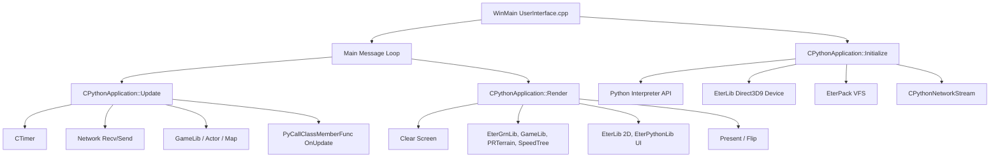

# Kompendium Klienta: Centralna Mapa Systemu (CLIENT_SYSTEM_MAP)

## 1. Cel Architektoniczny i Rola Modulu

Centralna Mapa Systemu pelni role punktu startowego klienta gry Metin2, laczac wszystkie biblioteki, frameworki i podsystemy w jedna, zintegrowana architekture aplikacji. Jej glowne obowiazki obejmuja:

- **Inicjalizacje Srodowiska**: Tworzenie okna Windows, przechwytywanie wyjatkow i bledow, uruchamianie wewnetrznego interpretera Python oraz konfiguracje gniazd (sockets).
- **Zarzadzanie Cyklem Zycia**: Kontrola glownej petli komunikatu (Message Loop) systemu Windows (`WinMain`), ktora cyklicznie wywoluje mechanizmy aktualizujace (`Update`) i renderujace (`Render`).
- **Orkiestracje Podsystemow**: Laczenie najnizszego poziomu zasobow matematycznych i pamieciowych (EterBase), narzedzi renderujacych DirectX (EterLib), wirtualnego systemu plikow (EterPack) z najwyzsza warstwa skryptowa (PythonApplication).
- **Punkt Wejscia (Entry Point)**: Aplikacja jako proces typu win32 zaczyna swoje dzialanie od funkcji `WinMain` zlokalizowanej w `UserInterface.cpp`, ktora nastepnie inicjuje globalna klase instancji `CPythonApplication`.

## 2. Diagram Architektury i Przeplywu Danych (Mermaid)

## 3. Rejestr Struktur Danych i Pamieci (Memory & Struct Layout)

Klient na tym poziomie dziala glownie jako zarzadca singletonow i klas glownych. Nie wprowadza wielu dedykowanych malych struktur C, tylko wiaze wielkie obiekty w pamieci.

### Klasa: `CPythonApplication` (Singleton)

Glowne serce gry sterujace procesem aktualizacji.

- **`m_pySystem` / `m_pyBackground` / `m_pyNetwork`**: (Wskazniki / 4 bajty) Dedykowane moduly eksponujace API C++ do globalnego scope interpretera Python.
- **`m_LightManager`**: Instancja klasy zarzadzajacej swiatlami kierunkowymi DirectX 9.
- **`m_dwUpdateFPS`, `m_dwRenderFPS`**: (`DWORD` / 4 bajty) Zmienne przechowujace wyliczone wartosci FPS, odswiezane co sekunde z uzyciem Timer-a.
- **`m_bCursorVisible`**: (`bool` / 1 bajt) Flaga odpowiadajaca za wlaczenie systemowego kursora (gdy gra renderuje wlasny).
- **Wyrownanie**: Struktura duza, standardowe domyslne wyrownanie C++ ABI (4-bajtowe dla x86). Uzywa ogromnej liczby singletonow rejestrowanych przez makro `CSingleton`.

## 4. Rejestr Klas i Metod (API Reference)

### Plik: `UserInterface.cpp`

- `int APIENTRY WinMain(HINSTANCE hInstance, HINSTANCE hPrevInstance, LPSTR lpCmdLine, int nCmdShow)`
  **Logika:**
  1. Sprawdza czy aplikacja to test-build (`__IS_TEST_SERVER_MODE__`).
  2. Konfiguruje systemowy handler bledow (`SetUnhandledExceptionFilter`).
  3. Wywoluje procedury sprawdzania anty-cheatow (Hackshield, XTrap - historycznie).
  4. Tworzy instancje `CPythonApplication`.
  5. Inicjalizuje glowne okno z `hInstance` i tytulem okna (czesciowo zaleznie od Locale).
  6. Odpala wlasciwa petle (Message Loop): wywoluje `PeekMessage` non-stop. Jesli `WM_QUIT`, wychodzi. W wolnym czasie (kiedy nie ma eventow systemowych z okna) odpala `app.Update()` oraz `app.Render()`.
  7. Czysci i usuwa `CPythonApplication`.

### Klasa: `CPythonApplication` (Pliki: `PythonApplication.h/.cpp`)

- `bool CPythonApplication::Initialize(HINSTANCE hInstance)`
  **Logika:** Metoda wiaze wszystkie podsystemy w calosc.
  1. Bootuje narzedzia bazowe: Timer, VFS (EterPack).
  2. Tworzy okno (HWND) przez EterLib.
  3. Tworzy i startuje Python API (`Py_Initialize()`). Rejestruje 28 wlasnych modulow C++ na przestrzeni Pythona (np. `player`, `net`, `chrmgr`).
  4. Kompiluje i wywoluje skrypt wejsciowy `system.py`, ktory z kolei odpala glowna logike UI w `networkModule.py` lub `introLogin.py`.
- `void CPythonApplication::Update()`
  **Logika:**
  1. Oblicza czas od ostatniej klatki uzywajac Singletona Timer z `EterBase`.
  2. Wywoluje `Process()` w instancji `CPythonNetworkStream` (czyta i wysyla pakiety).
  3. Zwraca kursorowi pozycje.
  4. Odpala callback `OnUpdate()` eksponowany przez aplikacje w przestrzeni Pythona. To powoduje ze interfejs uzytkownika i okna UI (`EterPythonLib`) sprawdzaja eventy.
- `void CPythonApplication::Render()`
  **Logika:**
  1. Czysci ekran (Clear) w `IDirect3DDevice9`.
  2. Resetuje macierze kamery.
  3. Renderuje w scenie 3D (obiekty z `CInstanceBase`, postacie, mapy).
  4. Renderuje warstwe UI 2D (Render2D) - okienka inwentarza, chat, itd.
  5. Wywoluje `Present` wysylajac bufor na ekran karty graficznej.

## 5. Punkty Styku (Cross-Subsystem Integration)

- **Python (`system.py` / `RunMainScript`)**: Jest to bezposrednia brama z silnika C++ (UserInterface) do skryptow logiki (root i uiscript). EterPack z pamieci dekompresuje kod pythonowski i go wykonuje bez zapisywania plikow `.py` na dysku.
- **DirectX (Glowne Gniazdo Renderu)**: Cale rysowanie wszystkich bibliotek musi byc "wciagniete" i odpalane sekwencyjnie w srodku `CPythonApplication::Render`. Blad kolejnosc renderu miedzy UI, Terrain i Modelem zaskutkuje problemami typu Z-Fighting (kolejnosc glebi).
- **Zarzadzanie Zasobami (Multithreading Loader)**: `WinMain` na etapie startu wywoluje thread pool zarzadzania IO dla modelow `.gr2` i `.dds`.

## 6. Pulapki, Antywzorce i Ograniczenia

- **Globalny Stan (Singleton Hell)**: Aplikacja korzysta w wiekszosci z globalnych obektow typu `CRaceManager::Instance()`, `CItemManager::Instance()`. Prowadzi to do trudnosci w izolowaniu pamieci, niemosliwosci testowania (Unit Testing) silnika C++ i scislych powiazan gdzie kazdy kod w C++ widzi i moze modyfikowac inny.
- **Blokowanie Watku UI (Main Thread Blocking)**: Petla `Update()` + `Render()` pracuje wspolbieznie z `PeekMessage()` w glownym watku Windowsa. Jesli skrypt w Pythonie (np. skomplikowana funkcja `OnUpdate`) zawiesi sie na dluzej niz 100-200ms, gra freezuje (widmo braku odpowiedzi ze strony `HWND` okna).
- **Zabezpieczenia Memory Protections**: Przez uzywanie zwenetrznych SDK jak Hackshield/XTrap (pozostalosci), silnik w `WinMain` bywa bardzo delikatny na ingerencje debuggera (anti-attach). Usuniecie ich i powrot do standardowej kompilacji czesto wymaga wylaczania makr Themida.

---

## 7. Indeks Kompendium (Single Source of Truth)

Ponizej znajduje sie kompletny rejestr 28 modulow wchodzacych w sklad zdekonstruowanego systemu. Dokumentacja kazdej warstwy dostepna jest w ponizszych odnosnikach.

### Architektura i Cykl Zycia Klienta
- [01_client_lifecycle_and_loop.md](01_architecture/01_client_lifecycle_and_loop.md)
- [02_architecture_deep_dive.md](01_architecture/02_architecture_deep_dive.md)
- [03_client_server_integration_map.md](01_architecture/03_client_server_integration_map.md)

### Podsystemy Silnika (EterBase, EterLib, EterPack, EterGrnLib, GameLib, itd)
- [01_eterbase_core.md](02_subsystems/01_eterbase_core.md)
- [02_eterbase_crypto.md](02_subsystems/02_eterbase_crypto.md)
- [03_eterpack_vfs.md](02_subsystems/03_eterpack_vfs.md)
- [04_eterpack_crypto.md](02_subsystems/04_eterpack_crypto.md)
- [05_eterlocale.md](02_subsystems/05_eterlocale.md)
- [06_eterimagelib.md](02_subsystems/06_eterimagelib.md)
- [07_dumpproto.md](02_subsystems/07_dumpproto.md)
- [08_eterlib_d3d_device.md](02_subsystems/08_eterlib_d3d_device.md)
- [09_eterlib_camera.md](02_subsystems/09_eterlib_camera.md)
- [10_eterlib_fonts.md](02_subsystems/10_eterlib_fonts.md)
- [11_eterlib_2d_resources.md](02_subsystems/11_eterlib_2d_resources.md)
- [12_prterrain_engine.md](02_subsystems/12_prterrain_engine.md)
- [13_speedtree_spherelib.md](02_subsystems/13_speedtree_spherelib.md)
- [14_etergrnlib_granny.md](02_subsystems/14_etergrnlib_granny.md)
- [15_gamelib_actor_core.md](02_subsystems/15_gamelib_actor_core.md)
- [16_gamelib_actor_battle.md](02_subsystems/16_gamelib_actor_battle.md)
- [17_gamelib_race_manager.md](02_subsystems/17_gamelib_race_manager.md)
- [18_gamelib_map_outdoor.md](02_subsystems/18_gamelib_map_outdoor.md)
- [19_gamelib_item_fly.md](02_subsystems/19_gamelib_item_fly.md)
- [20_effectlib_particles.md](02_subsystems/20_effectlib_particles.md)
- [21_miles_discord_web.md](02_subsystems/21_miles_discord_web.md)

### Protokol Sieciowy i Pakiety
- [01_network_stream_core_handshake.md](03_network_protocol/01_network_stream_core_handshake.md)
- [02_phases_login_select_loading.md](03_network_protocol/02_phases_login_select_loading.md)
- [03_phase_game_actors_items.md](03_network_protocol/03_phase_game_actors_items.md)
- [04_packets_cg_client_to_server.md](03_network_protocol/04_packets_cg_client_to_server.md)
- [05_packets_gc_server_to_client.md](03_network_protocol/05_packets_gc_server_to_client.md)

### Integracja z Pythonem (UI, Okna, Bindowanie)
- [01_eterpythonlib_window.md](04_python_bindings/01_eterpythonlib_window.md)
- [02_player_and_skill_api.md](04_python_bindings/02_player_and_skill_api.md)
- [03_chrmgr_and_instance_base.md](04_python_bindings/03_chrmgr_and_instance_base.md)
- [04_item_shop_exchange_api.md](04_python_bindings/04_item_shop_exchange_api.md)
- [05_chat_messenger_guild_api.md](04_python_bindings/05_chat_messenger_guild_api.md)
- [06_minimap_texttail_quest_api.md](04_python_bindings/06_minimap_texttail_quest_api.md)
