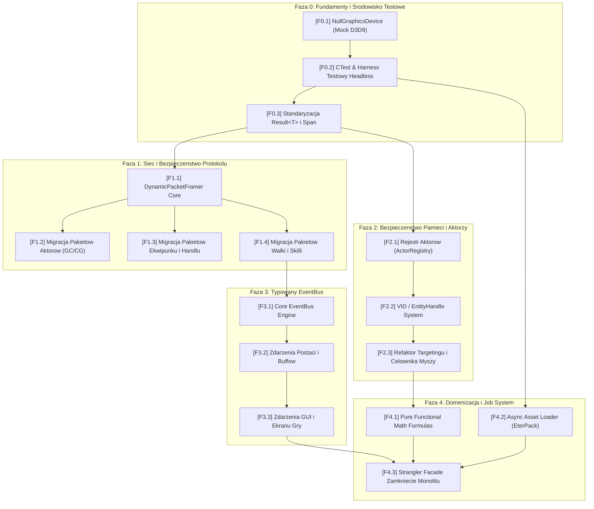

# ULTIMATE MASTER PLAN MODERNIZACJI KLIENTA C++ DLA AGENTOW AI (v4.0)

> **Cel Strategiczny**: Przeksztalcenie monolitycznego kodu klienta gry w C++ ([`E:\SourceCodeClient\src\`](file:///E:/SourceCodeClient/src/), ~900k linii kodu) w odizolowana, modularna architekture nowej generacji (C++20/C++23), w 100% odporna na bledy ludzkie i halucynacje modeli AI.
> **Standard Wykonawczy**: Zero-Conflict, Zero-Breakage (Strangler Fig Pattern), pelna testowalnosc Headless w kontenerach chmury Google Jules Cloud API.

---

## 1. Architektoniczna Diagnoza i Nowy Paradygmat ("AI-First Architecture")

### 1.1. Glowny Problem Istniejacego Kodu
Istniejacy klient gry powstal w standardzie C++98/03 z pozniejszymi, fragmentarycznymi adaptacjami. Cechuje go:
1. **Niewidzialne zaleznosci**: Masowe uzycie globalnych singletonow (`Instance()`, `GetSingleton()`).
2. **Niestabilnosc pamieciowa**: Surowe wskazniki C (`CInstanceBase*`, `CActorInstance*`), powodujace crashe typu *Use-After-Free* przy usunieciu aktora ze swiata.
3. **Kruchy protokol**: Reczne zliczanie bajtow w `Recv()` prowadzace do desynchronizacji calego strumienia TCP przy najmniejszym bledzie w rozmiarze pakietu.
4. **Wiazanie stringowe z Pythonem**: Wywolywanie metod interfejsu graficznego przez litery stringow (`PyCallClassMemberFunc("string", ...)`), co uniemozliwia kompilatorowi wykrycie bledow.
5. **Brak srodowiska testowego w chmurze**: Kod wymaga okna Win32 i fizycznej karty Direct3D9, przez co agenci w chmurze (Google Jules VM) nie mogli weryfikowac swoich zmian testami jednostkowymi.

### 1.2. Paradygmat AI-First (Jak projektowac kod dla autonomicznych modeli AI)
Agent AI (taki jak Google Jules czy Antigravity) generuje kod o najwyzszej jakosci, gdy spelnione sa nastepujace inwarianty architektoniczne:
- **Wyrazne granice modulow (Strict Module Boundaries)**: Kazdy serwis ma wlasny interfejs, zero dostepu do stanu globalnego.
- **Bezpieczenstwo typow w czasie kompilacji (Compile-time Type Safety)**: Kompilator C++ musi odrzucic bledny kod juz na etapie `cargo check` / `cl.exe`, a nie dopuscic do cichego bledu w runtime.
- **Odpornosc na wycieki i wiszace wskazniki**: Uzywanie identyfikatorow (`EntityID` / `VID Handle`) zamiast wskaznikow surowych.
- **Obsluga bledu oparta o wartosci (`std::expected` / `Result<T>`)**: Zakaz rzucania wyjatkow i zakaz ignorowania kodow bledu.
- **Deterministyczne srodowisko Headless**: Mozliwosc uruchomienia pelnej logiki klienta w kontenerze Linux bez monitora i karty GPU.

---

## 2. Siedem Filarow Architektonicznych Nowej Ery

```
┌────────────────────────────────────────────────────────────────────────┐
│             FILAR VII: SRODOWISKO HEADLESS (MOCK NULL D3D9)           │
├────────────────────────────────────────────────────────────────────────┤
│   FILAR I: FRAMER SIECIOWY  │  FILAR II: REJESTR AKTOROW (VID HANDLES) │
│   (Zero-Copy std::span)     │  (Zero Use-After-Free & Dangling Ptr)   │
├─────────────────────────────┼──────────────────────────────────────────┤
│   FILAR III: TYPED EVENTBUS │  FILAR IV: TASK / JOB ASYNC SYSTEM       │
│   (Koniec String Coupling)  │  (Odciazenie Glownego Watku z EterPack)  │
├─────────────────────────────┴──────────────────────────────────────────┤
│   FILAR V: STRANGLER DOMAIN SERVICES (Inventory, Trade, Movement)      │
├────────────────────────────────────────────────────────────────────────┤
│   FILAR VI: PURE FUNCTIONAL MATH (constexpr Formuly Obliczen i Walki)  │
└────────────────────────────────────────────────────────────────────────┘
```

---

### Filar I: Protokol Sieciowy i Bezpieczny Framer (Dynamic Zero-Copy Framing)
- **Cel**: Wyeliminowanie 100% desynchronizacji buforow TCP.
- **Architektura**:
  - Pelna migracja z monolitycznego [`PythonNetworkStreamPhaseGame.cpp`](file:///E:/SourceCodeClient/src/UserInterface/PythonNetworkStreamPhaseGame.cpp) do istniejacego juz adaptera [`ModernPacketDispatcher.h`](file:///E:/SourceCodeClient/src/Client/Network/ModernPacketDispatcher.h).
  - Wprowadzenie wzorca `DynamicPacketFramer`:
    1. Warstwa sieciowa wycina z kolowego bufora [`FastLockFreeRingBuffer.h`](file:///E:/SourceCodeClient/src/EterBase/FastLockFreeRingBuffer.h) dokladnie jeden pakiet o znanym rozmiarze naglowka i ladunku.
    2. Pakiet przekazywany jest do handlera wylacznie jako niemutowalny wycinek pamieci `std::span<const uint8_t> payload`.
    3. Handler zwraca `EterBase::PacketResult<void>`.
  - **Zysk dla Agenta AI**: Agent implementujacy nowy pakiet nie ma fizycznej mozliwosci zepsucia przesuniecia w buforze gniazda. Nawet w razie bledu parsowania, nastepny pakiet zostanie odczytany poprawnie.

---

### Filar II: Bezpieczenstwo Bytow i Rejestr Aktorow (EntityID / VID Handle Pattern)
- **Cel**: Likwidacja wszystkich crashy typu *Null Pointer Dereference* oraz *Use-After-Free*.
- **Architektura**:
  - Calkowity zakaz przechowywania surowych wskaznikow `CInstanceBase*` lub `CActorInstance*` w kontrolerach gracza, celownikach myszy, interfejsach handlu i dialogach.
  - Wprowadzenie struktury uchwytu:
    ```cpp
    struct EntityHandle {
        uint32_t vid{0};
        uint32_t generation{0};
        
        [[nodiscard]] bool IsValid() const noexcept;
    };
    ```
  - Dostepp do aktora odbywa sie wylacznie przez Rejestr:
    ```cpp
    auto actorOpt = ActorRegistry::Instance().Get(handle);
    if (!actorOpt) {
        return; // Postac bezpiecznie zniknela ze swiata, zero crasha!
    }
    actorOpt->get().PerformAction();
    ```

---

### Filar III: Silnie Typowany EventBus (Koniec Wiazania Stringowego z Pythonem)
- **Cel**: Usuniecie niesprawdzonych wywolan `PyCallClassMemberFunc("NAZWA_STRINGA", ...)`.
- **Architektura**:
  - Implementacja bezalokacyjnego, typowanego szkieletu zdarzen w [`src/UserInterface/Core/`](file:///E:/SourceCodeClient/src/UserInterface/Core/):
    ```cpp
    namespace Events {
        struct AffectAdded { uint32_t actorVid; uint8_t affectType; int32_t duration; };
        struct ItemEquipped { uint16_t cell; uint32_t itemVnum; };
        struct TargetChanged { uint32_t targetVid; uint32_t currentHp; uint32_t maxHp; };
    }
    ```
  - C++ wola wylacznie: `Core::EventBus::Publish(Events::AffectAdded{...});`.
  - Dedykowany adapter mostka `PythonEventDispatcher` subskrybuje te zdarzenia i przekazuje je do interpretera Pythona.
  - **Zysk dla Agenta AI**: Gdy programista lub agent refaktoryzuje C++, nie musi analizowac kodu skryptow Pythona. Interfejs jest sprawdzany przez kompilator w czasie budowania.

---

### Filar IV: Wielowatkowosc i Architektura Zadaniowa (Task / Job System)
- **Cel**: Likwidacja mikro-przyciec (stutteringu) i odciazenie watku glownego z operacji wejscia/wyjscia (I/O).
- **Architektura**:
  - Wprowadzenie asynchronicznej puli watkow roboczych (I/O Thread Pool) na bazie `std::jthread`.
  - Dekompresja archiwow [`EterPackManager`](file:///E:/SourceCodeClient/src/EterPack/EterPackManager.cpp) oraz ladowanie tekstur i geometrii terenu ([`MapOutdoor`](file:///E:/SourceCodeClient/src/GameLib/MapOutdoor.cpp)) przeniesione do zadan asynchronicznych:
    ```cpp
    JobSystem::Enqueue([path]() {
        auto data = EterPackManager::Instance().LoadRaw(path);
        return PrepareTexture(data);
    }).ThenOnMainThread([](TextureHandle tex) {
        ApplyTexture(tex);
    });
    ```
  - Glowny watek gry odpowiada wylacznie za deterministyczna petle aktualizacji logiki oraz generowanie komend renderowania.

---

### Filar V: Rozbicie Monolitow Domenowych (Strangler Fig Pattern)
- **Cel**: Zmniejszenie rozmiaru plikow z 10k linii do czystych modulow o budzecie 500-1500 linii.
- **Architektura**:
  - Wyodrebnienie serwisow domenowych z `CInstanceBase` oraz `CPythonNetworkStream`:
    1. **MovementService**: Kinematyka, wektory, wyznaczanie katow natarcia, interpolacja pozycji.
    2. **CombatService**: Obliczanie uderzen, kolizje miecza, kolejkowanie skilli.
    3. **InventoryDomain**: Siatka 2D, walidacja slotow, algorytm auto-sortowania i zamiany przedmiotow.
    4. **TradeDomain**: Maszyna stanow bezpiecznego handlu z graczem i NPC.
  - Stare metody staja sie cienkimi fasadami przekierowujacymi do nowych domen, gwarantujac 100% kompatybilnosci wstecznej.

---

### Filar VI: Czysta Matematyka i Logika (`constexpr Pure Math`)
- **Cel**: Baza wzorow oddzielona od kodu DirectX i Win32, w 100% testowalna jednostkowo.
- **Architektura**:
  - Biblioteka `src/Client/Gameplay/Formulas/`:
    - `CombatFormulas::CalculateDamage(attackerStats, defenderStats, skillLevel)`
    - `MovementKinematics::CalculateStep(currentPos, targetPos, speed, deltaTime)`
    - `AggroCalculator::IsWithinAggroRadius(monsterPos, playerPos, baseRadius)`
  - Wszystkie funkcje sa bezstanowe, oznaczone jako `constexpr` i `noexcept`.
  - Agent AI moze napisac 50 testow jednostkowych w kilkanascie sekund bez inicjalizacji calego silnika gry.

---

### Filar VII: Srodowisko Headless i Automatyzacja CI/CD w Chmurze (NullGraphicsDevice)
- **Cel**: Umozliwienie uruchamiania testow przez Google Jules Cloud VM bez monitora i karty GPU.
- **Architektura**:
  - Implementacja atrapy Direct3D9 (`NullGraphicsDevice` dziedziczacy po `IDirect3DDevice9`), ktory przyjmuje wywolania `DrawIndexedPrimitive`, `SetRenderState`, `BeginScene` i zwraca sukces `D3D_OK` bez faktycznego rysowania na ekranie.
  - Dodanie flagi kompilacji `--headless-mode`.
  - Utworzenie konfiguracji `CTest` w CMake:
    - Testy ramkowania pakietow sieciowych.
    - Testy matematyki walki i siatki ekwipunku.
    - Testy ladowania i dekompresji proto.
  - Chmurowy worker Jules po wygenerowaniu kodu uruchamia `ctest --output-on-failure`. Dopiero po zielonym wyniku kod trafia do harvestowania.

---

## 3. Plan Wdrozenia w 5 Fazach (DAG dla Roju 150 Agentow)



---

### Faza 0: Fundamenty Testowe Headless (15 Agentow, Klaster `[SYS]`)
*Cel*: Wyposazenie repozytorium w mozliwosc natychmiastowej weryfikacji zmian bez monitora.
- **Zadania**:
  - `T0.1`: Stworzenie `NullGraphicsDevice` i `NullDirect3D9` implementujacych interfejsy D3D bez okna Win32.
  - `T0.2`: Skonfigurowanie zestawu testow jednostkowych `CMakeLists.txt` + `CTest`.
  - `T0.3`: Implementacja naglowkow bazowych `Core/Result.h` (`std::expected`), `Core/Span.h` oraz `Core/Assert.h`.
- **Weryfikacja**: Sukces polecenia `ctest` w kontenerze Linux bez zmiennej `DISPLAY`.

### Faza 1: Siec, Protokol i Dynamiczny Framer (30 Agentow, Klaster `[NET]`)
*Cel*: Eliminacja desynchronizacji strumienia TCP i pamieciozernych kopii buforow.
- **Zadania**:
  - `T1.1`: Przepiecie glownej petli Winsock na `DynamicPacketFramer`.
  - `T1.2`: Migracja pakietow fazy gry (Actor: Spawn, Move, Delete) na `IPacketHandler`.
  - `T1.3`: Migracja pakietow przedmiotow (Item: Drop, Pick, Equip, Use) na `IPacketHandler`.
  - `T1.4`: Migracja pakietow walki i skilli na `IPacketHandler`.
- **Weryfikacja**: Zestaw testow jednostkowych wstrzykujacych 10 000 losowych uszkodzonych i poszatkowanych pakietow binarnych bez wycieku i bez zerwania sesji.

### Faza 2: Bezpieczenstwo Bytow i Rejestr Aktorow (30 Agentow, Klaster `[ACT]`)
*Cel*: Eliminacja wiszacych wskaznikow i crashy dereferencji.
- **Zadania**:
  - `T2.1`: Implementacja centralnego `ActorRegistry` ze zintegrowana mapa generacyjna.
  - `T2.2`: Zamiana pol `CInstanceBase*` na `EntityHandle` w klasie `CPythonPlayer` i `CPythonCharacterManager`.
  - `T2.3`: Refaktoryzacja mechanizmu podswietlania celu mysza (Targeting Raycast) i interakcji z NPC na bezpieczne pobieranie uchwytow.
- **Weryfikacja**: Test symulujacy nagle usuniecie atakowanego bytu w trakcie wykonywania animacji ciosu. Rezultat: bezpieczny powrot bez wyjatku pamieci.

### Faza 3: Typowany EventBus C++ <-> Python (25 Agentow, Klaster `[PY] / [GUI]`)
*Cel*: Odciecie logiki silnika C++ od bezposrednich zaleznosci stringowych do skryptow GUI.
- **Zadania**:
  - `T3.1`: Implementacja bezblokadowego `CoreEventBus` z obsluga subskrypcji synchronicznych i kolejkowanych.
  - `T3.2`: Emisja zdarzen dla zmian HP/MP, zakladania ekwipunku, punktow statusu i buffow.
  - `T3.3`: Dedykowany adapter mostka `PythonUIBridge` mapujacy zdarzenia na wywolania UI.
- **Weryfikacja**: Test weryfikujacy, ze brak metody w Pythonie loguje ostrzezenie w konsoli, ale nie powoduje zatrzymania watku gry ani awarii.

### Faza 4: Domenizacja i Job System (50 Agentow, Klastry `[ITM]`, `[CBT]`, `[WLD]`, `[RND]`)
*Cel*: Rozbicie monolitow na odseparowane podsystemy i asynchroniczne ladowanie zasobow.
- **Zadania**:
  - `T4.1`: Wydzielenie czystych regul walki i ruchu do `Formulas/CombatFormulas.h` (`constexpr`).
  - `T4.2`: Asynchroniczne zadania dekompresji zasobow EterPack w watkach I/O.
  - `T4.3`: Zamkniecie starych monolitow fasadami (`StranglerFacade`) i archiwizacja legacy kodu.
- **Weryfikacja**: Pelny test regresyjny, stabilny FPS i zero wyciekow pamieci w 12-godzinnym tescie ciaglym.

---

## 4. Zasady Bezpieczenstwa Zero-Breakage (Strangler Fig Workflow)

Aby zagwarantowac, ze klient gry w kazdym momencie pozostaje w 100% zdatny do kompilacji i uruchomienia:
1. **Zasada Wspolistnienia (Parallel Run)**:
   - Nowy serwis (np. `ModernPacketDispatcher`) dziala obok starego (`PythonNetworkStream`).
   - W laczniku decydujemy flaga lub tabela przekierowan: jesli dany opcode ma nowy handler, wywolaj go; w przeciwnym razie uzyj legacy metody.
2. **Commit Atomowy na Galaz `main`**:
   - Kazda paczka zmian zharvestowana od Jules Swarm trafia na `main` wylacznie wtedy, gdy `cargo test` / `ctest` przechodzi w 100%.
   - Jesli testy nie przejda: natychmiastowy `git rollback`, a zadanie wraca do kolejki naprawczej.
3. **Zakaz Modyfikacji Wielu Plikow Naraz (Izolacja)**:
   - Kazde zadanie agenta dotyka maksymalnie 2-4 scisle powiazanych plikow domenowych.
   - Zero konfliktow merge (Zero Merge Conflicts).

---

## 5. Podsumowanie Korzysci dla Ekosystemu

| Parametr | Stan Obecny (Legacy Monolit) | Po Wdrozeniu Ultimate Planu |
|---|---|---|
| **Stabilnosc Pamieci** | Ryzyko use-after-free, wiszace wskazniki | **0% ryzyka** (EntityID generation handles) |
| **Protokol Sieciowy** | Desynchronizacja TCP przy blednym sizeof | **Zero-Copy Framing** z ochrona `std::span` |
| **Integracja z Pythonem** | Surowe stringi w C++, ciche crashe | **Silnie typowany EventBus** sprawdzany w kompilacji |
| **Wspolbieznosc i Plynnosc** | Watek glowny robi wszystko (stutter) | **Job System**, asynchroniczne ladowanie zasobow |
| **Zdolnosc Agentow AI do Pracy** | Ograniczona przez monolit i ukryty stan | **Pelna autonomia**, lokalna modularnosc (SRP) |
| **Weryfikacja w Chmurze** | Brak mozliwosci testow bez monitora | **100% Headless CTest** na Google Jules VM |
