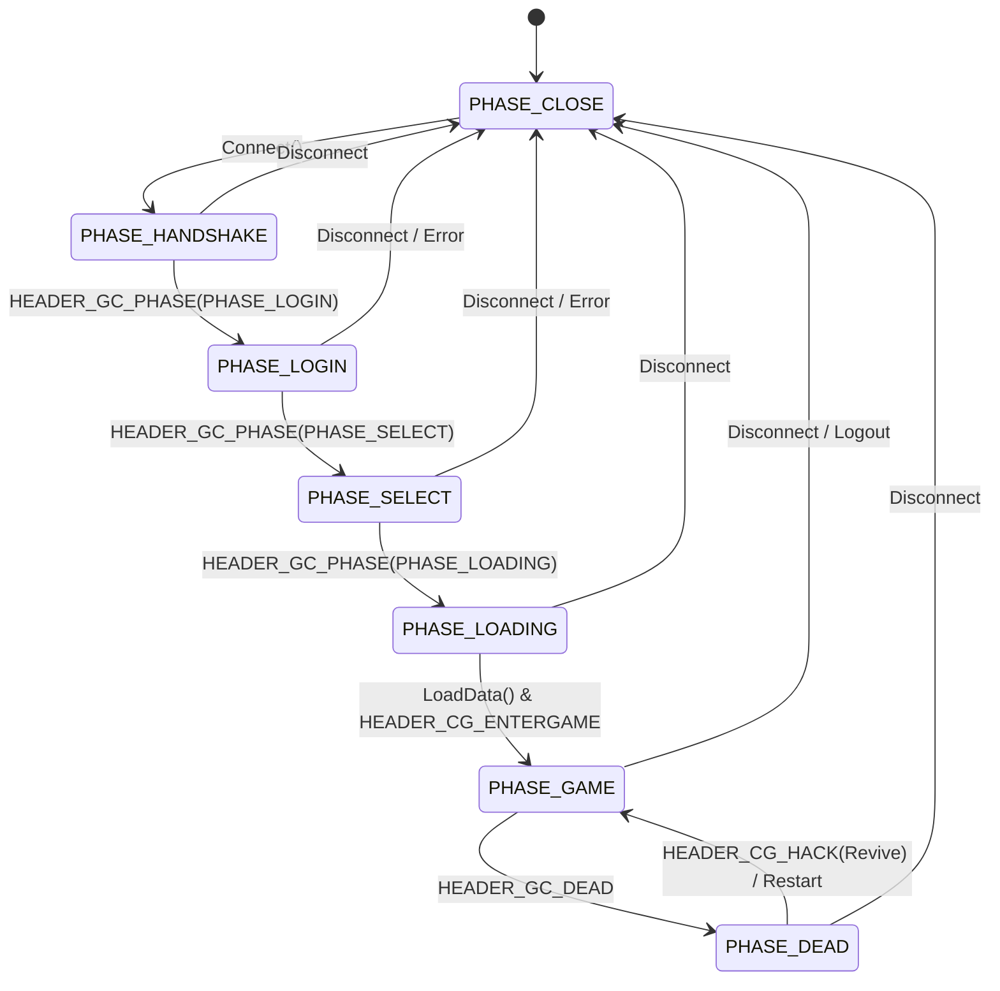

# Specyfikacja Architektoniczna: Maszyna Stanow Klienta (FSM) i Sekwencje Pakietow

## 1. Wprowadzenie
Dokument ten opisuje maszyne stanow klienta C++ na podstawie analizy kodu zrodlowego sieci (`PythonNetworkStream`). Faza polaczenia definiuje, ktore pakiety sa poprawne w danym momencie, chroniac serwer przed nieoczekiwanymi pakietami.

## 2. Stany FSM (Phase)
Zgodnie z `Packet.h` (enum `EPhase`) klient operuje w nastepujacych fazach:
- `PHASE_CLOSE` (0): Brak polaczenia, stan poczatkowy.
- `PHASE_HANDSHAKE` (1): Faza negocjacji i wymiany kluczy (Security).
- `PHASE_LOGIN` (2): Ekran logowania (Autoryzacja).
- `PHASE_SELECT` (3): Wybor i tworzenie postaci.
- `PHASE_LOADING` (4): Ladowanie danych mapy po wybraniu postaci.
- `PHASE_GAME` (5): Glowna rozgrywka.
- `PHASE_DEAD` (6): Postac zginela.

### Graf Stanow (Mermaid)



## 3. Macierz Dopuszczalnych Pakietow (Przyklady)

| Stan (Faza)       | Oczekiwane Pakiety Klienta (CG)     | Spodziewane Pakiety Serwera (GC)        | Akcje Zmiany Fazy                       |
|-------------------|-------------------------------------|-----------------------------------------|-----------------------------------------|
| `PHASE_CLOSE`     | -                                   | -                                       | Nawiazanie polaczenia TCP -> Handshake  |
| `PHASE_HANDSHAKE` | `HEADER_CG_KEY_AGREEMENT`           | `HEADER_GC_KEY_AGREEMENT`, `HEADER_GC_PHASE`| Serwer wysyla `HEADER_GC_PHASE` (Login) |
| `PHASE_LOGIN`     | `HEADER_CG_LOGIN` / `LOGIN2/3/5`    | `HEADER_GC_LOGIN_SUCCESS3/4`, `HEADER_GC_LOGIN_FAILURE`, `HEADER_GC_EMPIRE` | `HEADER_GC_PHASE` na `Select` / `Close` |
| `PHASE_SELECT`    | `HEADER_CG_PLAYER_SELECT`, `HEADER_CG_PLAYER_CREATE`, `HEADER_CG_EMPIRE` | `HEADER_GC_CHARACTER_CREATE_SUCCESS/FAILURE`, `HEADER_GC_EMPIRE` | `HEADER_GC_PHASE` na `Loading`          |
| `PHASE_LOADING`   | `HEADER_CG_ENTERGAME` (10)          | `HEADER_GC_MAIN_CHARACTER`, `HEADER_GC_PHASE` | Po otrzymaniu glownej postaci i fazy, klient wysyla enter game i wchodzi w `Game` |
| `PHASE_GAME`      | Ruch, atak, uzycie skilli, chat     | Spawn bytow, obrazenia, ekwipunek, faza | `HEADER_GC_DEAD` -> `Dead` / `Close`    |

## 4. Kluczowe Sekwencje i Pakiety

### 4.1. Sekwencja Logowania
Klient w `PHASE_LOGIN` wysyla pakiet logowania.
- Oczekuje na `HEADER_GC_LOGIN_SUCCESS3` (lub 4) oraz `HEADER_GC_EMPIRE`.
- Serwer w przypadku sukcesu powinien wyslac sukces, stan konta, a takze `HEADER_GC_PHASE` zmieniajacy faze klienta na `PHASE_SELECT`.

**Pakiet: TPacketGCLoginSuccess3**
- C++ Definicja:
  ```cpp
  typedef struct packet_login_success3 {
      BYTE header;
      TSimplePlayerInformation akSimplePlayerInformation[PLAYER_PER_ACCOUNT3];
      DWORD guild_id[PLAYER_PER_ACCOUNT3];
      char guild_name[PLAYER_PER_ACCOUNT3][GUILD_NAME_MAX_LEN+1];
  } TPacketGCLoginSuccess3;
  ```
- Mapowanie Rust (Binarnie):
  - `header`: 1 byte (`<B`) - Opcode (np. 6)
  - `akSimplePlayerInformation`: Tabela struktur `TSimplePlayerInformation` (rozmiar staly, zalezy od MAX_PLAYERS)
  - `guild_id`: Tabela DWORD (u32, `<I`)
  - `guild_name`: Tabela stringow stalej dlugosci (ASCII, zera koncowe)

**Pakiet: TPacketGCEmpire**
- C++ Definicja:
  ```cpp
  typedef struct packet_empire {
      BYTE bHeader;
      BYTE bEmpire;
  } TPacketGCEmpire;
  ```
- Mapowanie Rust:
  - `header`: 1 byte (`<B`) - Opcode (90)
  - `empire`: 1 byte (`<B`) - ID imperium (1, 2, 3)
- Rozmiar: 2 bajty.

### 4.2. Sekwencja Wyboru Postaci
W fazie `PHASE_SELECT` uzytkownik widzi liste postaci.
- Po kliknieciu 'Start', wysylany jest `HEADER_CG_PLAYER_SELECT`.
- Serwer przygotowuje swiat i powiadamia klienta o zmianie fazy wysylajac `HEADER_GC_PHASE` na `PHASE_LOADING`.

**Pakiet: TPacketCGSelectCharacter**
- C++ Definicja:
  ```cpp
  typedef struct command_player_select {
      BYTE header;
      BYTE player_index;
  } TPacketCGSelectCharacter;
  ```
- Mapowanie Rust:
  - `header`: 1 byte (`<B`) - Opcode (6)
  - `player_index`: 1 byte (`<B`) - Indeks postaci na liscie (zwykle 0-3)
- Rozmiar: 2 bajty.

### 4.3. Sekwencja Ladowania Swiata
Po wejsciu w `PHASE_LOADING`, klient inicjalizuje srodowisko graficzne i wczytuje mapy.
- Serwer wysyla dane glownego aktora m.in. `HEADER_GC_MAIN_CHARACTER` ktory zawiera koordynaty.
- Klient w `PythonNetworkStreamPhaseLoading.cpp` wywoluje `LoadData(lX, lY)`.
- Zmiana na `PHASE_GAME` nastepuje po zakonczeniu ladowania (na poziomie pythona/C++), po czym klient wysyla do serwera `HEADER_CG_ENTERGAME` informujac, ze jest gotowy na odbior bytow.

**Pakiet: TPacketGCMainCharacter (lub warianty EMPIRE, BGM)**
- C++ Definicja:
  ```cpp
  typedef struct packet_main_character {
      BYTE header;
      DWORD dwVID;
      WORD wRaceNum;
      char szName[CHARACTER_NAME_MAX_LEN + 1];
      // (zmienne pola) koordynaty lx, ly itp.
  } TPacketGCMainCharacter;
  ```
- Mapowanie Rust:
  - `header`: 1 byte (`<B`) - Opcode (15 / 113)
  - `dwVID`: 4 bajty (`<I`) - unikalny identyfikator podmiotu (Virtual ID)
  - `wRaceNum`: 2 bajty (`<H`) - typ modelu rasy (VNUM)
  - `szName`: Tablica znakow C (np. 24 bajty) - string

**Pakiet: TPacketCGEnterGame**
- Informacja (z Packet.h):
  ```cpp
  // HEADER_CG_ENTERGAME = 10
  ```
- Mapowanie Rust:
  - `header`: 1 byte (`<B`) - Opcode (10)
  - Rozmiar: 1 bajt (sam naglowek) lub naglowek z wbudowanymi mniejszymi strukturami, w zaleznosci od wersji. Zazwyczaj jest to sam trigger.

## 5. Zmiana Fazy - HEADER_GC_PHASE
Zmiana stanow maszyny klienta z serwera kontrolowana jest dedykowanym pakietem.
- C++ Definicja:
  ```cpp
  typedef struct packet_phase {
      BYTE header;
      BYTE phase;
  } TPacketGCPhase;
  ```
- Mapowanie Rust:
  - `header`: 1 byte (`<B`) - Opcode (253, `0xfd`)
  - `phase`: 1 byte (`<B`) - Wartosc nowej fazy (z enum `EPhase`)
- Rozmiar: 2 bajty.

## Podsumowanie i Rekomendacje dla Rusta
Implementacja serwerowa (np. `crates/m2-server` lub `m2-packets`) MUSI dokladnie pilnowac poprawnosci przejsc miedzy stanami, odrzucajac pakiety CG z niewlasciwych faz. Wzorzec "Drop" przy uszkodzonych polaczeniach / timeoutach powinien zawsze gwarantowac wyczyszczenie obiektu `Player` lub `Connection`. Serializacja/deserializacja bajtow opiera sie na konwencji Little-Endian (`std::io::Cursor`, `byteorder`).
